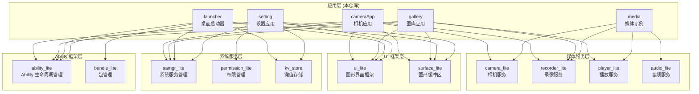
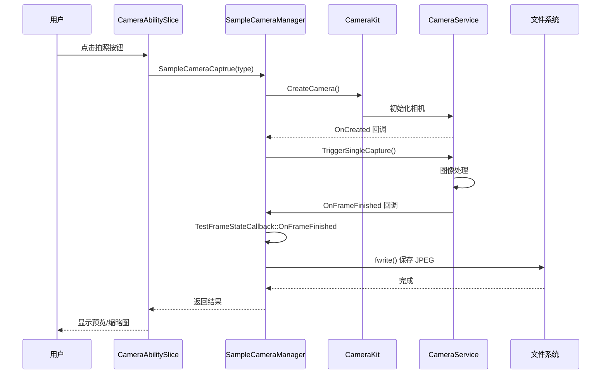
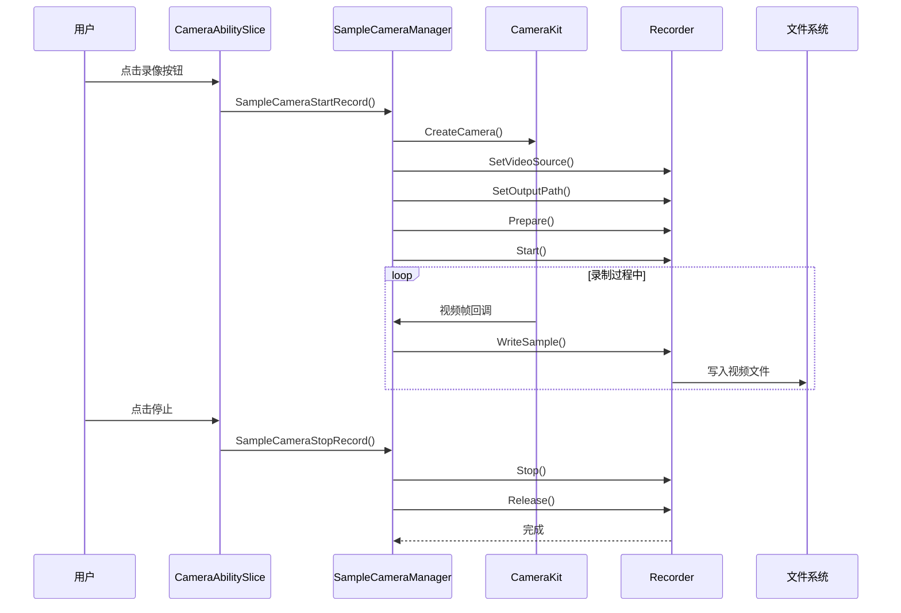
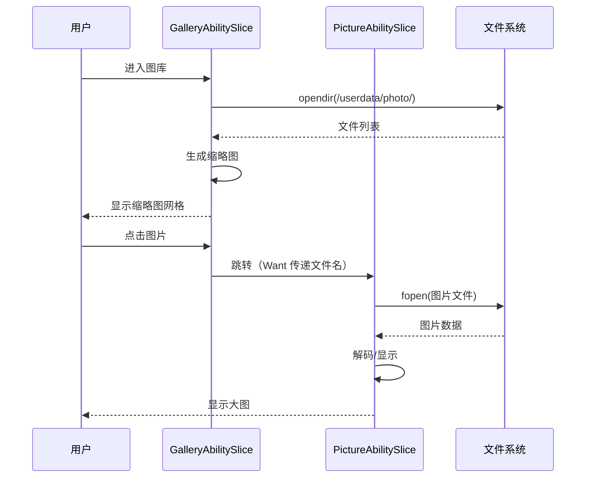
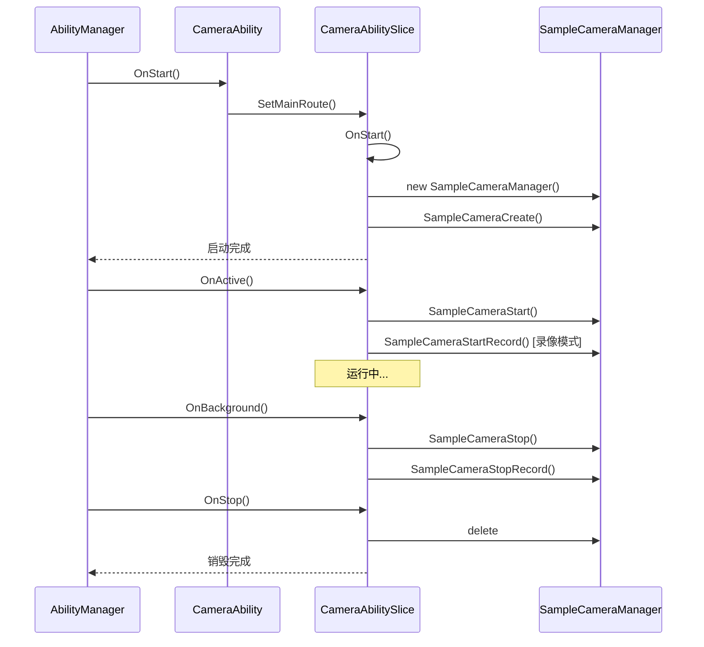
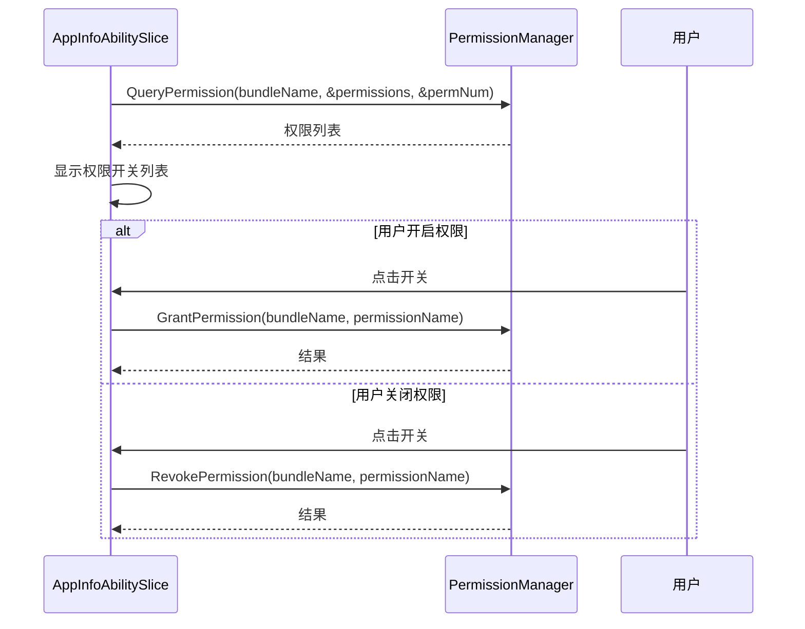
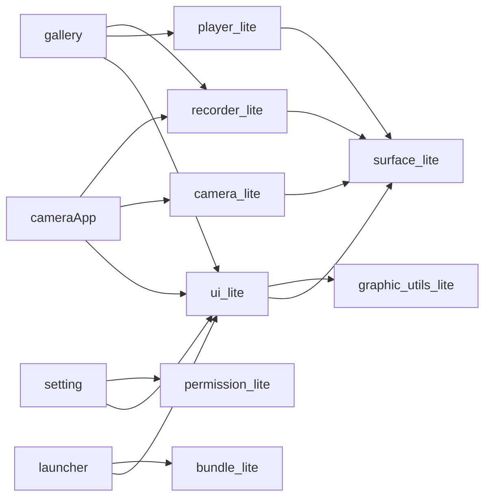

# 架构说明

## 组件图

### 整体架构



---

## 数据流

### 相机拍照数据流



### 视频录制数据流



### 图库图片浏览数据流



---

## 线程模型

### cameraApp 线程模型

```
主线程 (UI 线程)
├── Ability/AbilitySlice 生命周期回调
├── 用户事件处理（点击、滑动）
└── UI 渲染

工作线程 1 (EventHandler)
├── CameraStateCallback 回调
│   ├── OnCreated
│   ├── OnCreateFailed
│   └── OnReleased
├── FrameStateCallback 回调
│   └── OnFrameFinished (拍照完成)
└── Recorder 状态回调

工作线程 2 (录制线程，由 Recorder 内部创建)
├── 视频编码
├── 音频采集（录音时）
└── 文件写入
```

**关键代码** (`camera_manager.h:70`):
```cpp
SampleCameraStateMng(EventHandler &eventHdlr) : eventHdlr_(eventHdlr)
```

**设计说明**:
- 所有相机回调均在 EventHandler 线程执行，避免阻塞 UI
- 视频编码在独立线程，由 media_lite 库内部管理

---

### gallery 线程模型

```
主线程 (UI 线程)
├── AbilitySlice 生命周期
├── 用户交互处理
└── 图片/视频解码渲染

后台线程 (媒体播放)
├── 视频解码
├── 音频播放
└── 进度更新回调
```

**关键代码** (`player_ability_slice.cpp`):
```cpp
// 播放进度回调（在播放器内部线程）
void PlayerAbilitySlice::UpdatePlayTime()
```

---

### launcher 线程模型

```
主线程 (UI 线程)
├── 桌面渲染
├── 应用图标点击处理
├── 时间/日期更新（定时器）
└── 应用启动

后台线程 (BundleManager)
├── 应用信息查询
├── 安装/卸载监听
└── 应用列表更新
```

---

## 关键时序

### 相机应用生命周期



### 权限管理时序



---

## 模块依赖关系

### 依赖图（无环验证）



**结论**: 依赖关系为 DAG（有向无环图），无循环依赖。

---

## 关键设计模式

### 1. 回调模式 (Callback)
用于异步事件处理：
```cpp
class SampleCameraStateMng : public CameraStateCallback {
    void OnCreated(Camera &c) override;
    void OnCreateFailed(const std::string cameraId, int32_t errorCode) override;
    void OnReleased(Camera &c) override;
};
```

### 2. 单例模式 (Singleton)
全局唯一实例管理：
```cpp
// CameraKit 为单例
CameraKit *camKit = CameraKit::GetInstance();
```

### 3. 监听器模式 (Listener)
UI 事件处理：
```cpp
class EventListener : public UIView::OnClickListener {
    bool OnClick(UIView &view, const Event &event) override;
};
```

### 4. Ability 框架模式
OpenHarmony 应用标准架构：
- Ability: 应用入口，管理生命周期
- AbilitySlice: 页面管理，处理 UI
- Want: 组件间通信

---

## 相关链接

- [目录结构](./Structure.md) - 代码文件组织
- [对外接口](./External_API.md) - Ability 和权限接口
- [内部接口](./Internal_API.md) - 模块间接口
- [GN 构建系统](./Build_System.md) - 构建配置
