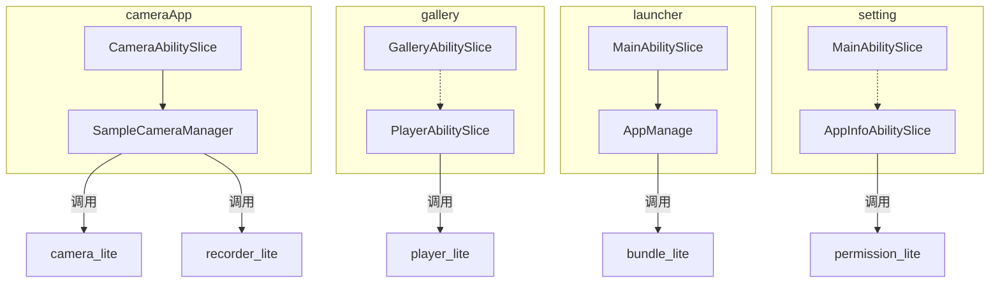

# 内部接口 (Internal API)

## 模块内部类接口

### cameraApp 模块

#### SampleCameraManager
相机管理器，封装相机操作。

**文件**: `cameraApp/cameraApp/src/main/cpp/camera_manager.h:105-131`

```cpp
class SampleCameraManager {
public:
    SampleCameraManager();
    ~SampleCameraManager();

    // 相机生命周期
    int SampleCameraCreate();                          // 创建相机实例
    bool SampleCameraExist(void);                      // 检查相机是否存在
    bool SampleCameraIsReady(void);                    // 检查相机是否就绪
    
    // 预览控制
    int SampleCameraStart(Surface *surface);           // 开始预览
    int SampleCameraStop(void);                        // 停止预览
    
    // 拍照
    int SampleCameraCaptrue(int type);                 // 拍照 (type: 0=普通, 1=视频缩略图)
    bool SampleCameraCaptrueIsFinish(void);            // 检查拍照是否完成
    
    // 录像控制
    int SampleCameraStartRecord(Surface *surface);     // 开始录像
    int SampleCameraPauseRecord(void);                 // 暂停录像
    int SampleCameraResumeRecord(Surface *mSurface);   // 恢复录像
    int SampleCameraStopRecord(void);                  // 停止录像
    bool SampleCameraGetRecord(void);                  // 获取录像状态
    
private:
    CameraKit *camKit;                                 // CameraKit 实例
    string camId;                                      // 相机 ID
    SampleCameraStateMng *CamStateMng;                 // 状态管理器
    EventHandler eventHdlr_;                           // 事件处理器
};
```

#### SampleCameraStateMng
相机状态回调管理器。

**文件**: `cameraApp/cameraApp/src/main/cpp/camera_manager.h:67-103`

```cpp
class SampleCameraStateMng : public CameraStateCallback {
public:
    SampleCameraStateMng(EventHandler &eventHdlr);
    ~SampleCameraStateMng();

    // CameraStateCallback 实现
    void OnCreated(Camera &c) override;
    void OnCreateFailed(const std::string cameraId, int32_t errorCode) override;
    void OnReleased(Camera &c) override;
    
    // 业务接口
    void StartRecord(Surface *mSurface);               // 开始录制
    void StartPreview(Surface *surface);               // 开始预览
    void Capture(int type);                            // 捕获图像
    void SetPause();                                   // 暂停
    void SetResume(Surface *mSurface);                 // 恢复
    void SetStop(int s);                               // 停止
    bool RecordState();                                // 获取录制状态
    bool CameraIsReady();                              // 相机就绪状态
    bool IsCaptureOver(void);                          // 捕获完成状态
    
private:
    int gRecordSta_;
    int gPreviewSta_;
    int gRecFd_;
    EventHandler &eventHdlr_;
    Camera *cam_;
    Recorder *recorder_;
    TestFrameStateCallback fsCb_;
    FrameConfig *fc_;
};
```

#### CameraAbilitySlice
cameraApp 主页面。

**文件**: `cameraApp/cameraApp/src/main/cpp/camera_ability_slice.h:102-140`

```cpp
class CameraAbilitySlice : public AbilitySlice {
public:
    CameraAbilitySlice();
    ~CameraAbilitySlice() override;

protected:
    // AbilitySlice 生命周期
    void OnStart(const Want &want) override;
    void OnInactive() override;
    void OnActive(const Want &want) override;
    void OnBackground() override;
    void OnStop() override;

private:
    static constexpr int BUTTON_NUMS = 4;
    static constexpr int FONT_SIZE = 28;

    EventListener *buttonListener_ { nullptr };
    SampleCameraManager *cam_manager;              // 相机管理器实例
    
    // UI 组件（部分）
    UIImageView *background_;
    UISurfaceView* surfaceView;                    // 预览 Surface
    UIImageView *backBttn;
    UILabel *txtMsgLabel;
    UILabel *tmLabel;
    UIImageView* bttnLeft;
    UIImageView* bttnMidle;
    UIImageView* bttnRight;
    UIImageView* bttnRecord;
    
    void SetHead();
    void SetBottom();
};
```

---

### gallery 模块

#### GalleryAbilitySlice
图库主页面。

**文件**: `gallery/include/gallery_ability_slice.h`

```cpp
class GalleryAbilitySlice : public AbilitySlice {
public:
    GalleryAbilitySlice();
    ~GalleryAbilitySlice();
    
protected:
    void OnStart(const Want &want) override;
    void OnInactive() override;
    void OnActive(const Want &want) override;
    void OnBackground() override;
    void OnStop() override;
    
private:
    void SetHead();
    void AddAllPictures();
    void SetBottom();
    void SetBackIcon();
    void SetVideoIcon();
    
    RootView* rootView_;
    UIScrollView* scrollView_;
    vector<UIImageView*> imgViewList_;
};
```

#### PlayerAbilitySlice
视频播放页面。

**文件**: `gallery/include/player_ability_slice.h`

```cpp
class PlayerAbilitySlice : public AbilitySlice {
public:
    PlayerAbilitySlice();
    ~PlayerAbilitySlice();
    
    void UpdatePlayTime();                         // 更新播放进度
    
protected:
    void OnStart(const Want &want) override;
    void OnInactive() override;
    void OnActive(const Want &want) override;
    void OnBackground() override;
    void OnStop() override;
    
private:
    Player* videoPlayer_;                          // 播放器实例
    Surface* surface_;
    bool isPlaying_;
    int64_t totalDuration_;
};
```

---

### setting 模块

#### AppInfoAbilitySlice
应用详情/权限管理页面。

**文件**: `setting/setting/src/main/cpp/app_info_ability_slice.h`

```cpp
class AppInfoAbilitySlice : public AbilitySlice {
public:
    AppInfoAbilitySlice();
    ~AppInfoAbilitySlice();
    
protected:
    void OnStart(const Want& want) override;
    void OnInactive() override;
    void OnActive(const Want &want) override;
    void OnBackground() override;
    void OnStop() override;
    
private:
    void SetButtonListener();
    void SetHead();
    void PermissionInfoList();                     // 加载权限列表
    void SetAppPermissionInfo(int index, PermissionSaved& permissions);
    
    char bundleName_[256];                         // 应用包名
    PermissionSaved* permissions_;                 // 权限数组
    // ... UI 组件
};
```

#### ToggBtnOnListener
权限开关监听器。

**文件**: `setting/setting/src/main/cpp/app_info_ability_slice.h:50-123`

```cpp
class ToggBtnOnListener : public UIView::OnClickListener {
public:
    void SetBundleName(const char* bundleName, int lenght);
    void SetPermissionName(const char* permissionsName, int nameLenght);
    
    bool OnClick(UIView& view, const Event& event) override {
        if (togglebutton_->GetState()) {
            ret = RevokePermission(bundleName_, name_);    // 关闭权限
        } else {
            ret = GrantPermission(bundleName_, name_);     // 开启权限
        }
    }
    
private:
    char bundleName_[128];
    char name_[128];
    UIToggleButton* togglebutton_;
};
```

**关键安全函数**:
- `QueryPermission(bundleName_, &permissions_, &permNum)` - 查询权限
- `GrantPermission(bundleName_, name_)` - 授权
- `RevokePermission(bundleName_, name_)` - 撤销权限

---

## 模块依赖方向

### 依赖关系图



### 依赖规则

| 模块 | 允许依赖 | 禁止依赖 |
|------|----------|----------|
| cameraApp | camera_lite, recorder_lite, ui_lite, surface_lite | gallery, launcher, setting |
| gallery | player_lite, recorder_lite, ui_lite, surface_lite | cameraApp, launcher, setting |
| launcher | bundle_lite, ui_lite, surface_lite | cameraApp, gallery, setting |
| setting | permission_lite, ui_lite, surface_lite | cameraApp, gallery, launcher |

**结论**: 各应用模块之间**无直接依赖**，仅通过系统服务和 Ability 框架交互。

---

## 接口稳定性标注

### 稳定接口（public）

| 接口 | 稳定性 | 说明 |
|------|--------|------|
| `SampleCameraManager` | **稳定** | cameraApp 核心接口，外部无需调用 |
| `CameraAbilitySlice::OnStart/OnStop` | **稳定** | Ability 标准生命周期 |
| `GalleryAbilitySlice::OnStart` | **稳定** | Ability 标准生命周期 |
| `PlayerAbilitySlice` | **稳定** | gallery 播放接口 |
| `AppManage` | **稳定** | launcher 应用管理 |

### 内部接口（private/unstable）

| 接口 | 稳定性 | 说明 |
|------|--------|------|
| `TaskView::Callback` | **内部** | 计时器回调，可能变更 |
| `TestFrameStateCallback` | **内部** | 拍照回调实现细节 |
| `ToggBtnOnListener` | **内部** | 权限开关监听实现 |

---

## 头文件层级

### 公共头文件（暴露给其他模块）

无 - 本项目中各应用模块独立，**无公共头文件**。

### 模块内部头文件

| 模块 | 头文件位置 | 说明 |
|------|------------|------|
| cameraApp | `cameraApp/cameraApp/src/main/cpp/*.h` | 私有头文件 |
| gallery | `gallery/include/*.h` | 私有头文件 |
| launcher | `launcher/launcher/src/main/cpp/*.h` | 私有头文件 |
| setting | `setting/setting/src/main/cpp/*.h` | 私有头文件 |

### 系统头文件依赖

```cpp
// 相机相关
#include "camera_kit.h"              // camera_lite SDK
#include "recorder.h"                // recorder_lite SDK

// 播放相关
#include "player.h"                  // player_lite SDK

// UI 相关
#include "ability_loader.h"          // ability_lite SDK
#include "components/ui_*.h"         // ui_lite SDK

// 权限相关
#include "permission_kit.h"          // permission_lite SDK
```

---

## 可替换点

### 1. 相机实现替换
当前使用 `camera_lite`，可替换为其他相机服务：

```cpp
// camera_manager.h:27
#include "camera_kit.h"  // 可替换为其他相机 SDK

// 需保持 SampleCameraManager 接口不变
```

### 2. UI 框架替换
当前使用 `ui_lite`，理论上可替换：

```cpp
// camera_ability_slice.h:25-32
#include <components/ui_label_button.h>
#include <components/ui_label.h>
// ... 其他 ui_lite 组件

// 需要重新实现所有 UI 初始化代码
```

**难度**: 高（UI 代码遍布各 AbilitySlice）

### 3. 权限管理替换
当前使用 `permission_lite`，可替换为其他权限服务：

```cpp
// setting/setting/src/main/cpp/app_info_ability_slice.cpp
// 修改以下调用：
QueryPermission(bundleName_, &permissions_, &permNum);
GrantPermission(bundleName_, name_);
RevokePermission(bundleName_, name_);
```

---

## 相关链接

- [对外接口](./External_API.md) - 系统级接口
- [架构说明](./Architecture.md) - 模块关系
- [安全风险分析](./Security.md) - 接口安全考虑
