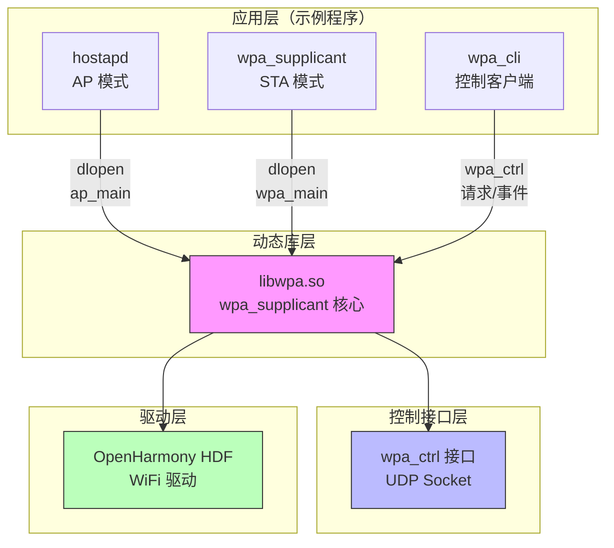
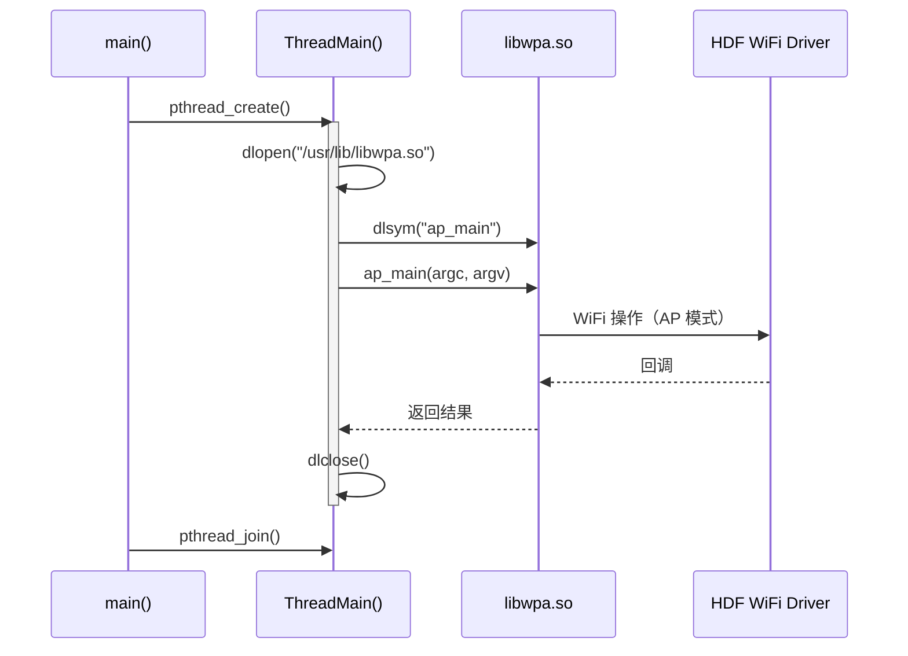
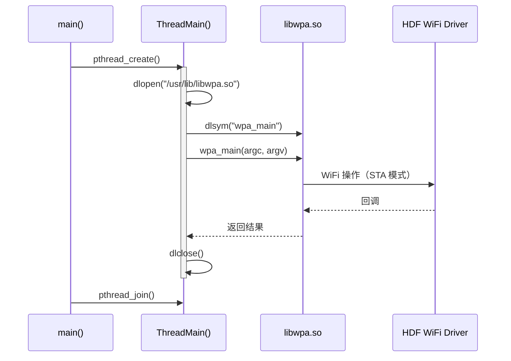
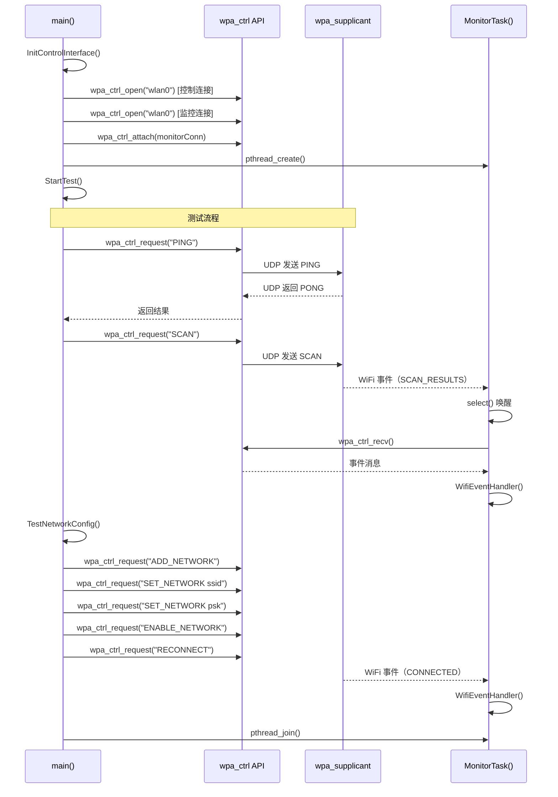
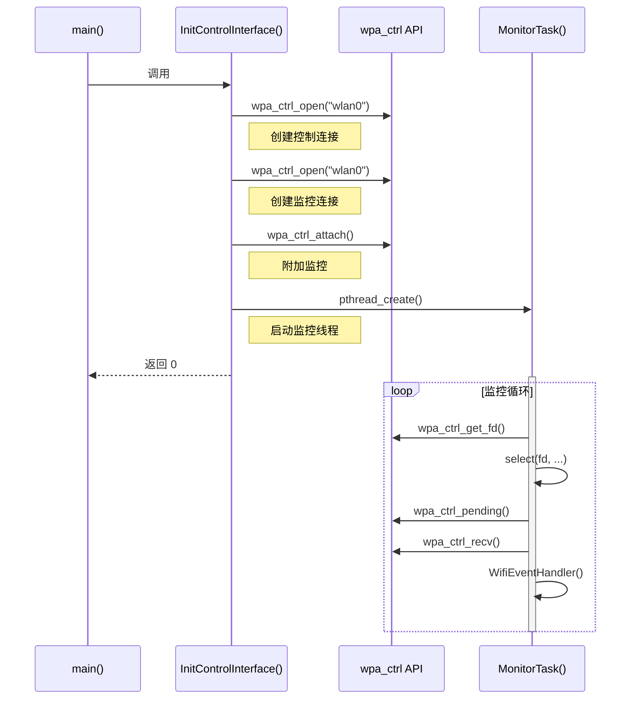
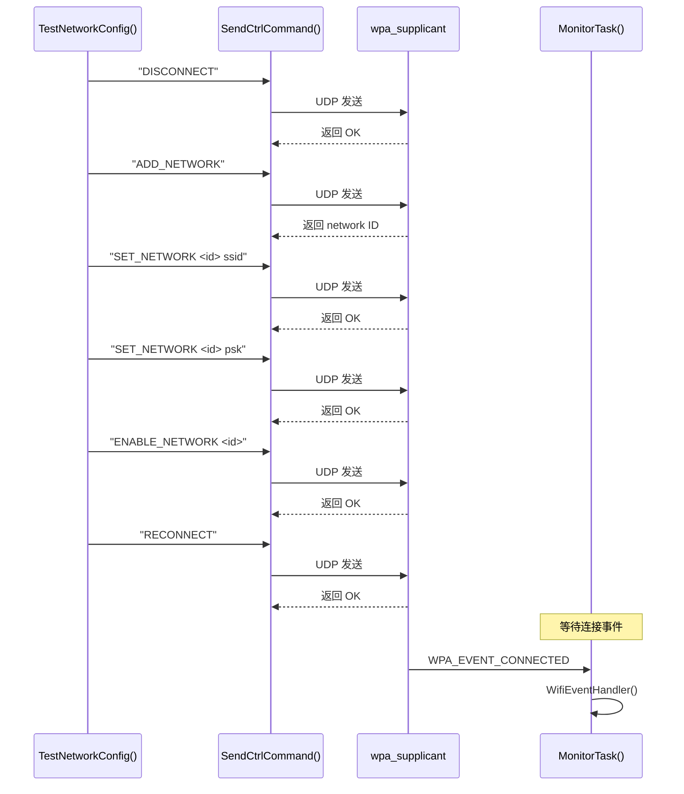
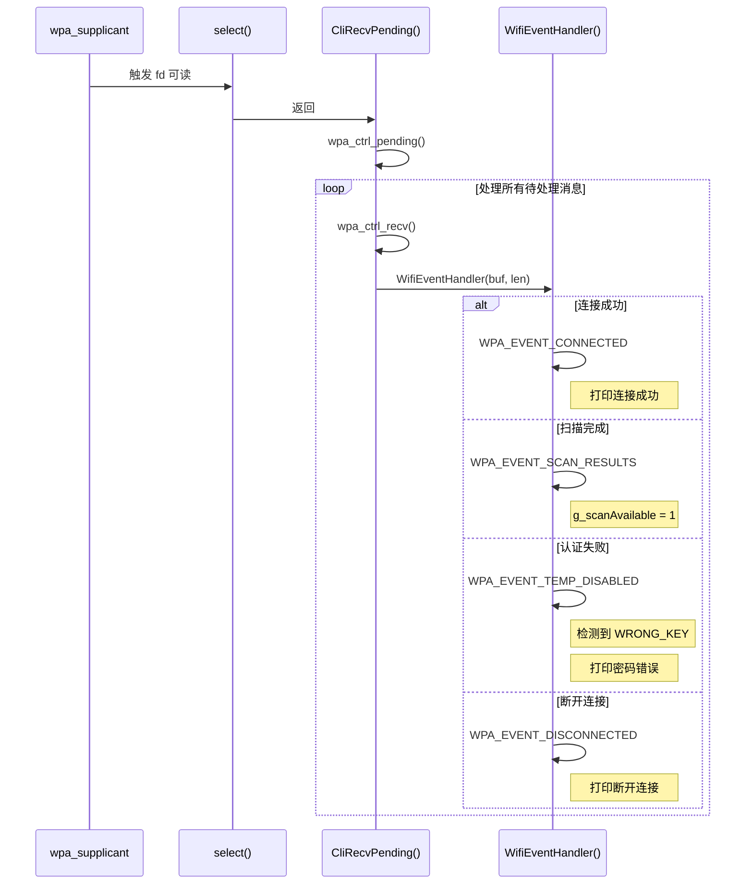

# 架构说明

> 说明项目的组件交互、数据流、线程模型和关键时序

---

## 目的

本文档说明 `@ohos/camera_sample_communication` 项目的架构设计，包括组件图、数据流、线程模型和关键时序，帮助读者理解系统的工作原理。

## 适用范围

本文档适用于：
- 需要理解项目架构的开发者
- 准备进行功能扩展的工程师
- 需要调试性能问题的开发人员

## 关键结论

- 项目采用动态加载架构，通过 dlopen 加载 libwpa.so
- wpa_cli 使用控制接口（wpa_ctrl）与 wpa_supplicant 通信
- 多线程模型：主线程 + 工作线程（wpa_cli 还有监控线程）
- 不使用 IPC 或 ServiceAbility，使用 wpa_ctrl UDP 接口

## 相关跳转

- [目录结构](02_Directory_Structure.md) - 代码组织方式
- [GN Targets](06_GN_Targets.md) - 构建配置和依赖

---

## 组件架构图

### 整体架构



### 组件交互

| 组件 | 交互方式 | 说明 |
|------|---------|------|
| hostapd | dlopen | 加载 libwpa.so，调用 ap_main |
| wpa_supplicant | dlopen | 加载 libwpa.so，调用 wpa_main |
| wpa_cli | wpa_ctrl | 通过 UDP socket 与 wpa_supplicant 通信 |
| libwpa.so | wpa_ctrl | 提供 wpa_ctrl 接口 |
| libwpa.so | HDF driver | 调用 OpenHarmony WiFi 驱动 |

---

## 数据流

### hostapd 数据流



**证据**: `hostapd/src/hostapd_sample.c:56-70`

### wpa_supplicant 数据流



**证据**: `wpa_supplicant/src/wpa_sample.c:56-70`

### wpa_cli 数据流



**证据**: `wpa_cli/src/wpa_cli_sample.c:245-255`

---

## 线程模型

### hostapd 线程模型

```
┌─────────────────────────────────────┐
│         主线程 (main)              │
│  - 创建工作线程                     │
│  - 等待工作线程结束                │
└─────────────────────────────────────┘
              │ pthread_create()
              ▼
┌─────────────────────────────────────┐
│      工作线程 (ThreadMain)         │
│  - dlopen 加载 libwpa.so          │
│  - 调用 ap_main                    │
│  - dlclose 卸载库                  │
└─────────────────────────────────────┘
```

**全局变量**:
- `pthread_t g_apThread` - 工作线程句柄
- `char* g_apArg[20]` - 命令行参数
- `int g_apArgc` - 参数数量

**证据**: `hostapd/src/hostapd_sample.c:21-24`

### wpa_supplicant 线程模型

```
┌─────────────────────────────────────┐
│         主线程 (main)              │
│  - 创建工作线程                     │
│  - 等待工作线程结束                │
└─────────────────────────────────────┘
              │ pthread_create()
              ▼
┌─────────────────────────────────────┐
│      工作线程 (ThreadMain)         │
│  - dlopen 加载 libwpa.so          │
│  - 调用 wpa_main                   │
│  - dlclose 卸载库                  │
└─────────────────────────────────────┘
```

**全局变量**:
- `pthread_t g_wpaThread` - 工作线程句柄
- `char* g_wpaArg[20]` - 命令行参数
- `int g_wpaArgc` - 参数数量

**证据**: `wpa_supplicant/src/wpa_sample.c:21-24`

### wpa_cli 线程模型

```
┌─────────────────────────────────────┐
│         主线程 (main)              │
│  - 初始化控制接口                   │
│  - 运行测试用例                     │
│  - 等待监控线程结束                │
└─────────────────────────────────────┘
              │ pthread_create()
              ▼
┌─────────────────────────────────────┐
│      监控线程 (MonitorTask)        │
│  - select() 阻塞等待              │
│  - CliRecvPending() 接收事件      │
│  - WifiEventHandler() 处理事件     │
└─────────────────────────────────────┘
```

**全局变量**:
- `static struct wpa_ctrl *g_monitorConn` - 监控连接
- `static struct wpa_ctrl *g_ctrlConn` - 控制连接
- `static pthread_t g_wpaThreadId` - 监控线程句柄
- `static int g_scanAvailable` - 扫描完成标志

**证据**: `wpa_cli/src/wpa_cli_sample.c:41-44`

---

## 关键时序

### wpa_cli 初始化时序



**证据**:
- 初始化: `wpa_cli/src/wpa_cli_sample.c:230-243`
- 监控: `wpa_cli/src/wpa_cli_sample.c:107-125`

### 网络连接时序



**证据**: `wpa_cli/src/wpa_cli_sample.c:140-185`

### WiFi 事件处理时序



**证据**:
- 事件接收: `wpa_cli/src/wpa_cli_sample.c:91-105`
- 事件处理: `wpa_cli/src/wpa_cli_sample.c:61-89`

---

## 通信机制

### wpa_ctrl 接口

**接口类型**: UDP Socket

**特点**:
- 双连接模式：控制连接（发送命令）+ 监控连接（接收事件）
- 非阻塞模式：使用 select() 实现异步事件处理
- 文本协议：命令和响应均为文本格式

**关键函数**:

| 函数 | 用途 | 证据 |
|------|------|------|
| `wpa_ctrl_open()` | 打开控制接口 | `wpa_cli_sample.c:232-233` |
| `wpa_ctrl_attach()` | 附加监控 | `wpa_cli_sample.c:238` |
| `wpa_ctrl_request()` | 发送命令 | `wpa_cli_sample.c:130` |
| `wpa_ctrl_recv()` | 接收事件 | `wpa_cli_sample.c:96` |
| `wpa_ctrl_pending()` | 检查待处理消息 | `wpa_cli_sample.c:93` |
| `wpa_ctrl_get_fd()` | 获取文件描述符 | `wpa_cli_sample.c:113` |

### 动态加载机制

**函数**: `dlopen`, `dlsym`, `dlclose`

**加载流程**:
1. `dlopen("/usr/lib/libwpa.so", RTLD_NOW \| RTLD_LOCAL)` - 加载动态库
2. `dlsym(handle, "ap_main" / "wpa_main")` - 查找符号
3. 调用目标函数
4. `dlclose(handle)` - 卸载动态库

**证据**:
- hostapd: `hostapd_sample.c:30, 36, 49`
- wpa_supplicant: `wpa_sample.c:30, 36, 49`

---

## 错误处理

### 错误传播路径

```
libwpa.so → 返回错误码 → ThreadMain → 打印日志 → 退出
                                    ↓
                             主线程 pthread_join() → 程序退出
```

### 错误处理策略

| 组件 | 错误处理策略 | 证据 |
|------|-------------|------|
| hostapd | 打印日志，退出 | `hostapd_sample.c:32, 39, 44` |
| wpa_supplicant | 打印日志，退出 | `wpa_sample.c:32, 39, 44` |
| wpa_cli | 打印错误，返回 -1 | `wpa_cli_sample.c:136, 147` |

---

## 资源生命周期

### hostapd 资源生命周期

```
main() 启动
  ↓
pthread_create() → 创建工作线程
  ↓
ThreadMain()
  ↓
dlopen() → 加载 libwpa.so
  ↓
dlsym() → 查找 ap_main
  ↓
ap_main() → 执行
  ↓
dlclose() → 卸载 libwpa.so
  ↓
线程退出
  ↓
pthread_join() → 回收工作线程
  ↓
main() 返回
```

### wpa_cli 资源生命周期

```
main() 启动
  ↓
InitControlInterface()
  ↓
wpa_ctrl_open() → 创建控制连接
wpa_ctrl_open() → 创建监控连接
wpa_ctrl_attach() → 附加监控
  ↓
pthread_create() → 创建监控线程
  ↓
StartTest() → 执行测试
  ↓
MonitorTask() 循环
  ↓
pthread_join() → 回收监控线程
  ↓
main() 返回
```

---

## 架构特点

### 优点

1. **简单清晰**: 动态加载模式，代码结构简单
2. **模块独立**: 三个模块可独立运行和构建
3. **示例导向**: 便于学习和理解 wpa_supplicant 使用方法

### 局限

1. **无错误恢复**: 错误发生后程序直接退出
2. **无权限管理**: 任何进程都可调用 wpa_ctrl 接口
3. **单线程模型**: wpa_cli 的主线程在测试时会阻塞
4. **硬编码配置**: 配置文件路径和接口名称硬编码

---

## 性能考虑

| 组件 | 性能关注点 | 说明 |
|------|-----------|------|
| hostapd | 动态加载开销 | dlopen/dlsym 有一次性开销 |
| wpa_supplicant | 动态加载开销 | dlopen/dlsym 有一次性开销 |
| wpa_cli | 事件处理延迟 | select() 轮询，1秒超时 |

**证据**: `wpa_cli/src/wpa_cli_sample.c:116, 122`

---

## 扩展点

### 可扩展点

1. **wpa_ctrl 接口封装**: 可封装为更高级的 API
2. **事件处理器**: 可扩展 WifiEventHandler 支持更多事件
3. **配置管理**: 可添加动态配置加载功能
4. **多线程**: 可将主线程和工作线程改为消息队列模式
