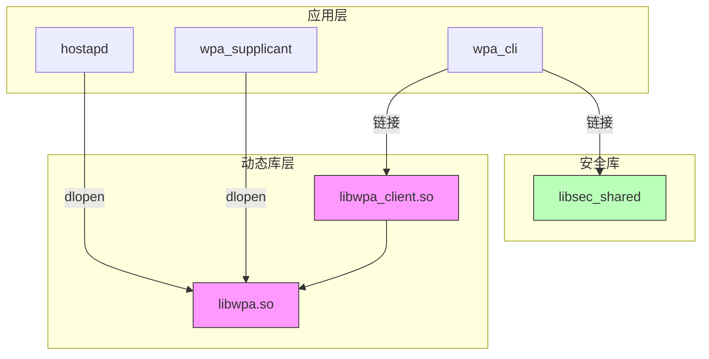

# 内部 API

> 说明项目的内部 API，包括模块接口、依赖方向、稳定性和可替换点

---

## 目的

本文档说明 `@ohos/camera_sample_communication` 项目的内部 API，帮助开发者理解模块间的接口和依赖关系。

## 适用范围

本文档适用于：
- 需要修改或扩展代码的开发者
- 准备进行代码重构的工程师
- 需要理解模块交互的开发人员

## 关键结论

- 三个模块（hostapd、wpa_supplicant、wpa_cli）相互独立
- 所有模块依赖外部 libwpa.so 动态库
- wpa_cli 内部函数按功能分类：控制接口、事件处理、测试函数
- 大部分内部函数是示例性质，稳定性较低

## 相关跳转

- [对外 API](04_External_API.md) - 对外接口说明
- [目录结构](02_Directory_Structure.md) - 代码组织方式

---

## 模块依赖关系

### 依赖图



### 依赖关系表

| 模块 | 依赖 | 依赖类型 | 稳定性 |
|------|------|---------|--------|
| hostapd | libwpa.so | 动态加载 | 外部依赖 |
| wpa_supplicant | libwpa.so | 动态加载 | 外部依赖 |
| wpa_cli | libwpa_client.so | 链接 | 外部依赖 |
| wpa_cli | libsec_shared | 链接 | 外部依赖 |

---

## hostapd 内部 API

### 函数列表

| 函数 | 作用域 | 稳定性 | 说明 |
|------|--------|--------|------|
| `main()` | 公开 | 稳定 | 程序入口 |
| `ThreadMain()` | 静态 | 不稳定 | 工作线程函数 |

### 全局变量

| 变量 | 类型 | 作用域 | 说明 |
|------|------|--------|------|
| `g_apThread` | `pthread_t` | 全局 | 工作线程句柄 |
| `g_apArg` | `char*[20]` | 全局 | 命令行参数数组 |
| `g_apArgc` | `int` | 全局 | 命令行参数数量 |

**证据**: `hostapd/src/hostapd_sample.c:21-24`

### 函数详细说明

#### `main()`

**路径**: `hostapd/src/hostapd_sample.c:56-70`

**签名**:
```c
int main(int argc, char *argv[])
```

**功能**:
1. 保存命令行参数到全局变量
2. 创建工作线程
3. 等待工作线程结束

**参数**:
- `argc` - 参数数量
- `argv` - 参数数组

**返回值**:
- `0` - 成功
- `1` - 线程创建失败

**稳定性**: 稳定（标准 main 函数）

#### `ThreadMain()`

**路径**: `hostapd/src/hostapd_sample.c:26-54`

**签名**:
```c
static void* ThreadMain()
```

**功能**:
1. 动态加载 libwpa.so
2. 查找 ap_main 符号
3. 调用 ap_main
4. 卸载动态库

**返回值**: `NULL`

**依赖**:
- `dlfcn.h` - dlopen, dlsym, dlclose
- `/usr/lib/libwpa.so` - 外部动态库

**稳定性**: 不稳定（示例代码，不建议直接使用）

---

## wpa_supplicant 内部 API

### 函数列表

| 函数 | 作用域 | 稳定性 | 说明 |
|------|--------|--------|------|
| `main()` | 公开 | 稳定 | 程序入口 |
| `ThreadMain()` | 静态 | 不稳定 | 工作线程函数 |

### 全局变量

| 变量 | 类型 | 作用域 | 说明 |
|------|------|--------|------|
| `g_wpaThread` | `pthread_t` | 全局 | 工作线程句柄 |
| `g_wpaArg` | `char*[20]` | 全局 | 命令行参数数组 |
| `g_wpaArgc` | `int` | 全局 | 命令行参数数量 |

**证据**: `wpa_supplicant/src/wpa_sample.c:21-24`

### 函数详细说明

#### `main()`

**路径**: `wpa_supplicant/src/wpa_sample.c:56-70`

**签名**:
```c
int main(int argc, char *argv[])
```

**功能**:
1. 保存命令行参数到全局变量
2. 创建工作线程
3. 等待工作线程结束

**参数**:
- `argc` - 参数数量
- `argv` - 参数数组

**返回值**:
- `0` - 成功
- `1` - 线程创建失败

**稳定性**: 稳定（标准 main 函数）

#### `ThreadMain()`

**路径**: `wpa_supplicant/src/wpa_sample.c:26-54`

**签名**:
```c
static void* ThreadMain()
```

**功能**:
1. 动态加载 libwpa.so
2. 查找 wpa_main 符号
3. 调用 wpa_main
4. 卸载动态库

**返回值**: `NULL`

**依赖**:
- `dlfcn.h` - dlopen, dlsym, dlclose
- `/usr/lib/libwpa.so` - 外部动态库

**稳定性**: 不稳定（示例代码，不建议直接使用）

---

## wpa_cli 内部 API

### 函数列表

| 函数 | 作用域 | 稳定性 | 类别 | 说明 |
|------|--------|--------|------|------|
| `main()` | 公开 | 稳定 | 入口 | 程序入口 |
| `InitControlInterface()` | 静态 | 不稳定 | 控制接口 | 初始化 wpa_ctrl 接口 |
| `MonitorTask()` | 静态 | 不稳定 | 事件处理 | 监控任务线程 |
| `CliRecvPending()` | 静态 | 不稳定 | 事件处理 | 接收待处理事件 |
| `WifiEventHandler()` | 静态 | 不稳定 | 事件处理 | 处理 WiFi 事件 |
| `SendCtrlCommand()` | 静态 | 不稳定 | 控制接口 | 发送控制命令 |
| `TestCliConnection()` | 静态 | 不稳定 | 测试 | 测试连接 |
| `TestScan()` | 静态 | 不稳定 | 测试 | 测试扫描 |
| `TestNetworkConfig()` | 静态 | 不稳定 | 测试 | 测试网络配置 |
| `StartTest()` | 静态 | 不稳定 | 测试 | 运行所有测试 |
| `DumpString()` | 静态 | 不稳定 | 工具 | 打印字符串 |
| `StrMatch()` | 静态 | 不稳定 | 工具 | 字符串匹配 |

### 全局变量

| 变量 | 类型 | 作用域 | 说明 |
|------|------|--------|------|
| `g_monitorConn` | `struct wpa_ctrl*` | 静态 | 监控连接 |
| `g_ctrlConn` | `struct wpa_ctrl*` | 静态 | 控制连接 |
| `g_wpaThreadId` | `pthread_t` | 静态 | 监控线程句柄 |
| `g_scanAvailable` | `int` | 静态 | 扫描完成标志 |

**证据**: `wpa_cli/src/wpa_cli_sample.c:41-44`

### 宏定义

| 宏 | 值 | 说明 |
|----|-----|------|
| `WPA_IFACE_NAME` | `"wlan0"` | WiFi 接口名称 |
| `WIFI_AUTH_FAILED_REASON_STR` | `"WRONG_KEY"` | 认证失败原因 |
| `WIFI_AUTH_FAILED_REASON_CODE` | `"reason=2"` | 认证失败代码 |
| `WPA_CTRL_REQUEST_OK` | `"OK"` | 请求成功响应 |
| `WPA_CTRL_REQUEST_FAIL` | `"FAIL"` | 请求失败响应 |

**证据**: `wpa_cli/src/wpa_cli_sample.c:22-26`

### 函数详细说明

#### 控制接口类

##### `InitControlInterface()`

**路径**: `wpa_cli/src/wpa_cli_sample.c:230-243`

**签名**:
```c
int InitControlInterface()
```

**功能**: 初始化 wpa_ctrl 控制和监控接口

**返回值**:
- `0` - 成功
- `-1` - 失败

**依赖**: `wpa_ctrl_open`, `wpa_ctrl_attach`, `pthread_create`

**稳定性**: 不稳定（示例代码）

##### `SendCtrlCommand()`

**路径**: `wpa_cli/src/wpa_cli_sample.c:127-138`

**签名**:
```c
static int SendCtrlCommand(const char *cmd, char *reply, size_t *replyLen)
```

**功能**: 发送控制命令到 wpa_supplicant

**参数**:
- `cmd` - 控制命令字符串
- `reply` - 响应缓冲区
- `replyLen` - 缓冲区长度（输入/输出）

**返回值**:
- `0` - 成功
- `-1` - 失败

**依赖**: `wpa_ctrl_request`

**稳定性**: 不稳定（示例代码）

#### 事件处理类

##### `MonitorTask()`

**路径**: `wpa_cli/src/wpa_cli_sample.c:107-125`

**签名**:
```c
static void* MonitorTask(void *args)
```

**功能**: 监控任务线程，监听 WiFi 事件

**实现**: 使用 `select()` 等待 fd 可读，然后调用 `CliRecvPending()` 处理事件

**稳定性**: 不稳定（示例代码）

##### `CliRecvPending()`

**路径**: `wpa_cli/src/wpa_cli_sample.c:91-105`

**签名**:
```c
static void CliRecvPending(void)
```

**功能**: 接收所有待处理的事件消息

**实现**: 循环调用 `wpa_ctrl_recv()` 和 `WifiEventHandler()`

**稳定性**: 不稳定（示例代码）

##### `WifiEventHandler()`

**路径**: `wpa_cli/src/wpa_cli_sample.c:61-89`

**签名**:
```c
static void WifiEventHandler(char *rawEvent, int len)
```

**功能**: 处理 WiFi 事件（连接、扫描、断开等）

**支持的事件**:
- `WPA_EVENT_CONNECTED` - 连接成功
- `WPA_EVENT_SCAN_RESULTS` - 扫描完成
- `WPA_EVENT_TEMP_DISABLED` - 认证失败
- `WPA_EVENT_DISCONNECTED` - 断开连接

**稳定性**: 不稳定（示例代码）

#### 测试类

##### `TestCliConnection()`

**路径**: `wpa_cli/src/wpa_cli_sample.c:187-197`

**签名**:
```c
static void TestCliConnection(void)
```

**功能**: 测试与 wpa_supplicant 的连接（发送 PING 命令）

**稳定性**: 不稳定（示例代码）

##### `TestScan()`

**路径**: `wpa_cli/src/wpa_cli_sample.c:199-221`

**签名**:
```c
static void TestScan(void)
```

**功能**: 测试 WiFi 网络扫描功能

**流程**:
1. 发送 SCAN 命令
2. 等待扫描完成事件
3. 获取并打印扫描结果

**稳定性**: 不稳定（示例代码）

##### `TestNetworkConfig()`

**路径**: `wpa_cli/src/wpa_cli_sample.c:140-185`

**签名**:
```c
static void TestNetworkConfig(void)
```

**功能**: 测试网络配置和连接功能

**流程**:
1. 断开当前连接
2. 添加网络配置
3. 设置 SSID 和密码
4. 启用网络
5. 重新连接

**稳定性**: 不稳定（示例代码）

##### `StartTest()`

**路径**: `wpa_cli/src/wpa_cli_sample.c:223-228`

**签名**:
```c
static void StartTest(void)
```

**功能**: 运行所有测试用例

**调用顺序**:
1. `TestCliConnection()`
2. `TestScan()`
3. `TestNetworkConfig()`

**稳定性**: 不稳定（示例代码）

#### 工具类

##### `DumpString()`

**路径**: `wpa_cli/src/wpa_cli_sample.c:46-54`

**签名**:
```c
static void DumpString(const char *buf, int len, const char *tag)
```

**功能**: 打印字符串内容（用于调试）

**稳定性**: 不稳定（示例代码）

##### `StrMatch()`

**路径**: `wpa_cli/src/wpa_cli_sample.c:56-59`

**签名**:
```c
static int StrMatch(const char *a, const char *b)
```

**功能**: 字符串前缀匹配（strncmp 的包装）

**返回值**:
- `1` - 匹配
- `0` - 不匹配

**稳定性**: 不稳定（示例代码）

---

## 依赖方向

### 外部依赖

| 模块 | 外部依赖 | 依赖类型 |
|------|---------|---------|
| hostapd | `dlfcn.h` | 系统库 |
| hostapd | `pthread.h` | 系统库 |
| hostapd | `/usr/lib/libwpa.so` | 动态库 |
| wpa_supplicant | `dlfcn.h` | 系统库 |
| wpa_supplicant | `pthread.h` | 系统库 |
| wpa_supplicant | `/usr/lib/libwpa.so` | 动态库 |
| wpa_cli | `common/wpa_ctrl.h` | 第三方头文件 |
| wpa_cli | `utils/includes.h` | 第三方头文件 |
| wpa_cli | `securec.h` | 安全库 |
| wpa_cli | `libwpa_client.so` | 链接库 |

### 内部依赖

- hostapd、wpa_supplicant、wpa_cli 三个模块相互独立
- 无内部模块间依赖

---

## 可替换点

### 可替换的组件

| 组件 | 替换难度 | 替换说明 |
|------|---------|---------|
| libwpa.so | 中 | 需要支持相同的 dlopen/dlsym 接口 |
| wpa_ctrl 接口 | 中 | 需要支持相同的命令和事件格式 |
| 配置文件格式 | 低 | JSON/YAML 等格式均可 |
| 线程模型 | 低 | 可改为事件驱动或消息队列 |

### 可替换的函数

| 函数 | 替换难度 | 替换说明 |
|------|---------|---------|
| `ThreadMain()` | 低 | 可改为直接调用，不使用线程 |
| `MonitorTask()` | 中 | 可改为回调或事件驱动 |
| `WifiEventHandler()` | 低 | 可扩展支持更多事件 |
| `SendCtrlCommand()` | 低 | 可添加重试、超时等逻辑 |

---

## 稳定性分析

### 稳定性分级

| 级别 | 说明 | 示例 |
|------|------|------|
| 稳定 | 标准接口，不建议修改 | `main()`, wpa_ctrl API |
| 较稳定 | 示例代码，可参考 | 配置文件格式 |
| 不稳定 | 示例代码，不建议直接使用 | `ThreadMain()`, `TestScan()` |

### 不稳定函数列表

以下函数为示例代码，不建议在生产环境中直接使用：

- `hostapd/src/hostapd_sample.c:ThreadMain()`
- `wpa_supplicant/src/wpa_sample.c:ThreadMain()`
- `wpa_cli/src/wpa_cli_sample.c:InitControlInterface()`
- `wpa_cli/src/wpa_cli_sample.c:MonitorTask()`
- `wpa_cli/src/wpa_cli_sample.c:CliRecvPending()`
- `wpa_cli/src/wpa_cli_sample.c:WifiEventHandler()`
- `wpa_cli/src/wpa_cli_sample.c:SendCtrlCommand()`
- `wpa_cli/src/wpa_cli_sample.c:TestCliConnection()`
- `wpa_cli/src/wpa_cli_sample.c:TestScan()`
- `wpa_cli/src/wpa_cli_sample.c:TestNetworkConfig()`
- `wpa_cli/src/wpa_cli_sample.c:StartTest()`
- `wpa_cli/src/wpa_cli_sample.c:DumpString()`
- `wpa_cli/src/wpa_cli_sample.c:StrMatch()`

---

## 扩展建议

### 推荐的扩展方向

1. **封装高级 API**: 将 `SendCtrlCommand()` 和 `WifiEventHandler()` 封装为更高级的 API
2. **添加回调机制**: 使用回调函数处理 WiFi 事件，而非硬编码处理逻辑
3. **错误处理增强**: 添加更详细的错误码和错误消息
4. **配置管理**: 添加动态配置加载和热更新功能
5. **日志系统**: 使用标准日志库替代 printf

### 模块化建议

将 wpa_cli 模块拆分为以下子模块：

```
wpa_cli/
├── src/
│   ├── main.c              # 入口
│   ├── ctrl_interface.c    # 控制接口封装
│   ├── event_handler.c     # 事件处理
│   ├── config.c            # 配置管理
│   └── utils.c             # 工具函数
└── include/
    └── wpa_cli_api.h       # 对外 API
```
