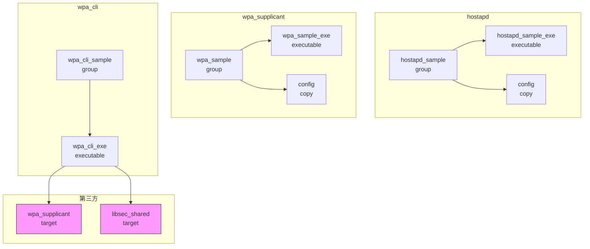

# GN Targets

> 说明项目的 GN 构建系统，包括 targets 列表、类型、依赖、产物和开关

---

## 目的

本文档说明 `@ohos/camera_sample_communication` 项目的 GN 构建系统，帮助开发者理解编译配置和依赖关系。

## 适用范围

本文档适用于：
- 需要理解构建系统的开发者
- 准备修改构建配置的工程师
- 需要添加新模块的开发人员

## 关键结论

- 项目使用 GN 构建系统（lite_component）
- 三个子模块（hostapd、wpa_supplicant、wpa_cli）独立构建
- 每个模块生成独立的可执行文件
- 主 target（sample）的 features 为空，不实际构建子模块

## 相关跳转

- [目录结构](02_Directory_Structure.md) - 代码组织方式
- [编译产物](07_Build_Artifacts.md) - 输出产物和部署

---

## 构建系统概述

### GN 版本

- 构建系统: GN (Generate Ninja)
- 组件类型: `lite_component` (OpenHarmony 轻量级组件)

### 构建入口

**文件**: `BUILD.gn`

**路径**: `BUILD.gn:1-28`

```gn
import("//build/lite/config/component/lite_component.gni")

lite_component("sample") {
    features = [
    ]
}

generate_notice_file("communication_sample") {
    module_name = "communication_sample"
    module_source_dir_list = [
        "//third_party/wpa_supplicant/wpa_supplicant-2.9/hostapd",
        "//third_party/wpa_supplicant/wpa_supplicant-2.9/wpa_supplicant",
    ]
}
```

---

## Targets 列表

### 根 Targets

| Target | 类型 | 输出 | 说明 |
|--------|------|------|------|
| `sample` | lite_component | - | 主组件（features 为空） |
| `communication_sample` | generate_notice_file | NOTICE 文件 | 生成许可证文件 |

**证据**: `BUILD.gn:16-27`

### hostapd Targets

**文件**: `hostapd/BUILD.gn`

| Target | 类型 | 输出 | 说明 |
|--------|------|------|------|
| `hostapd_sample_exe` | executable | hostapd | hostapd 可执行文件 |
| `hostapd_sample` | group | - | 组 target |
| `config` | copy | $root_out_dir/etc/hostapd.conf | 配置文件复制 |

**证据**: `hostapd/BUILD.gn:24-40`

### wpa_supplicant Targets

**文件**: `wpa_supplicant/BUILD.gn`

| Target | 类型 | 输出 | 说明 |
|--------|------|------|------|
| `wpa_sample_exe` | executable | wpa_supplicant | wpa_supplicant 可执行文件 |
| `wpa_sample` | group | - | 组 target |
| `config` | copy | $root_out_dir/etc/wpa_supplicant.conf | 配置文件复制 |

**证据**: `wpa_supplicant/BUILD.gn:24-40`

### wpa_cli Targets

**文件**: `wpa_cli/BUILD.gn`

| Target | 类型 | 输出 | 说明 |
|--------|------|------|------|
| `wpa_cli_exe` | executable | wpa_cli | wpa_cli 可执行文件 |
| `wpa_cli_sample` | group | - | 组 target |

**证据**: `wpa_cli/BUILD.gn:25-44`

---

## Target 详细配置

### 根 BUILD.gn

#### `sample` (lite_component)

```gn
lite_component("sample") {
    features = [
    ]
}
```

- **类型**: lite_component
- **输出**: 无
- **features**: 空（不实际构建子模块）

#### `communication_sample` (generate_notice_file)

```gn
generate_notice_file("communication_sample") {
    module_name = "communication_sample"
    module_source_dir_list = [
        "//third_party/wpa_supplicant/wpa_supplicant-2.9/hostapd",
        "//third_party/wpa_supplicant/wpa_supplicant-2.9/wpa_supplicant",
    ]
}
```

- **类型**: generate_notice_file
- **输出**: NOTICE 许可证文件
- **作用**: 生成第三方库的许可证声明

---

### hostapd/BUILD.gn

#### `hostapd_sample_exe` (executable)

```gn
executable("hostapd_sample_exe") {
    output_name = "hostapd"
    sources = sample_sources
}
```

| 属性 | 值 | 说明 |
|------|-----|------|
| output_name | hostapd | 输出文件名 |
| sources | sample_sources | 源文件列表 |

**sources**: `sample_sources = ["src/hostapd_sample.c"]`

**证据**: `hostapd/BUILD.gn:16-18, 24-27`

#### `config` (copy)

```gn
copy("config") {
    sources = config_file
    outputs = [
        "$root_out_dir/etc/hostapd.conf"
    ]
}
```

| 属性 | 值 | 说明 |
|------|-----|------|
| sources | config_file | 源文件 |
| outputs | $root_out_dir/etc/hostapd.conf | 目标路径 |

**sources**: `config_file = ["config/hostapd.conf"]`

**证据**: `hostapd/BUILD.gn:20-22, 35-40`

---

### wpa_supplicant/BUILD.gn

#### `wpa_sample_exe` (executable)

```gn
executable("wpa_sample_exe") {
    output_name = "wpa_supplicant"
    sources = sample_sources
}
```

| 属性 | 值 | 说明 |
|------|-----|------|
| output_name | wpa_supplicant | 输出文件名 |
| sources | sample_sources | 源文件列表 |

**sources**: `sample_sources = ["src/wpa_sample.c"]`

**证据**: `wpa_supplicant/BUILD.gn:16-18, 24-27`

#### `config` (copy)

```gn
copy("config") {
    sources = config_file
    outputs = [
        "$root_out_dir/etc/wpa_supplicant.conf"
    ]
}
```

| 属性 | 值 | 说明 |
|------|-----|------|
| sources | config_file | 源文件 |
| outputs | $root_out_dir/etc/wpa_supplicant.conf | 目标路径 |

**sources**: `config_file = ["config/wpa_supplicant.conf"]`

**证据**: `wpa_supplicant/BUILD.gn:20-22, 35-40`

---

### wpa_cli/BUILD.gn

#### `wpa_cli_exe` (executable)

```gn
executable("wpa_cli_exe") {
    output_name = "wpa_cli"
    sources = sample_sources
    include_dirs = sample_include_dirs
    out_dir = rebase_path(root_build_dir)
    deps = [
        "//third_party/wpa_supplicant/wpa_supplicant-2.9:wpa_supplicant",
        "//third_party/bounds_checking_function:libsec_shared"
    ]
    ldflags = [
       "-L${out_dir}",
       "-lwpa_client"
    ]
}
```

| 属性 | 值 | 说明 |
|------|-----|------|
| output_name | wpa_cli | 输出文件名 |
| sources | sample_sources | 源文件列表 |
| include_dirs | sample_include_dirs | 头文件路径 |
| deps | [...] | 依赖的 target |
| ldflags | [...] | 链接器标志 |

**sources**: `sample_sources = ["src/wpa_cli_sample.c"]`

**include_dirs**:
```gn
sample_include_dirs = [
    "//third_party/wpa_supplicant/wpa_supplicant-2.9/src/",
    "//third_party/bounds_checking_function:libsec_shared/include/"
]
```

**deps**:
```gn
deps = [
    "//third_party/wpa_supplicant/wpa_supplicant-2.9:wpa_supplicant",
    "//third_party/bounds_checking_function:libsec_shared"
]
```

**ldflags**:
```gn
ldflags = [
   "-L${out_dir}",
   "-lwpa_client"
]
```

**证据**: `wpa_cli/BUILD.gn:16-38`

---

## 依赖关系图

### 依赖关系



### 依赖表

| Target | 依赖 | 依赖类型 |
|--------|------|---------|
| hostapd_sample_exe | - | 无 |
| wpa_sample_exe | - | 无 |
| wpa_cli_exe | //third_party/wpa_supplicant/wpa_supplicant-2.9:wpa_supplicant | GN 依赖 |
| wpa_cli_exe | //third_party/bounds_checking_function:libsec_shared | GN 依赖 |

---

## 第三方依赖

### wpa_supplicant

**路径**: `//third_party/wpa_supplicant/wpa_supplicant-2.9`

**版本**: 2.9

**提供**:
- `libwpa.so` - wpa_supplicant 核心库
- `libwpa_client.so` - wpa 控制接口客户端库

**使用位置**:
- hostapd: 动态加载 libwpa.so
- wpa_supplicant: 动态加载 libwpa.so
- wpa_cli: 链接 libwpa_client.so

### bounds_checking_function (libsec)

**路径**: `//third_party/bounds_checking_function:libsec_shared`

**提供**: `libsec_shared.so` - 安全函数库（securec）

**使用位置**: wpa_cli 链接

**头文件**: `//third_party/bounds_checking_function:libsec_shared/include/`

---

## 编译配置选项

### 当前配置

本项目**不包含**编译开关（feature flags）。

所有配置都是静态的，无条件编译。

### 潜在配置选项

如需添加配置选项，可以在 BUILD.gn 中添加 `config` 或 `defines`：

```gn
config("my_config") {
    defines = [
        "ENABLE_DEBUG=1",
        "MAX_NETWORKS=10",
    ]
}

executable("my_exe") {
    configs = [":my_config"]
}
```

---

## Target ↔ 产物映射

| Target | 产物类型 | 输出路径 | 说明 |
|--------|---------|----------|------|
| hostapd_sample_exe | 可执行文件 | $root_out_dir/hostapd | hostapd 程序 |
| wpa_sample_exe | 可执行文件 | $root_out_dir/wpa_supplicant | wpa_supplicant 程序 |
| wpa_cli_exe | 可执行文件 | $root_out_dir/wpa_cli | wpa_cli 程序 |
| hostapd config | 配置文件 | $root_out_dir/etc/hostapd.conf | hostapd 配置 |
| wpa_supplicant config | 配置文件 | $root_out_dir/etc/wpa_supplicant.conf | wpa_supplicant 配置 |
| communication_sample | 许可证文件 | NOTICE 文件 | 第三方库许可证 |

---

## 构建命令

### 编译单个模块

```bash
# 编译 hostapd
hb build -f //applications/sample/camera/communication/hostapd

# 编译 wpa_supplicant
hb build -f //applications/sample/camera/communication/wpa_supplicant

# 编译 wpa_cli
hb build -f //applications/sample/camera/communication/wpa_cli
```

### 编译所有模块

```bash
# 编译所有模块（需要指定 features）
hb build -f //applications/sample/camera/communication/hostapd
hb build -f //applications/sample/camera/communication/wpa_supplicant
hb build -f //applications/sample/camera/communication/wpa_cli
```

### 清理构建产物

```bash
# 清理所有构建产物
hb clean
```

---

## 构建产物位置

| 产物类型 | 输出路径 | 安装路径 |
|---------|----------|---------|
| 可执行文件 | $root_out_dir/ | /usr/bin/ 或 /bin/ |
| 配置文件 | $root_out_dir/etc/ | /etc/ |
| 动态库 | $root_out_dir/lib/ | /usr/lib/ 或 /lib/ |

**注意**: 实际安装路径取决于 OpenHarmony 系统配置。

---

## 构建流程

### hostapd 构建流程

```
1. GN 解析 hostapd/BUILD.gn
   ↓
2. 编译 src/hostapd_sample.c
   ↓
3. 链接生成 hostapd
   ↓
4. 复制 config/hostapd.conf 到 $root_out_dir/etc/
```

### wpa_supplicant 构建流程

```
1. GN 解析 wpa_supplicant/BUILD.gn
   ↓
2. 编译 src/wpa_sample.c
   ↓
3. 链接生成 wpa_supplicant
   ↓
4. 复制 config/wpa_supplicant.conf 到 $root_out_dir/etc/
```

### wpa_cli 构建流程

```
1. GN 解析 wpa_cli/BUILD.gn
   ↓
2. 编译 src/wpa_cli_sample.c（使用指定的 include_dirs）
   ↓
3. 链接 wpa_client 库和 libsec_shared 库
   ↓
4. 生成 wpa_cli
```

---

## 构建注意事项

### 注意事项

1. **第三方依赖**: wpa_supplicant 必须先构建
2. **库路径**: wpa_cli 链接时需要正确指定库路径
3. **配置文件**: 配置文件会被复制到输出目录
4. **静态链接**: 当前配置为动态链接，依赖运行时库

### 常见问题

| 问题 | 原因 | 解决方案 |
|------|------|---------|
| 找不到 libwpa.so | 第三方库未构建 | 先构建 wpa_supplicant |
| 找不到头文件 | include_dirs 配置错误 | 检查 wpa_cli/BUILD.gn |
| 链接错误 | ldflags 配置错误 | 检查库路径和库名称 |
| 配置文件未复制 | copy target 未配置 | 检查 copy target 配置 |

---

## 扩展建议

### 添加新模块

如需添加新模块（如 wpa_gui），可以按以下方式扩展：

```gn
# 新建 wpa_gui/BUILD.gn
import("//build/lite/config/component/lite_component.gni")

sample_sources = [
    "src/wpa_gui.c",
]

sample_include_dirs = [
    "//third_party/wpa_supplicant/wpa_supplicant-2.9/src/",
]

executable("wpa_gui_exe") {
    output_name = "wpa_gui"
    sources = sample_sources
    include_dirs = sample_include_dirs
    deps = [
        "//third_party/wpa_supplicant/wpa_supplicant-2.9:wpa_supplicant",
    ]
}

group("wpa_gui_sample") {
    deps = [
        ":wpa_gui_exe",
    ]
}
```

### 添加配置选项

如需添加编译选项，可以在 BUILD.gn 中添加 `defines`：

```gn
executable("my_exe") {
    defines = [
        "ENABLE_LOG=1",
        "MAX_NETWORKS=10",
    ]
}
```
