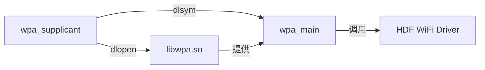
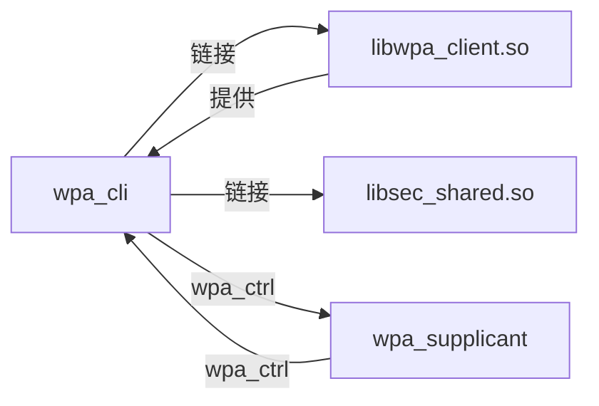

# 编译产物

> 说明项目的编译产物，包括 .so/.a/.hap/可执行文件等、安装路径和运行时加载关系

---

## 目的

本文档说明 `@ohos/camera_sample_communication` 项目的编译产物，帮助开发者了解输出文件和部署方式。

## 适用范围

本文档适用于：
- 需要理解编译产物的开发者
- 准备部署应用的工程师
- 需要调试运行时问题的开发人员

## 关键结论

- 项目生成三个可执行文件：hostapd、wpa_supplicant、wpa_cli
- 配置文件复制到 $root_out_dir/etc/ 目录
- 运行时依赖 libwpa.so 和 libwpa_client.so
- 无 .hap、.so、.a 静态库产物（所有库均为第三方）

## 相关跳转

- [GN Targets](06_GN_Targets.md) - 构建配置和依赖
- [目录结构](02_Directory_Structure.md) - 代码组织方式

---

## 编译产物总览

### 产物列表

| 类别 | 产物 | 源文件 | 输出路径 | 说明 |
|------|------|--------|----------|------|
| 可执行文件 | hostapd | hostapd/src/hostapd_sample.c | $root_out_dir/hostapd | WiFi 接入点 |
| 可执行文件 | wpa_supplicant | wpa_supplicant/src/wpa_sample.c | $root_out_dir/wpa_supplicant | WiFi 客户端 |
| 可执行文件 | wpa_cli | wpa_cli/src/wpa_cli_sample.c | $root_out_dir/wpa_cli | WiFi 控制客户端 |
| 配置文件 | hostapd.conf | hostapd/config/hostapd.conf | $root_out_dir/etc/hostapd.conf | hostapd 配置 |
| 配置文件 | wpa_supplicant.conf | wpa_supplicant/config/wpa_supplicant.conf | $root_out_dir/etc/wpa_supplicant.conf | wpa_supplicant 配置 |

### 运行时依赖

| 可执行文件 | 动态库依赖 | 来源 |
|-----------|------------|------|
| hostapd | libwpa.so | 第三方 wpa_supplicant |
| wpa_supplicant | libwpa.so | 第三方 wpa_supplicant |
| wpa_cli | libwpa_client.so | 第三方 wpa_supplicant |
| wpa_cli | libsec_shared.so | 第三方 bounds_checking_function |

---

## 可执行文件

### hostapd

**输出名**: hostapd

**源文件**: `hostapd/src/hostapd_sample.c` (71 行)

**输出路径**: `$root_out_dir/hostapd`

**安装路径**: `/usr/bin/hostapd` 或 `/bin/hostapd`（取决于系统配置）

**功能**: WiFi 接入点（AP 模式）

**运行时依赖**: `/usr/lib/libwpa.so`

**启动方式**:
```bash
hostapd /etc/hostapd.conf
```

**证据**:
- 构建配置: `hostapd/BUILD.gn:24-27`
- 源代码: `hostapd/src/hostapd_sample.c:56`

---

### wpa_supplicant

**输出名**: wpa_supplicant

**源文件**: `wpa_supplicant/src/wpa_sample.c` (71 行)

**输出路径**: `$root_out_dir/wpa_supplicant`

**安装路径**: `/usr/bin/wpa_supplicant` 或 `/bin/wpa_supplicant`（取决于系统配置）

**功能**: WiFi 客户端（STA 模式）

**运行时依赖**: `/usr/lib/libwpa.so`

**启动方式**:
```bash
wpa_supplicant -B -i wlan0 -c /etc/wpa_supplicant.conf
```

**证据**:
- 构建配置: `wpa_supplicant/BUILD.gn:24-27`
- 源代码: `wpa_supplicant/src/wpa_sample.c:56`

---

### wpa_cli

**输出名**: wpa_cli

**源文件**: `wpa_cli/src/wpa_cli_sample.c` (256 行)

**输出路径**: `$root_out_dir/wpa_cli`

**安装路径**: `/usr/bin/wpa_cli` 或 `/bin/wpa_cli`（取决于系统配置）

**功能**: WiFi 控制客户端

**运行时依赖**:
- `/usr/lib/libwpa_client.so`
- `libsec_shared.so`

**启动方式**:
```bash
wpa_cli
```

**证据**:
- 构建配置: `wpa_cli/BUILD.gn:25-38`
- 源代码: `wpa_cli/src/wpa_cli_sample.c:245`

---

## 配置文件

### hostapd.conf

**源文件**: `hostapd/config/hostapd.conf`

**输出路径**: `$root_out_dir/etc/hostapd.conf`

**安装路径**: `/etc/hostapd.conf`

**内容**:
```
interface=wlan0
driver=hdf wifi
ctrl_interface=udp
ssid=testap
hw_mode=g
channel=1
ignore_broadcast_ssid=0
```

**配置项说明**:

| 配置项 | 值 | 说明 |
|--------|-----|------|
| interface | wlan0 | WiFi 网络接口 |
| driver | hdf wifi | OpenHarmony HDF WiFi 驱动 |
| ctrl_interface | udp | 控制接口类型 |
| ssid | testap | 接入点 SSID |
| hw_mode | g | 802.11g 模式 |
| channel | 1 | 无线信道 |
| ignore_broadcast_ssid | 0 | 广播 SSID |

**证据**: `hostapd/config/hostapd.conf:1-8`

---

### wpa_supplicant.conf

**源文件**: `wpa_supplicant/config/wpa_supplicant.conf`

**输出路径**: `$root_out_dir/etc/wpa_supplicant.conf`

**安装路径**: `/etc/wpa_supplicant.conf`

**内容**:
```
country=GB
ctrl_interface=udp
network={
}
```

**配置项说明**:

| 配置项 | 值 | 说明 |
|--------|-----|------|
| country | GB | 国家代码（英国） |
| ctrl_interface | udp | 控制接口类型 |
| network | {} | 网络配置块（空） |

**证据**: `wpa_supplicant/config/wpa_supplicant.conf:1-5`

---

## 动态库依赖

### libwpa.so

**来源**: 第三方 wpa_supplicant 2.9

**路径**: `/usr/lib/libwpa.so`

**用途**: wpa_supplicant 核心库

**使用者**:
- hostapd（通过 dlopen 动态加载）
- wpa_supplicant（通过 dlopen 动态加载）

**加载方式**:
```c
void *handleLibWpa = dlopen("/usr/lib/libwpa.so", RTLD_NOW | RTLD_LOCAL);
```

**证据**:
- hostapd: `hostapd/src/hostapd_sample.c:30`
- wpa_supplicant: `wpa_supplicant/src/wpa_sample.c:30`

---

### libwpa_client.so

**来源**: 第三方 wpa_supplicant 2.9

**路径**: `/usr/lib/libwpa_client.so`

**用途**: wpa 控制接口客户端库

**使用者**: wpa_cli（通过链接）

**链接方式**:
```gn
ldflags = [
   "-L${out_dir}",
   "-lwpa_client"
]
```

**证据**: `wpa_cli/BUILD.gn:34-37`

---

### libsec_shared.so

**来源**: 第三方 bounds_checking_function

**路径**: `/usr/lib/libsec_shared.so`

**用途**: 安全函数库（securec）

**使用者**: wpa_cli（通过链接）

**链接方式**:
```gn
deps = [
    "//third_party/bounds_checking_function:libsec_shared"
]
```

**证据**: `wpa_cli/BUILD.gn:30-33`

---

## 运行时加载关系

### hostapd 运行时加载

```
hostapd (可执行文件)
  ↓
dlopen("/usr/lib/libwpa.so")
  ↓
dlsym("ap_main")
  ↓
调用 ap_main()
  ↓
调用 OpenHarmony HDF WiFi 驱动
```

**流程图**:


**证据**: `hostapd/src/hostapd_sample.c:30-42`

---

### wpa_supplicant 运行时加载

```
wpa_supplicant (可执行文件)
  ↓
dlopen("/usr/lib/libwpa.so")
  ↓
dlsym("wpa_main")
  ↓
调用 wpa_main()
  ↓
调用 OpenHarmony HDF WiFi 驱动
```

**流程图**:



**证据**: `wpa_supplicant/src/wpa_sample.c:30-42`

---

### wpa_cli 运行时加载

```
wpa_cli (可执行文件)
  ↓
链接时加载 libwpa_client.so
  ↓
链接时加载 libsec_shared.so
  ↓
wpa_ctrl_open() 打开控制接口
  ↓
通过 wpa_ctrl 接口与 wpa_supplicant 通信
```

**流程图**:



**证据**:
- 链接配置: `wpa_cli/BUILD.gn:30-37`
- wpa_ctrl 使用: `wpa_cli/src/wpa_cli_sample.c:232-233`

---

## 安装路径

### 标准安装路径

| 文件类型 | 标准路径 | 备选路径 |
|---------|----------|---------|
| 可执行文件 | /usr/bin/ 或 /bin/ | /system/bin/ |
| 配置文件 | /etc/ | /system/etc/ |
| 动态库 | /usr/lib/ 或 /lib/ | /system/lib/ |

### 实际安装示例

假设构建输出目录为 `out/ohos-arm-release/`：

```
out/ohos-arm-release/
├── bin/
│   ├── hostapd
│   ├── wpa_supplicant
│   └── wpa_cli
├── etc/
│   ├── hostapd.conf
│   └── wpa_supplicant.conf
└── lib/
    ├── libwpa.so
    ├── libwpa_client.so
    └── libsec_shared.so
```

---

## 运行时依赖检查

### 检查动态库依赖

使用 `ldd` 或 `readelf` 命令检查：

```bash
# 检查 hostapd 的依赖
ldd out/ohos-arm-release/bin/hostapd

# 检查 wpa_supplicant 的依赖
ldd out/ohos-arm-release/bin/wpa_supplicant

# 检查 wpa_cli 的依赖
ldd out/ohos-arm-release/bin/wpa_cli
```

### 预期输出

**hostapd**:
```
libwpa.so => /usr/lib/libwpa.so
libc.so => /usr/lib/libc.so
```

**wpa_supplicant**:
```
libwpa.so => /usr/lib/libwpa.so
libc.so => /usr/lib/libc.so
```

**wpa_cli**:
```
libwpa_client.so => /usr/lib/libwpa_client.so
libsec_shared.so => /usr/lib/libsec_shared.so
libc.so => /usr/lib/libc.so
```

---

## 部署流程

### 1. 构建产物

```bash
hb build -f //applications/sample/camera/communication/hostapd
hb build -f //applications/sample/camera/communication/wpa_supplicant
hb build -f //applications/sample/camera/communication/wpa_cli
```

### 2. 打包

将产物打包为系统镜像：

```bash
# 示例打包命令（实际命令取决于项目配置）
./build/pack_image.py
```

### 3. 烧录

将镜像烧录到设备：

```bash
# 示例烧录命令（实际命令取决于工具）
./tools/flash.sh
```

### 4. 运行

在设备上运行：

```bash
# 启动 wpa_supplicant
wpa_supplicant -B -i wlan0 -c /etc/wpa_supplicant.conf

# 运行 wpa_cli
wpa_cli

# 启动 hostapd（如需要）
hostapd /etc/hostapd.conf
```

---

## 运行时调试

### 查看运行时日志

```bash
# 查看系统日志
dmesg | grep -i wpa

# 查看应用日志
hilog | grep -i wifi
```

### 检查进程状态

```bash
# 检查 wpa_supplicant 进程
ps -A | grep wpa_supplicant

# 检查 hostapd 进程
ps -A | grep hostapd

# 检查 wpa_cli 进程
ps -A | grep wpa_cli
```

### 检查网络接口

```bash
# 查看网络接口状态
ifconfig wlan0

# 查看网络连接状态
netstat -r
```

---

## 常见问题

### 问题 1：运行时找不到动态库

**症状**: 运行程序时报错 "error while loading shared libraries: libwpa.so: cannot open shared object file"

**原因**: 动态库未安装或路径不正确

**解决方案**:
1. 确认 libwpa.so 已安装到 /usr/lib/ 或 /lib/
2. 设置 LD_LIBRARY_PATH 环境变量：
   ```bash
   export LD_LIBRARY_PATH=/usr/lib:$LD_LIBRARY_PATH
   ```

### 问题 2：配置文件找不到

**症状**: 运行程序时报错 "Configuration file not found"

**原因**: 配置文件未安装或路径不正确

**解决方案**:
1. 确认配置文件已安装到 /etc/ 目录
2. 使用绝对路径指定配置文件：
   ```bash
   hostapd /etc/hostapd.conf
   ```

### 问题 3：无法启动 WiFi 接口

**症状**: 程序启动后无法使用 WiFi

**原因**:
- WiFi 驱动未加载
- 网络接口不存在
- 权限不足

**解决方案**:
1. 检查 WiFi 驱动状态：
   ```bash
   dmesg | grep -i wifi
   ```
2. 检查网络接口：
   ```bash
   ifconfig -a
   ```
3. 使用 root 权限运行：
   ```bash
   sudo hostapd /etc/hostapd.conf
   ```

---

## 性能考虑

| 产物 | 大小（估算） | 加载时间 | 内存占用 |
|------|------------|---------|---------|
| hostapd | ~50 KB | ~10 ms | ~1 MB |
| wpa_supplicant | ~50 KB | ~10 ms | ~1 MB |
| wpa_cli | ~30 KB | ~5 ms | ~0.5 MB |
| libwpa.so | ~1 MB | ~20 ms | - |
| libwpa_client.so | ~20 KB | ~5 ms | - |
| libsec_shared.so | ~50 KB | ~5 ms | - |

**注意**: 实际大小和性能取决于编译选项和平台。

---

## 扩展建议

### 优化构建产物

1. **减小体积**: 使用 `strip` 命令去除调试符号
2. **静态链接**: 减少运行时依赖
3. **压缩**: 使用 UPX 等工具压缩可执行文件

### 优化运行时

1. **预加载**: 使用 `LD_PRELOAD` 预加载库
2. **链接时优化**: 使用 LTO 优化性能
3. **共享库优化**: 使用版本化共享库

### 添加新产物

如需添加新的编译产物（如库文件），可以在 BUILD.gn 中添加 `shared_library` 或 `static_library` target：

```gn
shared_library("my_lib") {
    sources = [
        "src/my_lib.c",
    ]
    output_name = "my_lib"
}
```
