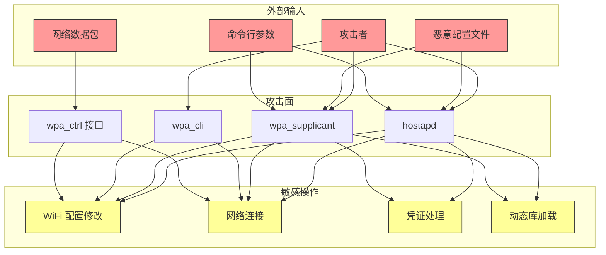
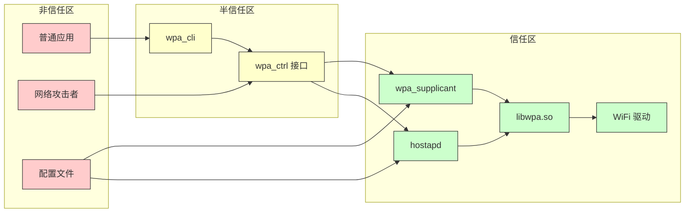

# 安全风险评审

> 基于代码证据的安全风险分析，包括攻击面、信任边界、可被利用点和修复建议

---

## 目的

本文档提供 `@ohos/camera_sample_communication` 项目的安全风险评审，帮助开发者了解潜在的安全问题和修复建议。

## 适用范围

本文档适用于：
- 需要进行安全审计的开发者
- 准备部署生产环境的工程师
- 需要了解安全风险的安全工程师

## 关键结论

- 本项目是示例代码，**不适用于生产环境**
- 缺少权限管理和访问控制机制
- 无输入验证和参数校验
- 使用动态库加载（dlopen），存在潜在风险
- wpa_ctrl 接口无访问控制

## 相关跳转

- [项目定位与边界](01_Project_Position.md) - 项目职责和边界
- [架构说明](03_Architecture.md) - 组件交互和数据流

---

## 威胁模型

### 威胁模型图



### 攻击面清单

| 攻击面 | 类型 | 风险等级 | 说明 |
|--------|------|---------|------|
| 命令行参数 | 输入 | 高 | hostapd/wpa_supplicant 接受任意命令行参数 |
| 配置文件 | 输入 | 中 | 配置文件可被篡改 |
| wpa_ctrl 接口 | 接口 | 高 | 无访问控制的控制接口 |
| 动态库加载 | 机制 | 高 | dlopen 加载外部库 |
| 网络数据包 | 输入 | 低 | wpa_ctrl UDP socket 接收网络数据 |

---

## 信任边界

### 信任边界图



### 信任边界说明

| 边界 | 来源 | 目标 | 信任级别 | 保护机制 |
|------|------|------|---------|---------|
| 配置文件 → hostapd | 文件系统 | hostapd | 非信任 | 无 |
| 配置文件 → wpa_supplicant | 文件系统 | wpa_supplicant | 非信任 | 无 |
| wpa_cli → wpa_ctrl | 应用 | wpa_ctrl | 半信任 | 无 |
| wpa_ctrl → wpa_supplicant | wpa_ctrl | wpa_supplicant | 信任 | 无 |
| hostapd → libwpa.so | hostapd | libwpa.so | 信任 | 无 |

**问题**: 所有信任边界都缺少保护机制。

---

## 可被利用点

### 风险 1：无权限检查

**风险等级**: 高

**证据**:
- 代码中未发现 `permission`、`access_token`、`uid/gid` 检查逻辑
- wpa_ctrl 接口无访问控制

**位置**:
- hostapd: `hostapd/src/hostapd_sample.c:56-70`
- wpa_supplicant: `wpa_supplicant/src/wpa_sample.c:56-70`
- wpa_cli: `wpa_cli/src/wpa_cli_sample.c:230-255`

**触发路径**:
```
恶意应用 → wpa_ctrl 接口 → 发送任意命令 → wpa_supplicant 执行
```

**影响**:
- 任何应用都可以修改 WiFi 配置
- 任何应用都可以连接/断开 WiFi
- 可能导致 WiFi 服务拒绝攻击

**修复建议**:
1. 在 wpa_ctrl 接口添加权限检查
2. 使用 Unix 文件权限控制 socket 访问
3. 使用 SELinux/AppArmor 限制访问
4. 在应用层实现权限验证

**示例修复**:
```c
// 检查调用者权限
if (!CheckPermission("ohos.permission.GET_WIFI_INFO")) {
    SAMPLE_ERROR("Permission denied");
    return -1;
}
```

---

### 风险 2：无输入验证

**风险等级**: 高

**证据**:
- 命令行参数直接传递给 wpa_main/ap_main，无验证
- wpa_ctrl 命令无长度和格式验证

**位置**:
- hostapd: `hostapd/src/hostapd_sample.c:56-63`
- wpa_supplicant: `wpa_supplicant/src/wpa_sample.c:56-63`
- wpa_cli: `wpa_cli/src/wpa_cli_sample.c:127-138`

**触发路径**:
```
攻击者 → 注入超长命令 → 缓冲区溢出
攻击者 → 注入特殊字符 → 格式化字符串漏洞
```

**影响**:
- 缓冲区溢出
- 格式化字符串漏洞
- 拒绝服务
- 代码执行

**修复建议**:
1. 添加输入长度验证
2. 使用安全的字符串处理函数（如 securec）
3. 转义特殊字符
4. 使用白名单验证

**示例修复**:
```c
static int SendCtrlCommand(const char *cmd, char *reply, size_t *replyLen)
{
    // 验证命令长度
    if (strlen(cmd) > MAX_CMD_LENGTH) {
        SAMPLE_ERROR("Command too long");
        return -1;
    }

    // 验证命令格式
    if (!ValidateCommand(cmd)) {
        SAMPLE_ERROR("Invalid command format");
        return -1;
    }

    size_t len = *replyLen - 1;
    wpa_ctrl_request(g_ctrlConn, cmd, strlen(cmd), reply, &len, 0);
    // ...
}
```

---

### 风险 3：动态库加载风险

**风险等级**: 高

**证据**:
- 使用 dlopen 加载 `/usr/lib/libwpa.so`
- 无库签名验证
- 无库版本检查

**位置**:
- hostapd: `hostapd/src/hostapd_sample.c:30`
- wpa_supplicant: `wpa_supplicant/src/wpa_sample.c:30`

**触发路径**:
```
攻击者 → 替换 libwpa.so → 加载恶意库 → 代码执行
```

**影响**:
- 恶意代码执行
- 凭据泄露
- 系统控制权丢失

**修复建议**:
1. 验证库签名
2. 使用绝对路径或配置指定库路径
3. 禁用 RTLD_LOCAL，使用 RTLD_GLOBAL
4. 定期检查库文件完整性

**示例修复**:
```c
static void* ThreadMain()
{
    printf("[HostapdSample]init hostapd.\n");

    // 检查库文件签名
    if (!VerifyLibrarySignature("/usr/lib/libwpa.so")) {
        printf("[HostapdSample]Library signature verification failed.\n");
        return NULL;
    }

    void *handleLibWpa = dlopen("/usr/lib/libwpa.so", RTLD_NOW | RTLD_GLOBAL);
    // ...
}
```

---

### 风险 4：信息泄露

**风险等级**: 中

**证据**:
- 错误消息包含详细日志
- 使用 printf 直接输出敏感信息
- 无日志访问控制

**位置**:
- hostapd: `hostapd/src/hostapd_sample.c:32, 39, 44-47`
- wpa_supplicant: `wpa_supplicant/src/wpa_sample.c:32, 39, 44-47`
- wpa_cli: `wpa_cli/src/wpa_cli_sample.c:28-38`

**触发路径**:
```
攻击者 → 读取日志 → 获取敏感信息
```

**影响**:
- 配置信息泄露
- 命令行参数泄露
- 内部实现细节泄露

**修复建议**:
1. 使用标准日志系统（如 hilog）
2. 敏感信息使用日志级别控制
3. 避免在日志中输出配置参数
4. 实施日志访问控制

**示例修复**:
```c
#include "hilog/log.h"

// 使用标准日志
HILOG_ERROR(LOG_CORE, "wpa_ctrl request failed, ret=%{public}d", ret);
```

---

### 风险 5：竞态条件

**风险等级**: 中

**证据**:
- 全局变量无锁保护
- g_scanAvailable 标志无原子操作

**位置**:
- wpa_cli: `wpa_cli/src/wpa_cli_sample.c:44, 78`

**触发路径**:
```
线程1 → 设置 g_scanAvailable = 1
线程2 → 检查 g_scanAvailable（读到旧值）
```

**影响**:
- 数据竞争
- 程序行为异常
- 潜在的安全漏洞

**修复建议**:
1. 使用原子操作
2. 添加互斥锁保护
3. 使用线程安全的数据结构

**示例修复**:
```c
#include <stdatomic.h>

static atomic_int g_scanAvailable = 0;

static void WifiEventHandler(char *rawEvent, int len)
{
    // ...
    if (StrMatch(pos, WPA_EVENT_SCAN_RESULTS)) {
        SAMPLE_INFO("WIFI_EVENT_SCAN_DONE");
        atomic_store(&g_scanAvailable, 1);  // 原子操作
        return;
    }
    // ...
}

static void TestScan()
{
    // ...
    atomic_store(&g_scanAvailable, 0);
    SendCtrlCommand("SCAN", reply, &replyLen);
    while (1) {
        sleep(1);
        if (atomic_load(&g_scanAvailable) == 1) {  // 原子操作
            SAMPLE_INFO("scan result received.");
            break;
        }
    }
    // ...
}
```

---

## 未发现的威胁

### 已检查但未发现

| 类别 | 检查范围 | 结果 | 说明 |
|------|---------|------|------|
| SQL 注入 | 代码中无数据库操作 | 无风险 | 不适用 |
| XSS 攻击 | 代码中无 Web 界面 | 无风险 | 不适用 |
| CSRF 攻击 | 代码中无 Web 界面 | 无风险 | 不适用 |
| 路径遍历 | 配置文件路径固定 | 无风险 | 配置文件路径硬编码 |
| 整数溢出 | 代码中无算术运算 | 低风险 | 简单循环和数组访问 |

### 检查范围说明

本次安全评审覆盖了以下范围：
- 所有 C 源代码文件（hostapd, wpa_supplicant, wpa_cli）
- 配置文件（hostapd.conf, wpa_supplicant.conf）
- GN 构建文件
- 项目依赖的第三方库（未深入分析）

**局限性**:
- 未分析第三方库（libwpa.so, libsec_shared.so）的安全问题
- 未进行渗透测试
- 未进行模糊测试
- 未分析 OpenHarmony WiFi 驱动的安全性

---

## 安全建议

### 短期修复（优先）

| 优先级 | 修复项 | 工作量 |
|--------|--------|--------|
| 高 | 添加 wpa_ctrl 接口访问控制 | 中 |
| 高 | 验证输入参数 | 中 |
| 高 | 使用标准日志系统 | 低 |
| 中 | 修复竞态条件 | 低 |
| 中 | 验证动态库签名 | 高 |

### 长期改进

| 改进项 | 说明 |
|--------|------|
| 使用 IPC/ServiceAbility | 替代直接 socket 访问，提供更好的隔离 |
| 实施权限管理 | 使用 OpenHarmony 权限系统 |
| 添加安全测试 | 增加单元测试、模糊测试 |
| 代码审计 | 定期进行代码安全审计 |
| 漏洞响应 | 建立漏洞响应机制 |

---

## 安全检查清单

### 代码安全

- [ ] 添加输入验证
- [ ] 使用安全的字符串处理函数
- [ ] 验证动态库签名
- [ ] 使用原子操作保护共享变量
- [ ] 使用标准日志系统
- [ ] 敏感信息脱敏

### 访问控制

- [ ] 添加 wpa_ctrl 接口权限检查
- [ ] 使用 Unix 文件权限
- [ ] 实施 SELinux/AppArmor 策略

### 运行时安全

- [ ] 验证配置文件完整性
- [ ] 限制日志访问
- [ ] 使用最小权限原则
- [ ] 定期更新依赖库

---

## 安全资源

### 参考文档

- [OpenHarmony 安全指南](https://docs.openharmony.cn/)
- [wpa_supplicant 安全文档](https://w1.fi/wpa_supplicant/)
- [CWE 常见弱点列表](https://cwe.mitre.org/)
- [OWASP 安全编码实践](https://owasp.org/)

### 安全工具

- 静态分析: cppcheck, clang-static-analyzer
- 动态分析: Valgrind, AddressSanitizer
- 模糊测试: AFL, libFuzzer
- 渗透测试: Burp Suite, Metasploit

---

## 结论

本项目是示例代码，**不建议直接用于生产环境**。在生产环境中使用时，需要：

1. 实施完整的权限管理
2. 添加输入验证和参数校验
3. 保护 wpa_ctrl 接口
4. 验证动态库签名
5. 修复竞态条件
6. 使用标准日志系统
7. 定期进行安全审计

建议参考 OpenHarmony 官方 WiFi API 实现生产级应用。
