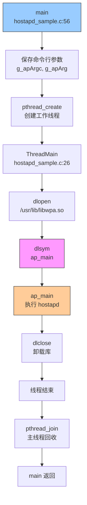
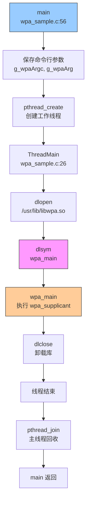
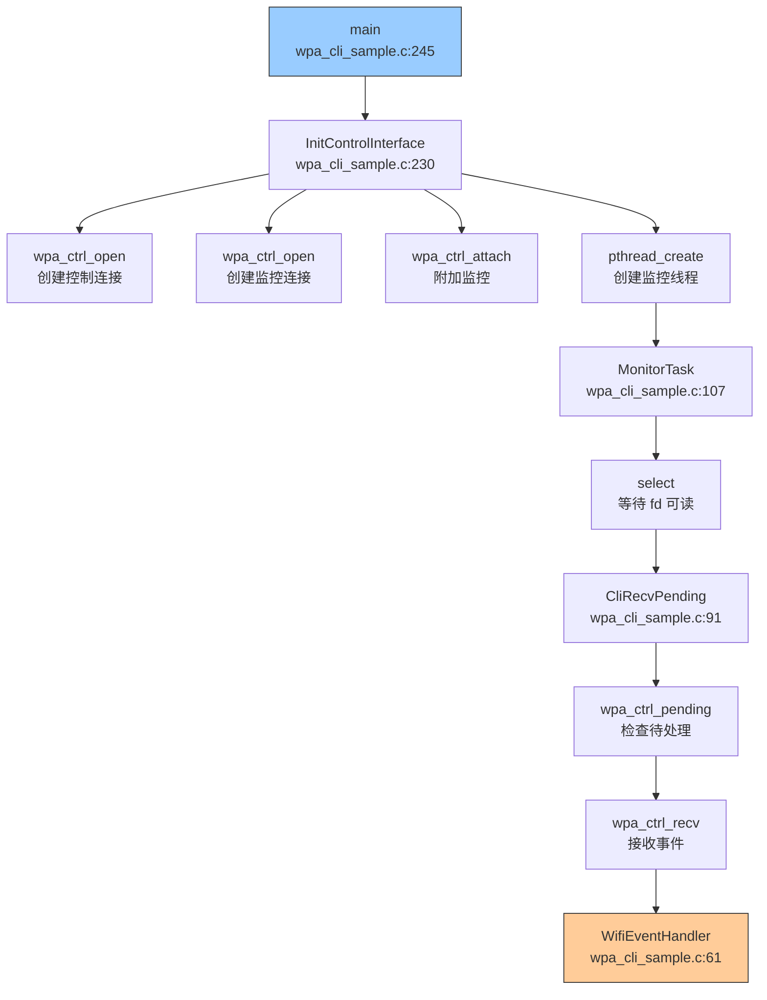
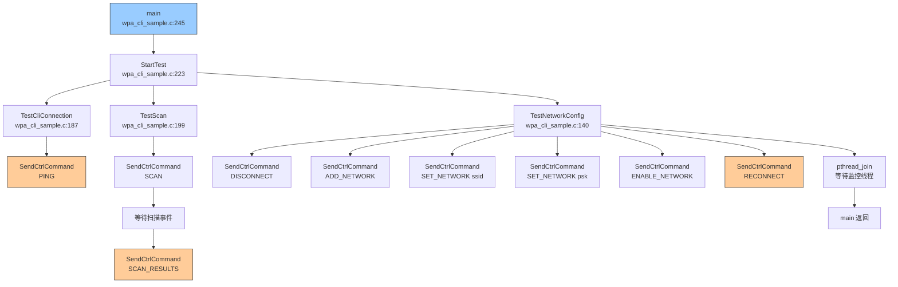
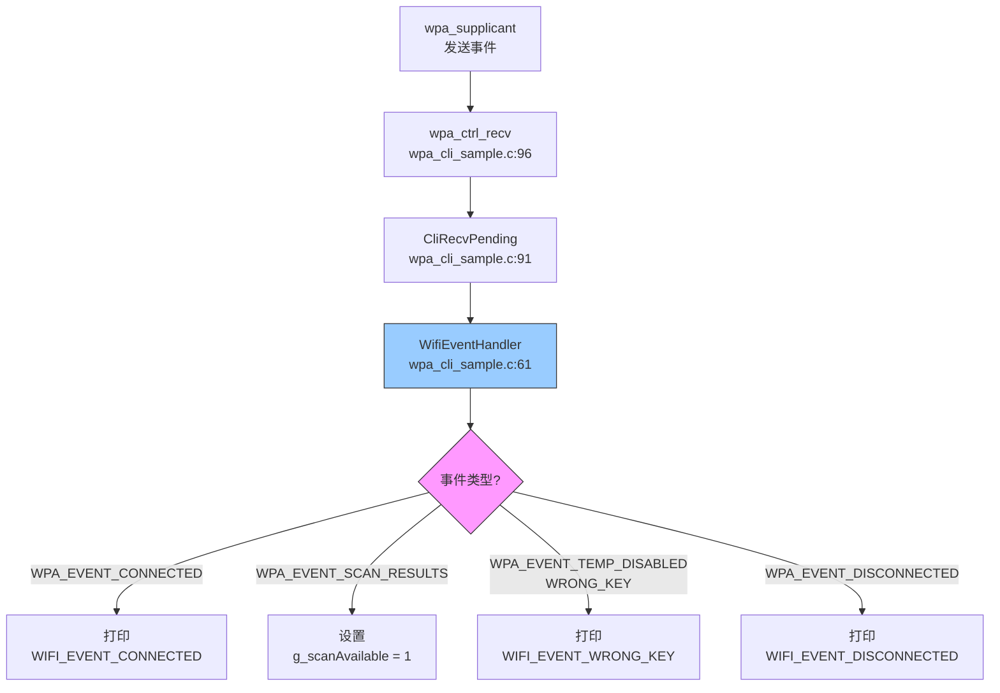
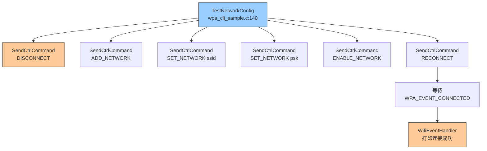
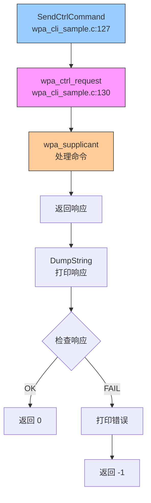

# 关键调用链

> 项目关键函数调用链，帮助理解代码执行流程

---

## 目的

本文档记录 `@ohos/camera_sample_communication` 项目的关键调用链，帮助开发者理解代码执行流程。

## 适用范围

本文档适用于：
- 需要理解代码执行流程的开发者
- 准备调试代码的工程师

---

## hostapd 调用链

### 启动流程

### 代码证据

| 调用 | 源文件 | 行号 |
|------|--------|------|
| main() | hostapd_sample.c | 56 |
| pthread_create() | hostapd_sample.c | 63 |
| ThreadMain() | hostapd_sample.c | 26 |
| dlopen() | hostapd_sample.c | 30 |
| dlsym() | hostapd_sample.c | 36 |
| ap_main() | libwpa.so | - |
| dlclose() | hostapd_sample.c | 49 |
| pthread_join() | hostapd_sample.c | 68 |

---

## wpa_supplicant 调用链

### 启动流程

### 代码证据

| 调用 | 源文件 | 行号 |
|------|--------|------|
| main() | wpa_sample.c | 56 |
| pthread_create() | wpa_sample.c | 63 |
| ThreadMain() | wpa_sample.c | 26 |
| dlopen() | wpa_sample.c | 30 |
| dlsym() | wpa_sample.c | 36 |
| wpa_main() | libwpa.so | - |
| dlclose() | wpa_sample.c | 49 |
| pthread_join() | wpa_sample.c | 68 |

---

## wpa_cli 调用链

### 初始化流程

### 测试流程

### 代码证据

| 调用 | 源文件 | 行号 |
|------|--------|------|
| main() | wpa_cli_sample.c | 245 |
| InitControlInterface() | wpa_cli_sample.c | 230 |
| wpa_ctrl_open() | wpa_cli_sample.c | 232-233 |
| wpa_ctrl_attach() | wpa_cli_sample.c | 238 |
| pthread_create() | wpa_cli_sample.c | 239 |
| MonitorTask() | wpa_cli_sample.c | 107 |
| select() | wpa_cli_sample.c | 116 |
| CliRecvPending() | wpa_cli_sample.c | 91 |
| wpa_ctrl_pending() | wpa_cli_sample.c | 93 |
| wpa_ctrl_recv() | wpa_cli_sample.c | 96 |
| WifiEventHandler() | wpa_cli_sample.c | 61 |
| StartTest() | wpa_cli_sample.c | 223 |
| TestCliConnection() | wpa_cli_sample.c | 187 |
| TestScan() | wpa_cli_sample.c | 199 |
| TestNetworkConfig() | wpa_cli_sample.c | 140 |
| SendCtrlCommand() | wpa_cli_sample.c | 127 |
| pthread_join() | wpa_cli_sample.c | 253 |

---

## WiFi 事件处理调用链

### 事件处理流程

### 代码证据

| 调用 | 源文件 | 行号 |
|------|--------|------|
| wpa_ctrl_recv() | wpa_cli_sample.c | 96 |
| CliRecvPending() | wpa_cli_sample.c | 91 |
| WifiEventHandler() | wpa_cli_sample.c | 61 |
| WPA_EVENT_CONNECTED | wpa_cli_sample.c | 72 |
| WPA_EVENT_SCAN_RESULTS | wpa_cli_sample.c | 76 |
| WPA_EVENT_TEMP_DISABLED | wpa_cli_sample.c | 81 |
| WPA_EVENT_DISCONNECTED | wpa_cli_sample.c | 85 |

---

## 网络连接调用链

### 连接流程

### 代码证据

| 调用 | 源文件 | 行号 |
|------|--------|------|
| TestNetworkConfig() | wpa_cli_sample.c | 140 |
| SendCtrlCommand() - DISCONNECT | wpa_cli_sample.c | 144 |
| SendCtrlCommand() - ADD_NETWORK | wpa_cli_sample.c | 145 |
| SendCtrlCommand() - SET_NETWORK ssid | wpa_cli_sample.c | 159 |
| SendCtrlCommand() - SET_NETWORK psk | wpa_cli_sample.c | 161 |
| SendCtrlCommand() - ENABLE_NETWORK | wpa_cli_sample.c | 167 |
| SendCtrlCommand() - RECONNECT | wpa_cli_sample.c | 173 |
| WifiEventHandler() - CONNECTED | wpa_cli_sample.c | 72 |

---

## 控制命令调用链

### 命令发送流程

### 代码证据

| 调用 | 源文件 | 行号 |
|------|--------|------|
| SendCtrlCommand() | wpa_cli_sample.c | 127 |
| wpa_ctrl_request() | wpa_cli_sample.c | 130 |
| DumpString() | wpa_cli_sample.c | 131 |

---

## 调用链汇总

### 主入口调用链

| 组件 | 入口函数 | 调用链 |
|------|---------|--------|
| hostapd | main() | main → pthread_create → ThreadMain → dlopen → dlsym → ap_main |
| wpa_supplicant | main() | main → pthread_create → ThreadMain → dlopen → dlsym → wpa_main |
| wpa_cli | main() | main → InitControlInterface → StartTest → TestScan/TestNetworkConfig |

### 关键函数调用链

| 功能 | 调用链 |
|------|--------|
| 初始化控制接口 | InitControlInterface → wpa_ctrl_open → wpa_ctrl_attach |
| 监控事件 | MonitorTask → select → CliRecvPending → wpa_ctrl_recv → WifiEventHandler |
| 发送命令 | SendCtrlCommand → wpa_ctrl_request |
| 连接网络 | TestNetworkConfig → SendCtrlCommand × 5 (DISCONNECT, ADD, SET, ENABLE, RECONNECT) |
| 扫描网络 | TestScan → SendCtrlCommand(SCAN) → 等待事件 → SendCtrlCommand(SCAN_RESULTS) |

---

## 使用建议

### 调试技巧

1. **使用断点**: 在关键函数设置断点，跟踪调用流程
2. **打印调用栈**: 使用 `backtrace()` 打印调用栈
3. **日志跟踪**: 在关键位置添加日志，跟踪执行流程

### 扩展建议

1. **添加回调**: 将 `WifiEventHandler()` 改为回调机制
2. **事件队列**: 使用事件队列处理 WiFi 事件
3. **异步操作**: 将阻塞操作改为异步

---

## 参考文档

- [架构说明](03_Architecture.md) - 组件交互和数据流
- [内部 API](05_Internal_API.md) - 模块接口和依赖
- [对外 API](04_External_API.md) - 对外接口说明
