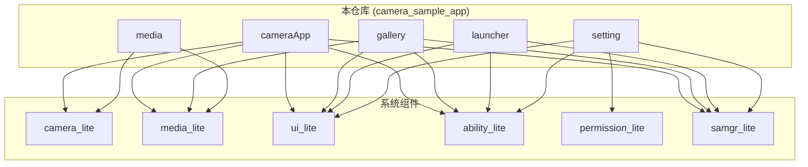

# OpenHarmony Camera 示例项目 - 概览

## 项目定位与边界

### 定位
本项目是 **OpenHarmony Lite 版本** 的媒体子系统示例应用集合，提供端到端的相机和多媒体应用参考实现。主要面向 IoT/轻量级设备（如智能手表、智能家居中控等）。

**所属子系统**: 媒体子系统 (Multimedia Subsystem)  
**代码仓**: `applications/sample/camera` (camera_sample_lite)

### 边界

**包含**:
- 完整的相机应用（预览、拍照、录像）
- 图库应用（图片浏览、视频播放）
- 桌面启动器（应用管理、快捷启动）
- 系统设置（权限管理、WiFi、显示设置）
- 媒体示例程序（独立可执行文件）

**不包含**:
- 底层多媒体 HAL/驱动实现（位于 `multimedia_camera_lite` 等仓）
- 系统服务实现（位于 `samgr_lite` 等仓）
- ArkUI 框架实现（位于 `arkui_ui_lite` 等仓）
- 测试代码（位于各模块的 test/ 目录，本 Wiki 不覆盖）

---

## 核心能力

| 能力 | 实现模块 | 关键技术 |
|------|----------|----------|
| 相机预览 | cameraApp | CameraKit + Surface |
| 拍照 | cameraApp | FrameConfig + JPEG 编码 |
| 录像 | cameraApp | Recorder + 视频编码 |
| 图库浏览 | gallery | 缩略图生成 + 图片解码 |
| 视频播放 | gallery | Player + 音视频同步 |
| 应用管理 | launcher | BundleManager + Ability 启动 |
| 权限管理 | setting | Permission API (Grant/Revoke/Query) |
| WiFi 设置 | setting | wpa_supplicant 客户端 |

---

## 运行环境

### 目标设备类型
```json
// cameraApp/src/main/config.json
"deviceType": [
  "phone", "tv", "tablet", "pc", 
  "car", "smartWatch", "sportsWatch", "smartVision"
]
```

### 系统要求
- **OpenHarmony 版本**: 3.1 (API 3-4)
- **系统类型**: small (轻量级系统)
- **C++ 版本**: C++11 或更高
- **构建工具**: hb (OpenHarmony Build)

### 依赖组件
- ability_lite (Ability 框架)
- bundle_framework_lite (包管理)
- camera_lite (相机服务)
- media_lite (媒体播放/录制)
- ui_lite (图形界面)
- surface_lite (图形缓冲区)
- samgr_lite (系统服务管理)
- permission (权限管理)

---

## 关键概念

### 1. Ability 框架
OpenHarmony 应用的基本组成单元。本项目中所有应用均基于 Ability 框架实现：
- **Ability**: 应用入口，`OnStart/OnStop` 生命周期
- **AbilitySlice**: 页面切片，`OnStart/OnActive/OnBackground/OnStop` 生命周期
- **Want**: 应用间通信/启动参数载体

**代码示例** (`cameraApp/cameraApp/src/main/cpp/camera_ability.cpp`):
```cpp
REGISTER_AA(CameraAbility)

void CameraAbility::OnStart(const Want &want) {
    printf("CameraAbility::OnStart\n");
    SetMainRoute("CameraAbilitySlice");
}
```

### 2. CameraKit 架构
相机能力封装，提供统一的相机操作接口：
```cpp
#include "camera_kit.h"
CameraKit *camKit = CameraKit::GetInstance();
list<string> camList = camKit->GetCameraIds();
camKit->CreateCamera(camId, *CamStateMng, eventHdlr_);
```

### 3. 权限模型
OpenHarmony 权限分级：
- **system_grant**: 系统授权（安装时自动授予）
- **user_grant**: 用户授权（运行时需用户确认）

**本应用使用的权限**:
| 权限 | 级别 | 用途 |
|------|------|------|
| ohos.permission.CAMERA | user_grant | 相机访问 |
| ohos.permission.MICROPHONE | user_grant | 录音 |
| ohos.permission.READ_MEDIA | user_grant | 读取媒体文件 |
| ohos.permission.WRITE_MEDIA | user_grant | 写入媒体文件 |
| ohos.permission.MODIFY_AUDIO_SETTINGS | system_grant | 修改音频设置 |

### 4. HAP 包结构
OpenHarmony 应用包（HarmonyOS Ability Package）：
- `.so`: Native 代码库
- `config.json`: 应用配置（包名、权限、Ability 清单）
- `resources/`: 资源文件（图片、布局等）
- 数字签名: `.p7b` 证书

### 5. 与标准版 OpenHarmony 的区别
| 特性 | 本项目 (Lite) | 标准版 |
|------|--------------|--------|
| 编程语言 | C++ (Native) | JS/ArkTS + C++ |
| UI 框架 | ui_lite | ArkUI |
| 应用包 | HAP (Native) | HAP (多类型) |
| 设备类型 | 轻量 IoT | 手机/平板/车机等 |
| API 版本 | 3-4 | 9+ |

---

## 项目关系图



---

## 相关链接

- [目录结构](./Structure.md) - 代码组织详情
- [架构说明](./Architecture.md) - 系统架构详解
- [构建系统](./Build_System.md) - 如何编译
- [安全风险分析](./Security.md) - 安全注意事项
