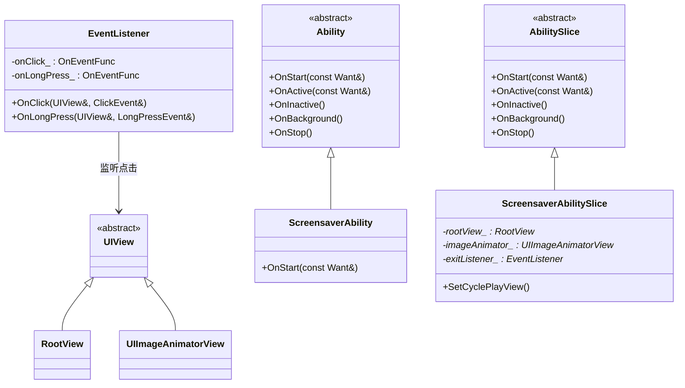
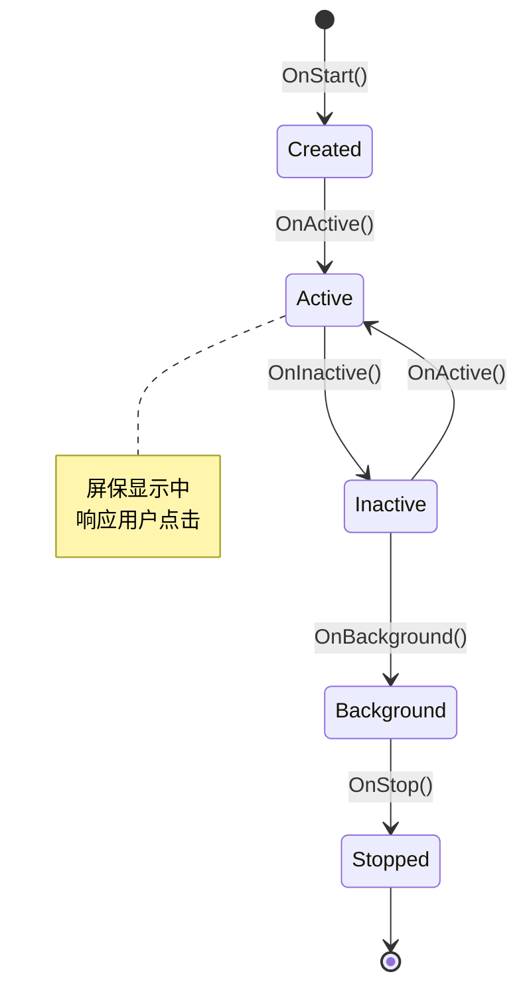
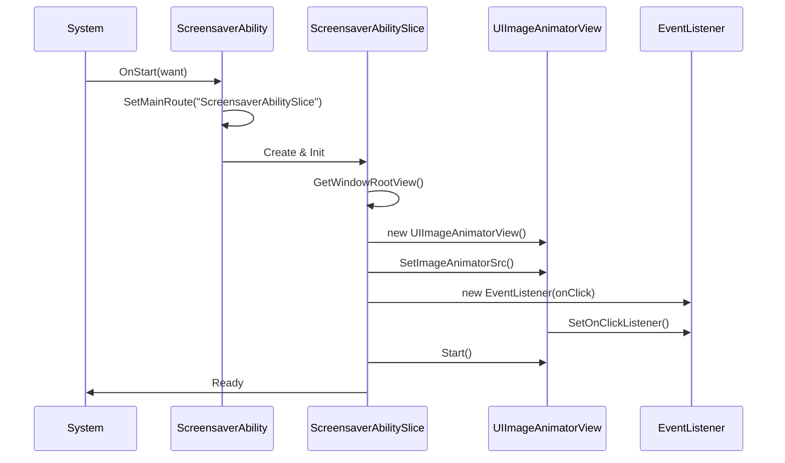

# 架构设计

## 1. 组件图

### 1.1 整体架构

```
┌─────────────────────────────────────────────────────────────┐
│                    用户态应用层                              │
│  ┌─────────────────────────────────────────────────────┐   │
│  │              ScreensaverAbility                      │   │
│  │  (Ability 生命周期管理)                               │   │
│  └─────────────────────────────────────────────────────┘   │
│                           │                                 │
│                           ▼                                 │
│  ┌─────────────────────────────────────────────────────┐   │
│  │            ScreensaverAbilitySlice                   │   │
│  │  (UI 渲染与事件处理)                                   │   │
│  │  ┌─────────────┐  ┌─────────────┐  ┌─────────────┐ │   │
│  │  │  RootView   │  │UIImageAnimator│ │EventListener│ │   │
│  │  │  (根视图)    │  │   View      │  │  (事件)     │ │   │
│  │  │             │  │  (动画)     │  │             │ │   │
│  │  └─────────────┘  └─────────────┘  └─────────────┘ │   │
│  └─────────────────────────────────────────────────────┘   │
└─────────────────────────────────────────────────────────────┘
                          │
                          ▼
┌─────────────────────────────────────────────────────────────┐
│                   OpenHarmony 框架层                         │
│  ┌─────────────┐  ┌─────────────┐  ┌─────────────────────┐ │
│  │ Ability     │  │ UI Lite     │  │ Surface Lite        │ │
│  │ Lite        │  │             │  │                     │ │
│  └─────────────┘  └─────────────┘  └─────────────────────┘ │
└─────────────────────────────────────────────────────────────┘
```

### 1.2 类图



---

## 2. 数据流

### 2.1 启动流程

```
系统启动屏保
        │
        ▼
ScreensaverAbility::OnStart()
        │
        ├── SetMainRoute("ScreensaverAbilitySlice")
        │         │
        │         ▼
        │   系统加载 ScreensaverAbilitySlice
        │
        └── Ability::OnStart(want)
                 │
                 ▼
        ScreensaverAbilitySlice::OnStart()
                 │
                 ├── GetWindowRootView()
                 │         │
                 │         ▼
                 │   设置根视图属性
                 │
                 ├── SetCyclePlayView()
                 │         │
                 │         ├── 创建 UIImageAnimatorView
                 │         ├── 配置图片动画参数
                 │         ├── 添加点击事件监听器
                 │         └── 启动动画
                 │
                 └── SetUIContent(rootView_)
                          │
                          ▼
                 屏保界面显示完成
```

### 2.2 用户交互流程

```
用户点击屏幕
        │
        ▼
EventListener::OnClick()
        │
        ├── 执行回调函数
        │         │
        │         ▼
        │   TerminateAbility()
        │
        └── 返回 true（事件已处理）
```

---

## 3. 生命周期

### 3.1 Ability 生命周期状态机



### 3.2 生命周期回调实现

| 状态 | 回调 | 实现位置 | 职责 |
|------|------|----------|------|
| 创建 | OnStart | `screensaver_ability.cpp:21` | 设置主路由 |
| 活跃 | OnActive | `screensaver_ability.cpp:32` | 转发给父类 |
| 非活跃 | OnInactive | `screensaver_ability.cpp:27` | 转发给父类 |
| 后台 | OnBackground | `screensaver_ability.cpp:37` | 转发给父类 |
| 停止 | OnStop | `screensaver_ability.cpp:42` | 转发给父类 |

---

## 4. 线程模型

### 4.1 执行线程

**单线程模型**：本应用运行在主线程（UI 线程）。

**约束**：
- 所有 UI 操作必须在主线程执行
- 事件监听回调在主线程触发
- 不涉及多线程同步问题

### 4.2 资源生命周期

```
ScreensaverAbilitySlice 构造
        │
        ├── rootView_ = nullptr
        ├── imageAnimator_ = nullptr
        └── exitListener_ = nullptr
        │
        ▼
ScreensaverAbilitySlice::OnStart()
        │
        ├── rootView_ = GetWindowRootView()
        ├── imageAnimator_ = new UIImageAnimatorView()
        └── exitListener_ = new EventListener(...)
        │
        ▼
ScreensaverAbilitySlice::OnStop() 或析构
        │
        ├── delete imageAnimator_
        ├── delete exitListener_
        └── 置空指针
```

**证据**：`screensaver_ability_slice.cpp:33-44`

---

## 5. 关键时序图

### 5.1 启动时序



---

## 6. 文档导航

- **下一步**：[内部 API](05_Inner_API.md) → 模块接口
- **返回**：[目录结构](02_Directory_Structure.md) → 代码组织
- **相关**：[构建系统](06_Build.md) → 构建配置
