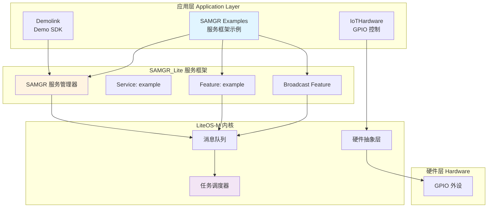
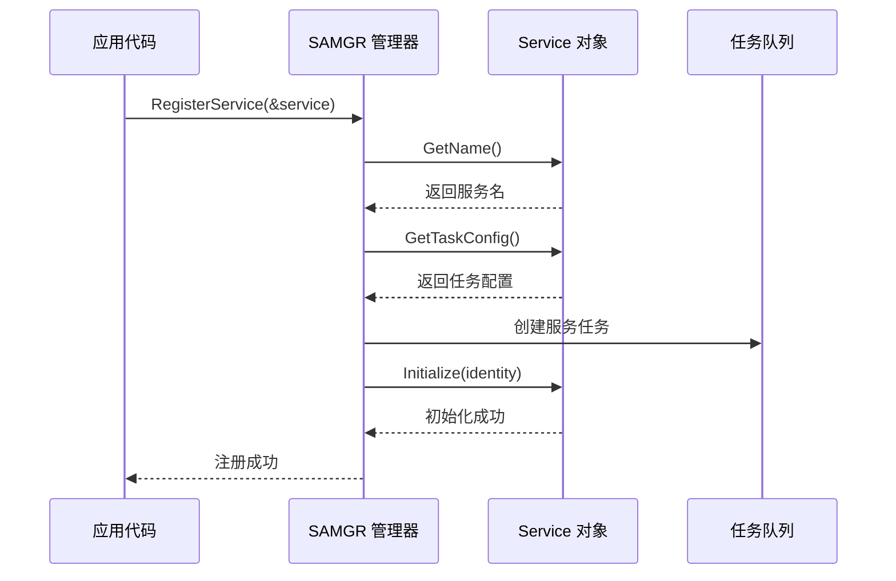
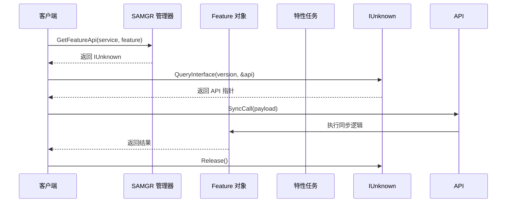
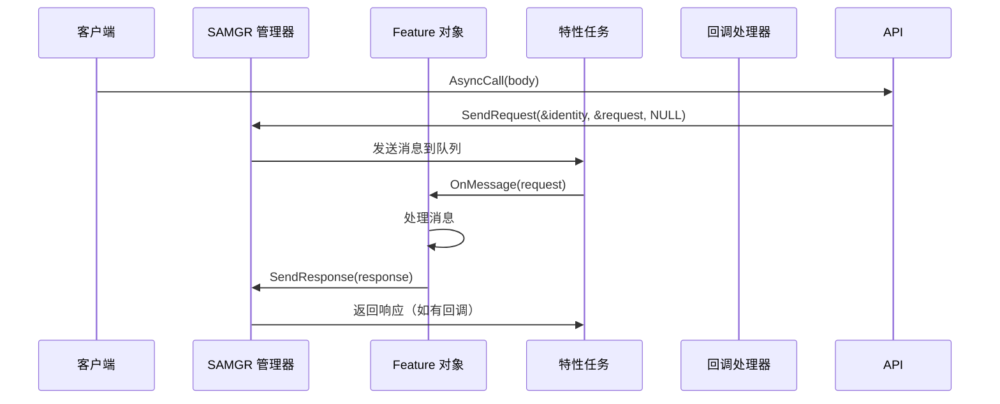
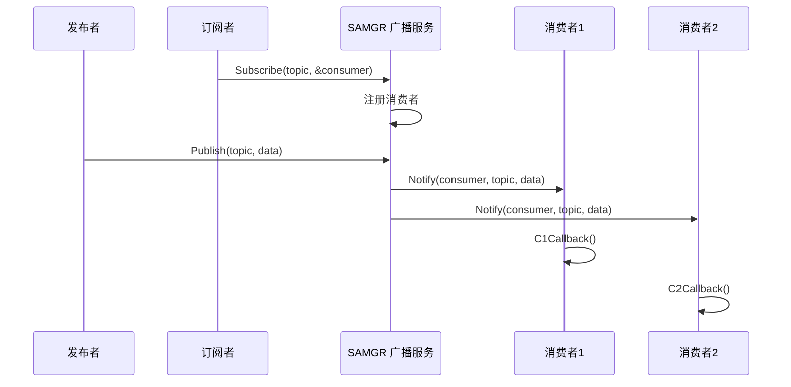
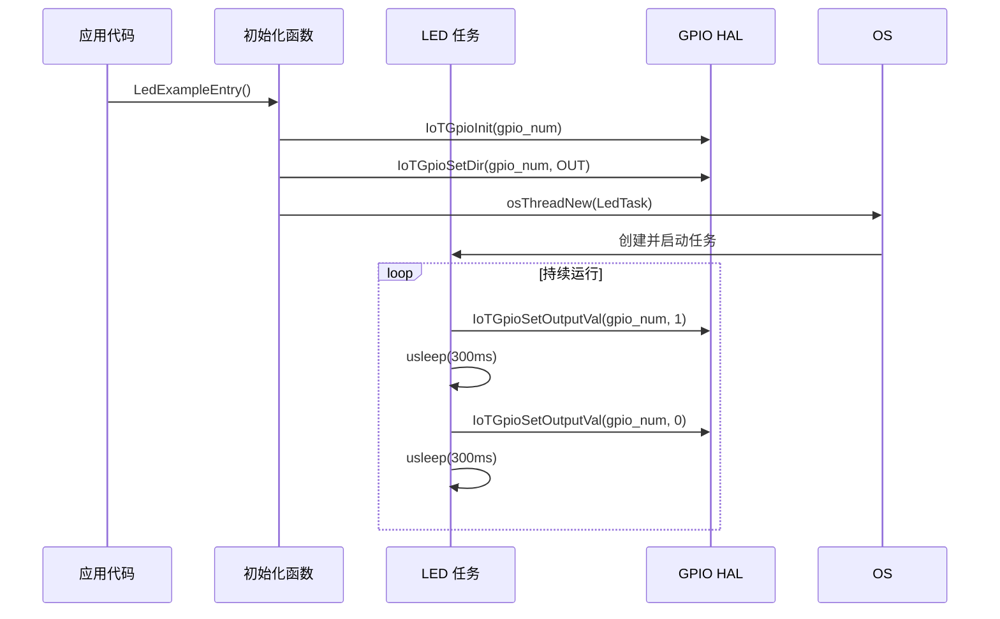
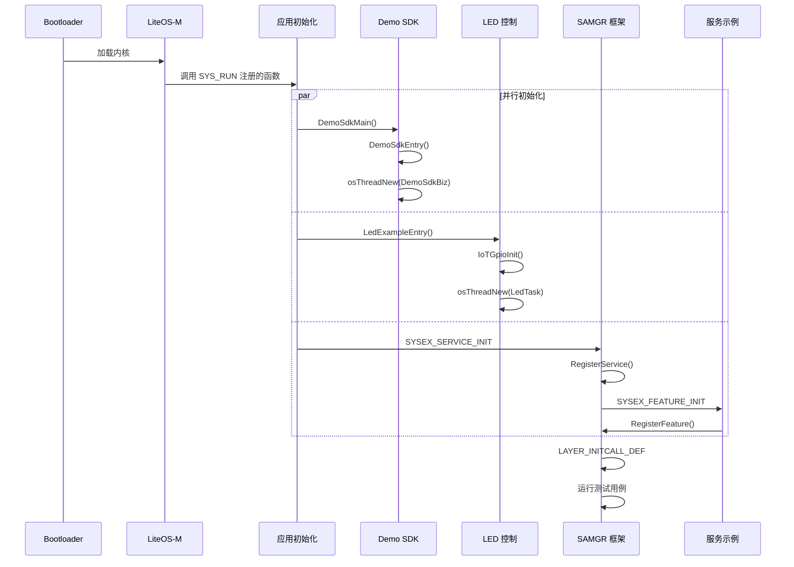
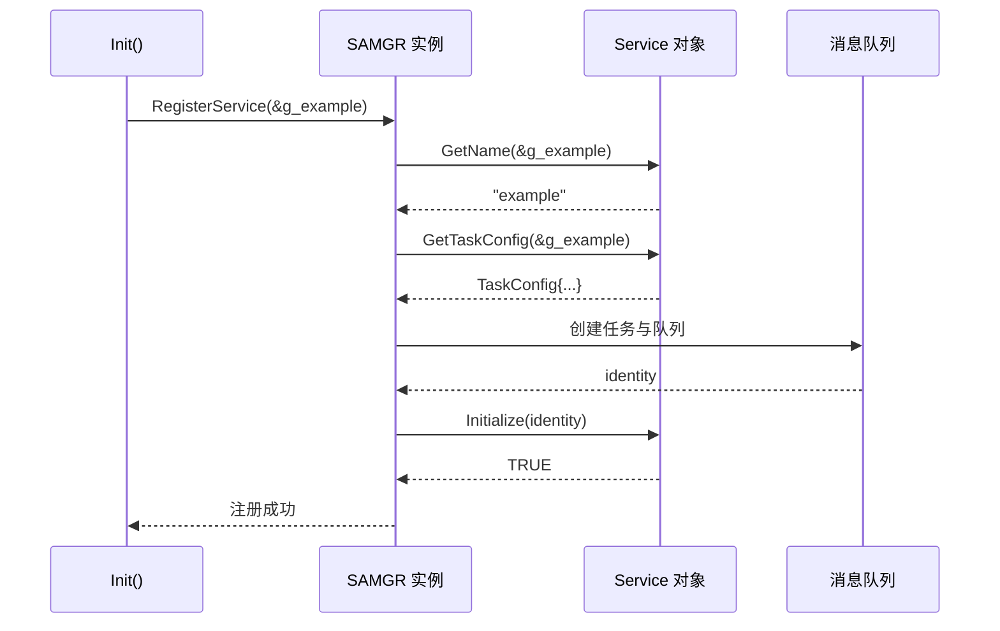
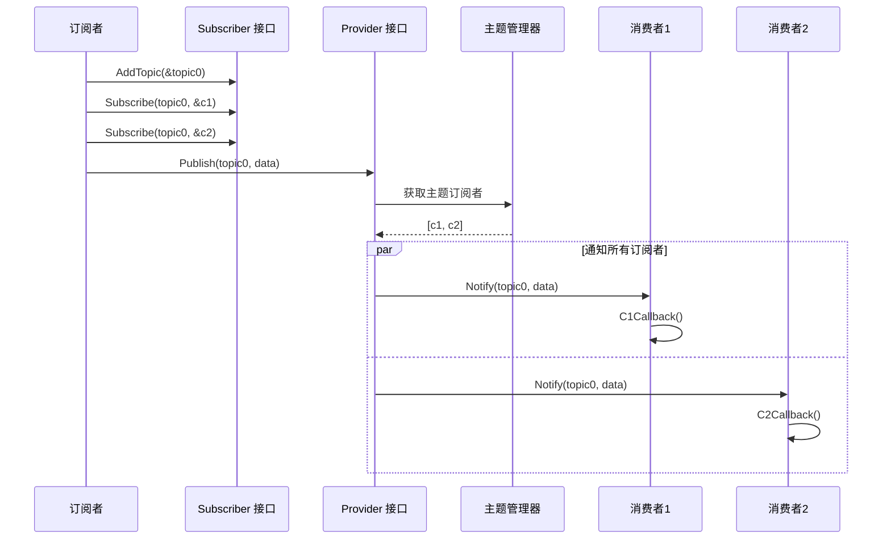

# 架构说明

## 目的

本文档详细描述项目的架构设计，包括组件关系、数据流、线程模型和关键时序。

## 适用范围

- 理解系统整体架构的开发者
- 进行架构设计或重构的工程师
- 学习 SAMGR_Lite 框架的开发者

## 关键结论

1. **分层架构**: 应用层 → SAMGR_Lite 服务框架 → LiteOS-M 内核
2. **模块化设计**: demolink、iothardware、samgr 三个独立模块
3. **事件驱动**: SAMGR_Lite 基于消息队列的异步通信机制
4. **轻量级**: 无 JS 层，纯 C 实现，适合资源受限设备

## 组件图



## 模块职责与边界

### 1. 应用层 (app/)

#### demolink 模块
**职责**: 展示如何集成和运行自定义 SDK
**边界**: 只负责 SDK 入口和任务管理，不涉及服务间通信

**关键组件**:
- Demo SDK 适配层（demosdk_adapter.c/h）
- SDK 入口（demosdk.c）
- 启动入口（helloworld.c）

证据：
- `app/demolink/demosdk.c:33-48` DemoSdkEntry 函数

#### iothardware 模块
**职责**: IoT 硬件操作（GPIO）
**边界**: 只负责硬件操作，不涉及服务间通信

**关键组件**:
- LED 控制任务（LedTask）
- GPIO 初始化与控制

证据：
- `app/iothardware/led_example.c:35-59` LedTask 任务函数

#### samgr 模块
**职责**: SAMGR_Lite 服务框架完整示例
**边界**: 依赖 SAMGR_Lite 框架，不直接操作硬件

**关键组件**:
- 服务示例（Service Example）
- 特性示例（Feature Example）
- 广播示例（Broadcast Example）
- 启动顺序示例（Bootstrap Example）
- 维护接口示例（Maintenance Example）

证据：
- `app/samgr/service_example.c:92` 注册服务

### 2. SAMGR_Lite 服务框架

#### SAMGR 核心组件

| 组件 | 说明 | 接口 |
|------|------|------|
| Service | 服务抽象单元，具有独立任务和消息队列 | GetName, Initialize, MessageHandle, GetTaskConfig |
| Feature | 服务的具体实现 | GetName, OnInitialize, OnStop, OnMessage |
| IUnknown | 接口查询与引用计数机制 | QueryInterface, AddRef, Release |
| Identity | 服务/特性的唯一标识 | serviceId, featureId, queueId |

证据：
- `app/samgr/service_example.c:33-37` ExampleService 结构定义
- `app/samgr/feature_example.c:50-54` DemoFeature 结构定义

### 3. LiteOS-M 内核

#### 核心能力

| 能力 | 说明 | API |
|------|------|-----|
| 任务管理 | 创建、删除、调度任务 | osThreadNew, osThreadGetId |
| 消息队列 | 跨任务消息传递 | (由 SAMGR 封装) |
| 硬件抽象 | 提供统一硬件操作接口 | IoTGpioInit, IoTGpioSetDir |

证据：
- `app/iothardware/led_example.c:19` 包含 cmsis_os2.h
- `app/iothardware/led_example.c:76` 使用 osThreadNew

## 数据流

### 1. SAMGR 服务注册流程



证据：
- `app/samgr/service_example.c:90-96` Init 函数实现注册

### 2. SAMGR 特性调用流程（同步）



证据：
- `app/samgr/feature_example.c:198-220` CASE_GetIUnknown 函数
- `app/samgr/feature_example.c:130-140` SyncCall 函数

### 3. SAMGR 特性调用流程（异步）



证据：
- `app/samgr/feature_example.c:142-157` AsyncCall 函数
- `app/samgr/feature_example.c:105-128` FEATURE_OnMessage 函数

### 4. 广播消息流程



证据：
- `app/samgr/broadcast_example.c:31-45` C1Callback 和 C2Callback 函数
- `app/samgr/broadcast_example.c:124-158` CASE_AddAndUnsubscribeTopic 函数

### 5. GPIO 控制流程



证据：
- `app/iothardware/led_example.c:61-79` LedExampleEntry 函数
- `app/iothardware/led_example.c:35-59` LedTask 任务函数

## 线程模型

### CMSIS-OS2 任务配置

项目使用 CMSIS-OS2 标准接口进行任务管理。

#### SAMGR 服务任务配置

```c
TaskConfig config = {
    LEVEL_HIGH,       // 优先级等级
    PRI_BELOW_NORMAL, // 任务优先级
    0x800,           // 栈大小（2048 字节）
    20,              // 任务队列大小
    SHARED_TASK      // 共享任务模式
};
```

证据：
- `app/samgr/service_example.c:66-68` GetTaskConfig 函数

#### LED 任务配置

```c
attr.stack_size = 512;    // 栈大小（512 字节）
attr.priority = 25;       // 任务优先级
```

证据：
- `app/iothardware/led_example.c:73-74` osThreadNew 属性配置

### 任务优先级

| 任务 | 优先级 | 说明 |
|------|--------|------|
| SAMGR 服务任务 | PRI_BELOW_NORMAL (20) | 服务消息处理 |
| LED 任务 | 25 | 硬件控制任务 |
| Demo SDK 任务 | 20 | SDK 业务逻辑 |

证据：
- `app/iothardware/led_example.c:24` LED_TASK_PRIO = 25
- `app/demolink/demosdk.c:22` TASK_PRIO = 20
- `app/samgr/service_example.c:67` PRI_BELOW_NORMAL

### 消息队列

SAMGR_Lite 为每个服务/特性维护独立的消息队列，实现异步消息处理。

消息结构：
```c
typedef struct {
    uint32 msgId;      // 消息 ID
    uint32 msgValue;   // 消息值
    uint16 len;        // 数据长度
    void *data;        // 消息数据
} Request;
```

证据：
- `app/samgr/feature_example.c:36-40` Payload 结构定义
- `app/samgr/feature_example.c:144-156` AsyncCall 构造 Request

## 关键时序

### 系统启动时序



### 服务注册时序



证据：
- `app/samgr/service_example.c:90-96` Init 函数

### 广播发布订阅时序



证据：
- `app/samgr/broadcast_example.c:124-158` CASE_AddAndUnsubscribeTopic 函数

## 架构特点

### 1. 轻量级设计
- 无 JS 运行时，纯 C 实现
- 最小化内存占用
- 适合资源受限设备

### 2. 模块化
- 清晰的模块边界
- 独立的 GN targets
- 松耦合设计

### 3. 事件驱动
- SAMGR_Lite 基于消息队列
- 异步通信机制
- 回调处理

### 4. 可扩展性
- 服务/特性注册机制
- 插件式架构
- 支持动态加载（理论上）

## 相关跳转链接

- [项目概览](01_Project_Overview.md)
- [目录结构与模块职责](02_Directory_Structure.md)
- [对外 API 文档](04_N-API_External.md)
- [内部 API](05_Inner_API.md)
- [附录 A: 关键调用链](appendix/Callgraphs.md)
