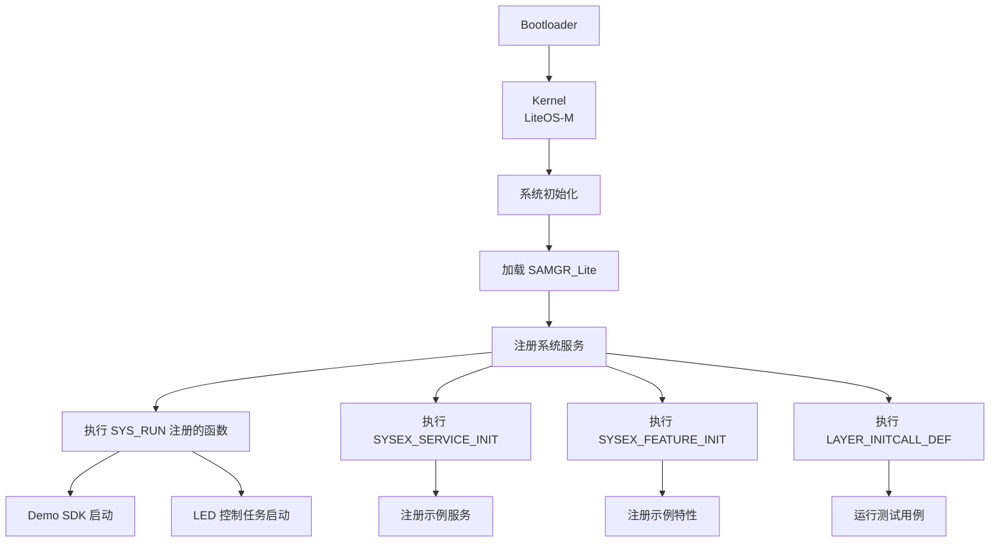

# 编译产物

## 目的

本文档描述项目的编译产物，包括静态库、最终可执行文件及其安装和运行时加载关系。

## 适用范围

- 需要了解编译产物的开发者
- 进行固件打包和部署的工程师
- 排查运行时加载问题的开发者

## 关键结论

1. **静态库为主**: 编译产物为 3 个静态库（.a 文件）
2. **集成到系统镜像**: 静态库链接到最终的 OpenHarmony 系统镜像
3. **无独立可执行文件**: 本项目是组件，不直接生成可执行文件
4. **依赖系统框架**: 运行时依赖 LiteOS-M、SAMGR_Lite 等系统组件

## 产物清单

### 静态库产物

| Target 名称 | 产物文件 | 代码行数 | 包含的源文件 | 说明 |
|-------------|---------|---------|-------------|------|
| example_demolink | libexample_demolink.a | ~128 行 | demosdk.c, demosdk_adapter.c, helloworld.c | Demo SDK 示例库 |
| led_example | libled_example.a | ~82 行 | led_example.c | LED 控制示例库 |
| example_samgr | libexample_samgr.a | ~1765 行 | *.c (9 个文件) | SAMGR_Lite 框架示例库 |

**总计**: 约 1975 行 C 代码编译为 3 个静态库。

证据：
- `app/demolink/BUILD.gn:15-19` example_demolink sources
- `app/iothardware/BUILD.gn:15` led_example source
- `app/samgr/BUILD.gn:15-25` example_samgr sources

### Target ↔ 产物映射

| Target | 产物文件 | 构建路径 | 依赖 |
|--------|---------|---------|------|
| example_demolink | libexample_demolink.a | out/{board}/libs/libexample_demolink.a | utils_lite |
| led_example | libled_example.a | out/{board}/libs/libled_example.a | utils_lite, liteos_m, peripheral |
| example_samgr | libexample_samgr.a | out/{board}/libs/libexample_samgr.a | utils_lite, liteos_m, samgr_lite |

**说明**: `{board}` 为目标开发板名称，如 `hispark_pegasus`。

证据：
- GN 构建系统默认输出路径规则
- BUILD.gn 文件中的 target 定义

## 最终可执行文件

### 系统镜像

本项目作为 OpenHarmony 系统的示例组件，静态库会被链接到最终的系统镜像中。

**可能的系统镜像**:
- `OHOS_Image.bin` - OpenHarmony 系统镜像
- `OHOS_Image.elf` - ELF 格式系统镜像（用于调试）
- `rootfs_jffs2.img` - 根文件系统镜像

**注意**: 系统镜像由上层构建脚本生成，本项目只提供组件库。

证据：
- `app/BUILD.gn:16-18` 使用 `lite_component`，表明这是系统组件而非独立应用

## 安装路径

### 开发板固件结构

```
/
├── bin/                  # 可执行文件
├── lib/                  # 共享库（本项目不使用）
├── etc/                  # 配置文件
├── dev/                  # 设备文件
└── ...                   # 其他系统目录
```

### 本项目代码运行位置

- **Demo SDK 代码**: 集成到系统进程，随系统启动运行
- **LED 控制代码**: 作为系统任务运行，控制 GPIO
- **SAMGR 示例代码**: 作为系统服务和特性运行

**注意**: 代码不是独立可执行文件，而是链接到系统镜像中。

## 运行时加载关系

### 系统启动流程



### 模块加载时序

根据 `SYS_RUN`、`SYSEX_SERVICE_INIT`、`SYSEX_FEATURE_INIT` 和 `LAYER_INITCALL_DEF` 宏，加载顺序如下：

| 阶段 | 宏名 | 模块 | 函数 | 说明 |
|------|------|------|------|------|
| 1 | SYS_RUN | demolink | DemoSdkMain | Demo SDK 入口 |
| 2 | SYS_RUN | iothardware | LedExampleEntry | LED 控制入口 |
| 3 | SYSEX_SERVICE_INIT | samgr | Init (service_example) | 注册服务 |
| 4 | SYSEX_SERVICE_INIT | samgr | Init (broadcast_example) | 注册广播服务 |
| 5 | SYSEX_FEATURE_INIT | samgr | Init (feature_example) | 注册特性 |
| 6 | LAYER_INITCALL_DEF | samgr | RunTestCase | 运行测试用例 |

证据：
- `app/demolink/helloworld.c:24` SYS_RUN
- `app/iothardware/led_example.c:81` SYS_RUN
- `app/samgr/service_example.c:98` SYSEX_SERVICE_INIT
- `app/samgr/broadcast_example.c:93` SYSEX_SERVICE_INIT
- `app/samgr/feature_example.c:194` SYSEX_FEATURE_INIT
- `app/samgr/service_example.c:187` LAYER_INITCALL_DEF

### 运行时依赖关系

```
系统镜像
├── LiteOS-M 内核
│   ├── 任务调度
│   └── 消息队列
├── SAMGR_Lite 框架
│   ├── 服务管理
│   ├── 特性管理
│   └── 广播服务
├── utils_lite
│   ├── 字符串处理（securec）
│   └── 其他工具
├── peripheral
│   └── GPIO HAL
├── example_demolink.a
│   └── Demo SDK 代码（链接到系统）
├── led_example.a
│   └── LED 控制代码（链接到系统）
└── example_samgr.a
    └── SAMGR 示例代码（链接到系统）
```

## 固件部署流程

### 编译与打包

```bash
# 1. 设置开发板
hb set -p hispark_pegasus@wifi

# 2. 编译
hb build -f

# 3. 固件输出位置
# out/hispark_pegasus/wifi_hispark_pegasus/OHOS_Image.bin
# out/hispark_pegasus/wifi_hispark_pegasus/OHOS_Image.elf
```

### 刷写到硬件

使用 HiTool 或 HUAWEI DevEco Device Tool 刷写固件到 HiSpark Pegasus 开发板。

## 内存占用分析

### 静态库大小

| 静态库 | 估算大小（已编译） | 说明 |
|-------|----------------|------|
| libexample_demolink.a | ~2-5 KB | 3 个源文件，代码简单 |
| libled_example.a | ~1-2 KB | 1 个源文件，代码简单 |
| libexample_samgr.a | ~10-15 KB | 9 个源文件，包含多个示例 |

**总计**: 约 13-22 KB（静态库大小）

**注意**: 实际内存占用取决于：
- 编译器优化级别（-O0, -O2, -O3）
- 目标架构（ARM Cortex-M 等）
- 链接时优化（LTO）

### 运行时内存

- **代码段（Text）**: 静态库代码大小
- **数据段（Data）**: 全局变量、静态变量
- **BSS 段**: 未初始化全局变量
- **栈**: 任务栈（LED: 512B, Demo SDK: 1000B）
- **堆**: 动态内存分配（如 Request.data）

证据：
- `app/iothardware/led_example.c:23` LED_TASK_STACK_SIZE = 512
- `app/demolink/demosdk.c:21` TASK_STACK_SIZE = 1000

## 调试信息

### ELF 符号表

系统镜像（OHOS_Image.elf）包含调试符号，可用于 GDB 调试。

```bash
# 查看符号表
arm-none-eabi-nm out/hispark_pegasus/wifi_hispark_pegasus/OHOS_Image.elf

# 查看地址映射
arm-none-eabi-objdump -h out/hispark_pegasus/wifi_hispark_pegasus/OHOS_Image.elf
```

### 日志输出

项目使用 `printf` 输出日志，可通过串口查看。

```bash
# 示例日志输出
it is demosdk entry.
[Register Test][TaskID:...][Reg Finish S:example]Time: ...!
[LPC Test][TaskID:...][OnMessage: S:example, F:example] msgId<MSG_PROC> ...
```

证据：
- `app/demolink/demosdk.c:28` printf 输出
- `app/samgr/*.c` 大量 printf 输出

## 清理与重新编译

### 清理构建产物

```bash
# 清理所有构建产物
hb clean

# 清理特定 target（如果支持）
hb clean -T app/demolink:example_demolink
```

### 增量编译

GN 支持增量编译，只重新编译修改过的文件。

```bash
# 增量编译
hb build
```

### 强制重新编译

```bash
# 强制重新编译所有文件
hb build -f
```

## 常见问题

### Q1: 静态库在哪里？

**A**: 静态库位于构建输出目录：
```
out/{board}/libs/libexample_demolink.a
out/{board}/libs/libled_example.a
out/{board}/libs/libexample_samgr.a
```

### Q2: 如何验证静态库是否正确编译？

**A**: 使用 `arm-none-eabi-ar` 工具：
```bash
arm-none-eabi-ar -t out/hispark_pegasus/wifi_hispark_pegasus/libs/libexample_demolink.a
```

### Q3: 如何查看静态库中的符号？

**A**: 使用 `arm-none-eabi-nm` 工具：
```bash
arm-none-eabi-nm out/hispark_pegasus/wifi_hispark_pegasus/libs/libexample_demolink.a
```

### Q4: 为什么找不到可执行文件？

**A**: 本项目是系统组件，不生成独立可执行文件。代码链接到系统镜像（OHOS_Image.bin）中。

### Q5: 如何将静态库链接到系统镜像？

**A**: 在上层构建脚本中添加依赖：
```gn
lite_component("system_app") {
  features = [
    "applications/sample/wifi-iot/app:app"
  ]
}
```

## 相关跳转链接

- [项目概览](01_Project_Overview.md)
- [GN 构建系统](06_GN_Build.md)
- [常见问题与调试](09_QA_Troubleshooting.md)
