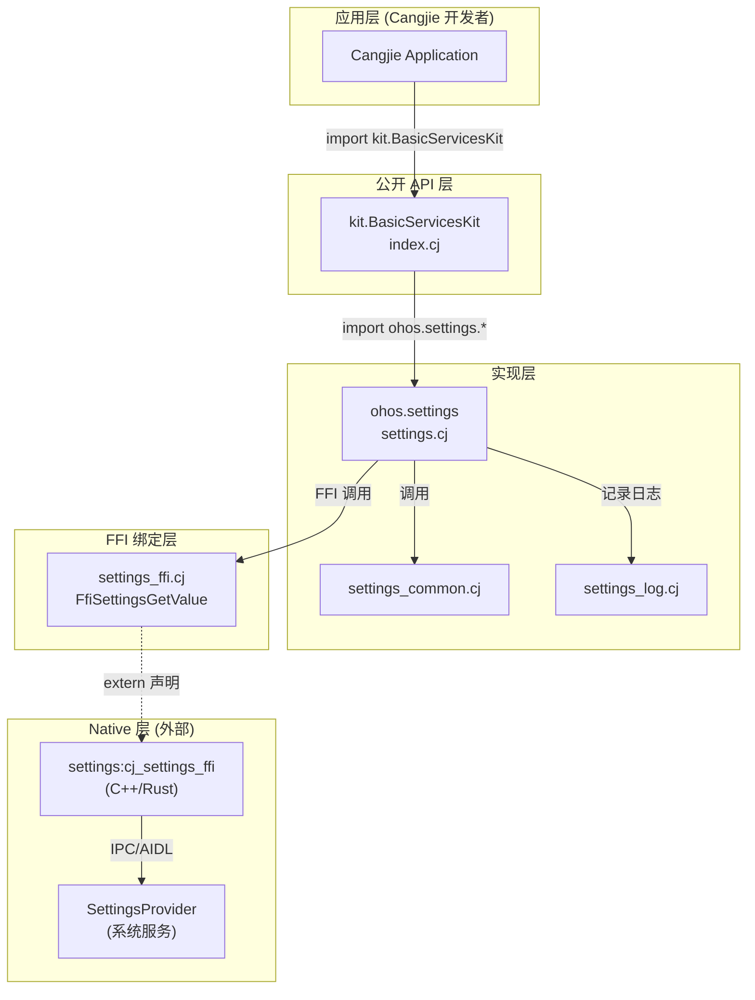
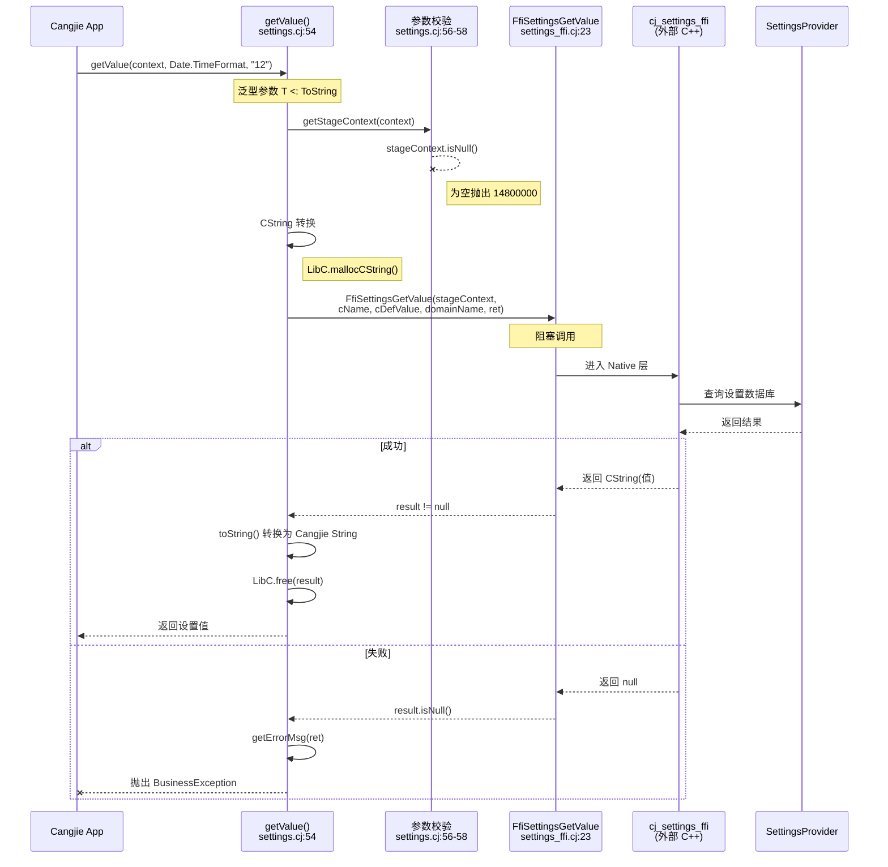
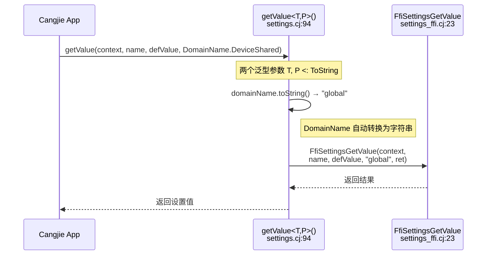
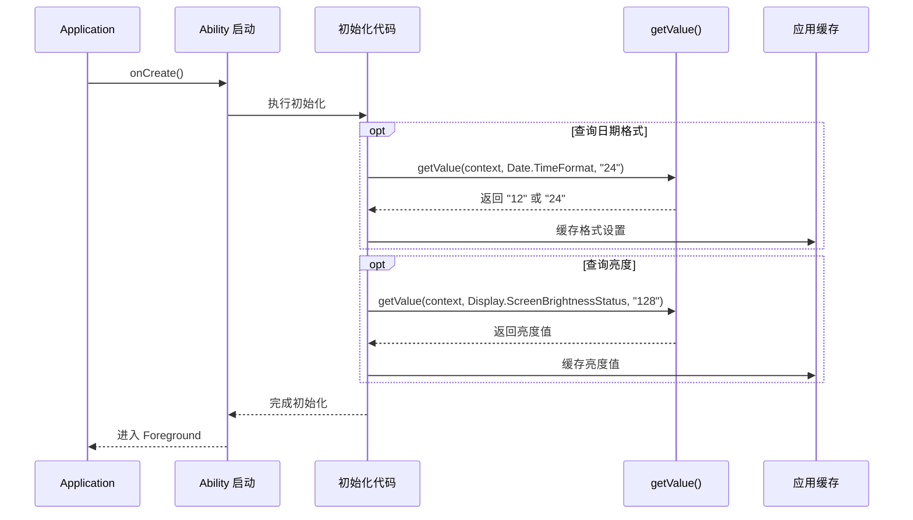

# 架构说明

本文档详细说明 `applications_cangjie_wrapper` 的架构设计，包括组件图、数据流、线程模型、FFI 绑定机制和错误处理策略。

---

## 组件架构图

### 分层架构



### 模块职责

| 模块 | 文件路径 | 职责 | 稳定性 |
|------|----------|------|--------|
| kit.BasicServicesKit | `kit/BasicServicesKit/index.cj` | 公开 API 统一导出 | **稳定** |
| ohos.settings | `ohos/settings/settings.cj` | 核心实现 `getValue()` | **稳定** |
| settings_common | `ohos/settings/settings_common.cj` | 枚举定义 (DomainName, Date, Display) | **稳定** |
| settings_ffi | `ohos/settings/settings_ffi.cj` | FFI 函数声明 | **内部** |
| settings_log | `ohos/settings/settings_log.cj` | 日志配置 | **内部** |

---

## 数据流详解

### 1. 标准查询流程 (getValue)



### 2. 带域名的查询流程 (getValue with domainName)



---

## FFI 绑定层详解

### 外部函数声明

```cangjie
// ohos/settings/settings_ffi.cj:22-25
foreign {
    func FfiSettingsGetValue(
        context: StageContext,      // CPointer<Unit>
        name: CString,              // 设置项名称
        value: CString,             // 默认值
        domainName: CString,        // 域名 (可为空)
        ret: CPointer<Int32>        // 错误码输出
    ): CString
}
```

### 类型映射

| Cangjie 类型 | C/C++ 类型 | 说明 |
|--------------|------------|------|
| `StageContext` | `void*` | 能力上下文指针，不透明类型 |
| `CString` | `char*` | 以 null 结尾的 C 字符串 |
| `CPointer<Int32>` | `int32_t*` | 错误码输出参数 |
| `CString` (返回值) | `char*` | 调用者负责释放 |

### 内存管理

```cangjie
// settings.cj:62-72
unsafe {
    try (
        cName = LibC.mallocCString(name.toString()).asResource(),
        cDefValue = LibC.mallocCString(defValue).asResource()
    ) {
        let result = FfiSettingsGetValue(...)
        if (result.isNull()) {
            throw BusinessException(ret, getErrorMsg(ret))
        }
        value = result.toString()
        LibC.free(result)  // ⚠️ 必须释放 Native 返回的内存
    }
}
```

**关键约定**：
1. 入参 `CString` 由 Cangjie 使用 `mallocCString` 分配，通过 `try-resource` 自动释放
2. 返回值 `CString` 由 Native 层分配，Cangjie 层必须显式调用 `LibC.free()`

### Native 依赖

```
external_deps = [ "settings:cj_settings_ffi" ]
```

**代码证据**: `ohos/settings/BUILD.gn:39`

---

## 线程模型

### 同步/异步特性

所有 API 均为**同步阻塞调用**，但通过注解标记支持在 Worker 线程执行：

```cangjie
@!APILevel[
    since: "22",
    syscap: "SystemCapability.Applications.Settings.Core",
    throwexception: true,
    workerthread: true  // ← 允许在 Worker 线程调用
]
```

**代码证据**: `ohos/settings/settings.cj:48-53`

### 线程安全

| 组件 | 线程安全 | 说明 |
|------|----------|------|
| `getValue()` | ✅ 线程安全 | 无共享可变状态 |
| FFI 调用 | ✅ 线程安全 | 底层 SettingsProvider 是进程级服务 |
| Settings 枚举 | ✅ 线程安全 | 纯函数，无副作用 |

### 使用建议

```cangjie
// 主线程调用（简短查询）
let brightness = getValue(context, Display.ScreenBrightnessStatus, "128")

// Worker 线程调用（推荐，避免阻塞 UI）
// 使用 @Concurrent 标记的函数在 Worker 中执行
```

---

## 错误处理机制

### 错误码体系

```
14800000 - 参数错误（通用）
14700104 - 系统内部错误（内存不足、死锁等）
```

**代码证据**: `ohos/settings/settings.cj:27-36`

### 错误映射表

```cangjie
func getErrorMsg(code: Int32): String {
    let ERROR_CODE_MAP = HashMap<Int32, String>(
        [(14700104, "System internal error such as out memory or deadlock.")])
    
    if (let Some(v) <- getUniversalErrorMsg(code)) {
        return v  // 通用错误码
    } else if (ERROR_CODE_MAP.contains(code)) {
        return ERROR_CODE_MAP[code]  // 本模块特定错误
    } else {
        return "Unknown error code ${code}"
    }
}
```

### 异常传播


### 错误处理示例

```cangjie
import ohos.business_exception.BusinessException

try {
    let format = getValue(context, Date.TimeFormat, "12")
} catch (e: BusinessException) {
    // e.code: Int32 - 错误码
    // e.message: String - 错误信息
    when (e.code) {
        14800000 -> println("参数错误: ${e.message}")
        14700104 -> println("系统错误: ${e.message}")
        else -> println("未知错误: ${e.message}")
    }
}
```

---

## 日志系统

### 日志配置

```cangjie
// ohos/settings/settings_log.cj:22-24
const LOG_CORE: UInt32 = 0           // 日志核心域
const SETTINGS_DOMAIN_ID: UInt32 = 0x500  // 域 ID: 0x500 (Settings)
let SETTINGS_LOG = HilogChannel(LOG_CORE, SETTINGS_DOMAIN_ID, "CJ-Settings")
```

### 当前日志使用情况

当前源码中已配置日志但未在关键路径打印日志，仅作预留。

**代码证据**: `ohos/settings/settings_log.cj`

---

## 构建变体

### 平台适配

```cangjie
// ohos/settings/BUILD.gn:20-29
if (is_mingw || is_mac) {
    sources = [ "../../mock/ohos.settings.cj" ]  // Mock 实现
} else {
    sources = [
        "settings.cj",
        "settings_common.cj",
        "settings_ffi.cj",
        "settings_log.cj",
    ]  // 真实实现
}
```

### Mock 实现

```cangjie
// mock/ohos.settings.cj:27-29
public func getValue<T>(context: UIAbilityContext, name: T, defValue: String): String {
    return String()  // 返回空字符串
}
```

Mock 实现用于：
- Windows (mingw) 交叉编译
- macOS 开发环境
- 单元测试场景（不依赖真实系统服务）

---

## 关键时序

### 应用启动时的设置查询



---

## 架构约束与限制

### 设计约束

1. **只读访问**：当前仅支持查询，不支持修改系统设置
2. **同步调用**：所有 API 为同步阻塞调用
3. **上下文依赖**：必须传入有效的 UIAbilityContext
4. **字符串类型**：所有设置值以字符串形式返回，需应用层解析

### 扩展点

| 扩展需求 | 建议方案 |
|----------|----------|
| 支持新的设置项 | 在 `settings_common.cj` 添加新的枚举值 |
| 支持设置操作 | 需 Native 层新增 `FfiSettingsSetValue`，当前未提供 |
| 观察者模式 | 需 Native 层支持回调注册，当前未提供 |
| 批量查询 | 当前为单条查询，可封装批量查询工具函数 |

---

## 下一步阅读

- **[API 参考](./20_API_Reference.md)** - 完整 API 文档和使用示例
- **[构建系统](./30_GN_Build.md)** - GN 构建配置详解
- **[附录: 调用链](./appendix/Callgraphs.md)** - 详细的调用链追踪
