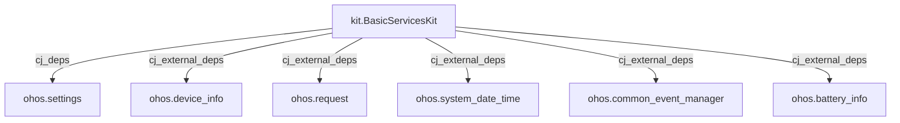
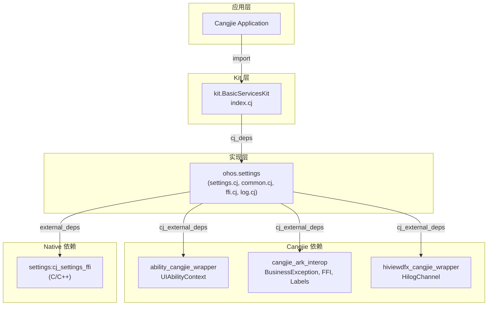
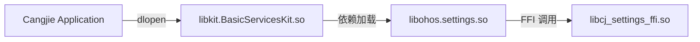

# GN 构建系统与编译产物

本文档详细说明 `applications_cangjie_wrapper` 的 GN 构建配置、目标定义、依赖关系和编译产物。

---

## GN 文件总览

### 构建文件清单

| 文件路径 | 用途 |
|----------|------|
| `BUILD.gn` (根) | 根构建配置，定义复制目标 |
| `kit/BasicServicesKit/BUILD.gn` | Kit 层共享库定义 |
| `ohos/settings/BUILD.gn` | Settings 实现层共享库定义 |

---

## 根 BUILD.gn

```gn
# Copyright (c) 2025 Huawei Device Co., Ltd.
# Licensed under the Apache License, Version 2.0

import("//build/templates/cangjie/cjc.gni")

# 定义 OHOS 包集合
applications_cangjie_wrapper_packages_ohos = [
  "//applications/standard/applications_cangjie_wrapper/ohos/settings:ohos.settings"
]

# 定义 Kit 包集合
applications_cangjie_wrapper_packages_kit = [
  "//applications/standard/applications_cangjie_wrapper/kit/BasicServicesKit:kit.BasicServicesKit",
]

# 复制 SDK API 库目标
copy_ohos_cangjie_sdk_api_lib("copy_sdk_applications_cangjie_libs") {
  ohos_inputs = applications_cangjie_wrapper_packages_ohos
  kit_inputs = applications_cangjie_wrapper_packages_kit
}
```

**代码位置**: `/BUILD.gn`

### 目标说明

| 目标 | 类型 | 输入 |
|------|------|------|
| `copy_sdk_applications_cangjie_libs` | `copy_ohos_cangjie_sdk_api_lib` | ohos.settings + kit.BasicServicesKit |

该目标用于将编译产物复制到 SDK 输出目录。

---

## Kit 层: kit.BasicServicesKit

### BUILD.gn 定义

```gn
# Copyright (c) 2025 Huawei Device Co., Ltd.

import("//build/templates/cangjie/cjc.gni")

ohos_cangjie_shared_library("kit.BasicServicesKit") {
  sources = ["index.cj"]  # 单一入口文件

  cj_deps = ["../../ohos/settings:ohos.settings"]

  cj_external_deps = [
    "startup_cangjie_wrapper:ohos.device_info",
    "request_cangjie_wrapper:ohos.request",
    "time_cangjie_wrapper:ohos.system_date_time",
    "notification_cangjie_wrapper:ohos.common_event_manager",
    "powermgr_cangjie_wrapper:ohos.battery_info"
  ]

  subsystem_name = "applications"
  part_name = "applications_cangjie_wrapper"
}
```

**代码位置**: `kit/BasicServicesKit/BUILD.gn`

### 目标属性

| 属性 | 值 | 说明 |
|------|-----|------|
| `target_name` | `kit.BasicServicesKit` | 目标名称 |
| `target_type` | `ohos_cangjie_shared_library` | Cangjie 共享库 |
| `sources` | `["index.cj"]` | 源文件列表 |

### 依赖关系



### 外部依赖清单

| 依赖 | 模块 | 说明 |
|------|------|------|
| `startup_cangjie_wrapper:ohos.device_info` | 设备信息 | 设备相关 API |
| `request_cangjie_wrapper:ohos.request` | 下载请求 | HTTP/RPC 请求 |
| `time_cangjie_wrapper:ohos.system_date_time` | 日期时间 | 系统时间 API |
| `notification_cangjie_wrapper:ohos.common_event_manager` | 公共事件 | 系统事件订阅 |
| `powermgr_cangjie_wrapper:ohos.battery_info` | 电池信息 | 电量状态 |

**注意**: 这些依赖项聚合自其他仓库，用于提供完整的 BasicServicesKit 功能。

---

## 实现层: ohos.settings

### BUILD.gn 定义

```gn
# Copyright (c) 2025 Huawei Device Co., Ltd.

import("//build/templates/cangjie/cjc.gni")

ohos_cangjie_shared_library("ohos.settings") {
  # 平台适配：Windows/macOS 使用 Mock 实现
  if (is_mingw || is_mac) {
    sources = [ "../../mock/ohos.settings.cj" ]
  } else {
    sources = [
      "settings.cj",
      "settings_common.cj",
      "settings_ffi.cj",
      "settings_log.cj",
    ]
  }

  # Cangjie 外部依赖
  cj_external_deps = [
    "ability_cangjie_wrapper:ohos.app.ability.ui_ability",
    "cangjie_ark_interop:ohos.business_exception",
    "cangjie_ark_interop:ohos.ffi",
    "cangjie_ark_interop:ohos.labels",
    "hiviewdfx_cangjie_wrapper:ohos.hilog",
  ]

  # Native 外部依赖 (C/C++)
  external_deps = [ "settings:cj_settings_ffi" ]

  subsystem_name = "applications"
  part_name = "applications_cangjie_wrapper"
}
```

**代码位置**: `ohos/settings/BUILD.gn`

### 源文件配置

| 平台 | 源文件 |
|------|--------|
| Linux/OpenHarmony | `settings.cj`, `settings_common.cj`, `settings_ffi.cj`, `settings_log.cj` |
| Windows (mingw) | `mock/ohos.settings.cj` |
| macOS | `mock/ohos.settings.cj` |

### 目标属性

| 属性 | 值 |
|------|-----|
| `target_name` | `ohos.settings` |
| `target_type` | `ohos_cangjie_shared_library` |
| `subsystem_name` | `applications` |
| `part_name` | `applications_cangjie_wrapper` |

### Cangjie 外部依赖

| 依赖 | 模块 | 用途 |
|------|------|------|
| `ability_cangjie_wrapper:ohos.app.ability.ui_ability` | UIAbility | 获取应用上下文 |
| `cangjie_ark_interop:ohos.business_exception` | 业务异常 | BusinessException 类 |
| `cangjie_ark_interop:ohos.ffi` | FFI 支持 | CPointer, CString, LibC |
| `cangjie_ark_interop:ohos.labels` | API 注解 | @!APILevel, @!Hide |
| `hiviewdfx_cangjie_wrapper:ohos.hilog` | 日志 | HilogChannel |

### Native 外部依赖

| 依赖 | 说明 |
|------|------|
| `settings:cj_settings_ffi` | Settings 子系统的 C/C++ FFI 实现 |

---

## 依赖关系总图



---

## Bundle 配置

### bundle.json 构建配置

```json
{
  "component": {
    "name": "applications_cangjie_wrapper",
    "subsystem": "applications",
    "build": {
      "sub_component": [
        "//applications/standard/applications_cangjie_wrapper/ohos/settings:ohos.settings",
        "//applications/standard/applications_cangjie_wrapper/kit/BasicServicesKit:kit.BasicServicesKit"
      ],
      "inner_kits": [
        {
          "name": "//applications/standard/applications_cangjie_wrapper:copy_sdk_applications_cangjie_libs"
        },
        {
          "name": "//applications/standard/applications_cangjie_wrapper:copy_sdk_applications_cangjie_libs_kit"
        }
      ]
    }
  }
}
```

**代码位置**: `bundle.json:30-44`

### 组件元数据

| 属性 | 值 | 说明 |
|------|-----|------|
| `name` | `applications_cangjie_wrapper` | 组件名称 |
| `subsystem` | `applications` | 所属子系统 |
| `version` | `6.1` | 版本号 |
| `license` | `Apache License 2.0` | 许可证 |

### 系统能力声明

```json
"syscap": [],
"features": []
```

当前未声明特定 Syscap，但代码中使用 `SystemCapability.Applications.Settings.Core`。

### 适配系统类型

```json
"adapted_system_type": ["standard"]
```

仅支持标准设备 (Standard)，不支持轻量 (Lite) 或小型 (Small) 设备。

### 资源占用

```json
"rom": "100KB",
"ram": "104KB"
```

---

## 编译产物清单

### 预期输出

| 目标 | 产物类型 | 产物名称 | 安装路径 |
|------|----------|----------|----------|
| `ohos.settings` | 共享库 (`.so`) | `libohos.settings.so` | `/system/lib/` 或应用私有目录 |
| `kit.BasicServicesKit` | 共享库 (`.so`) | `libkit.BasicServicesKit.so` | SDK 目录 |
| `copy_sdk_applications_cangjie_libs` | 复制产物 | 上述库文件 | SDK API 目录 |

### 产物命名规则

Cangjie 共享库遵循以下命名规则：

```
lib{target_name}.so
```

示例：
- `ohos.settings` → `libohos.settings.so`
- `kit.BasicServicesKit` → `libkit.BasicServicesKit.so`

### 运行时加载



---

## 构建命令参考

### 完整编译

```bash
# 在 OpenHarmony 源码根目录执行
./build.sh --product {product_name} \
    --build-target applications_cangjie_wrapper
```

### 单独编译本组件

```bash
# 编译 ohos.settings
gn gen out/{product} --args='...'
ninja -C out/{product} ohos.settings

# 编译 kit.BasicServicesKit
ninja -C out/{product} kit.BasicServicesKit

# 编译全部并复制到 SDK
ninja -C out/{product} copy_sdk_applications_cangjie_libs
```

### 依赖检查

```bash
# 查看目标依赖关系
gn desc out/{product} //applications/standard/applications_cangjie_wrapper/ohos/settings:ohos.settings deps --tree
```

---

## 常见构建问题

### 1. 找不到 `cjc.gni`

**问题**: `import("//build/templates/cangjie/cjc.gni")` 失败

**原因**: 需要在完整的 OpenHarmony 源码环境中编译，单仓库无法独立构建。

**解决**: 确保在 OpenHarmony 源码根目录执行构建命令。

### 2. Mock 实现被错误使用

**问题**: 在非 Windows/macOS 平台使用了 Mock 实现

**检查**: 查看 `is_mingw` 和 `is_mac` 变量的实际值

```gn
# 在 BUILD.gn 中调试
print("is_mingw = ${is_mingw}")
print("is_mac = ${is_mac}")
```

### 3. Native 依赖缺失

**问题**: `settings:cj_settings_ffi` 找不到

**原因**: Settings 子系统未编译或未加入产品配置

**解决**: 确保产品配置包含 `settings` 子系统。

---

## 下一步阅读

- **[项目概述](./00_Overview.md)** - 了解项目定位和功能边界
- **[架构说明](./10_Architecture.md)** - 理解 FFI 绑定和线程模型
- **[安全分析](./40_Security_Analysis.md)** - 了解安全相关实现
