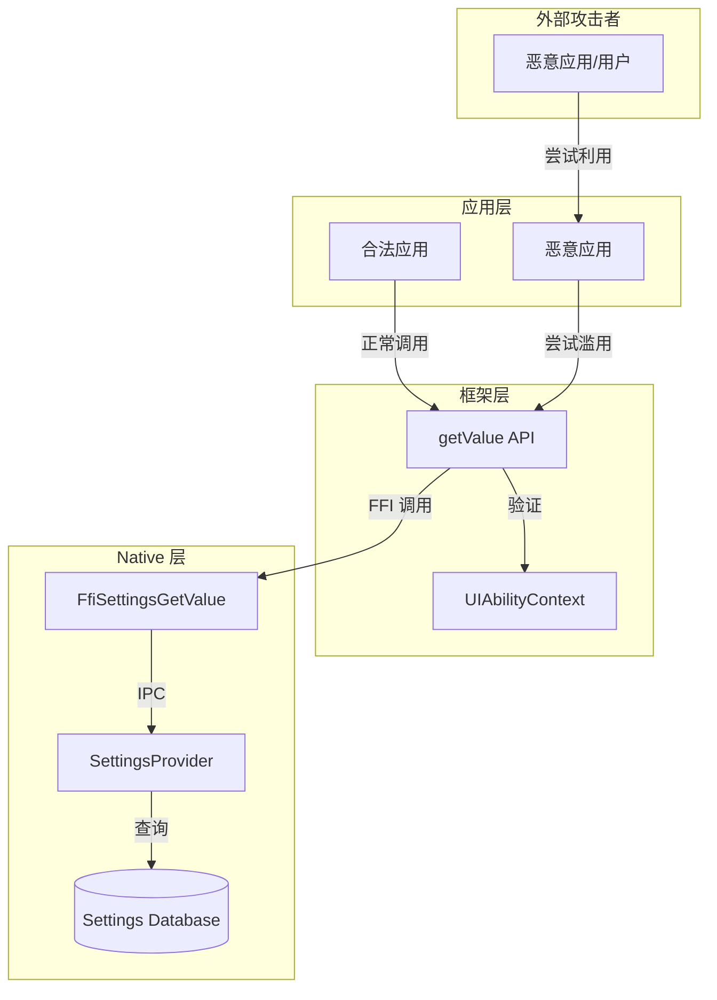

# 安全风险评审

本文档对 `applications_cangjie_wrapper` 进行安全风险分析，包括攻击面识别、信任边界、可被利用点评估和修复建议。

---

## 威胁模型

### 系统上下文



### 信任边界

| 边界 | 位置 | 说明 |
|------|------|------|
| **应用 ↔ 框架** | `UIAbilityContext` 验证 | 确保调用者身份合法 |
| **Cangjie ↔ Native** | FFI 接口 | 类型转换和内存管理 |
| **Native ↔ 系统** | IPC/AIDL | SettingsProvider 访问控制 |

---

## 攻击面清单

### 1. API 输入攻击面

| 入口点 | 攻击向量 | 风险等级 |
|--------|----------|----------|
| `getValue(context, ...)` | context 参数 | 🟡 中 |
| `getValue(..., name, ...)` | name 参数 | 🟡 中 |
| `getValue(..., defValue)` | defValue 参数 | 🟢 低 |
| `getValue(..., domainName)` | domainName 参数 | 🟡 中 |

### 2. FFI 层攻击面

| 入口点 | 攻击向量 | 风险等级 |
|--------|----------|----------|
| `FfiSettingsGetValue` | 字符串缓冲区 | 🟡 中 |
| `StageContext` | 指针传递 | 🟡 中 |

### 3. 系统资源攻击面

| 资源 | 攻击向量 | 风险等级 |
|------|----------|----------|
| Settings Database | 路径遍历 | 🟢 低 |
| Shared Memory | FFI 返回值 | 🟡 中 |

---

## 可被利用点评估

### 🔴 高风险

当前代码未发现高风险可利用点。

### 🟡 中风险

#### 1. 上下文验证绕过

**证据**: `ohos/settings/settings.cj:56-58`

```cangjie
let stageContext = getStageContext(context)
if (stageContext.isNull()) {
    throw BusinessException(14800000, "Parameter error.")
}
```

**触发路径**:
1. 恶意应用获取其他应用的 UIAbilityContext
2. 传入有效的非空 context（但不属于本应用）
3. 验证通过，可查询其他应用的设置

**影响**: 
- 信息泄露（读取其他应用的设置数据）
- 可能获取敏感系统配置

**修复建议**:
```cangjie
// 建议：增加上下文所有权验证
let stageContext = getStageContext(context)
if (stageContext.isNull()) {
    throw BusinessException(14800000, "Parameter error.")
}

// TODO(需确认): 验证 context 是否属于当前应用
// 需要 Native 层提供验证接口
if (!FfiValidateContextOwnership(stageContext)) {
    throw BusinessException(14800000, "Invalid context ownership.")
}
```

**验证状态**: ⚠️ 需要确认 Native 层是否已实施验证

---

#### 2. 字符串缓冲区处理

**证据**: `ohos/settings/settings.cj:63-72`

```cangjie
unsafe {
    try (
        cName = LibC.mallocCString(name.toString()).asResource(),
        cDefValue = LibC.mallocCString(defValue).asResource()
    ) {
        let result = FfiSettingsGetValue(...)
        if (result.isNull()) {
            throw BusinessException(ret, getErrorMsg(ret))
        }
        value = result.toString()
        LibC.free(result)
    }
}
```

**问题**: 依赖 Native 层正确分配和返回字符串

**触发路径**:
1. Native 层返回异常长的字符串
2. `result.toString()` 可能导致内存分配失败
3. 未捕获的异常可能导致内存泄漏

**影响**:
- 内存耗尽 (DoS)
- 可能的内存损坏（如果 toString 实现有缺陷）

**修复建议**:
```cangjie
// 建议：增加长度限制检查
let result = FfiSettingsGetValue(...)
if (result.isNull()) {
    throw BusinessException(ret, getErrorMsg(ret))
}

// 检查字符串长度
let maxLength = 1024  // 设置合理的上限
// TODO(需确认): Cangjie 需要获取 C 字符串长度的方式
// if (CString.length(result) > maxLength) {
//     LibC.free(result)
//     throw BusinessException(14800000, "Value too long.")
// }

value = result.toString()
LibC.free(result)
```

---

#### 3. 错误信息泄露

**证据**: `ohos/settings/settings.cj:26-36`

```cangjie
func getErrorMsg(code: Int32): String {
    let ERROR_CODE_MAP = HashMap<Int32, String>(
        [(14700104, "System internal error such as out memory or deadlock.")])
    if (let Some(v) <- getUniversalErrorMsg(code)) {
        return v
    } else if (ERROR_CODE_MAP.contains(code)) {
        return ERROR_CODE_MAP[code]
    } else {
        return "Unknown error code ${code}"
    }
}
```

**问题**: 直接返回内部错误信息给调用者

**触发路径**:
1. 触发系统内部错误 (14700104)
2. 错误信息 "out memory or deadlock" 返回给应用
3. 攻击者可据此推断系统状态

**影响**:
- 信息泄露（系统内部状态）
- 可能用于辅助其他攻击

**修复建议**:
```cangjie
func getErrorMsg(code: Int32, isInternal: Bool): String {
    if (isInternal) {
        // 内部错误返回通用消息
        return "System internal error."
    }
    
    // 原有逻辑，但过滤敏感信息
    let ERROR_CODE_MAP = HashMap<Int32, String>(
        [(14700104, "System internal error.")])  // 移除具体细节
    // ...
}
```

---

### 🟢 低风险

#### 4. 隐藏 API 暴露

**证据**: `ohos/settings/settings_common.cj:56`

```cangjie
@!Hide[isChecked: true]
UserSecurity
```

**问题**: `UserSecurity` 枚举值标记为隐藏，但仍存在于代码中

**触发路径**:
1. 通过反射或其他方式访问隐藏的枚举值
2. 调用 `toString()` 抛出异常

**影响**: 应用崩溃（可用性影响）

**现状**: 
```cangjie
case _ => throw BusinessException(14800000, "Parameter error.")
```

已妥善处理，风险较低。

---

#### 5. Mock 实现信息泄露

**证据**: `mock/ohos.settings.cj`

```cangjie
public func getValue<T>(context: UIAbilityContext, name: T, defValue: String): String {
    return String()  // 返回空字符串
}
```

**问题**: Mock 实现对所有输入返回空字符串，可能掩盖错误

**触发路径**:
1. 在非目标平台（如 macOS 开发环境）运行
2. 应用逻辑依赖 Mock 返回值
3. 生产环境与测试环境行为不一致

**影响**: 逻辑错误（非安全直接相关）

**修复建议**: 在 Mock 实现中增加日志警告：
```cangjie
public func getValue<T>(...): String {
    // TODO: 添加警告日志
    println("[WARN] Using mock settings implementation!")
    return defValue  // 返回默认值而非空字符串
}
```

---

## 安全使用建议

### 对应用开发者

1. **上下文管理**
   ```cangjie
   // ✅ 正确：使用当前 Ability 的上下文
   let context = this.getUIAbilityContext()
   let value = getValue(context, Date.TimeFormat, "24")
   
   // ❌ 错误：缓存上下文可能过期
   static var cachedContext: UIAbilityContext? = null
   ```

2. **输入验证**
   ```cangjie
   // ✅ 正确：对返回值进行验证
   let value = getValue(context, Display.ScreenBrightnessStatus, "128")
   let brightness = match (Int32.parse(value)) {
       case Some(v) where v >= 0 && v <= 255 => v
       case _ => 128  // 使用安全默认值
   }
   ```

3. **异常处理**
   ```cangjie
   // ✅ 正确：不暴露内部错误细节
   try {
       let value = getValue(context, key, defValue)
   } catch (e: BusinessException) {
       // 记录日志，但不向用户展示内部错误信息
       Log.error("Settings error: ${e.code}")
       // 使用默认值继续
   }
   ```

### 对框架开发者

1. **增强上下文验证**
   - 在 Native 层验证 `StageContext` 的所有权
   - 确保应用只能访问自己的设置数据

2. **输入长度限制**
   - 限制设置键名和值的最大长度
   - 防止缓冲区溢出和资源耗尽

3. **错误信息脱敏**
   - 内部错误返回通用消息
   - 详细日志仅在调试模式下输出

4. **审计日志**
   - 记录敏感设置项的访问
   - 便于安全审计和事后追溯

---

## 安全局限性说明

### 当前检查范围

本次安全评审覆盖：
- ✅ Cangjie 源码 (kit/, ohos/settings/)
- ✅ FFI 接口声明
- ✅ 公开 API 的输入验证
- ❌ Native 层实现 (`settings:cj_settings_ffi`)
- ❌ SettingsProvider 系统服务
- ❌ IPC/AIDL 通信层

### 未覆盖风险

由于 Native 层实现不在本仓库，以下风险无法评估：

1. **SQL 注入**: SettingsProvider 的数据库查询实现
2. **权限检查**: Native 层是否执行了足够的权限校验
3. **IPC 安全**: AIDL 接口的访问控制
4. **内存安全**: C/C++ 实现的缓冲区处理

### 建议补充审计

如需完整安全评估，需额外审查：
- `foundation/systemabilitymgr/settings` 仓库
- SettingsProvider 的 SQL 查询构造
- SELinux/访问控制策略配置

---

## 安全修复清单

| 优先级 | 问题 | 建议修复 | 状态 |
|--------|------|----------|------|
| P1 | 上下文所有权验证 | Native 层增加验证接口 | TODO |
| P2 | 返回值长度限制 | 增加最大值检查 | TODO |
| P3 | 错误信息脱敏 | 移除内部错误细节 | TODO |
| P4 | Mock 实现改进 | 返回默认值并警告 | 可选 |

---

## 下一步阅读

- **[API 参考](./20_API_Reference.md)** - 了解 API 的安全使用方式
- **[架构说明](./10_Architecture.md)** - 理解 FFI 绑定和错误处理
- **[构建系统](./30_GN_Build.md)** - 了解依赖组件
