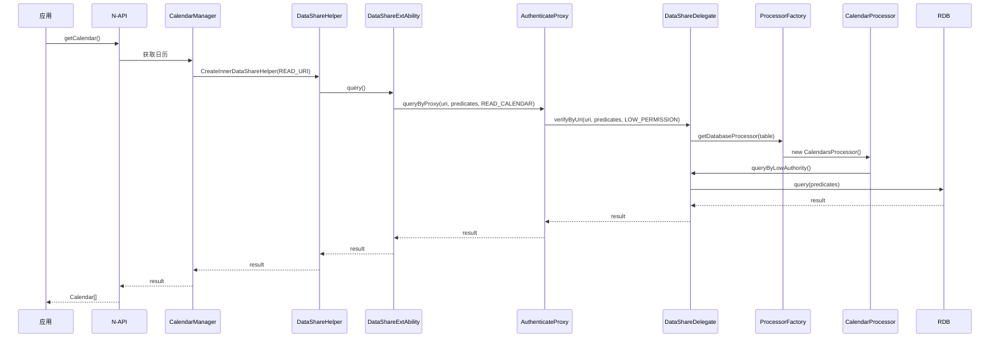
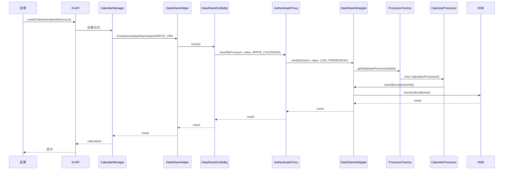
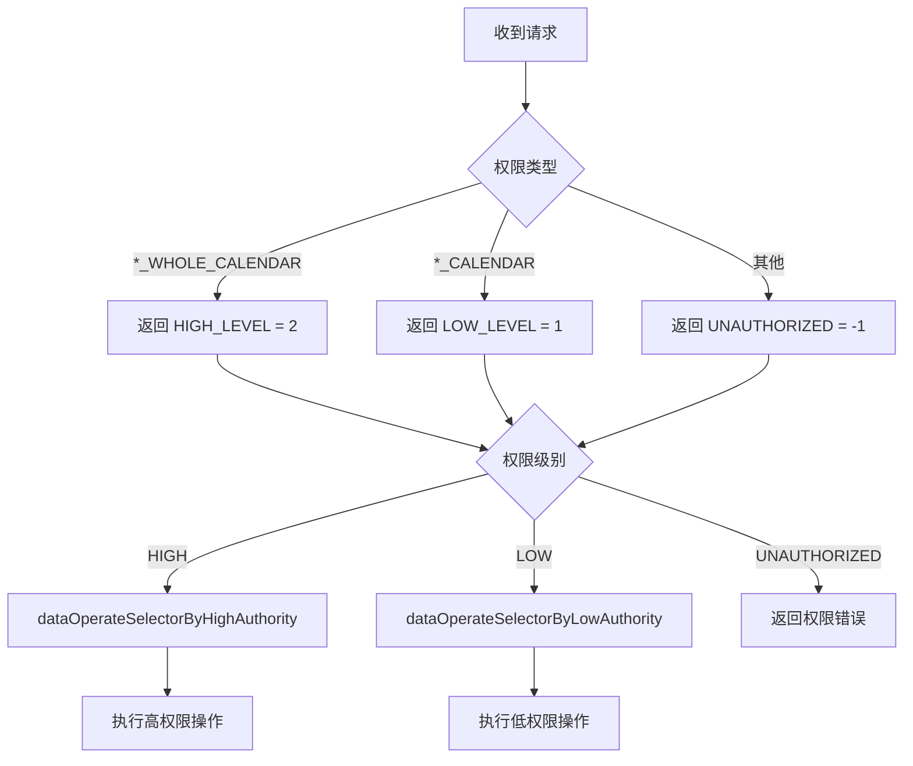
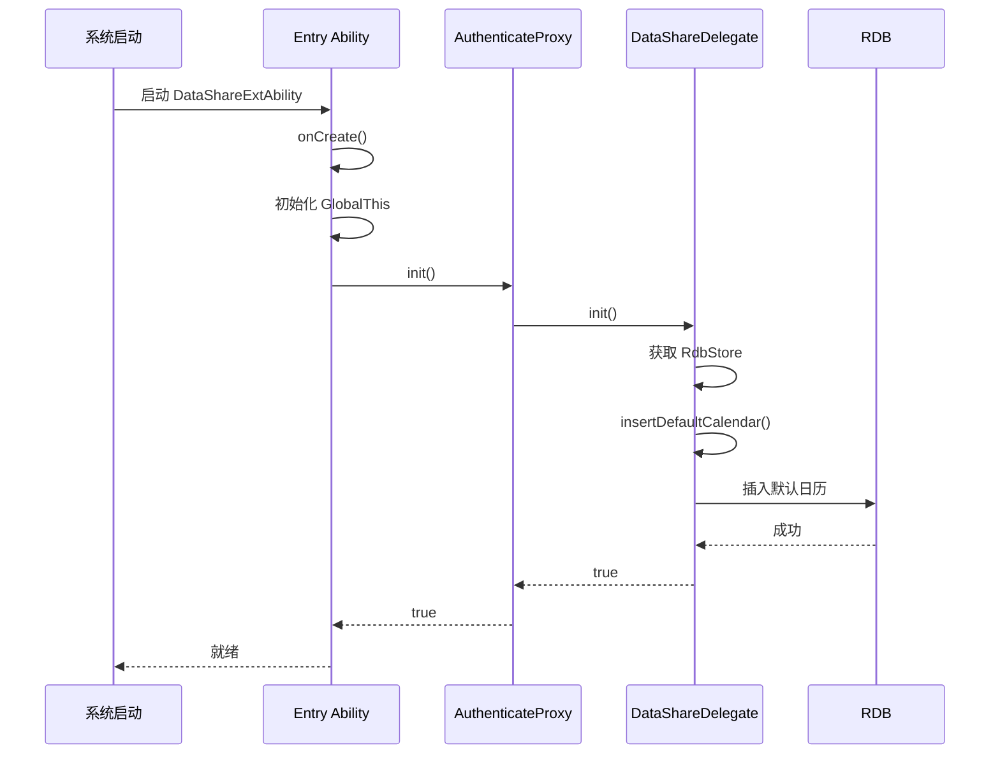

# CalendarData 架构说明

## 目的

本文档详细说明 CalendarData 组件的架构设计，包括组件图、数据流、线程模型和关键时序。

## 适用范围

- 目标读者：架构师、高级开发者
- 知识级别：中级到高级
- 前置知识：了解 OpenHarmony 组件化架构

## 整体架构

### 系统边界

```
┌─────────────────────────────────────────────────────────────┐
│                   OpenHarmony 系统                  │
├─────────────────────────────────────────────────────────────┤
│                                                      │
│  ┌──────────────┐      ┌──────────────┐         │
│  │  Calendar   │      │  第三方应用   │         │
│  │  (UI)      │◄────►│ (调用者)     │         │
│  └──────────────┘      └──────────────┘         │
│         │                  │                   │
│         │ N-API          │                   │
│         ▼                  │                   │
│  ┌──────────────────────────────────┐          │
│  │   CalendarData 组件          │          │
│  │  ┌──────────────────────┐    │          │
│  │  │ calendarmanager     │    │          │
│  │  │ (N-API/CJ/C++)    │    │          │
│  │  └────────┬─────────────┘    │          │
│  │           │ DataShare         │          │
│  │           ▼                  │          │
│  │  ┌──────────────────────┐    │          │
│  │  │ entry               │    │          │
│  │  │ (DataShareAbility)  │    │          │
│  │  └────────┬─────────────┘    │          │
│  │           │ dataprovider       │          │
│  │           ▼                  │          │
│  │  ┌──────────────────────┐    │          │
│  │  │ DataShareDelegate   │    │          │
│  │  └────────┬─────────────┘    │          │
│  │           │ datamanager        │          │
│  │           ▼                  │          │
│  │  ┌──────────────────────┐    │          │
│  │  │ ProcessorFactory   │    │          │
│  │  └────────┬─────────────┘    │          │
│  │           │                  │          │
│  │           ▼                  │          │
│  │  ┌──────────────────────┐    │          │
│  │  │ RDB 数据库        │    │          │
│  │  └──────────────────────┘    │          │
│  └──────────────────────────────────┘          │
└─────────────────────────────────────────────────────┘
```

### 核心组件关系

```
calendarmanager          dataprovider            datamanager
     │                        │                       │
     │ N-API Bindings       │ DataShare IPC         │
     │                        │                       │
     ▼                        ▼                       ▼
┌─────────┐            ┌─────────────────┐      ┌──────────────┐
│ Calendar│            │ DataShareExt   │      │ Processor    │
│ NAPI    │──────────►│ Ability         │─────►│ Factory      │
└─────────┘            └────────┬────────┘      └──────┬───────┘
                               │                       │
                               ▼                       ▼
                      ┌─────────────────┐      ┌──────────────┐
                      │ Authenticate    │      │ Calendar     │
                      │ Proxy          │─────►│ Processor    │
                      └─────────────────┘      └──────────────┘
                      ┌─────────────────┐      ┌──────────────┐
                      │ Delegate        │      │ Events       │
                      │ Proxy          │─────►│ Processor    │
                      └─────────────────┘      └──────────────┘
                                               ...
```

## 数据流

### 读操作流程



### 写操作流程



## 权限验证流程

### 权限级别判定



### C++ 层权限检查

calendarmanager/native/src/data_share_helper_manager.cpp:28-86

```cpp
// 权限名称常量
const std::string READ_PERMISSION_NAME  = "ohos.permission.READ_WHOLE_CALENDAR";
const std::string WRITE_PERMISSION_NAME = "ohos.permission.WRITE_WHOLE_CALENDAR";

// 创建 DataShareHelper 时检查权限
std::shared_ptr<DataShareHelper> DataShareHelperManager::CreateInnerDataShareHelper(
    const std::string &permissionUri) {
    // ...

    // 根据操作类型选择权限名称
    std::string permissionName = isRead ? READ_PERMISSION_NAME : WRITE_PERMISSION_NAME;

    // 验证调用者权限
    ret = Security::AccessToken::AccessTokenKit::VerifyAccessToken(
        IPCSkeleton::GetCallingTokenID(), permissionName);

    if (ret == Security::AccessToken::PERMISSION_GRANTED) {
        LOG_INFO("DataShareHelper in high permission");
        // 创建高权限 DataShareHelper
    } else {
        LOG_INFO("DataShareHelper in low permission");
        // 创建低权限 DataShareHelper
    }
}
```

### ArkTS 层权限检查

dataprovider/src/main/ets/DataShareAbilityAuthenticateProxy.ets:112-165

```typescript
async function verifyByUri(
    uri: string,
    dataParameter: DataParameter,
    highPermission: Permissions,
    lowPermission: Permissions,
    permission: Permissions,
    callback: Function): Promise<number> {
    
    let bundleNameAndTokenId = getBundleNameAndTokenIDByUri(uri);

    // 验证高权限
    if (permission === PERMISSIONS_READ_WHOLE_CALENDAR ||
        permission === PERMISSIONS_WRITE_WHOLE_CALENDAR) {
        // 封装回调添加权限使用记录
        dataParameter.callback = (err: BusinessError, rowId: number) => {
            callback(err, rowId);
            if (isNeedAddPermissionUsedRecord(uri, dataParameter)) {
                addPermissionUsedRecordInCallBack(err, bundleNameAndTokenId.tokenId, highPermission);
            }
        };
        return PERMISSIONS_FLAG_HIGH;  // 2
    }

    // 验证低权限
    if (permission === PERMISSIONS_READ_CALENDAR ||
        permission === PERMISSIONS_WRITE_CALENDAR) {
        // 封装回调添加权限使用记录
        dataParameter.callback = (err: BusinessError, rowId: number) => {
            callback(err, rowId);
            if (isNeedAddPermissionUsedRecord(uri, dataParameter)) {
                addPermissionUsedRecordInCallBack(err, bundleNameAndTokenId.tokenId, lowPermission);
            }
        };
        return PERMISSIONS_FLAG_LOW;  // 1
    }

    return PERMISSIONS_FLAG_UNAUTHORIZED;  // -1
}
```

## 线程模型

### 主线程

- **calendarmanager**: N-API 绑定在主线程执行
- **entry/DataShareExtAbility**: ArkTS 代码在主线程执行

### 异步处理

- 数据库操作通过异步 Promise/Callback 模式执行
- 权限检查通过 async/await 模式

### 线程同步

- 使用 Mutex 保护共享资源
- RDB 操作通过关系数据库内部锁机制保证一致性

## 关键时序

### 初始化时序



## 模块依赖

### 依赖方向

```
datastructure (无依赖)
    ↑
    │
common ─┐
    │    │
    │    │
datamanager (依赖 common, datastructure)
    │
    │
dataprovider (依赖 datamanager, common, datastructure)
    │
    │
entry (依赖 dataprovider)
    │
    │
calendarmanager (依赖 datastructure, common)
```

### 无环依赖

所有模块依赖形成 DAG（有向无环图），不存在循环依赖。

## 相关文档

- [目录结构](01_Directory_Structure.md) - 代码组织方式
- [对外 API](03_External_API.md) - N-API 完整清单
- [内部 API](04_Internal_API.md) - 模块接口详情
- [安全评审](07_Security_Review.md) - 权限机制深入分析

---

返回 [目录](SUMMARY.md) | [首页](README.md)
