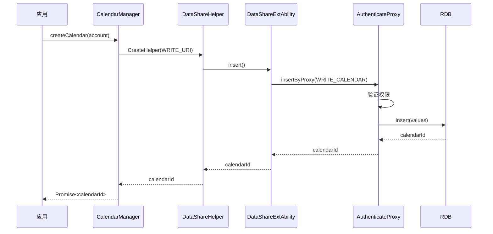
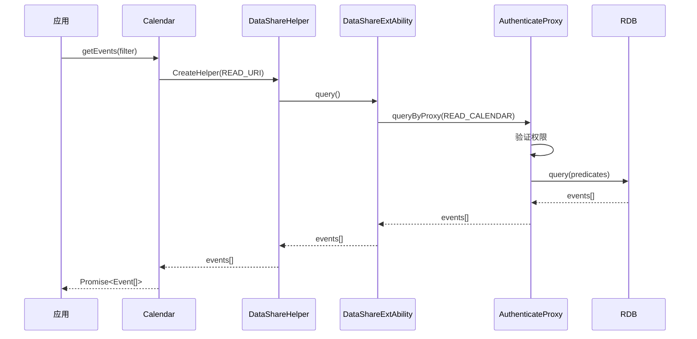

# 对外 API (N-API)

## 目的

本文档详细说明 CalendarData 组件的 N-API 对外接口，包括 API 清单、参数、返回值、同步异步模式、权限要求和错误码。

## 适用范围

- 目标读者：应用开发者、API 使用者
- 知识级别：初级到中级
- 前置知识：了解 OpenHarmony N-API 基础

## N-API 模块注册

### 模块信息

| 属性 | 值 |
|------|-----|
| 模块名称 | calendarManager |
| 注册方式 | napi_module_register() |
| 注册点 | calendarmanager/napi/src/module_register.cpp:45-52 |

### 注册代码

```cpp
// calendarmanager/napi/src/module_register.cpp:45-52
static napi_module _module = {
    .nm_version = 1,
    .nm_flags = 0,
    .nm_filename = nullptr,
    .nm_register_func = Init,
    .nm_modname = "calendarManager",
    .nm_priv = ((void *)0),
    .reserved = {0},
};
```

### 初始化流程

calendarmanager/napi/src/module_init.cpp:24-32

```cpp
napi_value ModuleInit(napi_env env, napi_value exports)
{
    CalendarNapi::Init(env, exports);
    CalendarManagerNapi::Init(env, exports);
    EventFilterNapi::Init(env, exports);
    CalendarEnumNapi::Init(env, exports);
    LOG_INFO("napi_module Init end...");
    return exports;
}
```

## API 清单

### CalendarManager API

CalendarManager 是获取日历管理器的主要入口点。

#### getCalendarManager

**功能**: 获取 CalendarManager 实例

**签名**: `getCalendarManager(context: Context): CalendarManager`

**参数**:
- `context`: 应用上下文（必填）

**返回值**: CalendarManager 对象

**示例**:
```javascript
import calendarManager from '@ohos.calendarManager';
const manager = calendarManager.getCalendarManager(getContext(this));
```

**证据**: calendarmanager/js/editor.js:76-84

---

### Calendar API

Calendar 对象代表一个日历账户，提供事件管理接口。

#### addEvent

**功能**: 添加单个事件

**签名**: `addEvent(event: Event, callback?: AsyncCallback<number>): Promise<number>`

**参数**:
- `event`: 事件对象（必填）
  - title: 事件标题
  - dtStart: 开始时间（毫秒时间戳）
  - dtEnd: 结束时间（毫秒时间戳）
  - allDay: 是否全天日程（0/1）
  - rRule: 重复规则（可选）
  - 其他字段...
- `callback`: 异步回调（可选）

**返回值**: Promise<number> - 事件 ID

**权限**: `ohos.permission.WRITE_CALENDAR` 或 `ohos.permission.WRITE_WHOLE_CALENDAR`

**C++ 入口**: calendarmanager/napi/include/calendar_napi.h:37

---

#### addEvents

**功能**: 批量添加事件

**签名**: `addEvents(events: Event[], callback?: AsyncCallback<number>): Promise<number>`

**参数**:
- `events`: 事件数组（必填）
- `callback`: 异步回调（可选）

**返回值**: Promise<number> - 成功数量

**权限**: `ohos.permission.WRITE_CALENDAR` 或 `ohos.permission.WRITE_WHOLE_CALENDAR`

**C++ 入口**: calendarmanager/napi/include/calendar_napi.h:38

---

#### deleteEvent

**功能**: 删除单个事件

**签名**: `deleteEvent(event: Event, callback?: AsyncCallback<number>): Promise<number>`

**参数**:
- `event`: 包含 ID 的事件对象（必填）
- `callback`: 异步回调（可选）

**返回值**: Promise<number> - 删除数量（0 或 1）

**权限**: `ohos.permission.WRITE_CALENDAR` 或 `ohos.permission.WRITE_WHOLE_CALENDAR`

**C++ 入口**: calendarmanager/napi/include/calendar_napi.h:39

---

#### deleteEvents

**功能**: 批量删除事件

**签名**: `deleteEvents(events: Event[], callback?: AsyncCallback<number>): Promise<number>`

**参数**:
- `events`: 包含 ID 的事件数组（必填）
- `callback`: 异步回调（可选）

**返回值**: Promise<number> - 删除数量

**权限**: `ohos.permission.WRITE_CALENDAR` 或 `ohos.permission.WRITE_WHOLE_CALENDAR`

**C++ 入口**: calendarmanager/napi/include/calendar_napi.h:40

---

#### updateEvent

**功能**: 更新单个事件

**签名**: `updateEvent(event: Event, callback?: AsyncCallback<number>): Promise<number>`

**参数**:
- `event`: 完整的事件对象（必填，必须包含 ID）
- `callback`: 异步回调（可选）

**返回值**: Promise<number> - 更新数量（0 或 1）

**权限**: `ohos.permission.WRITE_CALENDAR` 或 `ohos.permission.WRITE_WHOLE_CALENDAR`

**C++ 入口**: calendarmanager/napi/include/calendar_napi.h:41

---

#### updateEvents

**功能**: 批量更新事件

**签名**: `updateEvents(events: Event[], callback?: AsyncCallback<number>): Promise<number>`

**参数**:
- `events`: 完整的事件数组（必填，每个必须包含 ID）
- `callback`: 异步回调（可选）

**返回值**: Promise<number> - 更新数量

**权限**: `ohos.permission.WRITE_CALENDAR` 或 `ohos.permission.WRITE_WHOLE_CALENDAR`

**C++ 入口**: calendarmanager/napi/include/calendar_napi.h:42

---

#### getEvents

**功能**: 查询事件

**签名**: `getEvents(filter: EventFilter, callback?: AsyncCallback<Event[]>): Promise<Event[]>`

**参数**:
- `filter`: 事件筛选器（必填）
  - time: 时间范围
  - title: 标题筛选
  - id: ID 筛选
- `callback`: 异步回调（可选）

**返回值**: Promise<Event[]> - 事件数组

**权限**: `ohos.permission.READ_CALENDAR` 或 `ohos.permission.READ_WHOLE_CALENDAR`

**C++ 入口**: calendarmanager/napi/include/calendar_napi.h:43

---

#### getConfig

**功能**: 获取日历配置

**签名**: `getConfig(callback?: AsyncCallback<CalendarConfig>): Promise<CalendarConfig>`

**参数**:
- `callback`: 异步回调（可选）

**返回值**: Promise<CalendarConfig> - 配置对象

**权限**: 无

**C++ 入口**: calendarmanager/napi/include/calendar_napi.h:44

---

#### setConfig

**功能**: 设置日历配置

**签名**: `setConfig(config: CalendarConfig, callback?: AsyncCallback<number>): Promise<number>`

**参数**:
- `config`: 配置对象（必填）
- `callback`: 异步回调（可选）

**返回值**: Promise<number> - 设置结果

**权限**: `ohos.permission.WRITE_CALENDAR` 或 `ohos.permission.WRITE_WHOLE_CALENDAR`

**C++ 入口**: calendarmanager/napi/include/calendar_napi.h:45

---

#### getAccount

**功能**: 获取日历账户

**签名**: `getAccount(callback?: AsyncCallback<CalendarAccount>): Promise<CalendarAccount>`

**参数**:
- `callback`: 异步回调（可选）

**返回值**: Promise<CalendarAccount> - 账户对象

**权限**: 无

**C++ 入口**: calendarmanager/napi/include/calendar_napi.h:46

---

#### queryEventInstances

**功能**: 查询事件实例（重复事件展开）

**签名**: `queryEventInstances(filter: EventFilter, begin: number, end: number, callback?: AsyncCallback<Event[]>): Promise<Event[]>`

**参数**:
- `filter`: 事件筛选器（必填）
- `begin`: 开始时间戳（必填）
- `end`: 结束时间戳（必填）
- `callback`: 异步回调（可选）

**返回值**: Promise<Event[]> - 事件实例数组

**权限**: `ohos.permission.READ_CALENDAR` 或 `ohos.permission.READ_WHOLE_CALENDAR`

**C++ 入口**: calendarmanager/napi/include/calendar_napi.h:47

---

### CalendarManager API (JS 包装层)

#### createCalendar

**功能**: 创建日历账户

**签名**: `createCalendar(calendarAccount: CalendarAccount, callback?: AsyncCallback<number>): Promise<number>`

**参数**:
- `calendarAccount`: 日历账户对象（必填）
  - accountName: 账户名称
  - accountType: 账户类型
  - calendarColor: 颜色
  - 其他字段...
- `callback`: 异步回调（可选）

**返回值**: Promise<number> - 日历 ID

**权限**: `ohos.permission.WRITE_CALENDAR` 或 `ohos.permission.WRITE_WHOLE_CALENDAR`

**C++ 入口**: calendarmanager/napi/include/calendar_manager_napi.h:51

**证据**: calendarmanager/js/editor.js:24-30

---

#### deleteCalendar

**功能**: 删除日历账户

**签名**: `deleteCalendar(calendar: Calendar, callback?: AsyncCallback<number>): Promise<number>`

**参数**:
- `calendar`: 日历对象（必填，必须包含 ID）
- `callback`: 异步回调（可选）

**返回值**: Promise<number> - 删除数量（0 或 1）

**权限**: `ohos.permission.WRITE_CALENDAR` 或 `ohos.permission.WRITE_WHOLE_CALENDAR`

**C++ 入口**: calendarmanager/napi/include/calendar_manager_napi.h:52

**证据**: calendarmanager/js/editor.js:32-38

---

#### getCalendar

**功能**: 获取日历账户

**签名**: `getCalendar(calendarAccount?: CalendarAccount, callback?: AsyncCallback<Calendar>): Promise<Calendar>`

**参数**:
- `calendarAccount`: 日历对象（可选，用于指定特定账户）
  - accountName: 账户名称（可选）
- `callback`: 异步回调（可选）

**返回值**: Promise<Calendar> - 日历对象

**权限**: 无

**C++ 入口**: calendarmanager/napi/include/calendar_manager_napi.h:53

**证据**: calendarmanager/js/editor.js:40-55

---

#### getAllCalendars

**功能**: 获取所有日历账户

**签名**: `getAllCalendars(callback?: AsyncCallback<Calendar[]>): Promise<Calendar[]>`

**参数**:
- `callback`: 异步回调（可选）

**返回值**: Promise<Calendar[]> - 日历数组

**权限**: 无

**C++ 入口**: calendarmanager/napi/include/calendar_manager_napi.h:54

**证据**: calendarmanager/js/editor.js:57-63

---

#### editEvent

**功能**: 编辑事件（带 UI）

**签名**: `editEvent(event: Event): Promise<number>`

**参数**:
- `event`: 事件对象（必填）

**返回值**: Promise<number> - 编辑结果

**权限**: `ohos.permission.WRITE_CALENDAR` 或 `ohos.permission.WRITE_WHOLE_CALENDAR`

**C++ 入口**: calendarmanager/napi/include/calendar_manager_napi.h:55

**证据**: calendarmanager/js/editor.js:65-71

---

### EventFilter API

EventFilter 是事件筛选器，用于查询事件时设置筛选条件。

#### FilterById

**功能**: 按 ID 筛选

**C++ 入口**: calendarmanager/napi/include/event_filter_napi.h:37

---

#### FilterByTime

**功能**: 按时间范围筛选

**C++ 入口**: calendarmanager/napi/include/event_filter_napi.h:38

---

#### FilterByTitle

**功能**: 按标题筛选

**C++ 入口**: calendarmanager/napi/include/event_filter_napi.h:39

---

### 枚举类型

#### CalendarType

日历类型枚举。

#### EventType

事件类型枚举。

#### RecurrenceFrequency

重复频率枚举：
- DAILY - 每天
- WEEKLY - 每周
- MONTHLY - 每月
- YEARLY - 每年

#### ServiceType

服务类型枚举。

#### AttendeeRole

参会者角色枚举。

#### AttendeeStatus

参会者状态枚举。

#### AttendeeType

参会者类型枚举。

**C++ 入口**: calendarmanager/napi/include/calendar_enum_napi.h

---

## 参数校验

### 类型检查

所有 N-API 接口都进行参数类型检查，使用 N-API 类型转换函数：
- `napi_get_value_string()`
- `napi_get_value_int64()`
- `napi_get_value_bool()`
- `napi_get_value_object()`

### 必填参数检查

必填参数通过检查 undefined/null 来验证。

**示例**（伪代码）:
```cpp
if (value == nullptr) {
    NapiThrow(env, ErrorCode::INVALID_PARAM, "parameter is required");
    return nullptr;
}
```

### 范围检查

- 时间戳：检查是否为有效时间
- 数组长度：检查是否为空或过大
- ID 值：检查是否为有效正整数

## 错误码

### 常见错误码

| 错误码 | 名称 | 说明 |
|--------|------|------|
| 0 | SUCCESS | 成功 |
| -1 | ERROR | 通用错误 |
| 1001 | ILLEGAL_ARGUMENT_ERROR | 参数错误 |
| 1002 | DATABASE_ERROR | 数据库错误 |
| 1003 | PERMISSION_DENIED | 权限拒绝 |
| 1004 | NOT_FOUND | 未找到 |

### 错误处理

所有 API 都遵循统一的错误处理模式：

**Promise 模式**:
```javascript
try {
    const result = await calendar.addEvent(event);
} catch (error) {
    console.error(`Error: ${error.code} - ${error.message}`);
}
```

**Callback 模式**:
```javascript
calendar.addEvent(event, (error, result) => {
    if (error) {
        console.error(`Error: ${error.code} - ${error.message}`);
        return;
    }
    console.log(`Success: ${result}`);
});
```

## 权限要求

### 权限对照表

| API | 读权限 | 写权限 | 说明 |
|-----|---------|---------|------|
| getEvents | ✓ READ_CALENDAR<br>READ_WHOLE_CALENDAR | - | 根据权限级别返回数据 |
| addEvent | - | ✓ WRITE_CALENDAR<br>WRITE_WHOLE_CALENDAR | 根据权限级别写入数据 |
| addEvents | - | ✓ WRITE_CALENDAR<br>WRITE_WHOLE_CALENDAR | 批量添加 |
| deleteEvent | - | ✓ WRITE_CALENDAR<br>WRITE_WHOLE_CALENDAR | 根据权限级别删除 |
| updateEvent | - | ✓ WRITE_CALENDAR<br>WRITE_WHOLE_CALENDAR | 根据权限级别更新 |
| getCalendar | - | - | 无需权限 |
| createCalendar | - | ✓ WRITE_CALENDAR<br>WRITE_WHOLE_CALENDAR | 根据权限级别创建 |
| deleteCalendar | - | ✓ WRITE_CALENDAR<br>WRITE_WHOLE_CALENDAR | 根据权限级别删除 |

### 权限级别说明

**HIGH 权限**（`*_WHOLE_CALENDAR`）:
- 可读写所有日历账户的数据
- 不受账户所属限制

**LOW 权限**（`*_CALENDAR`）:
- 仅可读写调用应用创建的日历数据
- 通过 URI 中的 tokenId 进行隔离

**证据**:
- dataprovider/src/main/ets/DataShareAbilityAuthenticateProxy.ets:112-142
- calendarmanager/native/src/data_share_helper_manager.cpp:28-29, 73-86

## 同步/异步模式

### 异步 API

所有数据库操作 API 都是异步的，支持两种模式：

**Promise 模式**（推荐）:
```javascript
const events = await calendar.getEvents(filter);
```

**Callback 模式**:
```javascript
calendar.getEvents(filter, (error, events) => {
    if (error) {
        // 处理错误
        return;
    }
    // 处理结果
});
```

### 同步 API

配置查询类 API 可能是同步的：

```javascript
const config = calendar.getConfig();
```

## 调用链示例

### 创建日历账户



### 查询事件



## 相关文档

- [目录结构](01_Directory_Structure.md) - 代码组织方式
- [架构说明](02_Architecture.md) - 详细架构和数据流
- [内部 API](04_Internal_API.md) - 模块接口详情
- [安全评审](07_Security_Review.md) - 权限机制深入分析

---

返回 [目录](SUMMARY.md) | [首页](README.md)
