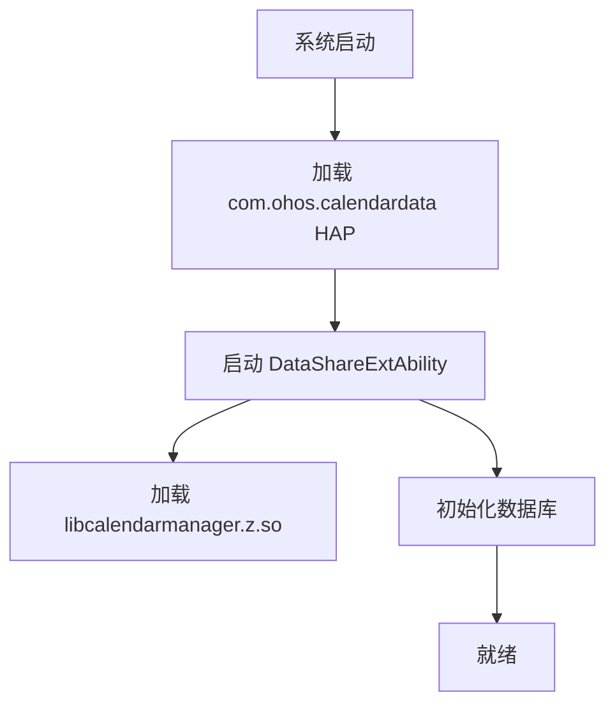
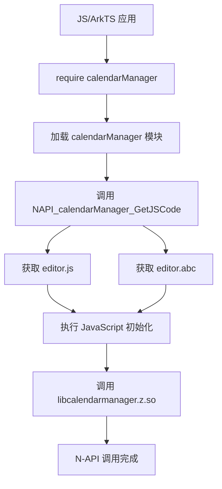

# 编译产物

## 目的

本文档说明 CalendarData 组件的编译产物清单、安装路径和运行时加载关系。

## 适用范围

- 目标读者：运维、部署人员、平台开发者
- 知识级别：初级到中级
- 前置知识：了解 OpenHarmony 打包机制

## 产物清单

### 主要共享库

| Target | 类型 | 输出文件 | 安装路径 |
|--------|------|-----------|---------|
| calendarmanager | ohos_shared_library | libcalendarmanager.z.so | /system/lib/module/ |
| cj_calendar_manager_ffi | ohos_shared_library | libcj_calendar_manager_ffi.z.so | /system/lib/platformsdk/ |

### 静态库

| Target | 类型 | 输出文件 | 用途 |
|--------|------|-----------|------|
| calendarmanager_static | ohos_static_library | libcalendarmanager_static.a | 链接到其他组件 |

### HAP 文件

| Target | 类型 | 输出文件 | 安装路径 |
|--------|------|-----------|---------|
| entry default | ohos_hap | CalendarData.hap | /system/app/com.ohos.calendardata/ |

### JavaScript 字节码

| Target | 类型 | 输出文件 | 用途 |
|--------|------|-----------|------|
| editor_abc | es2abc_gen_abc | editor.abc | 内嵌到共享库 |

## 安装路径

### 系统库路径

```
/system/lib/
├── module/
│   └── libcalendarmanager.z.so
└── platformsdk/
    └── libcj_calendar_manager_ffi.z.so
```

### 应用路径

```
/system/app/
└── com.ohos.calendardata/
    ├── CalendarData.hap
    └── ...
```

## 运行时加载关系

### 应用启动加载



### N-API 模块加载



### DataShare 调用链

```
应用进程
    ↓ N-API 调用
libcalendarmanager.z.so (calendarmanager 进程）
    ↓ DataShare IPC
DataShareExtAbility (calendardata 进程）
    ↓ RDB 操作
RDB 数据库
```

## 产物大小估计

| 产物 | 预估大小 | 说明 |
|------|---------|------|
| libcalendarmanager.z.so | ~2-5 MB | 包含 N-API 和 C++ 实现 |
| libcj_calendar_manager_ffi.z.so | ~1-2 MB | CJ FFI 绑定 |
| CalendarData.hap | ~1-3 MB | ArkTS 应用代码和资源 |
| libcalendarmanager_static.a | ~2-4 MB | 静态库用于链接 |

## 符号导出

### libcalendarmanager.z.so 导出符号

**N-API 模块导出**:
```cpp
NAPI_calendarManager_GetJSCode()     // 获取 JS 代码
NAPI_calendarManager_GetABCCode()     // 获取 ABC 字节码
```

**Inner API 导出**（来自 bundle.json）:
```cpp
// 通过 Inner Kits 暴露给其他组件
calendar_manager_ffi 相关符号
```

**证据**: calendarmanager/napi/src/module_register.cpp:64-86

### libcj_calendar_manager_ffi.z.so 导出符号

**CJ FFI 符号**:
- `cj_calendar_*` - 日历相关 FFI
- `cj_calendar_manager_*` - 日历管理器 FFI
- `cj_event_filter_*` - 事件筛选 FFI

## 依赖库加载

### 运行时依赖

libcalendarmanager.z.so 依赖以下系统库：

| 库名 | 说明 |
|------|------|
| libace_napi.z.so | N-API 框架 |
| libdatashare_consumer.z.so | DataShare 客户端 |
| libdatashare_common.z.so | DataShare 公共 |
| libaccesstoken_sdk.z.so | 权限 Token SDK |
| libhilog.z.so | 日志框架 |
| libipc_single.z.so | IPC 框架 |
| libutils.z.so | C 工具库 |
| libace_uicontent.z.so | ACE 引擎 |
- libhiappevent_innerapi.z.so (条件） | HiEvent |

**加载顺序**:
1. 系统基础库（hilog, utils, ipc）
2. N-API 框架（ace_napi）
3. DataShare 框架（datashare_*）
4. 权限 SDK（accesstoken_sdk）
5. ACE 引擎（ace_uicontent）
6. HiEvent (条件）
7. calendarmanager（本组件）

## 签名

### 应用签名

**签名配置**: build-profile.json5:3-15

| 字段 | 值 |
|------|-----|
| 签名类型 | release |
| 存储密码 | (已配置） |
| 证书路径 | ./signature/auto_ohos_release_applications_calendar_data_com.ohos.calendardata.cer |
| Key Alias | debugKey |
| Profile | ./signature/auto_ohos_release_applications_calendar_data_com.ohos.calendardata.p7b |
| 签名算法 | SHA256withECDSA |

### 库签名

共享库使用平台签名，不需要应用签名。

## 版本信息

### 库版本

| 组件 | 版本 |
|------|------|
| calendarmanager | 3.1 |
| cj_calendar_manager_ffi | 3.1 |

### SDK 兼容性

| 配置 | 版本 |
|------|------|
| compileSdkVersion | 23 |
| compatibleSdkVersion | 23 |

## 验证方法

### 验证库安装

```bash
# 检查共享库
ls -l /system/lib/module/libcalendarmanager.z.so
ls -l /system/lib/platformsdk/libcj_calendar_manager_ffi.z.so

# 检查导出符号
nm -D /system/lib/module/libcalendarmanager.z.so | grep NAPI_calendarManager
```

### 验证应用安装

```bash
# 检查 HAP 文件
ls -l /system/app/com.ohos.calendardata/CalendarData.hap

# 检查 bundle 信息
bm dump -p /system/app/com.ohos.calendardata/CalendarData.hap | grep bundleName
```

### 验证 N-API 可用性

```javascript
// 在应用中验证
try {
    const calendarManager = requireNapi('calendarManager');
    console.log('N-API 加载成功');
} catch (error) {
    console.error('N-API 加载失败:', error);
}
```

## 常见问题

### 库加载失败

**症状**: 找不到 libcalendarmanager.z.so

**原因**:
1. 库未正确安装
2. 路径错误
3. 权限问题

**解决**:
```bash
# 检查文件是否存在
ls -l /system/lib/module/libcalendarmanager.z.so

# 检查权限
chmod 644 /system/lib/module/libcalendarmanager.z.so

# 检查符号链接
ls -l /system/lib/libcalendarmanager.z.so
```

### N-API 模块未找到

**症状**: `requireNapi('calendarManager')` 失败

**原因**:
1. N-API 模块未正确注册
2. editor.js/ABC 未正确嵌入

**解决**:
```bash
# 检查导出函数
nm -D /system/lib/module/libcalendarmanager.z.so | grep NAPI_calendarManager
```

### DataShare Ability 未启动

**症状**: 无法连接到 DataShare 服务

**原因**:
1. HAP 未正确安装
2. 权限未配置
3. 数据库初始化失败

**解决**:
```bash
# 检查 HAP 安装
hdc_std shell pm list | grep com.ohos.calendardata

# 检查 Ability 状态
hdc_std shell aa dump -a com.ohos.calendardata
```

## 性能考虑

### 库加载时间

| 操作 | 预估时间 |
|------|---------|
| 加载 libcalendarmanager.z.so | ~10-50 ms |
| 初始化 N-API | ~5-20 ms |
| 启动 DataShare Ability | ~50-200 ms |

### 优化建议

1. **延迟加载**: 非 N-API 调用时不加载
2. **符号优化**: 使用 `-fvisibility=hidden` 隐藏内部符号
3. **链接时优化**: 启用 LTO（链接时优化）
4. **共享库**: 多个应用使用同一实例

## 相关文档

- [GN 构建](05_GN_Build.md) - 构建系统详解
- [对外 API](03_External_API.md) - N-API 清单
- [内部 API](04_Internal_API.md) - 模块接口

---

返回 [目录](SUMMARY.md) | [首页](README.md)
