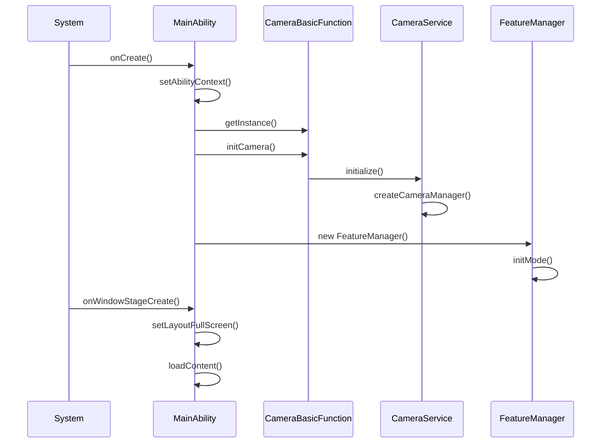
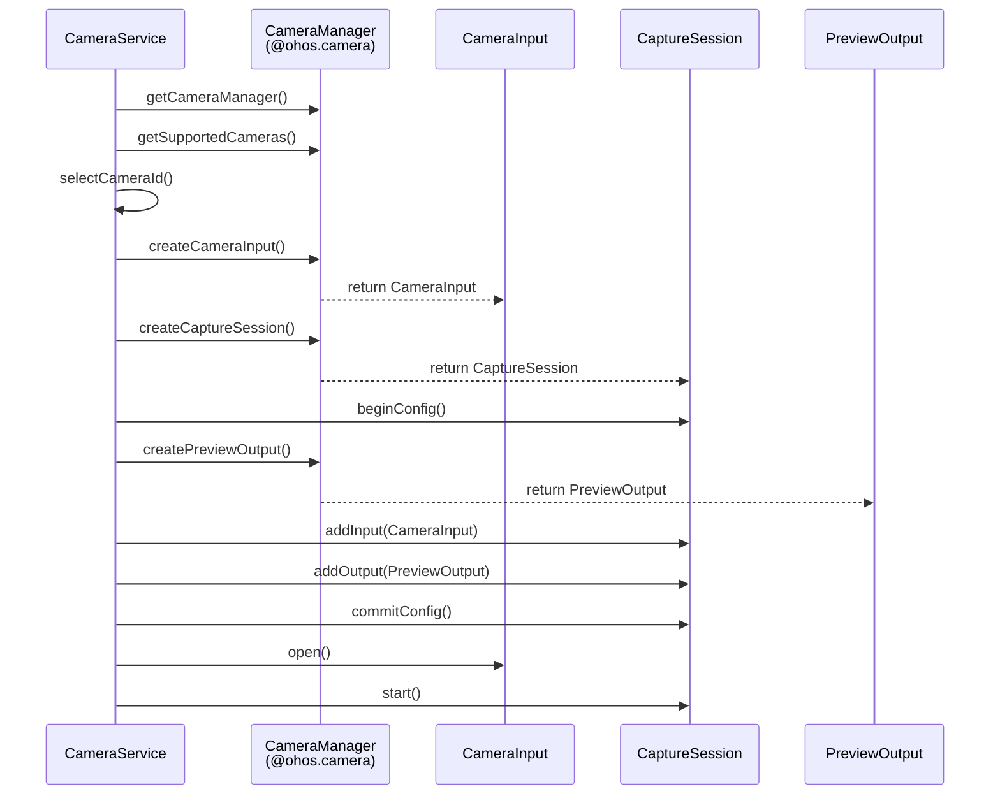
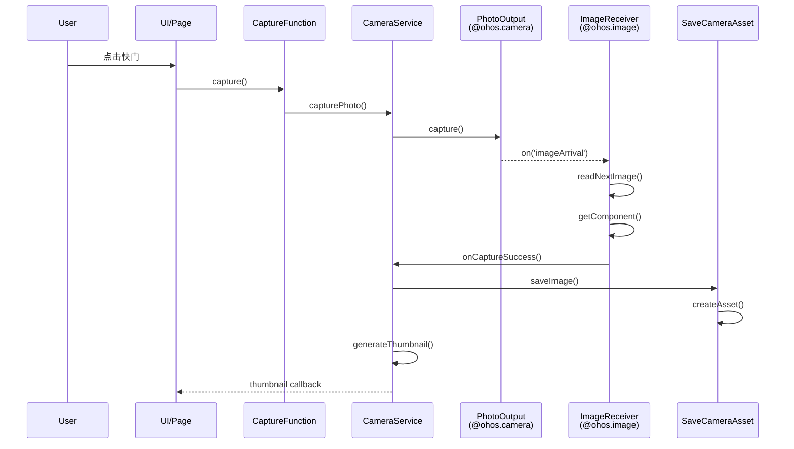
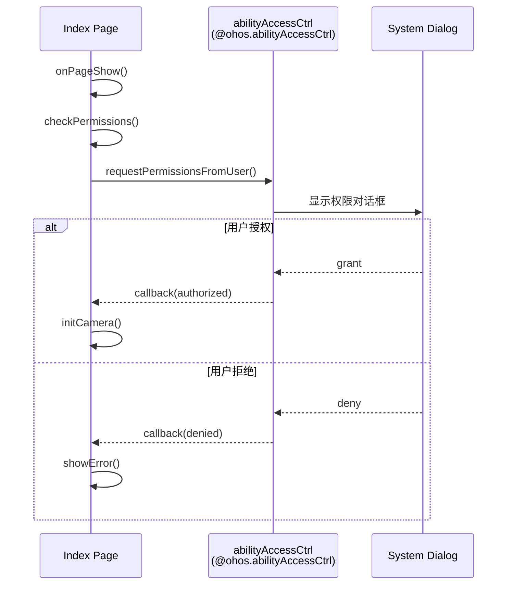

# 架构说明

## 整体架构

Camera 应用采用三层架构设计，遵循关注点分离原则：

```
┌─────────────────────────────────────────────────────────────┐
│                        Product 层                            │
│   ┌─────────────┐              ┌─────────────┐             │
│   │    Phone    │              │    Tablet   │             │
│   │  (手机形态)  │              │  (平板形态)  │             │
│   └──────┬──────┘              └──────┬──────┘             │
│          │                            │                    │
│   职责: 页面路由、窗口管理、设备适配       │                    │
└──────────┼────────────────────────────┼────────────────────┘
           │                            │
           └────────────┬───────────────┘
                        │ 依赖
┌───────────────────────┼─────────────────────────────────────┐
│                  Feature 层                                   │
│   ┌───────────┬───────────┬───────────────────────┐          │
│   │   Photo   │   Video   │        Multi          │          │
│   │  拍照模块  │  录像模块  │     多机位协同模块       │          │
│   └─────┬─────┴─────┬─────┴───────────┬───────────┘          │
│         │           │                 │                      │
│   职责: 具体业务功能实现，提供拍照/录像/多机位能力              │
└─────────┼───────────┼─────────────────┼──────────────────────┘
          │           │                 │
          └───────────┼─────────────────┘
                      │ 依赖
┌─────────────────────┼───────────────────────────────────────┐
│                  Common 层                                    │
│   ┌─────────────┬───┴───┬──────────────┬────────────────┐    │
│   │   camera    │redux  │ featurecommon│     utils      │    │
│   │  相机服务    │状态管理│   UI组件      │     工具       │    │
│   └─────────────┴───────┴──────────────┴────────────────┘    │
│   ┌──────────────┬──────────────┬────────────────────────┐   │
│   │  featuresvc  │   setting    │        worker          │   │
│   │ Feature管理   │   设置管理    │     多线程/事件总线     │   │
│   └──────────────┴──────────────┴────────────────────────┘   │
│                                                               │
│   职责: 公共服务、UI组件、状态管理、工具类（所有产品形态共享）    │
└───────────────────────────────────────────────────────────────┘
```

**证据**: `README_zh.md:6-14`

## 组件关系图

### 核心组件依赖

```mermaid
graph TB
    subgraph Product[Product Layer]
        MA[MainAbility]
        PA[Pages]
        EP[ExtensionPickerAbility]
    end
    
    subgraph Feature[Feature Layer]
        PM[PhotoMode]
        VM[VideoMode]
        MM[MultiMode]
        FM[FeatureManager]
    end
    
    subgraph Common[Common Layer]
        CS[CameraService]
        SM[SettingManager]
        Store[Redux Store]
        EB[EventBus]
        CBF[CameraBasicFunction]
    end
    
    subgraph System[System SDK]
        CamAPI[@ohos.multimedia.camera]
        ImgAPI[@ohos.multimedia.image]
        MedAPI[@ohos.multimedia.media]
    end
    
    MA --> PA
    PA --> FM
    EP --> CS
    FM --> PM
    FM --> VM
    FM --> MM
    PM --> CS
    VM --> CS
    MM --> CS
    CS --> CamAPI
    CS --> ImgAPI
    CS --> MedAPI
    PA --> Store
    PA --> EB
    FM --> SM
    CBF --> CS
    MA --> CBF
```

### 详细组件关系

| 组件 | 依赖组件 | 被谁依赖 |
|------|----------|----------|
| MainAbility | CameraBasicFunction, GlobalContext | 系统框架 |
| CameraBasicFunction | CameraService | MainAbility |
| CameraService | @ohos.multimedia.camera | PhotoMode, VideoMode, MultiMode |
| FeatureManager | SettingManager, ModeMap | Pages |
| PhotoMode | CameraService | FeatureManager |
| Redux Store | - | Pages, Components |
| EventBus | - | Pages, Components |

## 数据流分析

### 1. 相机预览数据流

```
┌─────────────┐     ┌─────────────┐     ┌─────────────┐     ┌─────────────┐
│ Camera HAL  │────>│ CameraManager│────>│CaptureSession│────>│PreviewOutput│
└─────────────┘     └─────────────┘     └─────────────┘     └──────┬──────┘
                                                                    │
                                                                    ▼
┌─────────────┐     ┌─────────────┐     ┌─────────────┐     ┌─────────────┐
│   ArkUI     │<────│ XComponent  │<────│  Surface    │<────│ Surface ID  │
└─────────────┘     └─────────────┘     └─────────────┘     └─────────────┘
```

**代码证据**:
- `CameraService.ts:82-83` - PreviewOutput 创建
- `PreviewArea.ets` - XComponent 使用

### 2. 拍照数据流

```
用户点击快门
     │
     ▼
┌─────────────┐     ┌─────────────┐     ┌─────────────┐
│ ShutterButton│────>│CaptureFunction│────>│CameraService  │
└─────────────┘     └─────────────┘     └───────┬───────┘
                                                │
                                                ▼
┌─────────────┐     ┌─────────────┐     ┌─────────────┐
│ SaveCameraAsset│<──│ImageReceiver  │<──│  PhotoOutput  │
└──────┬──────┘     └─────────────┘     └─────────────┘
       │
       ▼
┌─────────────┐     ┌─────────────┐
│  缩略图显示   │     │  保存到相册   │
└─────────────┘     └─────────────┘
```

**关键代码路径**:
- 触发: `FootBar.ets` -> `ShutterButton`
- 处理: `common/src/main/ets/default/function/CaptureFunction.ts`
- 服务: `common/src/main/ets/default/camera/CameraService.ts:335-400`
- 保存: `common/src/main/ets/default/camera/SaveCameraAsset.ts`
- 缩略图: `common/src/main/ets/default/camera/ThumbnailGetter.ts`

### 3. 状态管理数据流 (Redux)

```
┌─────────────┐     ┌─────────────┐     ┌─────────────┐
│   Action    │────>│   Reducer   │────>│    Store    │
│  (事件描述)  │     │ (状态计算)   │     │  (状态存储)  │
└─────────────┘     └─────────────┘     └──────┬──────┘
                                               │
                                               │ subscribe
                                               ▼
                                        ┌─────────────┐
                                        │  UI 组件更新  │
                                        └─────────────┘
```

**代码位置**:
- Action: `common/src/main/ets/default/redux/actions/Action.ts`
- Store: `common/src/main/ets/default/redux/store.ets`

### 4. 事件总线数据流

```
发布者                              订阅者
┌─────────────┐                    ┌─────────────┐
│  Component A │─── EventBus.emit ─>│  Component B │
└─────────────┘                    └─────────────┘
        │                                  ▲
        │ EventBus.emit                    │ EventBus.on
        ▼                                  │
┌─────────────┐                    ┌─────────────┐
│  Component C │───────────────────>│  Component D │
└─────────────┘                    └─────────────┘
```

**代码位置**: `common/src/main/ets/default/worker/eventbus/EventBus.ts`

## 线程模型

### 主线程职责
- UI 渲染 (ArkUI)
- Ability 生命周期回调
- 用户交互处理
- 轻量级业务逻辑

### Worker 线程职责
- 相机操作异步处理
- 图片处理
- 耗时业务逻辑

**代码证据**:
- `common/src/main/ets/default/worker/CameraWorker.ts`
- `common/src/main/ets/default/worker/WorkerManager.ts`

### 线程通信模型

```
┌──────────────────────┐              ┌──────────────────────┐
│      Main Thread     │              │     Worker Thread    │
│                      │              │                      │
│  ┌────────────────┐  │              │  ┌────────────────┐  │
│  │   UI Ability   │  │              │  │ CameraWorker   │  │
│  └────────┬───────┘  │              │  └────────┬───────┘  │
│           │          │   postMessage │           │          │
│           │          │<─────────────>│           │          │
│           ▼          │              │           ▼          │
│  ┌────────────────┐  │              │  ┌────────────────┐  │
│  │ WorkerManager  │──┼──────────────┼─>│ 相机操作处理    │  │
│  └────────────────┘  │              │  └────────────────┘  │
└──────────────────────┘              └──────────────────────┘
```

## 关键时序图

### 1. 应用启动时序



**代码证据**: `product/phone/src/main/ets/MainAbility/MainAbility.ts:30-115`

### 2. 相机初始化时序



**代码证据**: `common/src/main/ets/default/camera/CameraService.ts:200-300`

### 3. 拍照时序



**代码证据**: `common/src/main/ets/default/camera/CameraService.ts:335-400`

### 4. 权限申请时序



**代码证据**: `product/phone/src/main/ets/pages/index.ets:170-200`

## 模块边界与接口

### Common 层提供的核心接口

| 接口/类 | 路径 | 职责 |
|---------|------|------|
| CameraService | `camera/CameraService.ts` | 相机能力封装 |
| FeatureManager | `featureservice/FeatureManager.ts` | Feature 管理 |
| SettingManager | `setting/SettingManager.ts` | 设置管理 |
| GlobalContext | `utils/GlobalContext.ts` | 全局上下文 |
| EventBus | `worker/eventbus/EventBus.ts` | 事件总线 |
| getStore | `redux/store.ets` | Redux Store |

### Feature 层对外接口

| 接口/类 | 路径 | 职责 |
|---------|------|------|
| PhotoMode | `photo/PhotoMode.ts` | 拍照模式实现 |
| VideoMode | `video/VideoMode.ts` | 录像模式实现 |
| MultiMode | `multi/MultiMode.ts` | 多机位模式实现 |

### Product 层入口

| 入口 | 路径 | 职责 |
|------|------|------|
| MainAbility | `MainAbility/MainAbility.ts` | 应用生命周期 |
| ExtensionPickerAbility | `MainAbility/ExtensionPickerAbility.ts` | 扩展选择器 |
| FormAbility | `FormAbility/FormAbility.ts` | 卡片服务 |

## 设计模式应用

### 1. 单例模式 (Singleton)
- **CameraService**: 全局唯一相机服务
- **SettingManager**: 全局唯一设置管理
- **GlobalContext**: 全局上下文

**证据**: `GlobalContext.get()` 方法

### 2. 观察者模式 (Observer)
- **EventBus**: 跨组件事件订阅发布
- **Redux Store**: 状态变化订阅

**证据**: `EventBus.on()`, `EventBus.emit()`

### 3. 策略模式 (Strategy)
- **PhotoMode/VideoMode/MultiMode**: 不同拍摄模式策略

### 4. 工厂模式 (Factory)
- **FeatureManager**: 根据模式创建对应 Feature

### 5. 外观模式 (Facade)
- **CameraService**: 封装底层相机 API 复杂性
