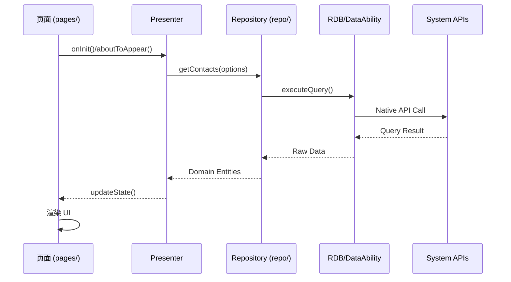
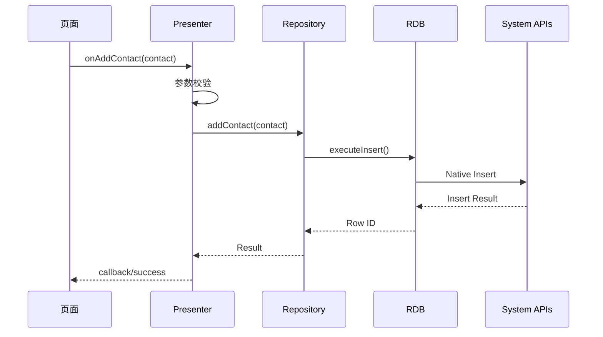

# 架构说明

## 架构概述

Contacts 应用采用 **MVP（Model-View-Presenter）** 结合 **领域驱动设计（DDD）** 的架构模式。

### 架构模式

```
┌─────────────────────────────────────────────────────────────────┐
│                        UI Layer (View)                          │
│  ┌──────────────────────────────────────────────────────────┐   │
│  │  pages/              - 页面 (ArkUI 声明式组件)           │   │
│  │  component/          - 可复用 UI 组件                      │   │
│  └──────────────────────────────────────────────────────────┘   │
└─────────────────────────────────────────────────────────────────┘
                              │
                              ▼
┌─────────────────────────────────────────────────────────────────┐
│                     Presenter Layer                             │
│  ┌──────────────────────────────────────────────────────────┐   │
│  │  presenter/         - MVP Presenter，处理业务逻辑        │   │
│  │  - 接收 View 事件                                                 │   │
│  │  - 调用 Model 层                                                 │   │
│  │  - 更新 View 状态                                                │   │
│  └──────────────────────────────────────────────────────────┘   │
└─────────────────────────────────────────────────────────────────┘
                              │
                              ▼
┌─────────────────────────────────────────────────────────────────┐
│                     Model Layer                                 │
│  ┌──────────────────┐  ┌─────────────────────────────────────┐  │
│  │ feature/contact/  │  │ feature/*/repo/                    │  │
│  │   contract/       │  │   - ContactRepository              │  │
│  │   entity/         │  │   - 数据仓库封装                   │  │
│  │   repo/           │  │   - RDB 操作                       │  │
│  └──────────────────┘  └─────────────────────────────────────┘  │
└─────────────────────────────────────────────────────────────────┘
                              │
                              ▼
┌─────────────────────────────────────────────────────────────────┐
│                   System Layer (Native APIs)                     │
│  ┌──────────────────────────────────────────────────────────┐   │
│  │  @ohos.telephony.*    - 电话能力                        │   │
│  │  @ohos.rdb            - 数据库能力                       │   │
│  │  @ohos.dataAbility    - DataAbility 能力                │   │
│  │  @ohos.app.ability.*  - Ability 生命周期                │   │
│  └──────────────────────────────────────────────────────────┘   │
└─────────────────────────────────────────────────────────────────┘
```

> **证据来源**: `README.md` - "The application architecture mainly combines MVP and domain-driven design ideas."

## 数据流

### 典型读取流程



### 典型写入流程



## 组件关系

### 模块依赖图

```
entry (主入口)
│
├── MainAbility
│   ├── PresenterManager ───► presenter/*
│   ├── SimManager ─────────► feature/account/
│   └── Workers ────────────► workers/*
│
├── pages/* ────────────────► component/*
│   └── 依赖 presenters
│
└── component/* ────────────► 纯 UI，无外部依赖

feature (功能模块)
│
├── contact (核心联系人)
│   ├── contract/* ───────► 数据契约定义
│   ├── entity/* ─────────► 领域实体
│   └── repo/* ───────────► ContactRepository
│
├── call ─────────────────► contact/repo
├── dialpad ──────────────► contact/repo
├── phonenumber ──────────► 工具模块
└── account ──────────────► contact/repo

common (公共模块)
│
├── util/* ───────────────► 全局工具类
├── permission/ ──────────► PermissionManager
└── Constants.ets ────────► 常量定义
```

## 线程模型

### Main Thread vs Worker Thread

```
┌─────────────────────────────────────────────────────┐
│                    Main Thread                       │
│  ┌─────────────────────────────────────────────┐   │
│  │  UI Rendering (ArkUI)                       │   │
│  │  - 页面渲染                                  │   │
│  │  - 组件事件处理                              │   │
│  │  - 动画效果                                  │   │
│  └─────────────────────────────────────────────┘   │
│                                                     │
│  ┌─────────────────────────────────────────────┐   │
│  │  Presenter (业务逻辑)                        │   │
│  │  - MVP Presenter                            │   │
│  │  - 轻量数据处理                              │   │
│  │  - UI 状态更新                               │   │
│  └─────────────────────────────────────────────┘   │
└─────────────────────────────────────────────────────┘
                          │
          ┌───────────────┼───────────────┐
          ▼               ▼               ▼
    ┌───────────┐   ┌───────────┐   ┌───────────┐
    │ DataWorker│   │  Worker2 │   │  Worker3  │
    │ (RDB)    │   │  (Async) │   │  (Async) │
    └───────────┘   └───────────┘   └───────────┘
          │               │               │
          └───────────────┴───────────────┘
                          │
                          ▼
              ┌───────────────────────────┐
              │   Heavy Operations        │
              │   - 数据库查询            │
              │   - 大数据处理            │
              │   - 文件 I/O              │
              └───────────────────────────┘
```

### Worker 配置

| Worker 类型 | 用途 | 依赖模块 |
|------------|------|----------|
| DataWorker | 密集型数据操作 | feature/contact/repo/ |

> **证据来源**: `entry/src/main/ets/MainAbility/MainAbility.ts` lines 32, 69
> ```typescript
> mDataWorker = WorkFactory.getWorker(WorkerType.DataWorker);
> globalThis.DataWorker = this.mDataWorker;
> ```

## 生命周期

### Ability 生命周期

```
┌─────────────────────────────────────────────────────────────┐
│                     Ability Lifecycle                        │
├─────────────────────────────────────────────────────────────┤
│                                                             │
│   onCreate ──► onWindowStageCreate ──► onForeground ──► ... │
│       │              │                   │               │  │
│       │              │                   │               │  │
│   应用初始化       窗口创建            来到前台        运行中 │
│                                                             │
│   ... ──► onBackground ──► onWindowStageDestroy ──► onDestroy │
│       │                │                    │            │ │
│       │            退到后台              窗口销毁      销毁   │
│                                                             │
└─────────────────────────────────────────────────────────────┘
```

### 关键状态管理

| 状态 | 说明 | 管理方式 |
|------|------|----------|
| globalThis.context | 应用上下文 | onCreate 时设置 |
| globalThis.abilityWant | 启动 Intent | onCreate/onNewWant 时更新 |
| globalThis.presenterManager | Presenter 管理器 | onCreate 时初始化 |
| LocalStorage | 页面间共享数据 | 窗口创建时绑定 |

> **证据来源**: `entry/src/main/ets/MainAbility/MainAbility.ts` lines 61-71
> ```typescript
> onCreate(want: Want, launchParam: AbilityConstant.LaunchParam) {
>     globalThis.context = this.context;
>     globalThis.abilityWant = want;
>     this.storage = new LocalStorage();
>     globalThis.presenterManager = new PresenterManager(this.context, this.mDataWorker);
> }
> ```

## 关键设计决策

### 1. MVP vs MVVM

Contacts 应用采用 MVP 而非 MVVM，原因：
- **Presenter 层** 集中处理业务逻辑
- **View 层** 仅负责 UI 渲染
- **数据流向** Presenter -> View 单向

### 2. 为什么使用 Worker

| 场景 | 原因 |
|------|------|
| 大量联系人查询 | 避免阻塞 UI 线程 |
| 数据同步操作 | 异步执行，不影响响应性 |
| 复杂计算 | 分离计算密集型任务 |

### 3. 领域驱动设计应用

| 层级 | 示例 | 说明 |
|------|------|------|
| Contract | `contract/Contacts.ets` | 数据契约/接口定义 |
| Entity | `entity/Contact.ets` | 领域实体 |
| Repository | `repo/ContactRepository.ets` | 数据访问抽象 |

> **证据来源**: `feature/contact/src/main/ets/` 目录结构
