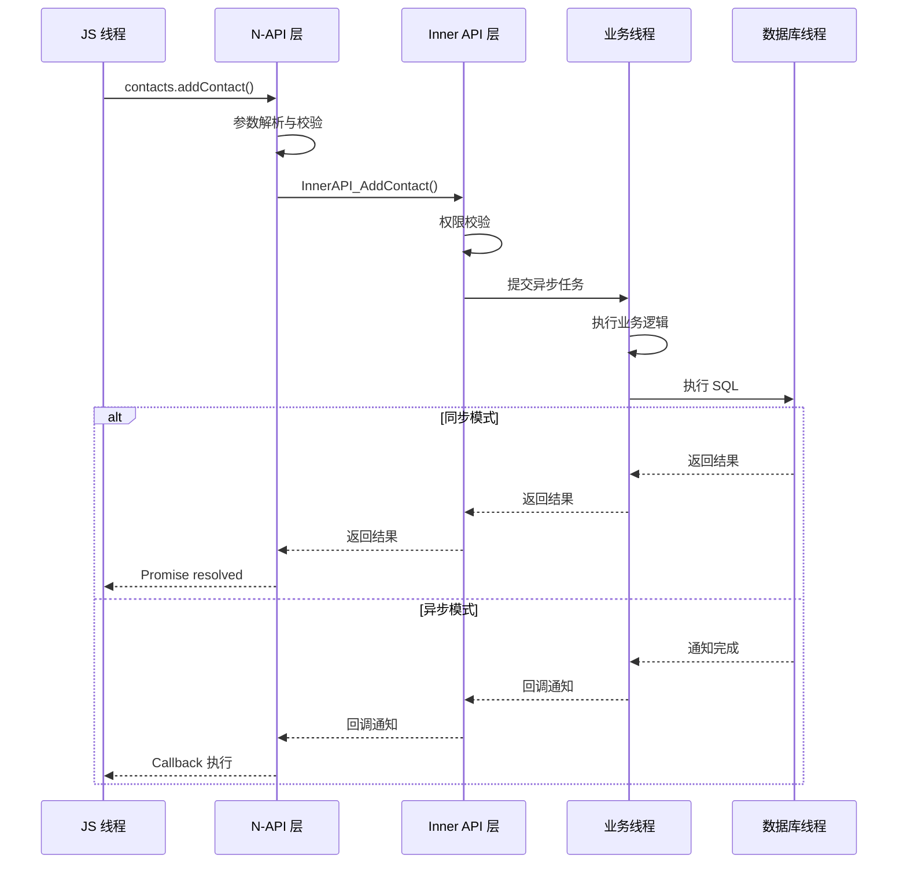
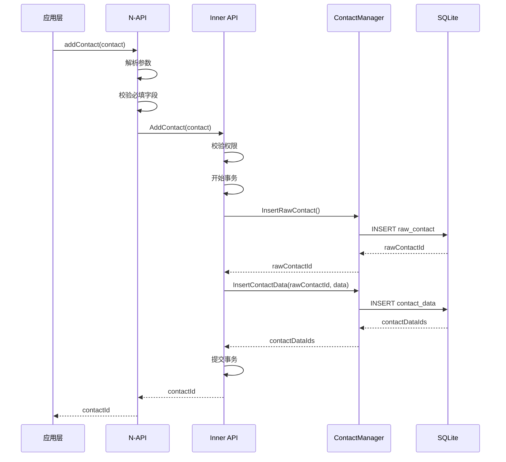
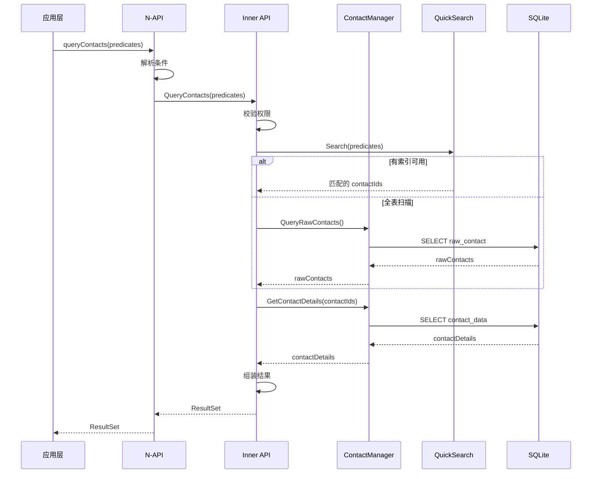
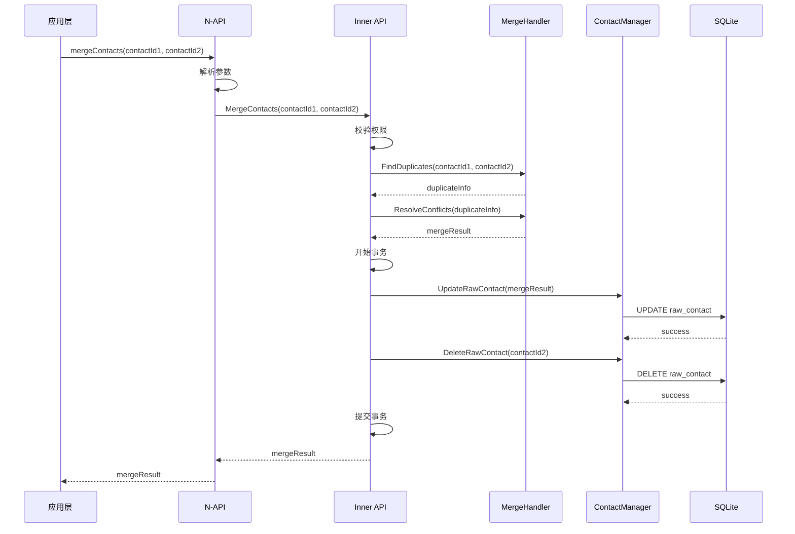

# contacts_data 架构设计

> 本文档详细说明 contacts_data 子系统的架构设计，包括组件关系、数据流向、线程模型和关键时序。

## 整体架构

contacts_data 子系统采用分层架构设计，从上到下依次为：应用层、N-API 层、Inner API 层、数据业务层、核心能力层和存储层。这种分层设计确保了职责清晰、依赖明确，便于维护和扩展。

```
┌─────────────────────────────────────────────────────────────────┐
│                        应用层                                    │
│  ┌─────────────┐  ┌─────────────┐  ┌─────────────────────────┐  │
│  │ 联系人应用   │  │ 通话记录应用 │  │ 第三方应用               │  │
│  └─────────────┘  └─────────────┘  └─────────────────────────┘  │
└─────────────────────────────────────────────────────────────────┘
                              │
                              ▼
┌─────────────────────────────────────────────────────────────────┐
│                      N-API 层 (contacts)                         │
│  ┌───────────────────────────────────────────────────────────┐  │
│  │  @ohos.contacts.data 模块                                 │  │
│  │  - 参数解析与校验                                          │  │
│  │  - 类型转换 (JS ↔ C++)                                    │  │
│  │  - 错误码封装                                             │  │
│  └───────────────────────────────────────────────────────────┘  │
└─────────────────────────────────────────────────────────────────┘
                              │
                              ▼
┌─────────────────────────────────────────────────────────────────┐
│                    Inner API 层 (contactsCJ)                     │
│  ┌───────────────────────────────────────────────────────────┐  │
│  │  C++ 接口层                                               │  │
│  │  - 业务逻辑编排                                            │  │
│  │  - 权限校验                                               │  │
│  │  - 事务管理                                               │  │
│  └───────────────────────────────────────────────────────────┘  │
└─────────────────────────────────────────────────────────────────┘
                              │
                    ┌─────────┴─────────┐
                    │                   │
                    ▼                   ▼
┌───────────────────────────┐  ┌───────────────────────────┐
│      数据业务层            │  │      核心能力层            │
│  ┌─────────────────────┐  │  │  ┌─────────────────────┐  │
│  │ dataBusiness        │  │  │  │ ability             │  │
│  │ - calllog           │  │  │  │ - account           │  │
│  │ - contacts          │  │  │  │ - common            │  │
│  │ - quicksearch       │  │  │  │ - merge             │  │
│  │ - voicemail         │  │  │  │ - sinicization      │  │
│  └─────────────────────┘  │  │  │ - datadisasterrecovery│ │
└───────────────────────────┘  │  └─────────────────────┘  │
                              │                           │
                              └─────────────┬─────────────┘
                                            │
                                            ▼
┌─────────────────────────────────────────────────────────────────┐
│                        存储层                                     │
│  ┌───────────────────────────────────────────────────────────┐  │
│  │  relational_store (SQLite)                                │  │
│  │  - contacts.db                                            │  │
│  │  - calllog.db                                             │  │
│  │  - voicemail.db                                           │  │
│  └───────────────────────────────────────────────────────────┘  │
└─────────────────────────────────────────────────────────────────┘
```

## 组件关系

### N-API 组件

N-API 层是 contacts_data 对外的 JavaScript 接口，所有 JS 应用通过 N-API 访问联系人数据。N-API 层的主要职责包括：

**参数解析与校验**：N-API 层负责解析 JavaScript 传入的参数，检查参数类型、长度、范围等是否符合要求。对于不合法的参数，N-API 层会抛出明确的错误信息，帮助开发者快速定位问题。

**类型转换**：JavaScript 和 C++ 使用不同的数据类型，N-API 层负责在两种类型之间进行转换。例如，JS 的 number 转换为 C++ 的 int64_t，JS 的 string 转换为 C++ 的 std::string。

**错误码封装**：底层 C++ 接口使用错误码表示操作结果，N-API 层将错误码转换为 JavaScript 的 Error 对象，开发者可以使用 try-catch 捕获异常。

### Inner API 组件

Inner API 层是 contacts_data 的内部 C++ 接口，供系统内部的其他子系统调用。Inner API 层的主要职责包括：

**业务逻辑编排**：Inner API 层调用 dataBusiness 层和 ability 层的能力，组装成完整的业务流程。例如，插入联系人需要先插入 raw_contact，再插入关联的 contact_data。

**权限校验**：Inner API 层负责校验调用者是否有权限执行相应的操作，包括检查调用者的 bundle name、signature、uid 等。

**事务管理**：对于需要原子性保证的操作，Inner API 层负责开启事务、执行操作、提交或回滚事务。

### 数据业务组件

dataBusiness 层包含四个业务模块，分别处理不同类型的数据：

**calllog 模块**：处理通话记录数据，实现通话记录的增删改查。calllog 模块与联系人模块关联，来电时可以自动匹配联系人信息。

**contacts 模块**：处理联系人核心数据，包括 raw_contact（原始联系人）和 contact_data（联系人详情）。contacts 模块管理联系人的基本信息、电话、邮箱、头像等。

**quicksearch 模块**：提供联系人快速检索能力，基于预构建的索引实现毫秒级搜索响应。quicksearch 模块支持拼音搜索、模糊搜索等高级功能。

**voicemail 模块**：处理语音信箱数据，与 calllog 模块联动，支持语音留言的录制和播放。

### 核心能力组件

ability 层提供 contacts_data 的核心业务能力，这些能力被 dataBusiness 层调用：

**account 模块**：管理多账户场景下的联系人数据隔离，确保每个用户只能访问自己的联系人。

**common 模块**：提供公共工具函数，包括日志、字符串处理、日期处理等。

**merge 模块**：实现联系人合并算法，自动或手动合并重复联系人。

**sinicization 模块**：提供汉字到拼音的转换，支持联系人搜索和排序。

**datadisasterrecovery 模块**：检测和修复数据库损坏，保障数据完整性。

## 数据流向

### 写操作数据流

```
JS 调用
    │
    ▼
N-API 层 (参数解析/类型转换)
    │
    ▼
Inner API 层 (权限校验/事务开始)
    │
    ▼
dataBusiness 层 (业务逻辑)
    │
    ▼
ability 层 (核心能力)
    │
    ▼
relational_store (SQLite 写入)
    │
    ▼
返回结果 (逐层返回)
```

写操作（如 insert、update、delete）的数据流从上层流向下层，最终写入数据库。每层都可能有前置处理（如校验）或后置处理（如记录日志）。

### 读操作数据流

```
JS 调用
    │
    ▼
N-API 层 (参数解析)
    │
    ▼
Inner API 层 (权限校验/缓存检查)
    │
    ▼
dataBusiness 层 (查询组装)
    │
    ▼
relational_store (SQLite 查询)
    │
    ▼
ability 层 (数据处理，如搜索排序)
    │
    ▼
返回结果 (ResultSet 逐行返回)
```

读操作（如 query）的数据流同样从上层流向下层，但返回时使用 ResultSet 游标方式逐行获取数据，避免一次性加载大量数据。

## 线程模型

### 线程划分

contacts_data 子系统使用多线程架构，不同类型的操作在不同线程上执行：

| 线程类型 | 线程名称 | 职责 |
|----------|----------|------|
| 主线程 | main thread | UI 交互、JS 调用入口 |
| JS 线程 | JS thread | N-API 调用处理 |
| 业务线程 | business thread | dataBusiness 业务逻辑 |
| 数据库线程 | DB thread | SQLite 操作 |
| SA 线程 | SA thread | 系统能力调用 |

### 线程安全

contacts_data 子系统通过以下机制保证线程安全：

**线程隔离**：SQLite 操作在独立的数据库线程上执行，避免阻塞主线程。数据库线程使用消息队列处理请求，确保同一时刻只有一个操作访问数据库。

**锁机制**：Inner API 层使用读写锁保护共享数据。读操作获取读锁，写操作获取写锁，多个读操作可以并发执行。

**线程池**：contacts 子系统使用线程池处理异步任务，避免频繁创建和销毁线程的开销。线程池大小可根据系统负载动态调整。

### 线程交互时序



## 关键时序

### 联系人插入时序



### 联系人查询时序



### 联系人合并时序



## 相关文档

| 文档 | 描述 | 链接 |
|------|------|------|
| 项目概览 | 了解项目定位和能力 | [00_Overview.md](00_Overview.md) |
| 目录结构 | 了解模块划分 | [01_Directory_Structure.md](01_Directory_Structure.md) |
| API 参考 | 学习接口使用 | [03_API_Reference.md](03_API_Reference.md) |
| 构建文档 | 了解编译配置 | [04_Build.md](04_Build.md) |
| 安全评审 | 了解安全考量 | [05_Security_Review.md](05_Security_Review.md) |
| 关键调用链 | 查看详细调用链 | [appendix/Callgraphs.md](appendix/Callgraphs.md) |
