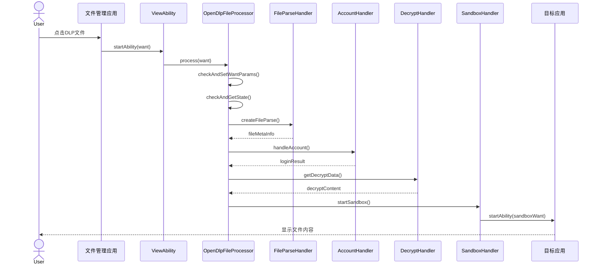
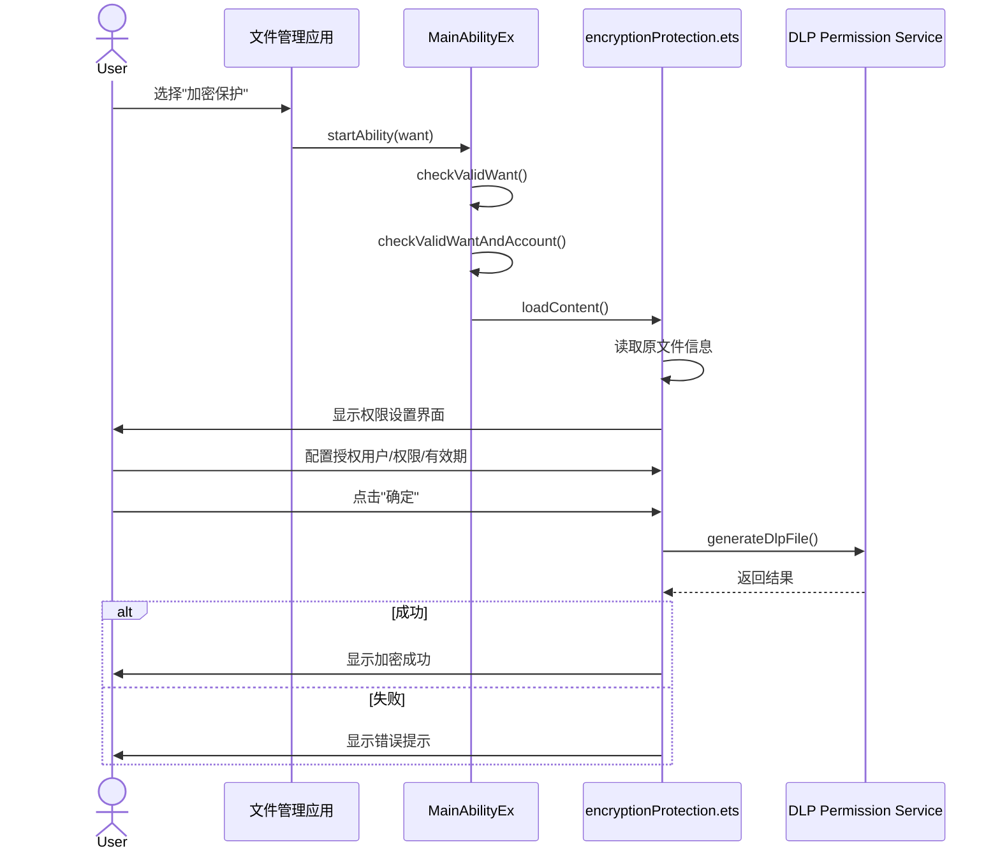
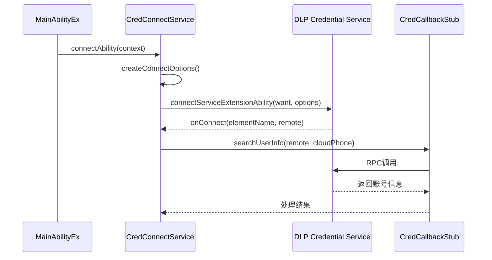

# 架构设计

## 目的

本文档描述DLP Manager的系统架构、组件关系、数据流和关键时序，帮助开发者理解系统设计和模块协作。

## 适用范围

- 进行架构设计的开发人员
- 需要理解系统流程的开发者
- 进行性能优化或问题定位的人员

---

## 系统架构

### 整体架构图

```
┌─────────────────────────────────────────────────────────────────────────────┐
│                              应用层 (Application)                            │
│  ┌─────────────────┐  ┌─────────────────┐  ┌─────────────────┐             │
│  │   MainAbility   │  │   ViewAbility   │  │  DataAbility    │             │
│  │   (UIExtension) │  │ (ServiceExt)    │  │ (ServiceExt)    │             │
│  └────────┬────────┘  └────────┬────────┘  └─────────────────┘             │
│           │                    │                                           │
│           ▼                    ▼                                           │
│  ┌─────────────────────────────────────────────────────────────────┐      │
│  │                    业务逻辑层 (Business)                         │      │
│  │  ┌──────────────┐  ┌──────────────┐  ┌──────────────────────┐   │      │
│  │  │ OpenDlpFile  │  │   Manager    │  │        RPC           │   │      │
│  │  │   Manager    │  │   Layer      │  │     (Service)        │   │      │
│  │  └──────┬───────┘  └──────┬───────┘  └──────────┬───────────┘   │      │
│  └─────────┼─────────────────┼────────────────────┼───────────────┘      │
│            │                 │                    │                      │
└────────────┼─────────────────┼────────────────────┼──────────────────────┘
             │                 │                    │
             ▼                 ▼                    ▼
┌─────────────────────────────────────────────────────────────────────────────┐
│                              基础设施层 (Infrastructure)                      │
│  ┌──────────────┐  ┌──────────────┐  ┌──────────────┐  ┌──────────────┐     │
│  │   FileUtils  │  │    HUKs      │  │  dlpPermission│  │   System     │     │
│  │              │  │   (加密)     │  │   (系统服务)  │  │   APIs       │     │
│  └──────────────┘  └──────────────┘  └──────────────┘  └──────────────┘     │
└─────────────────────────────────────────────────────────────────────────────┘
```

### 组件说明

#### 1. Ability层

| Ability | 类型 | 职责 |
|---------|------|------|
| MainAbilityEx | UIExtensionAbility | 处理DLP文件权限设置和修改请求（`entry/src/main/ets/Ability/MainAbilityEx.ets:54`） |
| ViewAbility | ServiceExtensionAbility | 处理DLP文件打开请求（`entry/src/main/ets/Ability/ViewAbility.ets:31`） |
| DataAbility | ServiceExtensionAbility | 维护文件打开历史记录 |
| DlpFileProcessAbility | ServiceExtensionAbility | 内部DLP文件处理服务 |
| EncryptedSharingAbility | ServiceExtensionAbility | 加密分享功能 |

#### 2. 业务逻辑层

| 模块 | 职责 |
|------|------|
| OpenDlpFileManager | DLP文件打开状态管理（单例）（`entry/src/main/ets/OpenDlpFile/manager/OpenDlpFileManager.ets:38`） |
| AccountManager | 域账号管理和验证（`entry/src/main/ets/manager/AccountManager.ets`） |
| ViewProcessor | DLP文件打开主流程处理（`entry/src/main/ets/OpenDlpFile/ViewProcessor/ViewProcessor.ets:45`） |
| CredConnectService | 凭证服务RPC连接（`entry/src/main/ets/rpc/CredConnectService.ets:25`） |

#### 3. 基础设施层

| 模块 | 职责 |
|------|------|
| FileUtils | 文件操作工具（`entry/src/main/ets/common/FileUtils/utils.ets`） |
| HUKs | 华为通用密钥库加密（`entry/src/main/ets/common/huks/HuksCipherUtil.ets:22`） |
| dlpPermission | 系统DLP权限服务客户端 |

---

## 数据流

### DLP文件打开数据流

```
用户点击DLP文件
       │
       ▼
┌──────────────┐
│  文件管理应用  │
│  startAbility │
└──────┬───────┘
       │ Want{uri, bundleName, callerToken}
       ▼
┌──────────────┐     ┌──────────────┐
│  ViewAbility │────>│  参数校验     │
│  onRequest   │     │ check params  │
└──────┬───────┘     └──────────────┘
       │
       ▼
┌─────────────────────────────────────────────────────────────┐
│                    OpenDlpFileProcessor                      │
│  ┌──────────┐  ┌──────────┐  ┌──────────┐  ┌──────────┐    │
│  │ 1.参数   │  │ 2.文件   │  │ 3.账号   │  │ 4.解密   │    │
│  │   检查   │  │   解析   │  │   验证   │  │   安装   │    │
│  └────┬─────┘  └────┬─────┘  └────┬─────┘  └────┬─────┘    │
│       │             │             │             │          │
│       ▼             ▼             ▼             ▼          │
│  checkAndSet    FileParse      Account      Decrypt       │
│    WantParams    Handler       Handler      Handler       │
└───────┼───────────────────────────────────────────────────┘
        │
        ▼
┌──────────────┐     ┌──────────────┐
│  沙箱启动     │────>│  应用打开文件  │
│  Sandbox     │     │              │
└──────────────┘     └──────────────┘
```

**代码位置**: `entry/src/main/ets/OpenDlpFile/ViewProcessor/ViewProcessor.ets:46`

### DLP文件创建数据流

```
用户选择文件并设置权限
       │
       ▼
┌──────────────┐
│ 文件管理应用  │
│  startAbility │
└──────┬───────┘
       │ Want{uri, fileName}
       ▼
┌──────────────┐
│ MainAbility  │
│ onSessionCreate│
└──────┬───────┘
       │
       ▼
┌─────────────────────────────────────────────────────────────┐
│              encryptionProtection.ets 页面                   │
│  ┌──────────┐  ┌──────────┐  ┌──────────┐  ┌──────────┐    │
│  │ 读取文件  │  │ 显示设置  │  │ 用户配置  │  │ 生成DLP  │    │
│  │   信息   │  │   界面   │  │   权限   │  │   文件   │    │
│  └──────────┘  └──────────┘  └──────────┘  └──────────┘    │
└─────────────────────────────────────────────────────────────┘
       │
       │ 调用 dlpPermission.generateDlpFile()
       ▼
┌──────────────┐
│ DLP Permission│
│   Service    │
└──────────────┘
```

**代码位置**: `entry/src/main/ets/pages/encryptionProtection.ets:87`

---

## 线程模型

### 线程设计

DLP Manager基于OpenHarmony的ArkTS运行时，遵循以下线程模型：

```
主线程 (Main Thread)
       │
       ├── UI渲染 ──────────────────────┐
       │                                  │
       ├── Ability生命周期回调           │
       │   - onCreate                     │
       │   - onSessionCreate              │
       │   - onRequest                    │
       │                                  │
       ├── 业务逻辑处理 ──────────────────┤
       │   - 参数校验                     │
       │   - 状态管理                     │
       │                                  │
       └── 异步操作发起 ──────────────────┘
              │
              ▼
       异步任务 (Promise/async-await)
              │
              ├── 文件I/O (fs.open/read)
              ├── RPC调用 (connectServiceExtensionAbility)
              ├── 网络请求 (connection.getNetCapabilities)
              └── 系统服务调用 (dlpPermission.*)
```

### 并发控制

#### 1. AsyncLock - 状态管理锁

```typescript
// OpenDlpFileManager使用AsyncLock保护共享状态
private lock: ArkTSUtils.locks.AsyncLock;

public async setStatus(uri: string, status: DecryptStatus): Promise<Result<void>> {
  try {
    await this.lock.lockAsync(() => {
      this.statusMap.set(uri, status);
    });
  }
}
```

**代码位置**: `entry/src/main/ets/OpenDlpFile/manager/OpenDlpFileManager.ets:44`

#### 2. 状态机 - 解密状态管理

```typescript
export enum DecryptState {
  NOT_STARTED = 1,  // 未开始
  DECRYPTING = 2,   // 解密中
  DECRYPTED = 3,    // 已解密
  ENCRYPTING = 4,   // 加密中
}
```

**代码位置**: `entry/src/main/ets/OpenDlpFile/manager/OpenDlpFileManager.ets:26`

---

## 关键时序

### 时序1：DLP文件打开流程



### 时序2：DLP权限设置流程



### 时序3：RPC连接流程



**代码位置**: `entry/src/main/ets/rpc/CredConnectService.ets:92`

---

## 关键设计决策

### 1. 单例模式应用

| 单例类 | 用途 |
|--------|------|
| OpenDlpFileManager | 统一管理DLP文件打开状态（`entry/src/main/ets/OpenDlpFile/manager/OpenDlpFileManager.ets:50`） |
| OpeningDialogManager | 统一管理"正在打开"对话框（`entry/src/main/ets/OpenDlpFile/manager/OpeningDialogManager.ets`） |
| FileIdHandler | 统一处理文件ID（`entry/src/main/ets/OpenDlpFile/handler/FileIdHandler.ets`） |
| StartSandboxHandler | 统一管理沙箱启动（`entry/src/main/ets/OpenDlpFile/handler/StartSandboxHandler.ets`） |

### 2. 工厂模式应用

| 工厂 | 用途 |
|------|------|
| FileParseFactory | 根据文件类型创建对应的解析器（`entry/src/main/ets/OpenDlpFile/handler/FileParseHandler.ets`） |
| AccountHandlerFactory | 根据账号类型创建对应的处理器（`entry/src/main/ets/OpenDlpFile/handler/AccountHandler.ets`） |

### 3. Handler职责划分

| Handler | 职责 |
|---------|------|
| FileParseHandler | 解析DLP文件头，提取元信息 |
| AccountHandler | 处理账号登录验证 |
| DecryptHandler | 处理文件解密逻辑 |
| StartSandboxHandler | 处理沙箱环境准备和应用启动 |
| ErrorHandler | 统一错误处理和上报 |

---

## 资源生命周期

### DLP文件打开生命周期

```
开始
  │
  ▼
┌─────────────────────┐
│ 1. ViewAbility      │
│    onRequest        │
└─────────┬───────────┘
          │
          ▼
┌─────────────────────┐
│ 2. OpenDlpFile      │
│    Processor.process│
└─────────┬───────────┘
          │
          ▼
┌─────────────────────┐
│ 3. 状态注册          │
│    setStatus()      │ ← 添加到OpenDlpFileManager
└─────────┬───────────┘
          │
          ▼
┌─────────────────────┐
│ 4. 沙箱启动          │
│    startSandbox     │
└─────────┬───────────┘
          │
          ▼
┌─────────────────────┐
│ 5. 应用运行          │ ← 用户操作文件
│    (目标应用)        │
└─────────┬───────────┘
          │
          ▼
┌─────────────────────┐
│ 6. 清理              │
│    ViewAbility      │ ← onDestroy时调用
│    onDestroy        │    removeByBundleNameAndAppIndex
└─────────────────────┘
结束
```

---

## 关键结论

1. **分层架构**: 应用采用Ability→业务逻辑→基础设施三层架构，职责清晰
2. **状态集中管理**: DLP文件打开状态由OpenDlpFileManager单例统一管理
3. **异步处理**: 大量使用Promise/async-await处理I/O和RPC操作
4. **Handler模式**: 将复杂流程拆分为多个Handler，各自处理单一职责
5. **安全隔离**: 通过沙箱机制实现文件内容的安全隔离访问

---

## 相关链接

- [目录结构](20_Directory_Structure.md) - 查看代码组织
- [调用链附录](appendix/Callgraphs.md) - 查看详细调用流程
- [安全风险](60_Security_Analysis.md) - 查看架构安全分析
