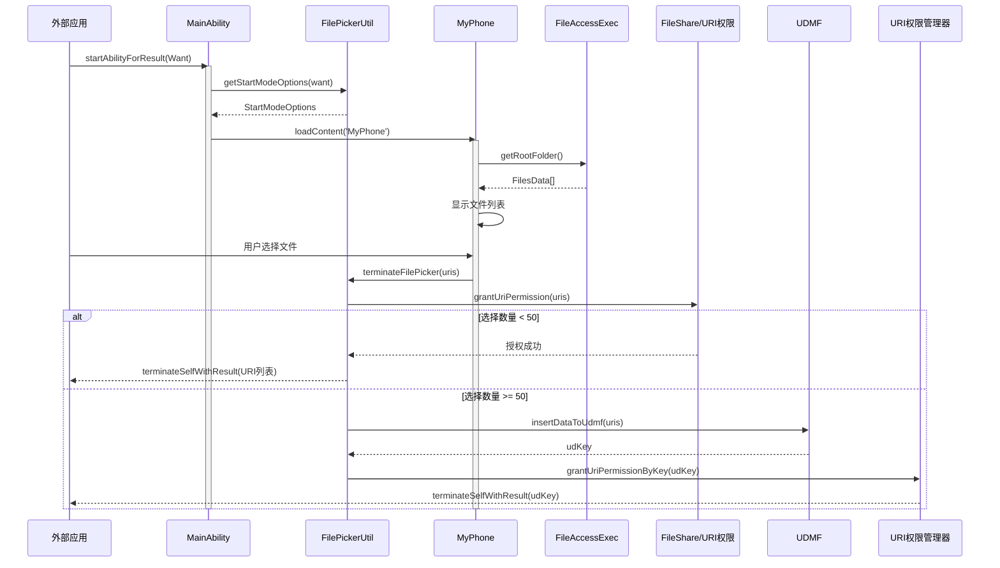
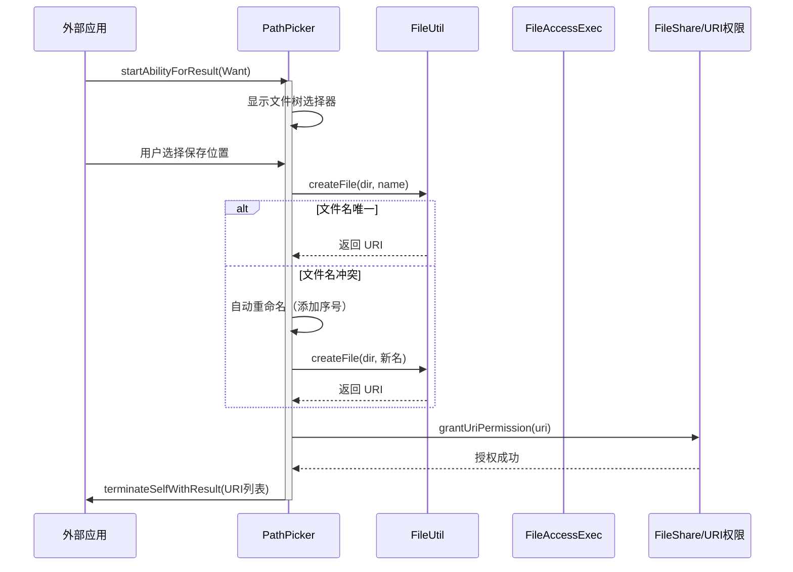
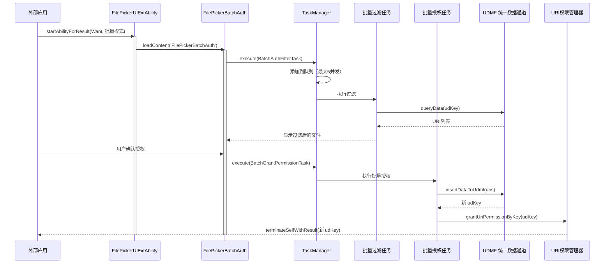
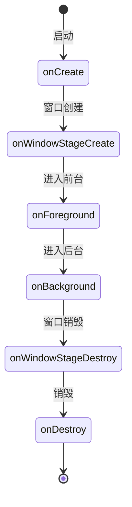
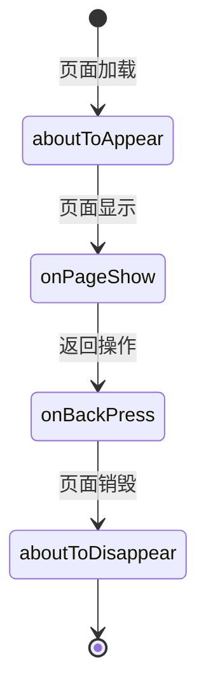
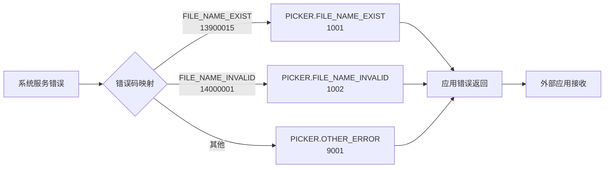
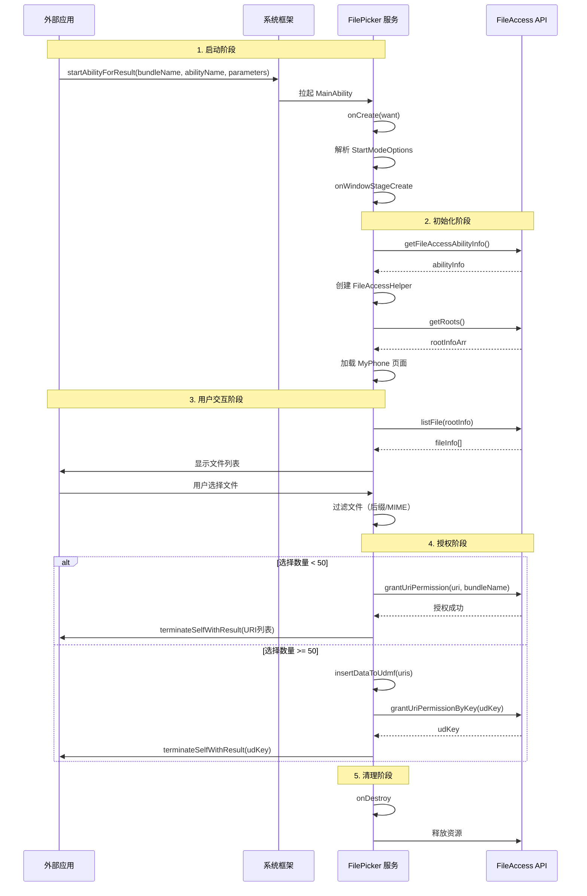

# 架构设计

## 目的

本文档说明 FilePicker 应用的架构设计，包括组件图、数据流、线程模型和关键时序。

## 适用范围

本文档适用于：
- 需要深入理解 FilePicker 架构的开发者
- 需要进行架构评审的技术人员

## 关键结论

1. **采用 Ability 框架**：UIAbility（独立窗口）+ UIExtensionAbility（模态弹窗）
2. **无传统 IPC**：通过 Want 对象进行通信，不使用 ServiceAbility/SystemAbility
3. **分层架构**：Ability 层 → Page 层 → Component 层 → Service 层
4. **任务池并发**：TaskManager 管理最大 5 个并发任务
5. **数据流向**：外部应用 → Want → FilePicker → URI 权限 → 返回结果

## 组件架构图

```mermaid
graph TB
    subgraph "外部应用"
        A1[第三方应用]
    end

    subgraph "FilePicker 应用"
        subgraph "Ability 层"
            A2[MainAbility<br/>UIAbility]
            A3[FilePickerUIExtAbility<br/>UIExtensionAbility]
            A4[AudioPickerUIExtensionAbility<br/>UIExtensionAbility]
        end

        subgraph "Page 层"
            P1[MyPhone<br/>文件选择]
            P2[PathPicker<br/>路径选择]
            P3[DownloadAuth<br/>下载授权]
            P4[FilePickerBatchAuth<br/>批量授权]
            P5[AudioPickerView<br/>音频选择]
        end

        subgraph "Component 层"
            C1[TopBar<br/>导航栏]
            C2[FilesList<br/>文件列表]
            C3[BreadCrumb<br/>面包屑]
            C4[Dialog<br/>对话框]
        end

        subgraph "Service 层"
            S1[FileAccessExec<br/>文件访问]
            S2[FilePickerUtil<br/>工具类]
            S3[TaskManager<br/>任务池]
            S4[AbilityCommonUtil<br/>权限管理]
        end
    end

    subgraph "系统服务"
        SYS1[FileAccess API]
        SYS2[PhotoAccessHelper]
        SYS3[UDMF 统一数据通道]
        SYS4[URI Permission Manager]
    end

    A1 -->|startAbilityForResult<br/>(Want) | A2
    A1 -->|startAbilityForResult<br/>(Want) | A3
    A1 -->|startAbilityForResult<br/>(Want) | A4

    A2 -->|loadContent| P1
    A2 -->|loadContent| P2
    A3 -->|loadContent| P1
    A3 -->|loadContent| P3
    A3 -->|loadContent| P4
    A4 -->|loadContent| P5

    P1 --> C1
    P1 --> C2
    P1 --> C3
    P2 --> C4

    P1 --> S1
    P2 --> S1
    P3 --> S2
    P4 --> S3
    P5 --> S2

    S1 --> SYS1
    S2 --> SYS2
    S3 --> SYS3
    S4 --> SYS4

    A2 -->|terminateSelfWithResult| A1
    A3 -->|terminateSelfWithResult| A1
    A4 -->|terminateSelfWithResult| A1
```

**证据**：
- Ability 层：`entry/src/main/ets/entryability/MainAbility.ets:28`
- Page 层：`entry/src/main/ets/pages/browser/storage/MyPhone.ets:45`
- Service 层：`entry/src/main/ets/base/utils/FileAccessExec.ets:35`

## 数据流

### 文件选择流程数据流



**证据**：
- Want 解析：`FilePickerUtil.ets:70-107`
- URI 授权：`FilePickerUtil.ets:204-228`
- 批量授权：`FilePickerUtil.ets:123-144`

### 文件保存流程数据流



**证据**：
- 文件保存：`PathPicker.ets:95-152`
- 文件重命名：`PathPicker.ets:186-224`

### 批量授权流程数据流



**证据**：
- 批量过滤：`FilePickerBatchAuth.ets:49-54`
- 批量授权任务：`BatchGrantPermissionTask.ets:21-33`
- 任务管理器：`TaskManager.ts:49-110`

## 线程模型

### UI 线程（主线程）

所有 UI 渲染在主线程执行：
- Ability 生命周期回调（onCreate、onDestroy、onWindowStageCreate）
- Page 生命周期回调（aboutToAppear、aboutToDisappear、onPageShow）
- UI 组件渲染和事件处理

**证据**：
- UIAbility 生命周期：`MainAbility.ets:32-100`
- UIExtensionAbility 生命周期：`FilePickerUIExtAbility.ets:37-70`

### 任务池线程（工作线程）

TaskManager 管理并发任务，使用 `@ohos.taskpool`：

| 配置项 | 值 | 证据 |
|--------|-----|-------|
| 最大并发任务数 | 5 | `TaskManager.ts:36` |
| 任务池名称映射 | HashMap | `TaskManager.ts:40` |
| 执行模式 | reject/waitToExecute/executeNow | `TaskManager.ts:96-109` |

**证据**：`TaskManager.ts:28-134`

### 任务类型

| 任务类 | 用途 | 并发限制 |
|--------|------|----------|
| BatchGrantUriPermissionTask | 批量 URI 授权 | 1（单线程） |
| BatchAuthFilterTask | 批量授权过滤 | 按默认并发数 |

**证据**：`TaskManager.ts:75-96`

## 资源生命周期

### Ability 生命周期



**MainAbility 证据**：`MainAbility.ets:32-100`
**FilePickerUIExtAbility 证据**：`FilePickerUIExtAbility.ets:37-70`

### Page 生命周期



**MyPhone 证据**：`MyPhone.ets:234-313`

### 资源释放

| 资源 | 释放时机 | 证据 |
|--------|----------|-------|
| FileAccessHelper | AbilityStage.onDestroy | `MainAbility.ets:54-55` |
| PhotoAccessHelper | AbilityStage.onDestroy | `MainAbility.ets:54-55` |
| Session | onSessionDestroy | `FilePickerUIExtAbility.ets:64-66` |

## 错误传播机制

### 错误码层次

```
应用层错误（ErrorCodeConst.PICKER）
    ↓
系统层错误（ErrorCodeConst.FILE_ACCESS）
    ↓
系统服务错误（FileAccess、PhotoAccessHelper）
```

**证据**：`ErrorCodeConst.ts:19-73`

### 错误处理流程



**证据**：`PathPicker.ets:64-79`

## 关键时序图

### 完整文件选择时序



**证据**：
- 启动流程：`MainAbility.ets:32-84`
- FileAccess 初始化：`AbilityCommonUtil.ts: getFileAccessHelper`
- 授权流程：`FilePickerUtil.ets:204-228`

## 相关跳转

- [概览](00_Overview.md) - 了解项目定位
- [对外 API](03_Public_API.md) - 学习调用方式
- [内部 API](04_Internal_API.md) - 了解模块接口
