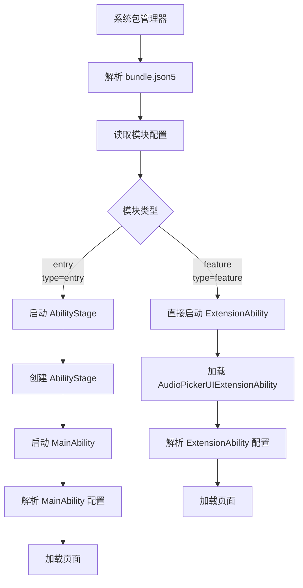

# 构建系统

## 目的

本文档说明 FilePicker 应用的构建系统，包括 Hvigor 配置、编译产物和运行时加载关系。

## 适用范围

本文档适用于：
- 需要编译 FilePicker 的开发者
- 需要理解构建流程的维护人员

## 关键结论

1. **使用 Hvigor 构建系统**：OpenHarmony 的官方构建工具，非 GN
2. **模块化构建**：entry 和 audiopicker 两个独立模块
3. **HAP 包产物**：每个模块生成独立的 .hap 文件
4. **系统签名**：预置应用使用固定签名证书

## 构建系统概述

### Hvigor 简介

Hvigor 是 OpenHarmony 的官方构建工具，基于 Gradle 生态：

| 特性 | 说明 | 证据 |
|------|------|-------|
| 插件架构 | 使用 `@ohos/hvigor-ohos-plugin` | `hvigorfile.js:18` |
| 模块化 | 支持多模块独立构建 | `build-profile.json5:27-52` |
| 签名集成 | 内置签名流程 | `build-profile.json5:12-24` |

**证据**：`hvigorfile.js:17-18`

### 构建配置层次

```
应用级配置
    ├── build-profile.json5        # 应用级构建配置
    ├── AppScope/app.json5        # 应用元数据（bundleName、版本）
    │
    └── 模块级配置
            ├── entry/hvigorfile.js            # entry 模块构建脚本
            ├── entry/src/main/module.json5     # entry 模块配置
            │
            └── audiopicker/hvigorfile.js      # audiopicker 模块构建脚本
                └── audiopicker/src/main/module.json5  # audiopicker 模块配置
```

## 应用级配置

### build-profile.json5

**路径**：`/Volumes/lexar/code/d/work/oh/applications/standard/filepicker/build-profile.json5`

**关键配置**：

```json
{
  "app": {
    "products": [
      {
        "name": "default",
        "compileSdkVersion": 23,
        "compatibleSdkVersion": 23,
        "runtimeOS": "OpenHarmony"
      }
    ],
    "signingConfigs": [
      {
        "name": "default",
        "material": {
          "storePassword": "********",
          "certpath": "./signature/default_*.cer",
          "keyAlias": "debugKey",
          "keyPassword": "********",
          "profile": "./signature/default_*.p7b",
          "storeFile": "./signature/default_*.p12",
          "signAlg": "SHA256withECDSA"
        }
      }
    ],
    "modules": [
      {
        "name": "entry",
        "srcPath": "./entry",
        "targets": [
          {
            "name": "default",
            "applyToProducts": ["default"]
          }
        ]
      },
      {
        "name": "audiopicker",
        "srcPath": "./audiopicker",
        "targets": [
          {
            "name": "default",
            "applyToProducts": ["default"]
          }
        ]
      }
    ]
  }
}
```

**关键参数**：

| 参数 | 值 | 说明 | 证据 |
|------|-----|------|-------|
| compileSdkVersion | 23 | 编译 SDK 版本 | `build-profile.json5:7-8` |
| compatibleSdkVersion | 23 | 兼容 SDK 版本 | `build-profile.json5:8` |
| runtimeOS | OpenHarmony | 运行时操作系统 | `build-profile.json5:9` |
| signAlg | SHA256withECDSA | 签名算法 | `build-profile.json5:21` |

### AppScope/app.json5

**路径**：`/Volumes/lexar/code/d/work/oh/applications/standard/filepicker/AppScope/app.json5`

**内容**：

```json
{
  "app": {
    "bundleName": "com.ohos.filepicker",
    "vendor": "example",
    "versionCode": 10100300,
    "versionName": "1.1.0.300",
    "icon": "$media:app_icon",
    "label": "$string:app_name"
  }
}
```

**关键参数**：

| 参数 | 值 | 说明 | 证据 |
|------|-----|------|-------|
| bundleName | com.ohos.filepicker | 应用包名（唯一标识） | `app.json5:3` |
| versionCode | 10100300 | 版本号 | `app.json5:5` |
| versionName | 1.1.0.300 | 版本名称 | `app.json5:6` |

## 模块级配置

### entry 模块

#### module.json5

**路径**：`/Volumes/lexar/code/d/work/oh/applications/standard/filepicker/entry/src/main/module.json5`

**关键配置**：

```json
{
  "module": {
    "name": "entry",
    "type": "entry",
    "srcEntry": "./ets/application/PickerAbilityStage.ets",
    "mainElement": "MainAbility",
    "deviceTypes": ["default", "tablet"],
    "pages": "$profile:main_pages",
    "abilities": [
      {
        "name": "MainAbility",
        "srcEntry": "./ets/entryability/MainAbility.ets",
        "exported": true,
        "skills": [
          {
            "actions": [
              "ohos.want.action.OPEN_FILE",
              "ohos.want.action.CREATE_FILE"
            ]
          }
        ]
      }
    ],
    "extensionAbilities": [
      {
        "name": "FilePickerUIExtAbility",
        "srcEntry": "./ets/entryability/FilePickerUIExtAbility.ets",
        "type": "sysPicker/filePicker",
        "exported": true
      }
    ],
    "requestPermissions": [
      {
        "name": "ohos.permission.MEDIA_LOCATION",
        "reason": "$string:permission_storage_reason_tips",
        "usedScene": {
          "when": "always",
          "abilities": ['MainAbility']
        }
      },
      {
        "name": "ohos.permission.READ_MEDIA",
        "reason": "$string:permission_storage_reason_tips",
        "usedScene": {
          "when": "always",
          "abilities": ['MainAbility']
        }
      },
      {
        "name": "ohos.permission.WRITE_MEDIA",
        "reason": "$string:permission_storage_reason_tips",
        "usedScene": {
          "when": "always",
          "abilities": ['MainAbility']
        }
      },
      {
        "name": "ohos.permission.FILE_ACCESS_MANAGER"
      },
      {
        "name": "ohos.permission.GET_BUNDLE_INFO_PRIVILEGED"
      },
      {
        "name": "ohos.permission.PROXY_AUTHORIZATION_URI"
      }
    ]
  }
}
```

**关键组件**：

| 组件类型 | 名称 | 类型 | 用途 | 证据 |
|----------|------|------|-------|
| Ability | MainAbility | UIAbility | 主入口，文件选择和保存 | `module.json5:17-33` |
| ExtensionAbility | FilePickerUIExtAbility | UIExtensionAbility | 系统 Picker，模态弹窗模式 | `module.json5:36-42` |
| AbilityStage | PickerAbilityStage | AbilityStage | 应用级初始化 | `module.json5:5` |

**证据**：`entry/src/main/module.json5:2-84`

#### hvigorfile.js

**路径**：`/Volumes/lexar/code/d/work/oh/applications/standard/filepicker/entry/hvigorfile.js`

**内容**：

```javascript
module.exports = require('@ohos/hvigor-ohos-plugin').appTasks
```

**说明**：使用标准的 Hvigor 应用插件。

**证据**：`entry/hvigorfile.js:18`

### audiopicker 模块

#### module.json5

**路径**：`/Volumes/lexar/code/d/work/oh/applications/standard/filepicker/audiopicker/src/main/module.json5`

**关键配置**：

```json
{
  "module": {
    "name": "audiopicker",
    "type": "feature",
    "mainElement": "AudiopickerAbility",
    "deviceTypes": ["default", "tablet"],
    "pages": "$profile:main_pages",
    "requestPermissions": [
      {
        "name": "ohos.permission.INTERNET"
      },
      {
        "name": "ohos.permission.GET_NETWORK_INFO"
      },
      {
        "name": "ohos.permission.GET_WIFI_INFO"
      },
      {
        "name": "ohos.permission.ACCESS_NOTIFICATION_POLICY"
      },
      {
        "name": "ohos.permission.WRITE_AUDIO",
        "reason": "$string:media_permission",
        "usedScene": {
          "abilities": ["audioPickerUIExtensionAbility"],
          "when": "always"
        }
      },
      {
        "name": "ohos.permission.READ_AUDIO",
        "reason": "$string:media_permission",
        "usedScene": {
          "abilities": ["audioPickerUIExtensionAbility"],
          "when": "always"
        }
      }
    ],
    "extensionAbilities": [
      {
        "name": "audiopicker",
        "type": "sysPicker/audioPicker",
        "exported": true
      }
    ]
  }
}
```

**关键组件**：

| 组件类型 | 名称 | 类型 | 用途 | 证据 |
|----------|------|------|-------|
| ExtensionAbility | audiopicker | UIExtensionAbility | 音频选择器 | `module.json5:49-56` |

**证据**：`audiopicker/src/main/module.json5:2-59`

## 编译产物

### HAP 包

| 模块 | 产物名称 | 说明 | 安装路径 |
|------|----------|------|----------|
| entry | entry-default-unsigned.hap / entry-default-signed.hap | 主模块 HAP 包 | /system/app/com.ohos.filepicker/ |
| audiopicker | audiopicker-default-unsigned.hap / audiopicker-default-signed.hap | 音频选择器 HAP 包 | /system/app/com.ohos.filepicker/ |

**产物特征**：
- 格式：HAP（HarmonyOS Ability Package）
- 内容：ArkTS 代码、资源文件、配置文件
- 签名：使用 ECDSA 算法，SHA256

**证据**：`build-profile.json5:27-52`

### 安装后路径

```
/system/app/com.ohos.filepicker/
├── entry/                     # entry 模块安装路径
│   ├── ets/                  # ArkTS 字节码
│   ├── resources/             # 资源文件
│   └── module.json          # 模块配置
└── audiopicker/              # audiopicker 模块安装路径
    ├── ets/                  # ArkTS 字节码
    ├── resources/             # 资源文件
    └── module.json          # 模块配置
```

**证据**：OpenHarmony 应用安装规范

## 运行时加载关系

### Ability 启动流程



**证据**：
- AbilityStage 入口：`entry/src/main/module.json5:5`
- ExtensionAbility 入口：`audiopicker/src/main/module.json5:49`

### 模块依赖

| 模块 | 依赖的系统能力 | 证据 |
|------|--------------|-------|
| entry | UIAbility, UIExtensionAbility, FileAccess, PhotoAccessHelper, UDMF | `module.json5:17-42` |
| audiopicker | UIExtensionAbility, 网络、音频 | `module.json5:49-56` |

**说明**：entry 和 audiopicker 是两个独立的 HAP 包，没有相互依赖。

## 构建命令

### 本地构建

```bash
# 编译所有模块
hvigorw --mode module -p product=default assembleHap

# 编译 entry 模块
hvigorw --mode module -p product=default assembleHap -m entry

# 编译 audiopicker 模块
hvigorw --mode module -p product=default assembleHap -m audiopicker

# 清理构建产物
hvigorw clean
```

### 签名流程

签名已在 `build-profile.json5` 中配置：

```bash
# Hvigor 自动执行以下步骤
1. 编译生成 .hap 文件
2. 使用签名证书签名
3. 输出 signed.hap 文件
```

**签名文件位置**：
- 证书：`signature/default_applications_filepicker_*.cer`
- 配置文件：`signature/default_applications_filepicker_*.p7b`
- 密钥库：`signature/default_applications_filepicker_*.p12`

**证据**：`build-profile.json5:15-24`

## 相关跳转

- [概览](00_Overview.md) - 了解项目定位
- [目录结构](01_Directory_Structure.md) - 理解代码组织
