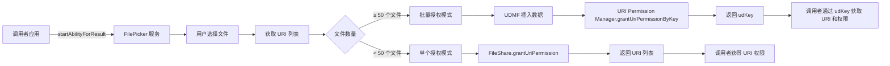

# 权限机制

## 目的

本文档说明 FilePicker 应用的权限机制，包括权限声明、鉴权流程和 URI 授权机制。

## 适用范围

本文档适用于：
- 需要理解权限模型的开发者
- 需要审计权限使用的安全人员

## 关键结论

1. **预置应用特权**：FilePicker 系统应用拥有特权权限（MEDIA_LOCATION、FILE_ACCESS_MANAGER 等）
2. **自动 URI 授权**：返回给调用者的 URI 自动授予读/写权限
3. **批量授权优化**：大量文件（>50）使用 UDMF 统一数据通道
4. **权限持久化**：支持持久化 URI 权限（跨重启有效）

## 权限声明

### entry 模块权限

**路径**：`entry/src/main/module.json5:44-82`

| 权限名称 | 类型 | 用途 | 使用场景 | 证据 |
|----------|------|------|----------|-------|
| ohos.permission.MEDIA_LOCATION | 危险 | 媒体库位置访问 | MainAbility | `module.json5:47-53` |
| ohos.permission.READ_MEDIA | 危险 | 读取媒体文件 | MainAbility | `module.json5:55-61` |
| ohos.permission.WRITE_MEDIA | 危险 | 写入媒体文件 | MainAbility | `module.json5:63-69` |
| ohos.permission.FILE_ACCESS_MANAGER | 系统 | 文件访问管理器 | 全局 | `module.json5:72-73` |
| ohos.permission.GET_BUNDLE_INFO_PRIVILEGED | 特权 | 获取包信息（特权） | 全局 | `module.json5:75-77` |
| ohos.permission.PROXY_AUTHORIZATION_URI | 系统 | URI 代理授权 | 全局 | `module.json5:79-81` |

### audiopicker 模块权限

**路径**：`audiopicker/src/main/module.json5:14-46`

| 权限名称 | 类型 | 用途 | 使用场景 | 证据 |
|----------|------|------|----------|-------|
| ohos.permission.INTERNET | 正常 | 网络访问 | 全局 | `module.json5:16-17` |
| ohos.permission.GET_NETWORK_INFO | 正常 | 获取网络信息 | 全局 | `module.json5:19-20` |
| ohos.permission.GET_WIFI_INFO | 正常 | 获取 WiFi 信息 | 全局 | `module.json5:22-23` |
| ohos.permission.ACCESS_NOTIFICATION_POLICY | 正常 | 访问通知策略 | 全局 | `module.json5:25-26` |
| ohos.permission.WRITE_AUDIO | 危险 | 写入音频文件 | audioPickerUIExtensionAbility | `module.json5:28-36` |
| ohos.permission.READ_AUDIO | 危险 | 读取音频文件 | audioPickerUIExtensionAbility | `module.json5:38-46` |

## 权限使用分析

### 媒体库权限

**权限组**：`MEDIA_LOCATION`, `READ_MEDIA`, `WRITE_MEDIA`

**用途**：
- 访问设备的媒体库（照片、视频、音频）
- 获取媒体文件的缩略图和元数据
- 删除/重命名媒体文件

**代码证据**：

```typescript
// /Volumes/lexar/code/d/work/oh/applications/standard/filepicker/entry/src/main/ets/base/utils/AbilityCommonUtil.ts
import { photoAccessHelper } from '@kit.MediaLibraryKit';

export function getPhotoManageHelper(): photoAccessHelper.PhotoAccessHelper {
    if (!photoManageHelper) {
        photoManageHelper = photoAccessHelper.getPhotoAccessHelper(globalThis.abilityContext);
    }
    return photoManageHelper;
}
```

**使用场景**：
- `FileAssetModel.ets` - 获取媒体文件信息
- `MyPhone.ets:177` - 获取视频/音频时长

### 文件访问权限

**权限组**：`FILE_ACCESS_MANAGER`

**用途**：
- 访问设备的文件系统（非媒体库）
- 创建/删除/重命名文件和文件夹
- 获取根目录和文件列表

**代码证据**：

```typescript
// /Volumes/lexar/code/d/work/oh/applications/standard/filepicker/entry/src/main/ets/base/utils/AbilityCommonUtil.ts
import fileAccess from '@ohos.file.fileAccess';

export function createFileAccessHelper(): Promise<void> {
    return new Promise(async (resolve, reject) => {
        let wants = await fileAccess.getFileAccessAbilityInfo();
        globalThis.fileAcsHelper = fileAccess.createFileAccessHelper(
            globalThis.abilityContext, wants
        );
        const rootIterator: fileAccess.RootIterator =
            await globalThis.fileAcsHelper.getRoots();
        // ...
    });
}
```

**使用场景**：
- `FileAccessExec.ets:38-73` - 创建文件/文件夹
- `FileAccessExec.ets:90-130` - 获取文件列表

### 特权权限

**权限组**：`GET_BUNDLE_INFO_PRIVILEGED`, `PROXY_AUTHORIZATION_URI`

**用途**：

| 权限 | 用途 | 证据 |
|--------|------|-------|
| GET_BUNDLE_INFO_PRIVILEGED | 获取调用者的包信息（图标、名称） | `FilePickerUIExtAbility.ets:74-82` |
| PROXY_AUTHORIZATION_URI | 代理 URI 权限授权 | `FilePickerUtil.ets:138` |

**代码证据**：

```typescript
// /Volumes/lexar/code/d/work/oh/applications/standard/filepicker/entry/src/main/ets/entryability/FilePickerUIExtAbility.ets
import bundleResourceManager from '@ohos.bundle.bundleResourceManager';

private getAppResourceInfo(bundleName: string, storage: LocalStorage): void {
    const bundleFlags = bundleResourceManager.ResourceFlag.GET_RESOURCE_INFO_ALL;
    const resourceInfo = bundleResourceManager.getBundleResourceInfo(bundleName, bundleFlags);
    storage.setOrCreate<string>('appName', resourceInfo.label);
    storage.setOrCreate<string>('appIcon', resourceInfo.icon);
}
```

## URI 授权机制

### 授权流程

FilePicker 为调用者应用授权 URI 访问权限：



### 单个授权模式

**实现位置**：`AbilityCommonUtil.ts:grantUriPermission`

**代码证据**：

```typescript
// /Volumes/lexar/code/d/work/oh/applications/standard/filepicker/entry/src/main/ets/base/utils/AbilityCommonUtil.ts
export function grantUriPermission(uriList: Array<string>, bundleName: string): Promise<boolean> {
    return new Promise(async (resolve, reject) => {
        for (let uri of uriList) {
            try {
                await FileShare.grantUriPermission(
                    uri,
                    bundleName,
                    wantConstant.Flags.FLAG_AUTH_READ_URI_PERMISSION |
                    wantConstant.Flags.FLAG_AUTH_WRITE_URI_PERMISSION
                );
            } catch (error) {
                resolve(false);
                return;
            }
        }
        resolve(true);
    });
}
```

**权限标志**：

| 标志 | 值 | 说明 | 证据 |
|------|-----|------|-------|
| FLAG_AUTH_READ_URI_PERMISSION | 0x01 | 读权限 | `FilePickerUtil.ets:135` |
| FLAG_AUTH_WRITE_URI_PERMISSION | 0x02 | 写权限 | `FilePickerUtil.ets:136` |
| FLAG_AUTH_PERSISTABLE_URI_PERMISSION | 0x04 | 持久化权限 | `FilePickerUtil.ets:137` |

### 批量授权模式

**实现位置**：`FilePickerUtil.ets:batchGrantUriPermission`

**触发条件**：选择文件数量 ≥ 50

**代码证据**：

```typescript
// /Volumes/lexar/code/d/work/oh/applications/standard/filepicker/entry/src/main/ets/base/utils/FilePickerUtil.ts
export async function batchGrantUriPermission(fileUriList: string[], callerId: number): Promise<string> {
    // 1. 将 URI 列表插入 UDMF
    let udKey: string = await FilePickerUtil.insertDataToUdmf(fileUriList);

    // 2. 设置权限标志（读 + 写 + 持久化）
    let flag: wantConstant.Flags = wantConstant.Flags.FLAG_AUTH_READ_URI_PERMISSION |
        wantConstant.Flags.FLAG_AUTH_WRITE_URI_PERMISSION |
        wantConstant.Flags.FLAG_AUTH_PERSISTABLE_URI_PERMISSION;

    // 3. 通过 udKey 批量授权
    await uriPermissionManager.grantUriPermissionByKey(udKey, flag, callerId);

    return udKey;
}

// UDMF 数据插入
export async function insertDataToUdmf(fileUris: string[]): Promise<string> {
    let unifiedData: unifiedDataChannel.UnifiedData = undefined;
    for (let i = 0; i < fileUris.length; i++) {
        let uDFileUri: uniformDataStruct.FileUri = {
            uniformDataType: uniformTypeDescriptor.UniformDataType.FILE_URI,
            oriUri: fileUris[i],
            fileType: uniformTypeDescriptor.UniformDataType.FILE
        }
        let curRecord = new unifiedDataChannel.UnifiedRecord(
            uniformTypeDescriptor.UniformDataType.FILE_URI, uDFileUri);
        if (!unifiedData) {
            unifiedData = new unifiedDataChannel.UnifiedData(curRecord);
        } else {
            unifiedData.addRecord(curRecord);
        }
    }
    const udKey = await unifiedDataChannel.insertData(
        { intention: unifiedDataChannel.Intention.PICKER }, unifiedData);
    return udKey ?? '';
}
```

**批量授权任务**：

```typescript
// /Volumes/lexar/code/d/work/oh/applications/standard/filepicker/entry/src/main/ets/taskpool/task/BatchGrantPermissionTask.ets
@Concurrent
async function startTask(fileUris: string[], callerId: number) {
    let udKey: string = await FilePickerUtil.batchGrantUriPermission(fileUris, callerId);
    TaskpoolUtils.sendData(udKey, TaskStatus.END);
}
```

**证据**：`BatchGrantPermissionTask.ets:21-33`

## 鉴权流程

### 调用者信息获取

FilePicker 通过 Want 参数获取调用者信息：

| 参数名 | 来源 | 用途 | 证据 |
|--------|------|------|-------|
| ohos.aafwk.param.callerAbilityName | Want.parameters | 调用者 Ability 名称 | `FilePickerUtil.ets:77` |
| ohos.aafwk.param.callerBundleName | Want.parameters | 调用者 Bundle 名称 | `FilePickerUtil.ets:78` |
| ohos.aafwk.param.callerUid | Want.parameters | 调用者 UID | `FilePickerUtil.ets:79` |
| CALLER_TOKEN | Want.parameters | 访问令牌（用于权限） | `FilePickerUtil.ets:98` |

**证据**：`FilePickerUtil.ets:70-107`

### Bundle 信息获取

**实现位置**：`FilePickerUIExtAbility.ets:getAppResourceInfo`

**代码证据**：

```typescript
// /Volumes/lexar/code/d/work/oh/applications/standard/filepicker/entry/src/main/ets/entryability/FilePickerUIExtAbility.ets
import bundleResourceManager from '@ohos.bundle.bundleResourceManager';

private getAppResourceInfo(bundleName: string, storage: LocalStorage): void {
    Logger.i(TAG, `getAppResourceInfo start`)
    const bundleFlags = bundleResourceManager.ResourceFlag.GET_RESOURCE_INFO_ALL;
    try {
        const resourceInfo = bundleResourceManager.getBundleResourceInfo(bundleName, bundleFlags);
        storage.setOrCreate<string>('appName', resourceInfo.label);
        storage.setOrCreate<string>('appIcon', resourceInfo.icon);
    } catch (err) {
        const message = (err as BusinessError).message;
        Logger.e(TAG, 'getBundleResourceInfo failed: %{public}s' + message);
    }
}
```

**用途**：
- 显示调用者应用图标（提升用户体验）
- 显示调用者应用名称（提升用户体验）

**证据**：`FilePickerUIExtAbility.ets:72-83`

## 下载授权特殊流程

**实现位置**：`DownloadAuth.ets`

**代码证据**：

```typescript
// /Volumes/lexar/code/d/work/oh/applications/standard/filepicker/entry/src/main/ets/pages/DownloadAuth.ets
async downloadDialogConfirm(): Promise<void> {
    const bundleName: string = this.startModeOptions.callerBundleName;
    this.downloadNewUri = VirtualUri.DOWNLOAD + '/' + bundleName;

    // 检查目录是否存在
    let isExist: boolean = FsUtil.accessSync(DOWNLOAD_PATH + '/' + bundleName);
    if (!isExist) {
        // 创建目录
        this.downloadNewUri = FileUtil.createFolderByFs(VirtualUri.DOWNLOAD, bundleName);
    }

    // 授权 URI 权限
    AbilityCommonUtil.grantUriPermission([this.downloadNewUri], bundleName);

    // 返回结果
    let abilityResult: ability.AbilityResult = {
        resultCode: (this.downloadNewUri === undefined) ? -1 : 0,
        want: {
            parameters: {
                'downloadNewUri': this.downloadNewUri
            }
        }
    };
    this.session.terminateSelfWithResult(abilityResult, (error) => {
        Logger.i(TAG, 'terminateSelfWithResult is called = ' + error?.code);
    });
}
```

**证据**：`DownloadAuth.ets:73-100`

## 权限安全检查

### 权限最小化原则

FilePicker 仅在必要时使用特权权限：

| 权限 | 使用必要性 | 使用位置 | 证据 |
|--------|----------|----------|-------|
| FILE_ACCESS_MANAGER | 必需 | 文件系统访问核心功能 | `module.json5:72-73` |
| GET_BUNDLE_INFO_PRIVILEGED | 必需 | 显示调用者应用信息 | `module.json5:75-77` |
| PROXY_AUTHORIZATION_URI | 必需 | URI 代理授权 | `module.json5:79-81` |
| MEDIA_LOCATION | 必需 | 媒体库访问 | `module.json5:47-53` |
| READ_MEDIA | 必需 | 媒体文件读取 | `module.json5:55-61` |
| WRITE_MEDIA | 必需 | 媒体文件写入 | `module.json5:63-69` |

### 权限范围限制

**读权限**：仅授权 URI 读权限
**写权限**：仅授权 URI 写权限
**持久化权限**：需要显式设置 FLAG_AUTH_PERSISTABLE_URI_PERMISSION

**证据**：`FilePickerUtil.ets:135-137`

## 相关跳转

- [概览](00_Overview.md) - 了解项目定位
- [架构设计](02_Architecture.md) - 理解数据流
- [对外 API](03_Public_API.md) - 学习调用方式
