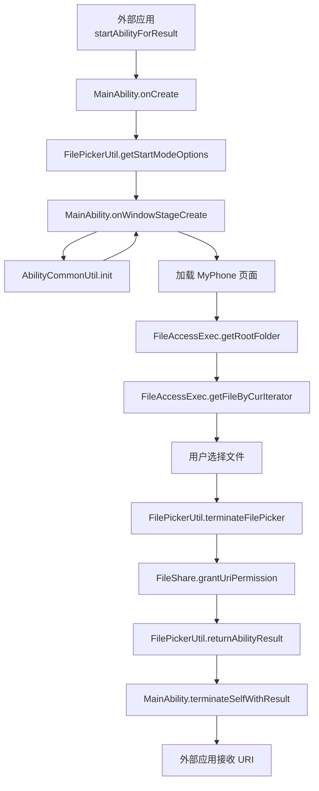
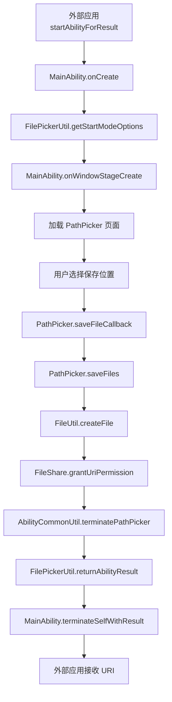
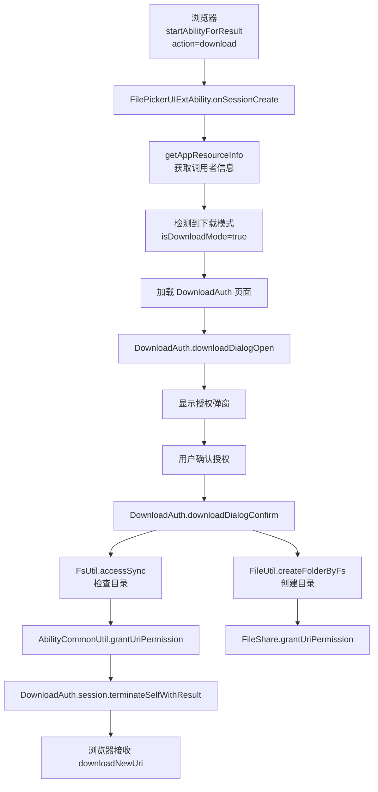
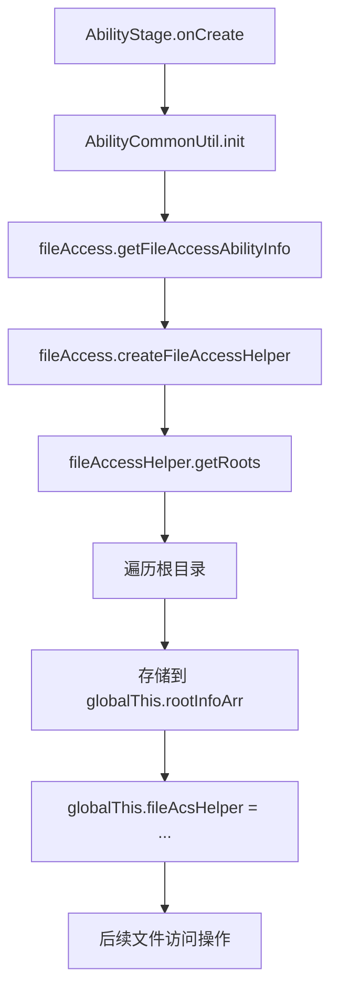

# 关键调用链

## 目的

本文档列出 FilePicker 应用的关键调用链，帮助理解入口到核心逻辑的执行路径。

## 适用范围

本文档适用于：
- 需要理解数据流的开发者
- 需要进行性能优化的开发者

## 调用链 1：文件选择完整流程

### 流程描述

外部应用通过 `startAbilityForResult` 拉起 FilePicker，用户选择文件后返回 URI 列表。

### 调用链图



### 详细步骤

| 步骤 | 函数 | 文件路径 | 行号 | 说明 |
|------|------|----------|------|-------|
| 1 | onCreate | `MainAbility.ets` | 32-51 | 创建 Ability，初始化 LocalStorage |
| 2 | getStartModeOptions | `FilePickerUtil.ets` | 70-107 | 解析 Want 参数为 StartModeOptions |
| 3 | onWindowStageCreate | `MainAbility.ets` | 58-84 | 创建窗口，加载页面 |
| 4 | init | `AbilityCommonUtil.ts` | TODO | 初始化 FileAccessHelper 和 PhotoAccessHelper |
| 5 | loadContent | `MainAbility.ets` | 65 | 加载 MyPhone.ets 页面 |
| 6 | getRootFolder | `FileAccessExec.ets` | 166-187 | 获取根目录文件列表 |
| 7 | getFileByCurIterator | `FileAccessExec.ets` | 90-130 | 获取当前目录文件列表 |
| 8 | 用户交互 | `MyPhone.ets` | 45-374 | 用户浏览和选择文件 |
| 9 | terminateFilePicker | `FilePickerUtil.ets` | 204-228 | 处理文件选择，准备返回结果 |
| 10 | grantUriPermission | `AbilityCommonUtil.ts` | TODO | 授权 URI 权限给调用者 |
| 11 | returnAbilityResult | `FilePickerUtil.ets` | 47-68 | 构造返回 Want |
| 12 | terminateSelfWithResult | `FilePickerUtil.ets` | 56 | 终止 Ability 并返回结果 |

## 调用链 2：文件保存完整流程

### 流程描述

外部应用通过 `startAbilityForResult` 拉起 FilePicker 保存模式，用户选择保存位置后创建文件并返回 URI。

### 调用链图



### 详细步骤

| 步骤 | 函数 | 文件路径 | 行号 | 说明 |
|------|------|----------|------|-------|
| 1 | onCreate | `MainAbility.ets` | 32-51 | 创建 Ability |
| 2 | getStartModeOptions | `FilePickerUtil.ets` | 70-107 | 解析 save 模式参数 |
| 3 | onWindowStageCreate | `MainAbility.ets` | 58-84 | 加载 PathPicker 页面 |
| 4 | 用户交互 | `PathPicker.ets` | 39-262 | 用户浏览目录树并选择保存位置 |
| 5 | saveFileCallback | `PathPicker.ets` | 47-89 | 处理用户选择结果 |
| 6 | saveFiles | `PathPicker.ets` | 95-152 | 创建文件列表 |
| 7 | createFile | `FileUtil.ets` | TODO | 调用 FileAccess API 创建文件 |
| 8 | grantUriPermission | `PathPicker.ets` | 82 | 授权新建文件的 URI |
| 9 | terminatePathPicker | `AbilityCommonUtil.ts` | TODO | 终止 PathPicker |
| 10 | returnAbilityResult | `FilePickerUtil.ets` | 47-68 | 构造返回 Want |
| 11 | terminateSelfWithResult | `MainAbility.ets` | 56 | 返回结果 |

## 调用链 3：批量授权完整流程

### 流程描述

FilePicker 检测到批量授权模式（选择文件 ≥50 个），通过任务池并发处理批量 URI 授权。

### 调用链图

```mermaid
graph TD
    A[外部应用<br/>startAbilityForResult<br/>批量模式]
    B[FilePickerUIExtAbility.onSessionCreate]
    C[FilePickerUtil.getStartModeOptions]
    D[检测到批量模式<br/>isBatchAuthMode=true]
    E[加载 FilePickerBatchAuth 页面]
    F[FilePickerBatchAuth.startFilterUri]
    G[TaskManager.execute<br/>BatchAuthFilterTask]
    H[BatchAuthFilterTask@Concurrent]
    I[FilePickerUtil.insertDataToUdmf]
    J[UDMF.insertData]
    K[UDMF.queryData]
    L[显示过滤后的文件]
    M[用户确认授权]
    N[TaskManager.execute<br/>BatchGrantUriPermissionTask]
    O[BatchGrantUriPermissionTask@Concurrent]
    P[uriPermissionManager.grantUriPermissionByKey]
    Q[FilePickerUtil.returnAbilityResult]
    R[session.terminateSelfWithResult]
    S[外部应用接收 udKey]

    A --> B
    B --> C
    C --> D
    D --> E
    E --> F
    F --> G
    G --> H
    H --> I
    I --> J
    J --> K
    K --> L
    L --> M
    M --> N
    N --> O
    O --> P
    P --> Q
    Q --> R
    R --> S
```

### 详细步骤

| 步骤 | 函数 | 文件路径 | 行号 | 说明 |
|------|------|----------|------|-------|
| 1 | onSessionCreate | `FilePickerUIExtAbility.ets` | 41-62 | 创建 UIExtension 会话 |
| 2 | getStartModeOptions | `FilePickerUtil.ets` | 70-107 | 解析批量授权参数 |
| 3 | 检测批量模式 | `FilePickerUtil.ets` | 85-91 | 识别 isBatchAuthMode=true |
| 4 | loadContent | `FilePickerUIExtAbility.ets` | 132-133 | 加载 FilePickerBatchAuth 页面 |
| 5 | startFilterUri | `FilePickerBatchAuth.ets` | 49-54 | 启动文件过滤任务 |
| 6 | execute | `TaskManager.ts` | 75-96 | 提交任务到任务池 |
| 7 | @Concurrent startTask | `BatchAuthFilterTask.ets` | 30-32 | 在工作线程执行过滤 |
| 8 | insertDataToUdmf | `FilePickerUtil.ets` | 146-179 | 插入 URI 到 UDMF |
| 9 | queryData | `FilePickerUtil.ets` | 181-196 | 从 UDMF 查询 URI 列表 |
| 10 | setData | `FilePickerBatchAuth.ets` | 56-64 | 更新文件列表 UI |
| 11 | 用户确认 | `FilePickerBatchAuth.ets` | - | 用户选择要授权的文件 |
| 12 | execute | `TaskManager.ts` | 75-96 | 提交批量授权任务 |
| 13 | @Concurrent startTask | `BatchGrantPermissionTask.ets` | 30-32 | 并发执行批量授权 |
| 14 | batchGrantUriPermission | `FilePickerUtil.ets` | 123-144 | 通过 UDMF 批量授权 |
| 15 | returnAbilityResult | `FilePickerUtil.ets` | 47-68 | 构造返回 Want |
| 16 | terminateSelfWithResult | `FilePickerUtil.ets` | 64 | 返回 udKey |

## 调用链 4：下载授权完整流程

### 流程描述

浏览器下载文件时拉起 FilePicker 下载授权模式，FilePicker 在 Download 目录创建应用子目录并授权。

### 调用链图



### 详细步骤

| 步骤 | 函数 | 文件路径 | 行号 | 说明 |
|------|------|----------|------|-------|
| 1 | onSessionCreate | `FilePickerUIExtAbility.ets` | 41-62 | 创建 UIExtension 会话 |
| 2 | getAppResourceInfo | `FilePickerUIExtAbility.ets` | 72-83 | 获取调用者图标和名称 |
| 3 | 检测下载模式 | `FilePickerUIExtAbility.ets` | 46-48 | 识别 isDownloadMode=true |
| 4 | loadContent | `FilePickerUIExtAbility.ets` | 107 | 加载 DownloadAuth 页面 |
| 5 | downloadDialogOpen | `DownloadAuth.ets` | 59-71 | 打开授权弹窗 |
| 6 | 用户确认 | `DownloadAuth.ets` | - | 用户点击确认按钮 |
| 7 | downloadDialogConfirm | `DownloadAuth.ets` | 73-100 | 处理授权逻辑 |
| 8 | accessSync | `DownloadAuth.ets` | 77 | 检查目录是否存在 |
| 9 | createFolderByFs | `FileUtil.ets` | TODO | 创建应用子目录 |
| 10 | grantUriPermission | `AbilityCommonUtil.ts` | TODO | 授权 URI 权限 |
| 11 | terminateSelfWithResult | `DownloadAuth.ets` | 97 | 返回下载 URI |

## 调用链 5：FileAccess 初始化流程

### 流程描述

Ability 初始化时，FileAccessHelper 创建并获取根目录列表。

### 调用链图



### 详细步骤

| 步骤 | 函数 | 文件路径 | 行号 | 说明 |
|------|------|----------|------|-------|
| 1 | onCreate | `PickerAbilityStage.ets` | 22-24 | AbilityStage 创建 |
| 2 | init | `AbilityCommonUtil.ts` | TODO | 初始化 FileAccess |
| 3 | getFileAccessAbilityInfo | `AbilityCommonUtil.ts` | TODO | 获取 FileAccess Ability 信息 |
| 4 | createFileAccessHelper | `AbilityCommonUtil.ts` | TODO | 创建 FileAccessHelper 实例 |
| 5 | getRoots | `AbilityCommonUtil.ts` | TODO | 获取根目录迭代器 |
| 6 | 遍历根目录 | `AbilityCommonUtil.ts` | TODO | 提取所有 RootInfo |
| 7 | 存储 rootInfoArr | `AbilityCommonUtil.ts` | TODO | 存储到全局变量 |

## 相关跳转

- [架构设计](02_Architecture.md) - 查看详细架构
- [对外 API](03_Public_API.md) - 了解调用方式
