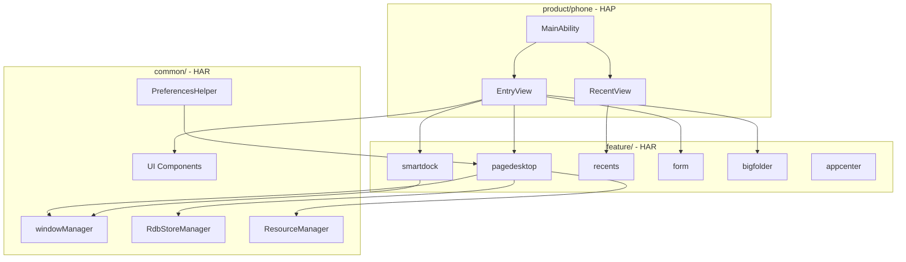
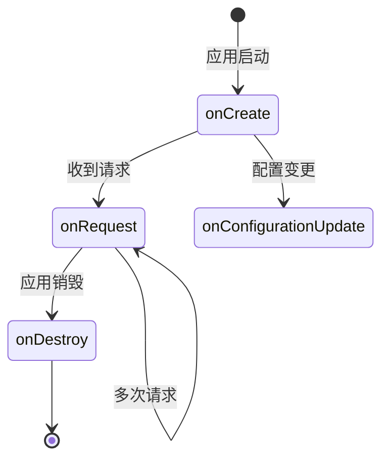

# 架构说明

> 组件图、数据流与线程模型

## 整体架构

### 三层架构图



### 数据流向

```
┌─────────────┐     ┌─────────────┐     ┌─────────────┐
│   用户输入   │ --> │   MainAbility │ --> │  窗口管理   │
└─────────────┘     └─────────────┘     └─────────────┘
                           │                     │
                           ▼                     ▼
                     ┌─────────────┐     ┌─────────────┐
                     │  模块加载器  │     │  页面渲染   │
                     │  (PreLoader)│     └─────────────┘
                     └──────┬──────┘
                            │
         ┌──────────────────┼──────────────────┐
         ▼                  ▼                  ▼
   ┌──────────┐      ┌──────────┐      ┌──────────┐
   │ pagedesktop│    │ recents │      │ smartdock │
   └────┬─────┘      └────┬─────┘      └────┬─────┘
        │                 │                 │
        └─────────────────┼─────────────────┘
                          ▼
                   ┌──────────────┐
                   │  数据存储    │
                   │ Rdb/Preferences │
                   └──────────────┘
```

## MainAbility 生命周期

### 状态转换图



### 核心流程

```typescript
// MainAbility.ts 关键流程
onCreate(want: Want) {
    // 1. 初始化 Launcher context
    globalThis.desktopContext = this.context;
    
    // 2. 初始化数据库
    RdbStoreManager.getInstance().initRdbConfig();
    RdbStoreManager.getInstance().createTable();
    
    // 3. 创建桌面窗口
    windowManager.createWindow(...);
    
    // 4. 初始化首选项
    PreferencesHelper.getInstance().initPreference(this.context);
    
    // 5. 启动各功能模块
    this.startGestureNavigation();
    windowManager.registerWindowEvent();
}
```

## 窗口管理

### 窗口类型

| 窗口名称 | 用途 | 层级 |
|----------|------|------|
| `DESKTOP_WINDOW_NAME` | 桌面主窗口 | `DESKTOP_RANK` |
| `RECENT_WINDOW_NAME` | 最近任务窗口 | `RECENT_RANK` |
| 自定义窗口 | 各功能模块子窗口 | 动态 |

### 窗口事件处理

```typescript
// 注册窗口事件
window.on('windowEvent', (stageEventType) => {
    if (stageEventType === WindowEventType.WINDOW_ACTIVE) {
        // 桌面获焦
        launcherAbilityManager.checkBundleMonitor();
        localEventManager.sendLocalEventSticky(
            EventConstants.EVENT_REQUEST_FORM_ITEM_VISIBLE, 
            null
        );
    }
});
```

## 模块加载机制

### PreLoader 模式

各 feature 模块通过 PreLoader 进行懒加载：

| PreLoader | 加载模块 | 时机 |
|-----------|----------|------|
| `pageDesktopPreLoader` | 工作区 | 桌面初始化 |
| `formPreLoader` | 卡片管理 | 需要显示卡片 |
| `smartDockPreLoader` | Dock 栏 | 桌面初始化 |
| `appCenterPreLoader` | 应用中心 | 点击入口 |
| `bigFolderPreLoader` | 智能文件夹 | 打开文件夹 |
| `formPreLoader` | 卡片服务 | 收到卡片发布请求 |

### 加载示例

```typescript
// feature/pagedesktop/index.ts
export { pageDesktopPreLoader } from './src/main/ets/default/common/PageDesktopPreLoader';
export { PageDesktopViewModel } from './src/main/ets/default/viewmodel/PageDesktopViewModel';

// MainAbility 中使用
import { pageDesktopPreLoader } from '@ohos/pagedesktop';
pageDesktopPreLoader.preload();
```

## 线程模型

### 主线程任务

ArkTS 应用运行在主线程（UI 线程）：

```
┌─────────────────────────────────────────┐
│              Main Thread                 │
│  ┌───────────────────────────────────┐  │
│  │  UI Rendering (ArkUI)             │  │
│  ├───────────────────────────────────┤  │
│  │  Event Handling                   │  │
│  ├───────────────────────────────────┤  │
│  │  Ability Lifecycle (onCreate...)  │  │
│  ├───────────────────────────────────┤  │
│  │  ViewModel Updates                │  │
│  └───────────────────────────────────┘  │
│              ▲                  ▲        │
│              │                  │        │
│         System Services     Async I/O    │
└─────────────────────────────────────────┘
```

### 异步操作

| 操作 | 线程 | 说明 |
|------|------|------|
| `window.createWindow` | 主线程 | 创建窗口 |
| `RdbStore` | 主线程（内部异步） | 数据库操作 |
| `Preferences` | 主线程（内部异步） | 首选项操作 |
| `startAbility` | 主线程 | 启动其他 Ability |

## 事件通信

### 本地事件管理器

```typescript
// 发送粘性事件
localEventManager.sendLocalEventSticky(
    EventConstants.EVENT_REQUEST_FORM_ITEM_VISIBLE, 
    null
);

// 注册事件监听（其他模块）
localEventManager.on(
    EventConstants.EVENT_REQUEST_FORM_ITEM_VISIBLE,
    (data) => {
        // 处理事件
    }
);
```

### 事件常量

| 事件名 | 用途 |
|--------|------|
| `EVENT_REQUEST_FORM_ITEM_VISIBLE` | 请求卡片可见 |
| `EVENT_OPEN_FOLDER_TO_CLOSE` | 关闭文件夹 |
| 其他事件 | 见 `EventConstants.ts` |

## 样式配置层级

### 配置优先级

```
高 ──────────────────────────────────────── 低
┌─────────────────────────────────────────┐
│ Product Level (最高优先级)               │
│   product/phone/src/main/resources/     │
├─────────────────────────────────────────┤
│ Feature Level                           │
│   feature/*/src/main/resources/         │
├─────────────────────────────────────────┤
│ Common Level (最低优先级)                │
│   common/src/main/resources/            │
└─────────────────────────────────────────┘
```

### 配置类型

| 配置类型 | 说明 |
|----------|------|
| `LAYOUT_CONFIG_TYPE_MODE` | 布局模式配置 |
| `LAYOUT_CONFIG_TYPE_STYLE` | 样式风格配置 |
| `LAYOUT_CONFIG_TYPE_FUNCTION` | 功能配置 |

## 相关文档

| 文档 | 链接 |
|------|------|
| 对外 API | [03_APIs.md](03_APIs.md) |
| 内部 API | [04_Inner_API.md](04_Inner_API.md) |
| 调用链图谱 | [appendix/Callgraphs.md](appendix/Callgraphs.md) |
