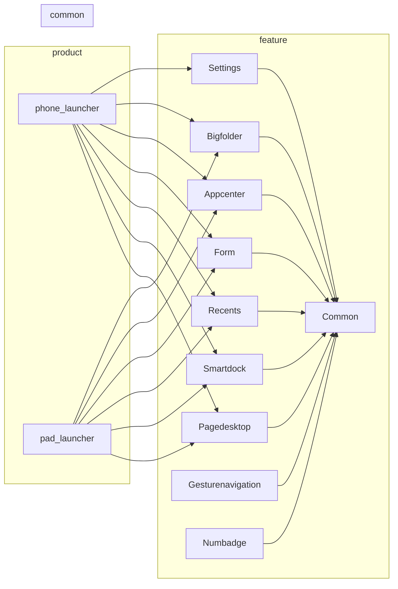

# 内部 API

> 模块接口、依赖方向与稳定性标注

## 概述

本文档描述 Launcher 项目内部模块之间的接口关系、依赖方向和接口稳定性标注。

## 模块依赖关系

### 依赖图



### 依赖方向

```
                    ┌─────────────┐
                    │   product   │  (无上游依赖，仅引用 feature)
                    │  (phone/pad) │
                    └──────┬──────┘
                           │
          ┌────────────────┼────────────────┐
          │                │                │
          ▼                ▼                ▼
    ┌──────────┐    ┌──────────┐    ┌──────────┐
    │ feature  │    │ feature  │    │ feature  │
    │   所有模块依赖 common              │
    └──────────┘    └──────────┘    └──────────┘
                           │
                           ▼
                    ┌──────────┐
                    │  common  │
                    │ (最底层) │
                    └──────────┘
```

## 接口稳定性标注

### 稳定性等级

| 等级 | 标注 | 说明 |
|------|------|------|
| 稳定 | 无特殊标注 | 公开 API，可放心使用 |
| 实验性 | `beta` | 可能在未来版本中变更 |
| 内部 | `private` | 仅限模块内部使用 |
| 废弃 | `deprecated` | 不推荐使用，将在未来移除 |

### 稳定性证据

#### 稳定接口（可安全使用）

| 模块 | 导出符号 | 稳定性依据 |
|------|----------|-----------|
| `common` | `Log`, `CommonConstants` | 常量类，无实现变更 |
| `common` | `windowManager` | 窗口管理器核心接口 |
| `pagedesktop` | `PageDesktopViewModel` | 视图模型，遵循 MVVM |
| `form` | `FormViewModel` | 卡片核心逻辑 |

#### 内部接口（模块私有）

| 模块 | 文件/类 | 内部使用 |
|------|---------|----------|
| `common` | `*Impl` 后缀实现类 | 供 Manager 调用 |
| `common` | `Base*` 基类 | 仅子类继承 |
| `feature` | `*Layout.ets` | 内部布局组件 |

## 核心管理器说明

### windowManager

**位置**: `common/src/main/ets/default/manager/windowManager.ts`

**职责**:
- 创建和管理桌面窗口
- 注册窗口事件
- 窗口层级管理

**主要方法**:

| 方法 | 参数 | 返回值 | 说明 |
|------|------|--------|------|
| `createWindow` | context, name, rank, pagePath, isMain, callback | void | 创建窗口 |
| `createRecentWindow` | void | Promise<void> | 创建最近任务窗口 |
| `registerWindowEvent` | void | void | 注册窗口事件 |
| `unregisterWindowEvent` | void | void | 注销窗口事件 |
| `minimizeAllApps` | void | void | 最小化所有应用 |
| `destroyWindow` | windowName | void | 销毁窗口 |

### RdbStoreManager

**位置**: `common/src/main/ets/default/manager/RdbStoreManager.ts`

**职责**:
- 初始化 RDB 数据库配置
- 创建数据库表
- 提供数据操作接口

**主要方法**:

| 方法 | 参数 | 返回值 | 说明 |
|------|------|--------|------|
| `getInstance` | void | RdbStoreManager | 获取单例 |
| `initRdbConfig` | void | Promise<void> | 初始化配置 |
| `createTable` | void | Promise<void> | 创建表 |

### launcherAbilityManager

**职责**:
- 管理 Launcher 能力
- 监控应用包变化
- 缓存管理

**主要方法**:

| 方法 | 参数 | 返回值 | 说明 |
|------|------|--------|------|
| `checkBundleMonitor` | void | void | 检查包监控 |
| `cleanAppMapCache` | void | void | 清理应用缓存 |

## 视图模型基类

### LayoutViewModel

**位置**: `common/src/main/ets/default/viewmodel/LayoutViewModel.ts`

**职责**: 工作区布局视图模型基类

**子类**:

| 子类 | 模块 | 说明 |
|------|------|------|
| `PageDesktopViewModel` | pagedesktop | 工作区视图模型 |
| `AppGridViewModel` | appcenter | 应用网格视图模型 |
| `BigFolderViewModel` | bigfolder | 智能文件夹视图模型 |
| `FormViewModel` | form | 卡片视图模型 |
| `RecentMissionsViewModel` | recents | 最近任务视图模型 |

## 数据模型

### 实体类结构

| 类名 | 位置 | 职责 |
|------|------|------|
| `AppItemInfo` | `bean/AppItemInfo.ts` | 应用项数据 |
| `FolderData` | `interface/FolderData.ts` | 文件夹数据 |
| `MenuInfo` | `bean/MenuInfo.ts` | 菜单数据 |
| `CardItemInfo` | `bean/CardItemInfo.ts` | 卡片项数据 |
| `MissionInfo` | `bean/MissionInfo.ts` | 任务数据 |
| `RecentMissionInfo` | `bean/RecentMissionInfo.ts` | 最近任务数据 |
| `DockItemInfo` | `bean/DockItemInfo.ts` | Dock 项数据 |

### AppItemInfo 结构

```typescript
class AppItemInfo {
    bundleName: string;        // 包名
    abilityName: string;       // 能力名
    appIconId: number;         // 图标 ID
    appName: string;           // 应用名
    labelId: number;          // 标签 ID
    installTime: number;       // 安装时间
    // ... 其他属性
}
```

## 事件常量

### EventConstants

**位置**: `common/src/main/ets/default/constants/EventConstants.ts`

| 事件名 | 说明 |
|--------|------|
| `EVENT_REQUEST_FORM_ITEM_VISIBLE` | 请求卡片可见 |
| `EVENT_OPEN_FOLDER_TO_CLOSE` | 关闭文件夹 |
| 其他事件 | 见源文件 |

## 配置常量

### CommonConstants

**位置**: `common/src/main/ets/default/constants/CommonConstants.ts`

| 常量类 | 说明 |
|--------|------|
| `LAUNCHER_BUNDLE` | Launcher 包名 (`com.ohos.launcher`) |
| `LAUNCHER_ABILITY` | Launcher Ability 名 |
| `RECENT_ABILITY` | 最近任务 Ability 名 |
| `SETTING_ABILITY` | 设置 Ability 名 |
| `MODULE_NAME` | 模块名 |
| `DEFAULT_USER_ID` | 默认用户 ID |

### 卡片维度常量

| 常量 | 值 | 说明 |
|------|------|------|
| `CARD_DIMENSION_1x1` | 6 | 1 行 1 列 |
| `CARD_DIMENSION_1x2` | 1 | 1 行 2 列 |
| `CARD_DIMENSION_2x2` | 2 | 2 行 2 列 |
| `CARD_DIMENSION_2x4` | 3 | 2 行 4 列 |
| `CARD_DIMENSION_4x4` | 4 | 4 行 4 列 |

## 相关文档

| 文档 | 链接 |
|------|------|
| 对外 API | [03_APIs.md](03_APIs.md) |
| 架构说明 | [02_Architecture.md](02_Architecture.md) |
| 构建配置 | [05_Build.md](05_Build.md) |
