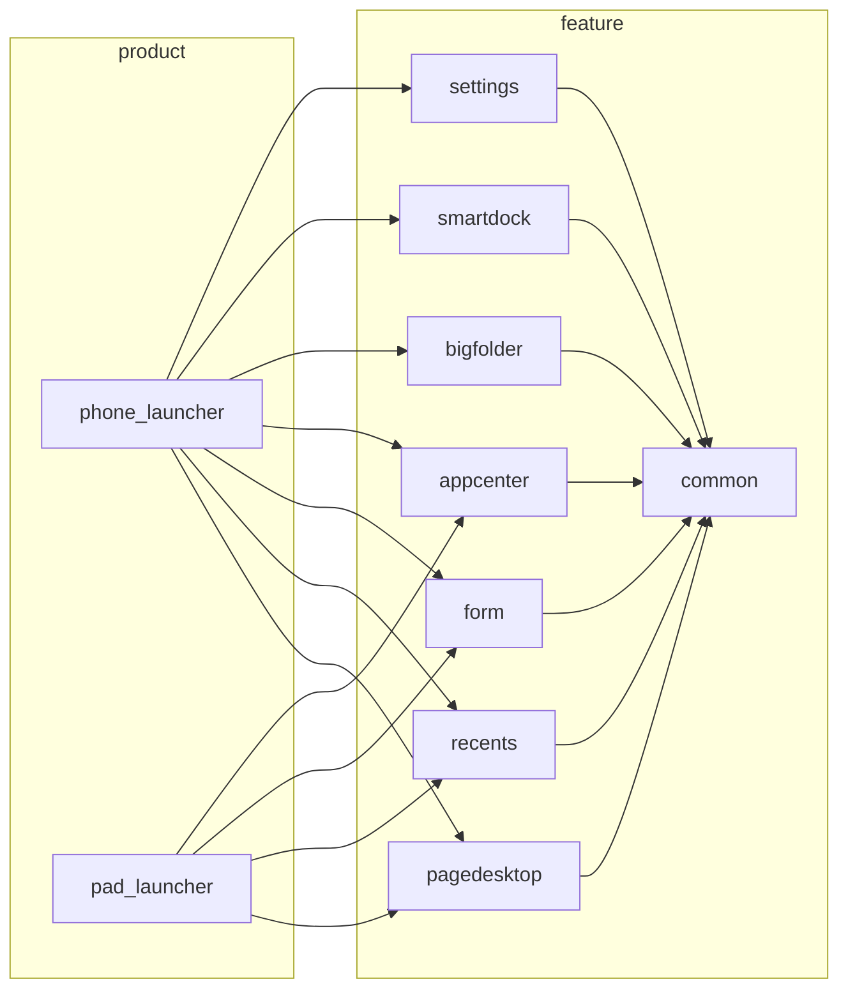

# 构建配置

> hvigor Targets 与编译产物说明

## 构建系统

### 构建工具

| 工具 | 版本/说明 |
|------|-----------|
| hvigor | 类 Gradle 构建工具 |
| npm | 依赖管理 |
| ArkTS 编译器 | 编译 ArkTS 代码 |

### 构建命令

```bash
# 构建所有模块
hvigor build

# 构建特定模块
hvigor assembleHap --module path/to/module

# 清理构建产物
hvigor clean
```

## 模块配置 (build-profile.json5)

### 顶层配置

**文件**: `build-profile.json5`

```json5
{
  "app": {
    "products": [
      {
        "name": "default",
        "signingConfig": "default",
        "compileSdkVersion": 20,
        "compatibleSdkVersion": 20
      }
    ],
    "signingConfigs": [
      {
        "name": "default",
        "material": {
          "storePassword": "...",
          "certpath": "signature/OpenHarmonyApplication.cer",
          "keyAlias": "OpenHarmony Application Release",
          "keyPassword": "...",
          "profile": "signature/launcher.p7b",
          "signAlg": "SHA256withECDSA",
          "storeFile": "signature/OpenHarmony.p12"
        }
      }
    ]
  },
  "modules": [ ... ]
}
```

### 模块清单

#### HAR 模块（共享模块）

| 模块名 | 路径 | 类型 | 依赖 |
|--------|------|------|------|
| `launcher_common` | `./common` | har | 系统 API |
| `launcher_appcenter` | `./feature/appcenter` | har | common |
| `launcher_bigfolder` | `./feature/bigfolder` | har | common |
| `launcher_form` | `./feature/form` | har | common |
| `launcher_gesturenavigation` | `./feature/gesturenavigation` | har | common |
| `launcher_numbadge` | `./feature/numbadge` | har | common |
| `launcher_pagedesktop` | `./feature/pagedesktop` | har | common |
| `launcher_recents` | `./feature/recents` | har | common |
| `launcher_smartDock` | `./feature/smartdock` | har | common |
| `launcher_settings` | `./feature/settings` | har | common |

#### HAP 模块（入口模块）

| 模块名 | 路径 | 类型 | 目标设备 |
|--------|------|------|----------|
| `phone_launcher` | `./product/phone` | entry | phone |
| `pad_launcher` | `./product/pad` | entry | tablet |

## 模块配置文件 (module.json5)

### entry 模块结构

**phone_launcher 模块配置**:

| 配置项 | 值 | 说明 |
|--------|-----|------|
| `name` | `phone_launcher` | 模块名 |
| `type` | `entry` | 模块类型 |
| `srcEntry` | `./ets/Application/AbilityStage.ts` | 源码入口 |
| `mainElement` | `com.ohos.launcher.MainAbility` | 主组件 |
| `deviceTypes` | `["default", "tablet"]` | 支持设备 |
| `deliveryWithInstall` | `true` | 安装时交付 |
| `installationFree` | `false` | 非免安装 |

### ExtensionAbility 配置

| 配置项 | 值 |
|--------|-----|
| `name` | `com.ohos.launcher.MainAbility` |
| `type` | `service` |
| `priority` | 2 |
| `exported` | false |

**支持的 Action**:
- `action.system.home`
- `com.ohos.action.main`
- `action.form.publish`

**支持的 Entity**:
- `entity.system.home`
- `flag.home.intent.from.system`

### HAR 模块结构

**feature 模块配置** (例如 pagedesktop):

```json5
{
  "module": {
    "name": "launcher_pagedesktop",
    "type": "har",
    "deviceTypes": [
      "default",
      "tablet"
    ]
  }
}
```

## 页面路由配置

### main_pages.json

**文件**: `product/phone/src/main/resources/base/profile/main_pages.json`

```json5
{
  "src": [
    "pages/FormManagerView",
    "pages/FormServiceView",
    "pages/EmptyPage",
    "pages/EntryView",
    "pages/RecentView",
    "pages/SubDisplayWallpaperPage"
  ]
}
```

## 签名配置

### 签名文件

| 文件 | 用途 |
|------|------|
| `signature/launcher.p7b` | 签名配置文件 |
| `signature/OpenHarmony.p12` | 密钥库 |
| `signature/OpenHarmonyApplication.cer` | 证书文件 |

### 签名算法

| 配置项 | 值 |
|--------|-----|
| `signAlg` | SHA256withECDSA |
| `keyAlias` | OpenHarmony Application Release |

## 编译产物

### 输出目录结构

```
out/
└── default/
    └── products/
        └── default/
            ├── phone_launcher/
            │   ├── build/
            │   │   ├── ets/
            │   │   ├── resources/
            │   │   └── module.json
            │   └── phone_launcher.hap
            │
            └── pad_launcher/
                ├── build/
                │   ├── ets/
                │   ├── resources/
                │   └── module.json
                └── pad_launcher.hap
```

### 产物说明

| 产物 | 类型 | 说明 |
|------|------|------|
| `*.hap` | HAP | Harmony Ability Package（可安装包） |
| `launcher_common.har` | HAR | Harmony Archive（共享模块） |

### HAP 结构

```
launcher.hap/
├── ets/                       # ArkTS 字节码
│   ├── index.abc
│   └── ...
├── resources/                 # 资源文件
│   ├── indexer.json
│   └── ...
├── libs/                      # 库文件
├── module.json               # 模块配置
└── META-INF/                 # 元数据
```

## 依赖关系

### 模块间依赖



### 系统 API 依赖

| 系统模块 | 用途 |
|----------|------|
| `@ohos.app.ability.ServiceExtensionAbility` | ServiceExtension |
| `@ohos.window` | 窗口管理 |
| `@ohos.display` | 显示管理 |
| `@ohos.hilog` | 日志 |
| `@ohos.multimodalInput` | 输入事件 |
| `@ohos.bundle` | 包管理 |
| `@ohos.app.ability.dataAbility` | DataAbility |

## 相关文档

| 文档 | 链接 |
|------|------|
| 概览 | [00_Overview.md](00_Overview.md) |
| 目录结构 | [01_Directory_Structure.md](01_Directory_Structure.md) |
| 安全评审 | [06_Security.md](06_Security.md) |
