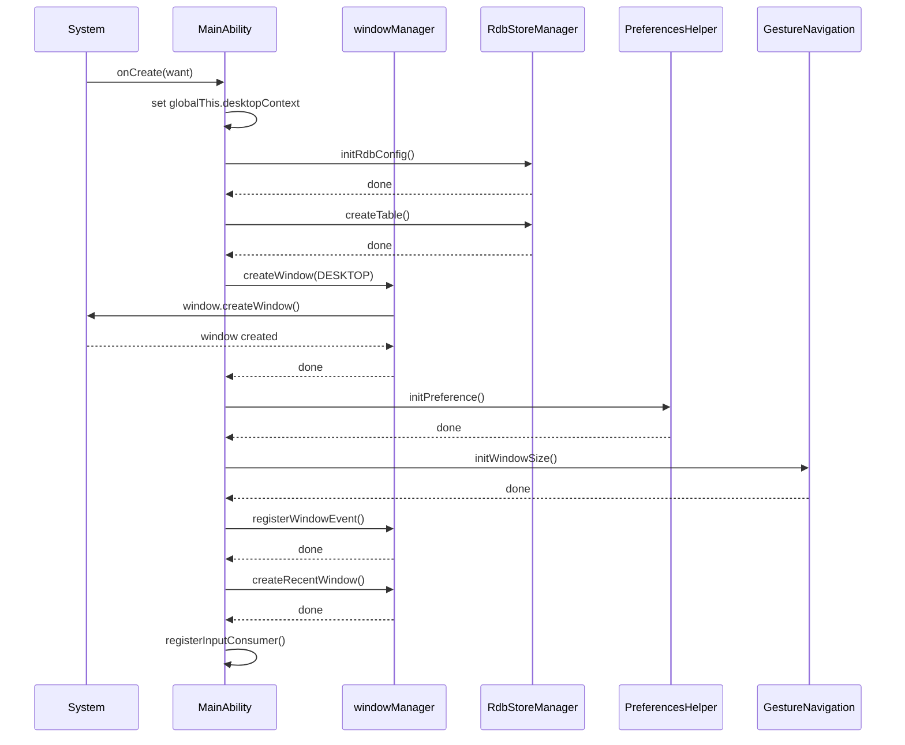

# 调用链图谱

> 关键调用链（入口→核心逻辑）

## 概述

本文档记录 Launcher 应用中的关键调用链，帮助理解从入口到核心逻辑的完整流程。

## 启动流程

### MainAbility onCreate

```
┌─────────────────────────────────────────────────────────────────────┐
│ MainAbility.onCreate(want: Want)                                    │
├─────────────────────────────────────────────────────────────────────┤
│ 1. 设置 Launcher Context                                            │
│    └─> globalThis.desktopContext = this.context                    │
│                                                                      │
│ 2. 初始化 RDB 数据库                                                 │
│    └─> RdbStoreManager.getInstance().initRdbConfig()                │
│        └─> RdbStoreManager.getInstance().createTable()              │
│                                                                      │
│ 3. 创建桌面窗口                                                      │
│    └─> windowManager.createWindow(...)                              │
│        ├─> window.createWindow()                                     │
│        └─> 加载 pages/DesktopView                                    │
│                                                                      │
│ 4. 初始化首选项                                                      │
│    └─> PreferencesHelper.getInstance().initPreference()            │
│                                                                      │
│ 5. 启动手势导航                                                      │
│    └─> GestureNavigationManager.getInstance().initWindowSize()      │
│                                                                      │
│ 6. 注册窗口事件                                                      │
│    └─> windowManager.registerWindowEvent()                           │
│        └─> window.on('windowEvent', callback)                       │
│                                                                      │
│ 7. 创建最近任务窗口                                                   │
│    └─> windowManager.createRecentWindow()                           │
│                                                                      │
│ 8. 注册输入消费者                                                    │
│    └─> inputConsumer.on('key', onKeyCodeHome, callback)            │
└─────────────────────────────────────────────────────────────────────┘
```

### 时序图



## 卡片发布流程

### onRequest 接收卡片

```
┌─────────────────────────────────────────────────────────────────────┐
│ MainAbility.onRequest(want: Want, startId: number)                 │
├─────────────────────────────────────────────────────────────────────┤
│                                                                      │
│ 1. 检查 action 类型                                                 │
│    └─> if (want.action === FormConstants.ACTION_PUBLISH_FORM)      │
│                                                                      │
│ 2. 发布卡片到桌面                                                    │
│    └─> PageDesktopViewModel.getInstance().publishCardToDesktop(    │
│           want.parameters                                            │
│        )                                                             │
│        └─> FormViewModel.publishForm()                              │
│            └─> 更新卡片数据                                          │
│                                                                      │
│ 3. 最小化所有应用（如果不是首次）                                     │
│    └─> windowManager.minimizeAllApps()                              │
└─────────────────────────────────────────────────────────────────────┘
```

## 应用启动流程

### 点击图标启动

```
┌─────────────────────────────────────────────────────────────────────┐
│ 用户点击应用图标                                                     │
├─────────────────────────────────────────────────────────────────────┤
│                                                                      │
│ 1. UI 事件触发                                                      │
│    └─> AppItem.onClick()                                            │
│                                                                      │
│ 2. 发送启动事件                                                      │
│    └─> localEventManager.sendLocalEventSticky(                      │
│           EVENT_APP_ICON_CLICK,                                      │
│           appInfo                                                    │
│        )                                                             │
│                                                                      │
│ 3. 启动应用                                                          │
│    └─> globalThis.desktopContext.startAbility({                     │
│           bundleName: appInfo.bundleName,                           │
│           abilityName: appInfo.abilityName                          │
│        })                                                            │
│        └─> AMS (Ability Manager Service)                            │
│                                                                      │
│ 4. 启动结果回调                                                     │
│    └─> .then(() => Log.showDebug(...))                              │
│    └─> .catch(() => Log.showError(...))                             │
└─────────────────────────────────────────────────────────────────────┘
```

## 最近任务流程

### HOME 键返回桌面

```
┌─────────────────────────────────────────────────────────────────────┐
│ 用户按下 HOME 键                                                     │
├─────────────────────────────────────────────────────────────────────┤
│                                                                      │
│ 1. 输入消费者捕获事件                                                │
│    └─> inputConsumer.on('key', onKeyCodeHome, callback)            │
│                                                                      │
│ 2. 启动 Launcher                                                    │
│    └─> globalThis.desktopContext.startAbility({                     │
│           bundleName: 'com.ohos.launcher',                         │
│           abilityName: 'com.ohos.launcher.MainAbility'              │
│        })                                                            │
│        └─> AMS                                                      │
│                                                                      │
│ 3. 返回桌面                                                          │
│    └─> windowManager.showWindow(windowManager.DESKTOP_WINDOW_NAME) │
└─────────────────────────────────────────────────────────────────────┘
```

### RECENT 键显示最近任务

```
┌─────────────────────────────────────────────────────────────────────┐
│ 用户按下 RECENT 键                                                   │
├─────────────────────────────────────────────────────────────────────┤
│                                                                      │
│ 1. 输入消费者捕获事件                                                │
│    └─> inputConsumer.on('key', onKeyCodeFunction, callback)         │
│                                                                      │
│ 2. 创建最近任务窗口                                                  │
│    └─> windowManager.createWindowWithName(                          │
│           windowManager.RECENT_WINDOW_NAME,                         │
│           windowManager.RECENT_RANK                                  │
│        )                                                             │
│        └─> RecentView 页面加载                                       │
│            └─> RecentMissionsViewModel.getInstance().loadMissions() │
│                └─> 从任务管理器获取任务列表                           │
└─────────────────────────────────────────────────────────────────────┘
```

## 窗口管理流程

### 窗口事件处理

```
┌─────────────────────────────────────────────────────────────────────┐
│ windowManager.registerWindowEvent()                                  │
├─────────────────────────────────────────────────────────────────────┤
│                                                                      │
│ 1. 监听窗口事件                                                      │
│    └─> window.on('windowEvent', (stageEventType) => {               │
│                                                                      │
│ 2. WINDOW_ACTIVE（获焦）                                             │
│    ├─> launcherAbilityManager.checkBundleMonitor()                  │
│    └─> localEventManager.sendLocalEventSticky(                      │
│           EVENT_REQUEST_FORM_ITEM_VISIBLE,                          │
│           null                                                       │
│        )                                                             │
│                                                                      │
│ 3. WINDOW_INACTIVE（失焦）                                           │
│    └─> Log.showInfo(...)                                            │
└─────────────────────────────────────────────────────────────────────┘
```

## 数据流图

### 应用信息加载

```
┌─────────────┐     ┌─────────────┐     ┌─────────────┐
│ RdbStore    │ --> │ AppItemInfo │ --> │ AppGrid     │
│ (数据库)    │     │ (数据实体)  │     │ (UI 组件)   │
└─────────────┘     └─────────────┘     └─────────────┘
                        ▲
                        │
                   ┌────┴────┐
                   │ Cache   │
                   │ (缓存)  │
                   └─────────┘
```

### 事件流

```
┌─────────────┐     ┌─────────────┐     ┌─────────────┐
│ Event Source│ --> │localEvent   │ --> │Event Handler│
│ (触发源)    │     │Manager      │     │ (处理器)    │
└─────────────┘     └─────────────┘     └─────────────┘
                        │
                   ┌────┴────┐
                   │ Sticky  │
                   │ (粘性)  │
                   └─────────┘
```

## 相关文档

| 文档 | 链接 |
|------|------|
| 架构说明 | [02_Architecture.md](../02_Architecture.md) |
| 对外 API | [03_APIs.md](../03_APIs.md) |
| 内部 API | [04_Inner_API.md](../04_Inner_API.md) |
