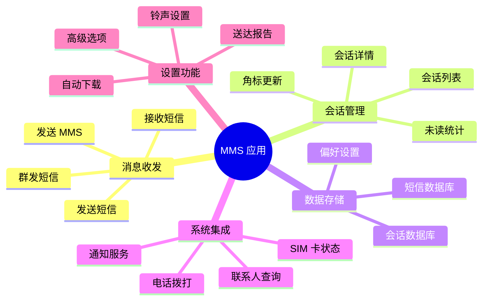

# 00. 项目概览

## 目的与适用范围

本文档提供 OpenHarmony MMS（信息应用）的整体概览，包括项目定位、核心功能、运行环境和关键概念。

**适用读者**: 新加入项目的开发者、架构师、安全审计人员  
**阅读时间**: 约 15 分钟

---

## 项目定位

### 系统定位

MMS 是 OpenHarmony 预置的系统应用，属于**应用层**组件，依赖底层的电话服务子系统 (`telephony_sms_mms`)。

```
┌─────────────────────────────────────────┐
│           应用层 (Applications)          │
│  ┌─────────┐  ┌─────────┐  ┌─────────┐ │
│  │ Contacts│  │  MMS    │  │  Phone  │ │
│  └────┬────┘  └────┬────┘  └────┬────┘ │
└───────┼────────────┼────────────┼──────┘
        │            │            │
        └────────────┴────────────┘
                     │
┌────────────────────┼────────────────────┐
│     框架层 (Framework)                  │
│  ┌─────────────────┼────────────────┐  │
│  │   telephony_sms_mms 服务          │  │
│  │   - SMS 发送/接收                 │  │
│  │   - MMS 编解码                    │  │
│  └─────────────────┼────────────────┘  │
└────────────────────┼────────────────────┘
                     │
┌────────────────────┼────────────────────┐
│     内核层 (Kernel)                     │
│        调制解调器驱动                      │
└─────────────────────────────────────────┘
```

### 功能边界

**包含功能**:
- ✅ 短信收发与管理
- ✅ 会话列表展示
- ✅ 短信送达报告
- ✅ 通知提醒
- ✅ 联系人关联
- ✅ 基础设置（铃声、送达报告等）

**不包含功能**:
- ❌ 底层短信协议处理（在 telephony_sms_mms 仓）
- ❌ 联系人数据管理（在 contacts 应用）
- ❌ 通话功能（在 phone 应用）
- ❌ 富媒体消息高级编辑

---

## 核心能力

### 功能模块



### 关键流程

#### 短信发送流程
```
用户输入 → 页面验证 → SendMsgService → telephony.sms → 底层服务 → 网络
                ↓
         ConversationService → DataShare → 短信数据库
```

#### 短信接收流程
```
网络 → 底层服务 → 公共事件 → MmsStaticSubscriber → 解析 → 存储 → 通知
                                                    ↓
                                              更新 UI
```

---

## 运行环境

### 系统要求

| 项目 | 要求 |
|------|------|
| OpenHarmony API 版本 | 11+ (compileSdkVersion: 23) |
| 设备类型 | 手机 (phone) |
| 系统权限 | 系统应用权限 |
| 依赖服务 | telephony_sms_mms, contactsdataability |

### 权限需求

应用需要以下敏感权限（定义于 `entry/src/main/module.json5`）:

| 权限 | 级别 | 用途 |
|------|------|------|
| ohos.permission.SEND_MESSAGES | system_grant | 发送短信 |
| ohos.permission.RECEIVE_SMS | system_grant | 接收短信 |
| ohos.permission.READ_MESSAGES | system_grant | 读取短信数据库 |
| ohos.permission.READ_CONTACTS | user_grant | 读取联系人 |
| ohos.permission.PLACE_CALL | system_grant | 拨打电话 |
| ohos.permission.NOTIFICATION_CONTROLLER | system_grant | 发送通知 |

---

## 关键概念

### 数据模型

#### 会话 (Session)
- 表示与某个联系人/号码的短信往来
- 存储在 `session` 表
- 关键字段: `telephone`, `unread_count`, `message_count`

#### 消息详情 (Message Detail)
- 单条短信的详细信息
- 存储在 `sms_mms_info` 表
- 关键字段: `msg_content`, `sender_number`, `receiver_number`, `msg_state`

#### 群组 (Group)
- 群发短信时关联多条消息
- 使用 `group_id` 字段关联
- 支持发送状态分组统计

### 消息状态

| 状态值 | 常量 | 含义 |
|--------|------|------|
| 0 | SEND_MESSAGE_SUCCESS | 发送成功 |
| 1 | SEND_MESSAGE_SENDING | 发送中 |
| 2 | SEND_MESSAGE_FAILED | 发送失败 |
| 3 | SEND_DRAFT | 草稿 |

### 消息类型

| 类型值 | 常量 | 说明 |
|--------|------|------|
| 0 | NORMAL | 普通短信 |
| 1 | THEME | 主题彩信 |
| 2 | PPT | 幻灯片 |

### SIM 卡标识

| 值 | 含义 |
|----|------|
| 0 | SIM 卡 1 |
| 1 | SIM 卡 2 |

---

## 技术栈

### 编程语言
- **ArkTS**: 主要开发语言 (TypeScript 超集)
- **TS**: 部分工具类

### UI 框架
- **ArkUI**: 声明式 UI 框架
- **自适应布局**: Grid/Row/Column + 媒体查询

### 数据管理
- **DataShare**: 跨应用数据共享
- **Preferences**: 轻量级配置存储

### 并发模型
- **Worker**: 数据库操作异步化
- **异步回调**: Promise + callback 混合

---

## 相关链接

- [架构设计](01_Architecture.md) - 深入了解技术实现
- [系统 API](03_SystemAPIs.md) - 查看所有外部接口
- [目录结构](02_DirectoryStructure.md) - 代码组织方式

---

*文档基于代码路径: entry/src/main/ets/*
