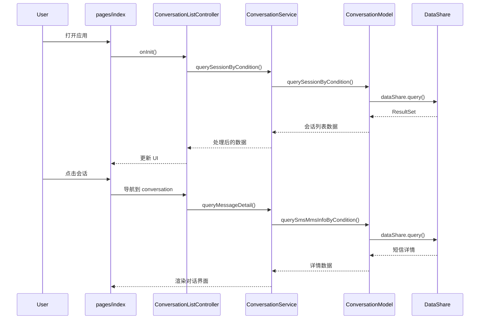
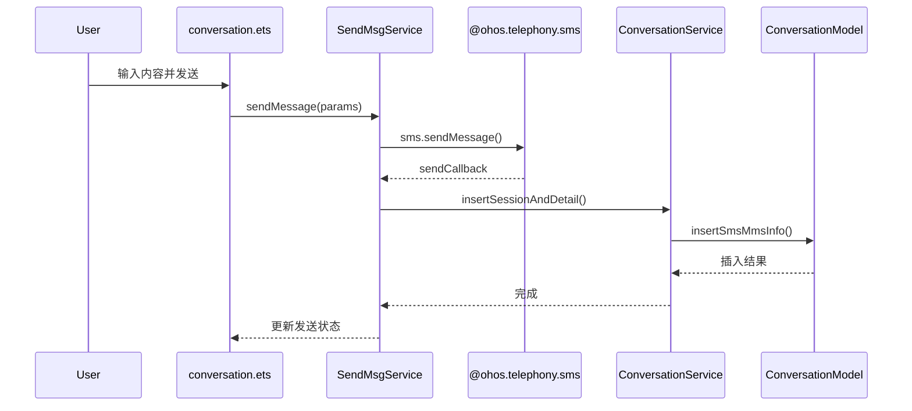
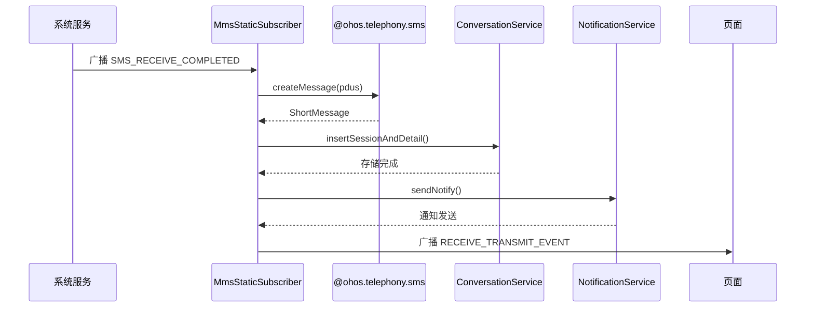
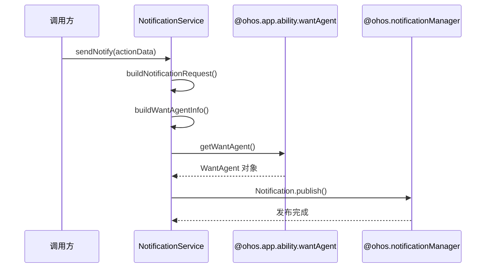
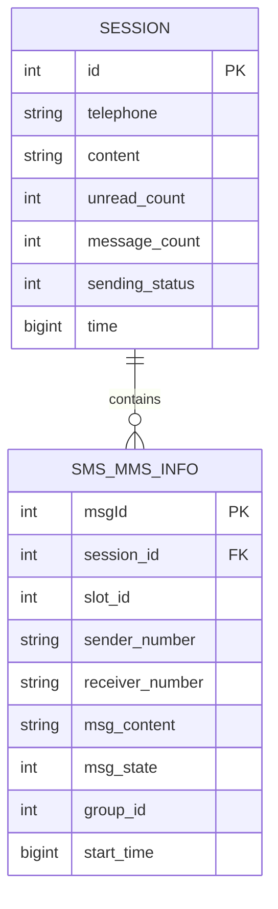
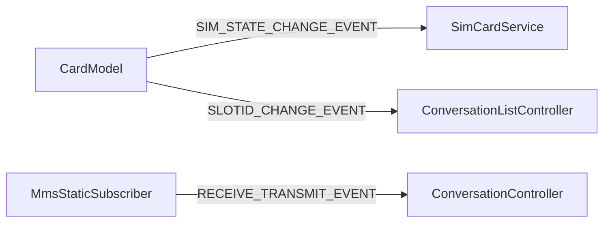

# 01. 架构设计

## 目的与适用范围

本文档描述 MMS 应用的技术架构，包括模块划分、组件关系、数据流和线程模型。

**适用读者**: 开发工程师、架构师  
**阅读时间**: 约 30 分钟

---

## 整体架构

### 分层架构

```mermaid
graph TB
    subgraph UI层
        P1[pages/index]
        P2[pages/conversation]
        P3[pages/settings]
        V1[views/MmsListItem]
        V2[views/MmsDialogs]
    end

    subgraph 业务逻辑层
        S1[SendMsgService]
        S2[ConversationService]
        S3[ConversationListService]
        S4[NotificationService]
        S5[ContactsService]
    end

    subgraph 数据模型层
        M1[ConversationModel]
        M2[ConversationListModel]
        M3[ContactsModel]
        M4[CardModel]
    end

    subgraph 系统服务层
        API1[@ohos.telephony.sms]
        API2[@ohos.data.dataShare]
        API3[@ohos.notificationManager]
        API4[@ohos.commonEventManager]
    end

    UI层 --> 业务逻辑层
    业务逻辑层 --> 数据模型层
    数据模型层 --> 系统服务层
```

### 模块职责

| 模块 | 职责 | 主要文件 |
|------|------|----------|
| **Application** | AbilityStage 生命周期 | MyAbilityStage.ts |
| **MainAbility** | UIAbility 生命周期管理 | MainAbility.ts |
| **StaticSubscriber** | 短信接收事件处理 | MmsStaticSubscriber.ts |
| **pages** | UI 页面实现 | 8 个页面目录 |
| **views** | 可复用 UI 组件 | 8 个视图组件 |
| **service** | 业务逻辑封装 | 10 个服务类 |
| **model** | 数据访问层 | 8 个模型类 |
| **data** | 数据类型定义 | 4 个数据文件 |
| **utils** | 工具类 | 8 个工具类 |
| **workers** | 后台线程处理 | Worker 相关 4 个文件 |

---

## 组件关系

### 核心组件交互图



### 服务层依赖关系

```mermaid
graph LR
    subgraph 服务层
        direction TB
        SendMsg[SendMsgService]
        ConServ[ConversationService]
        ConListServ[ConversationListService]
        NotifServ[NotificationService]
        ContServ[ContactsService]
        SimServ[SimCardService]
    end

    SendMsg --> TelephonySMS[@ohos.telephony.sms]
    ConServ --> ConListServ
    ConServ --> ContServ
    ConListServ --> ConListModel[ConversationListModel]
    NotifServ --> Notification[@ohos.notificationManager]
    ContServ --> ContactsModel[ContactsModel]
    SimServ --> Emitter[@ohos.events.emitter]
```

---

## 线程模型

### Worker 线程架构

MMS 应用使用 Worker 线程处理耗时数据库操作，避免阻塞 UI 线程。

```mermaid
graph TB
    subgraph 主线程
        UI[UI 组件]
        Controller[页面 Controller]
        Service[Service 层]
    end

    subgraph Worker线程
        DataWorker[DataWorkerWrapper]
        DataTask[DataWorkerTask]
        Models[Model 实例]
    end

    subgraph 系统服务
        DataShare[@ohos.data.dataShare]
    end

    UI --> Controller
    Controller --> Service
    Service -->|sendRequest| DataWorker
    DataWorker --> DataTask
    DataTask --> Models
    Models --> DataShare
```

### Worker 方法映射

定义在 `commonData.ets` 中的 Worker 方法:

| 方法名 | 所属模型 | 操作类型 |
|--------|----------|----------|
| queryContactDataByCondition | ContactsModel | 查询 |
| insertSmsMmsInfo | ConversationModel | 插入 |
| deleteSmsMmsInfoByCondition | ConversationModel | 删除 |
| updateSmsMmsInfoByCondition | ConversationModel | 更新 |
| querySmsMmsInfoByCondition | ConversationModel | 查询 |
| insertSession | ConversationListModel | 插入 |
| deleteSessionByCondition | ConversationListModel | 删除 |
| updateSessionByCondition | ConversationListModel | 更新 |

### 线程切换流程

```typescript
// entry/src/main/ets/service/ConversationService.ets:40
public insertSmsMmsInfo(valueBucket, callback, context): void {
    if (globalThis.DataWorker != null) {
        // 切换到 Worker 线程
        globalThis.DataWorker.sendRequest(
            common.RUN_IN_WORKER_METHOD.insertSmsMmsInfo,
            { valueBucket, context },
            res => { callback(res); }  // 回调回主线程
        );
    } else {
        // 主线程直接执行
        this.conversationModel.insertSmsMmsInfo(valueBucket, callback, mmsContext);
    }
}
```

---

## 关键时序

### 1. 短信发送时序



### 2. 短信接收时序



### 3. 通知发送时序



---

## 数据存储架构

### 数据库关系



### 数据访问模式

```
┌─────────────────────────────────────────┐
│           Service 层                     │
│   - 业务逻辑处理                         │
│   - 数据格式转换                         │
└──────────────┬──────────────────────────┘
               │
┌──────────────▼──────────────────────────┐
│           Model 层                       │
│   - DataShareHelper 创建                │
│   - Predicates 构建                     │
│   - CRUD 操作封装                        │
└──────────────┬──────────────────────────┘
               │
┌──────────────▼──────────────────────────┐
│        @ohos.data.dataShare             │
│   - 跨进程数据访问                        │
│   - URI 路由到对应 Ability               │
└─────────────────────────────────────────┘
```

---

## 事件机制

### 事件总线

使用 `@ohos.events.emitter` 实现模块间通信:



### 关键事件定义

| 事件 ID | 名称 | 发送方 | 接收方 |
|---------|------|--------|--------|
| 1 | SIM_STATE_CHANGE_EVENT | CardModel | SimCardService |
| 2 | SLOTID_CHANGE_EVENT | CardModel | UI Controllers |
| usual.event.SMS_RECEIVE_COMPLETED | 短信接收 | 系统 | MmsStaticSubscriber |
| usual.event.RECEIVE_COMPLETED_TRANSMIT | 接收转发 | MmsStaticSubscriber | UI 层 |

---

## 相关链接

- [目录结构](02_DirectoryStructure.md) - 查看代码组织
- [数据流](04_DataFlow.md) - 详细数据流转
- [附录A: 调用链](appendix/Callgraphs.md) - 完整调用关系

---

*架构图基于代码: entry/src/main/ets/*
