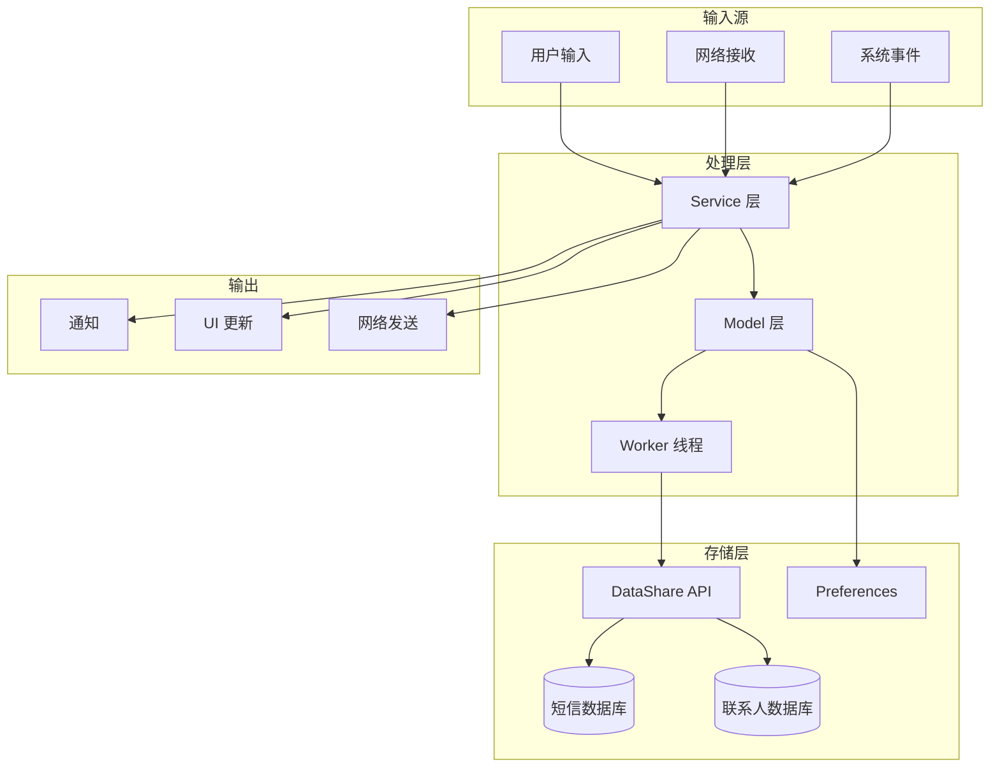
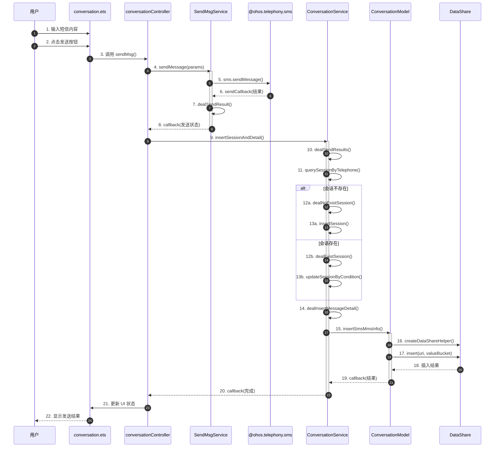
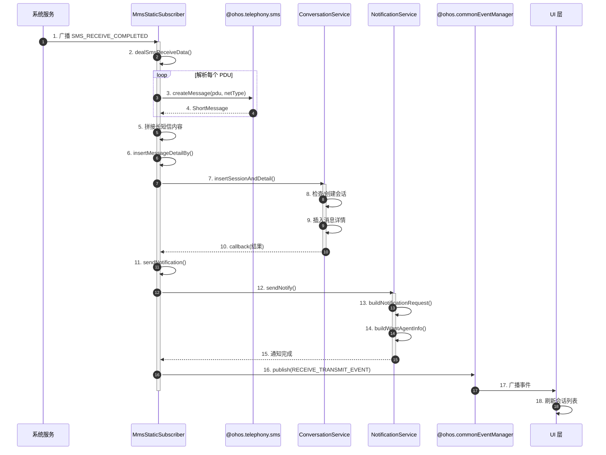
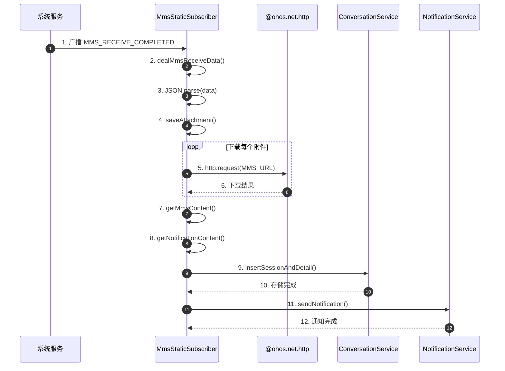
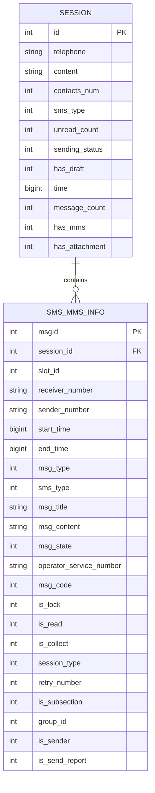
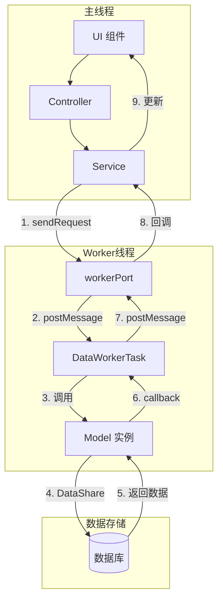
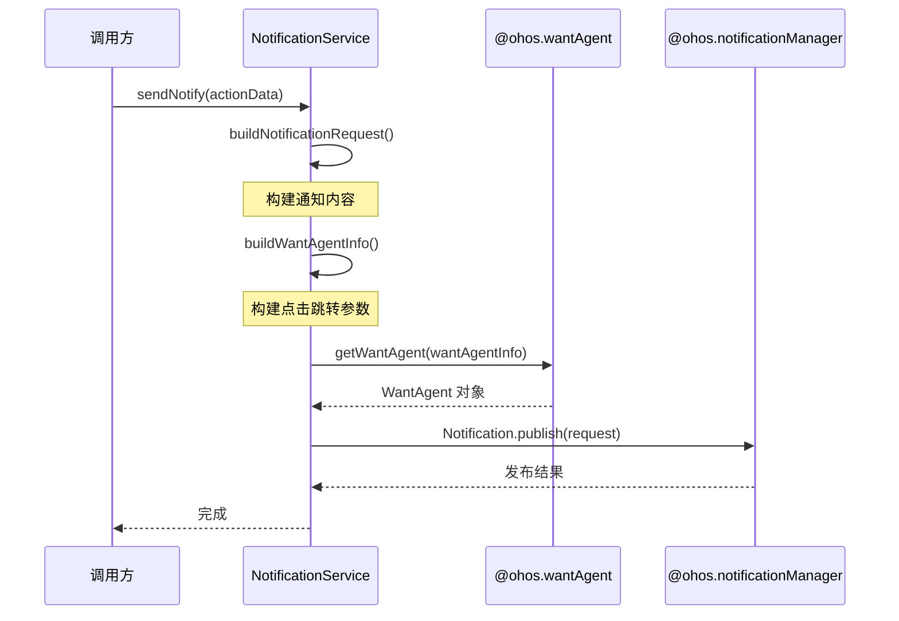
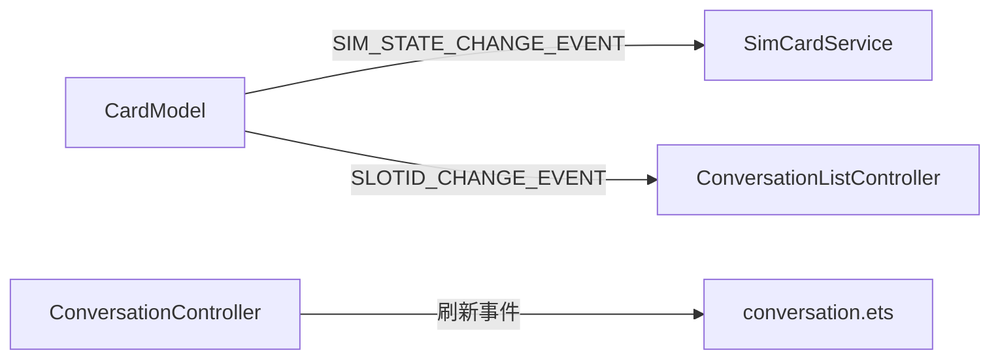

# 04. 数据流

## 目的与适用范围

本文档描述 MMS 应用中的核心数据流转过程，包括短信收发、数据存储和通知流程。

**适用读者**: 开发工程师、架构师  
**阅读时间**: 约 25 分钟

---

## 数据流概览



---

## 短信发送流程

### 流程图



### 关键数据转换

```
用户输入
    ↓
{
    slotId: 0,                    // SIM 卡槽
    destinationHost: "13800138000", // 目标号码
    content: "短信内容"            // 短信内容
}
    ↓ (SendMsgService.sendMessage)
telephony.sms.sendMessage 参数
    ↓
发送结果 (SendSmsResult)
    ↓
存储到数据库 (ConversationModel.insertSmsMmsInfo)
    ↓
{
    slot_id: 0,
    receiver_number: "13800138000",
    sender_number: "本机号码",
    msg_content: "短信内容",
    msg_state: 0/1/2,  // 成功/发送中/失败
    session_id: 123,   // 关联会话
    group_id: 456      // 群发分组
}
```

### 关键代码路径

1. **用户输入**: `entry/src/main/ets/pages/conversation/conversation.ets`
2. **发送调用**: `entry/src/main/ets/pages/conversation/conversationController.ets`
3. **短信发送**: `entry/src/main/ets/service/SendMsgService.ets:31`
4. **数据存储**: `entry/src/main/ets/service/ConversationService.ets:249`
5. **数据库插入**: `entry/src/main/ets/model/ConversationModel.ets:29`

---

## 短信接收流程

### 流程图



### PDU 处理详解

```
系统广播 PDU (字符串数组)
    ↓
MmsStaticSubscriber.convertStrArray()
    ↓
十六进制字符串 → 数字数组
    ↓
telephony.sms.createMessage(pdu, netType)
    ↓
ShortMessage 对象
    {
        visibleRawAddress: "发送号码",
        visibleMessageBody: "短信内容片段"
    }
    ↓
拼接多条 PDU (长短信)
    ↓
完整的短信内容
```

### 关键代码路径

1. **接收入口**: `entry/src/main/ets/StaticSubscriber/MmsStaticSubscriber.ts:35`
2. **PDU 解析**: `entry/src/main/ets/StaticSubscriber/MmsStaticSubscriber.ts:165`
3. **数据存储**: `entry/src/main/ets/StaticSubscriber/MmsStaticSubscriber.ts:143`
4. **通知发送**: `entry/src/main/ets/StaticSubscriber/MmsStaticSubscriber.ts:212`
5. **事件广播**: `entry/src/main/ets/StaticSubscriber/MmsStaticSubscriber.ts:197`

---

## MMS 接收流程

### 流程图



### MMS 数据处理

```javascript
// 接收的 MMS 数据格式
{
    telephone: "发送号码",
    content: "主题内容",
    mmsSource: [
        {
            msgType: 0/1/2/3,  // 主题/图片/视频/音频
            content: "内容",
            msgUriPath: "附件 URL"
        }
    ],
    slotId: 0
}
```

### 关键代码路径

1. **MMS 接收**: `entry/src/main/ets/StaticSubscriber/MmsStaticSubscriber.ts:78`
2. **附件下载**: `entry/src/main/ets/StaticSubscriber/MmsStaticSubscriber.ts:95`
3. **内容提取**: `entry/src/main/ets/StaticSubscriber/MmsStaticSubscriber.ts:115`

---

## 数据库存储流程

### 表结构关系



### 存储流程

```
业务数据
    ↓
Service 层处理
    ↓
构建 valueBucket 对象
    ↓
Model 层封装
    ↓
DataShareHelper.createDataShareHelper()
    ↓
dataShare.insert/update/delete/query()
    ↓
DataShare 服务
    ↓
短信数据库 (com.ohos.smsmmsability)
```

### 关键代码示例

```typescript
// 插入会话数据 (ConversationListModel)
async insertSession(valueBucket, callback, context) {
    let dataHelper = await dataShare.createDataShareHelper(
        context, 
        'datashare:///com.ohos.smsmmsability'
    );
    let uri = 'datashare:///com.ohos.smsmmsability/sms_mms/session';
    dataHelper.insert(uri, valueBucket)
        .then(res => callback(success))
        .catch(error => callback(failure));
}

// 插入短信详情 (ConversationModel)
async insertSmsMmsInfo(valueBucket, callback, context) {
    let dataHelper = await dataShare.createDataShareHelper(
        context,
        'datashare:///com.ohos.smsmmsability'
    );
    let uri = 'datashare:///com.ohos.smsmmsability/sms_mms/sms_mms_info';
    dataHelper.insert(uri, valueBucket)
        .then(res => callback(success))
        .catch(error => callback(failure));
}
```

---

## Worker 数据流

### Worker 架构



### Worker 方法映射

```typescript
// DataWorkerTask.runInWorker() 方法分发
switch (request) {
    // 联系人相关
    case 'queryContactDataByCondition':
        this.mContactsModel.queryContactDataByCondition(...)
        break;
    
    // 短信详情相关
    case 'insertSmsMmsInfo':
        this.mConversationModel.insertSmsMmsInfo(...)
        break;
    case 'deleteSmsMmsInfoByCondition':
        this.mConversationModel.deleteSmsMmsInfoByCondition(...)
        break;
    case 'updateSmsMmsInfoByCondition':
        this.mConversationModel.updateSmsMmsInfoByCondition(...)
        break;
    case 'querySmsMmsInfoByCondition':
        this.mConversationModel.querySmsMmsInfoByCondition(...)
        break;
    
    // 会话列表相关
    case 'insertSession':
        this.mConversationListModel.insertSession(...)
        break;
    case 'updateSessionByCondition':
        this.mConversationListModel.updateSessionByCondition(...)
        break;
    // ...
}
```

---

## 通知数据流

### 通知发送流程



### 通知数据结构

```typescript
// 通知请求结构
{
    id: msgId,                    // 通知 ID
    label: 'notification_' + msgId, // 标签
    content: {
        contentType: Notification.ContentType.NOTIFICATION_CONTENT_BASIC_TEXT,
        normal: {
            title: '联系人名称/号码',
            text: '短信内容...'
        }
    },
    wantAgent: WantAgent,         // 点击跳转
    slotType: Notification.SlotType.OTHER_TYPES,
    deliveryTime: timestamp,
    groupName: 'MMS'
}

// WantAgent 信息
{
    wants: [{
        bundleName: 'com.ohos.mms',
        abilityName: 'com.ohos.mms.MainAbility',
        action: 'mms.event.notification',
        parameters: {
            pageFlag: 'conversation',
            contactObjects: [...]
        }
    }],
    operationType: WantAgent.OperationType.START_ABILITY
}
```

---

## 事件数据流

### 应用内事件 (Emitter)



### 系统事件 (CommonEvent)

```
系统 SMS_RECEIVE_COMPLETED
    ↓
MmsStaticSubscriber.onReceiveEvent()
    ↓
处理短信/MMS
    ↓
publish(RECEIVE_TRANSMIT_EVENT)
    ↓
UI 层监听并刷新
```

---

## 相关链接

- [架构设计](01_Architecture.md) - 了解整体架构
- [系统 API](03_SystemAPIs.md) - 查看 API 详情
- [附录 A: 调用链](appendix/Callgraphs.md) - 完整调用路径

---

*数据流基于代码: entry/src/main/ets/*
