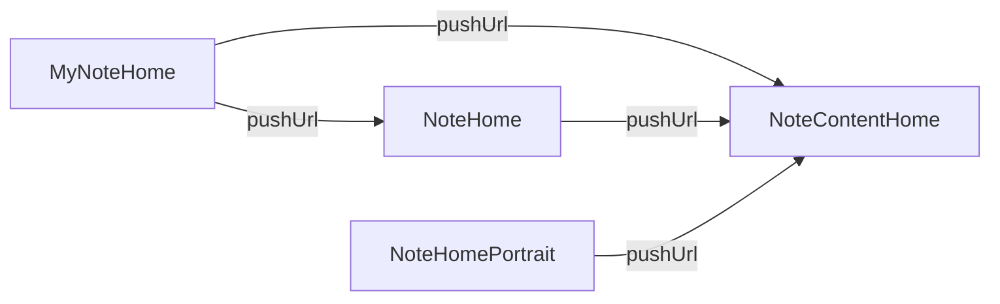
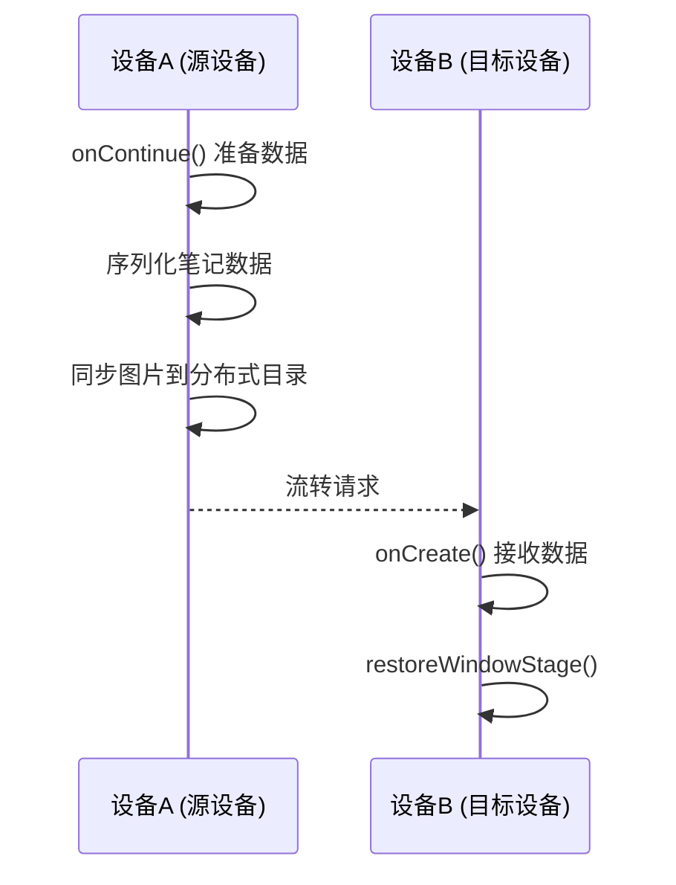

# 架构说明

## 1. 整体架构

### 1.1 架构分层

本应用采用 **分层架构** 设计：

```
┌─────────────────────────────────────────────────────────────────┐
│                         应用层                                   │
│  ┌───────────────────────────────────────────────────────────┐  │
│  │  pages/ (MyNoteHome, NoteHome, NoteContentHome, etc.)     │  │
│  └───────────────────────────────────────────────────────────┘  │
│                              ↓                                  │
│  ┌───────────────────────────────────────────────────────────┐  │
│  │  features/components/ (NoteListComp, NoteContentComp...) │  │
│  └───────────────────────────────────────────────────────────┘  │
│                              ↓                                  │
│  ┌───────────────────────────────────────────────────────────┐  │
│  │  common/utils/baseUtil/ (NoteUtil, FolderUtil, ...)      │  │
│  └───────────────────────────────────────────────────────────┘  │
│                              ↓                                  │
│  ┌───────────────────────────────────────────────────────────┐  │
│  │  common/utils/baseUtil/RdbStoreUtil.ets                  │  │
│  └───────────────────────────────────────────────────────────┘  │
│                              ↓                                  │
│  ┌───────────────────────────────────────────────────────────┐  │
│  │  @ohos.data.relationalStore                               │  │
│  └───────────────────────────────────────────────────────────┘  │
└─────────────────────────────────────────────────────────────────┘
```

### 1.2 架构特点

| 特点 | 描述 | 证据位置 |
|------|------|----------|
| **单向依赖** | 上层依赖下层，下层不依赖上层 | 目录结构分析 |
| **模块化** | 按功能划分为 utils、features、product 三层 | `01_Directory_Structure.md` |
| **数据驱动** | 使用 AppStorage 进行全局状态管理 | `MainAbility.ts:29-70` |
| **组件化** | UI 组件独立封装，可复用 | `features/src/main/ets/components/` |

## 2. UIAbility 生命周期

### 2.1 生命周期图

```
┌─────────────────────────────────────────────────────────────────┐
│                         UIAbility 生命周期                        │
│                                                                   │
│  onCreate() ──► onWindowStageCreate() ──► onForeground()        │
│       │                │                     │                   │
│       │                ▼                     ▼                   │
│       │         ┌─────────────┐        ┌─────────────┐          │
│       │         │ 页面加载     │        │ 进入前台     │          │
│       │         │ setUIContent│        │             │          │
│       │         └─────────────┘        └─────────────┘          │
│       │                                      │                  │
│       │                    ┌────────────────┴──────────────┐    │
│       │                    │                              │    │
│       ▼                    ▼                              ▼    │
│  ┌─────────┐          ┌─────────────┐              ┌─────────┐  │
│  │ 应用启动 │          │ 窗口创建    │              │ 进入后台 │  │
│  └─────────┘          └─────────────┘              └─────────┘  │
│                                                                   │
│  onBackground() ──► onWindowStageDestroy() ──► onDestroy()      │
│       │                   │                        │            │
│       ▼                   ▼                        ▼            │
│  ┌─────────┐          ┌─────────────┐              ┌─────────┐  │
│  │ 进入后台 │          │ 窗口销毁    │              │ 应用销毁 │  │
│  └─────────┘          └─────────────┘              └─────────┘  │
└─────────────────────────────────────────────────────────────────┘
```

### 2.2 生命周期方法说明

| 方法 | 调用时机 | 主要职责 | 代码位置 |
|------|----------|----------|----------|
| `onCreate()` | 应用启动 | 初始化上下文、设置 AppStorage | `MainAbility.ts:34-72` |
| `onWindowStageCreate()` | 窗口创建 | 加载页面、设置窗口属性 | `MainAbility.ts:78-123` |
| `onWindowStageDestroy()` | 窗口销毁 | 清理窗口资源 | `MainAbility.ts:125-127` |
| `onDestroy()` | 应用销毁 | 清理资源 | `MainAbility.ts:74-76` |
| `onForeground()` | 进入前台 | 恢复状态 | `MainAbility.ts:129-131` |
| `onBackground()` | 进入后台 | 保存状态、退出键盘 | `MainAbility.ts:133-137` |
| `onContinue()` | 跨设备流转 | 准备迁移数据 | `MainAbility.ts:163-214` |

**证据位置**: `product/default/src/main/ets/MainAbility/MainAbility.ts`

## 3. 页面导航

### 3.1 页面路由



### 3.2 页面列表

| 页面 | 路径 | 职责 |
|------|------|------|
| `MyNoteHome` | `product/default/src/main/ets/pages/MyNoteHome.ets` | 我的笔记主页 |
| `NoteHome` | `product/default/src/main/ets/pages/NoteHome.ets` | 笔记主页 (横屏/平板) |
| `NoteHomePortrait` | `product/default/src/main/ets/pages/NoteHomePortrait.ets` | 笔记主页 (竖屏) |
| `NoteContentHome` | `product/default/src/main/ets/pages/NoteContentHome.ets` | 笔记内容编辑页 |

**证据位置**: `product/default/src/main/resources/base/profile/main_pages.json`

## 4. 数据流

### 4.1 全局状态管理

本应用使用 `AppStorage` 进行跨组件、跨页面状态共享：

```typescript
// 设置全局状态
AppStorage.setOrCreate('context', this.context);
AppStorage.setOrCreate('rdbStore', rdbStore);
AppStorage.setOrCreate('AllFolderArray', folderDataArray);
AppStorage.setOrCreate('AllNoteArray', noteDataArray);

// 获取全局状态
let context = AppStorage.get<common.UIAbilityContext>('noteContext');
let folderArray = AppStorage.get<FolderData[]>('AllFolderArray');
```

**证据位置**: `MainAbility.ts:29-70`, `RdbStoreUtil.ets:80-81`

### 4.2 数据库操作流

```
┌─────────────────────────────────────────────────────────────────┐
│                     数据查询流程                                 │
│                                                                   │
│  UI 组件                                                           │
│     │                                                            │
│     ▼ query()                                                   │
│  NoteUtil / FolderUtil                                          │
│     │                                                            │
│     ▼ call                                                      │
│  RdbStoreUtil                                                    │
│     │                                                            │
│     ▼ executeSql()                                              │
│  relationalStore.RdbStore                                       │
│     │                                                            │
│     ▼ results                                                   │
│  数据返回 (NoteData[] / FolderData[])                            │
└─────────────────────────────────────────────────────────────────┘
```

**证据位置**: `common/utils/src/main/ets/default/baseUtil/RdbStoreUtil.ets`

## 5. 跨设备流转

### 5.1 流转流程



### 5.2 流转数据

| 数据项 | 类型 | 用途 |
|--------|------|------|
| `Search` | boolean | 搜索状态 |
| `ContinueNote` | string | 笔记内容 (JSON) |
| `ContinueSection` | number | 笔记位置 |
| `ScrollTopPercent` | number | 滚动位置 |
| `isFocusOnSearch` | boolean | 搜索框焦点 |

**证据位置**: `MainAbility.ts:43-68`, `MainAbility.ts:163-214`

## 6. 线程模型

### 6.1 主线程

所有 UI 操作和数据绑定在主线程执行：

- `@Component` 组件渲染
- `@State` / `@Link` 状态更新
- 页面路由 `router.pushUrl()`

### 6.2 异步操作

数据库操作使用 Promise 异步执行：

```typescript
relationalStore.getRdbStore(context, dbName)
  .then(async (store) => {
    // 数据库操作在子线程执行
    let resultSet = await this.rdbPredicates.offset(0).executeQuery();
  })
```

**证据位置**: `RdbStoreUtil.ets:52-100`

## 7. 相关跳转

| 目标 | 链接 |
|------|------|
| 目录结构 | [01_Directory_Structure.md](01_Directory_Structure.md) |
| 内部 API | [03_Inner_API.md](03_Inner_API.md) |
| 安全评估 | [06_Security_Review.md](06_Security_Review.md) |
