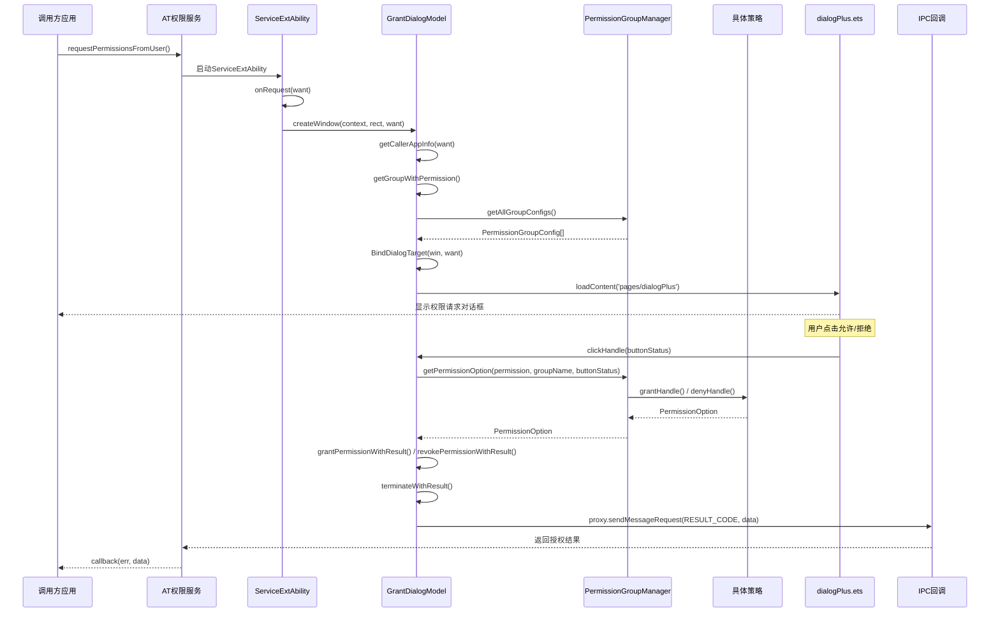
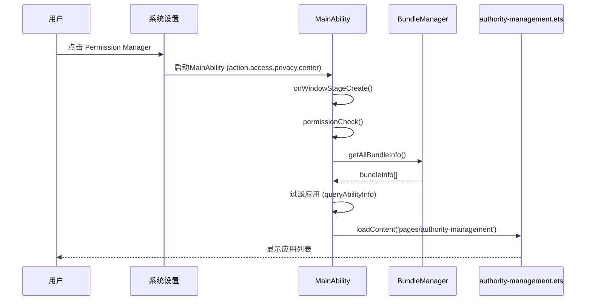

# 架构说明

> **目的**: 详细说明PermissionManager的架构设计，包括组件图、数据流、线程模型和关键时序  
> **适用范围**: 架构师、开发者、安全研究人员  
> **最后更新**: 2026-02-05

---

## 架构总览

PermissionManager采用 **OpenHarmony Stage模型** 架构，结合 **策略模式** 处理不同类型的权限请求。

### 架构图

```
┌─────────────────────────────────────────────────────────────────────────┐
│                           应用层 (调用方)                                │
│  ┌─────────────────────────────────────────────────────────────────┐   │
│  │  import abilityAccessCtrl from '@ohos.abilityAccessCtrl'       │   │
│  │  atManager.requestPermissionsFromUser(context, permissions)    │   │
│  └─────────────────────────────────────────────────────────────────┘   │
└─────────────────────────────────────────────────────────────────────────┘
                                    │
                                    ▼
┌─────────────────────────────────────────────────────────────────────────┐
│                           系统服务层 (AT权限服务)                         │
│  ┌─────────────────────────────────────────────────────────────────┐   │
│  │  security_access_token 服务                                    │   │
│  │  - 验证权限请求                                                │   │
│  │  - 启动 PermissionManager ServiceExtAbility                   │   │
│  └─────────────────────────────────────────────────────────────────┘   │
└─────────────────────────────────────────────────────────────────────────┘
                                    │
                                    ▼
┌─────────────────────────────────────────────────────────────────────────┐
│                        PermissionManager 应用层                          │
│  ┌─────────────────────────────────────────────────────────────────┐   │
│  │  ServiceExtAbility.ets                                         │   │
│  │  - onRequest(want) → createWindow()                           │   │
│  │  - GrantDialogModel.getCallerAppInfo(want)                    │   │
│  │  - loadContent('pages/dialogPlus')                            │   │
│  └─────────────────────────────────────────────────────────────────┘   │
│                                    │                                    │
│                                    ▼                                    │
│  ┌─────────────────────────────────────────────────────────────────┐   │
│  │  PermissionGroupManager (单例)                                  │   │
│  │  - 管理22个权限组策略                                          │   │
│  │  - getGroupConfigs() → 权限组配置                              │   │
│  │  - getPermissionOption() → 授权/拒绝处理                       │   │
│  └─────────────────────────────────────────────────────────────────┘   │
│                                    │                                    │
│                    ┌───────────────┼───────────────┐                   │
│                    ▼               ▼               ▼                   │
│  ┌─────────────────────┐ ┌─────────────────┐ ┌─────────────────────┐  │
│  │ LocationStrategy   │ │ CameraStrategy │ │ MicrophoneStrategy │  │
│  │ (位置权限组)        │ │ (相机权限组)    │ │ (麦克风权限组)      │  │
│  └─────────────────────┘ └─────────────────┘ └─────────────────────┘  │
│                                                                        │
│  ┌─────────────────────────────────────────────────────────────────┐   │
│  │  dialogPlus.ets (UI层)                                         │   │
│  │  - 显示权限请求对话框                                          │   │
│  │  - 用户交互 (允许/拒绝)                                        │   │
│  │  - GrantDialogModel.clickHandle()                             │   │
│  └─────────────────────────────────────────────────────────────────┘   │
│                                    │                                    │
│                                    ▼                                    │
│  ┌─────────────────────────────────────────────────────────────────┐   │
│  │  IPC回调 → atManager (返回结果给调用方应用)                     │   │
│  └─────────────────────────────────────────────────────────────────┘   │
└─────────────────────────────────────────────────────────────────────────┘
```

---

## 组件详细说明

### 1. Ability组件

#### 1.1 ServiceExtAbility (权限请求)

```
┌─────────────────────────────────────┐
│      ServiceExtAbility.ets          │
├─────────────────────────────────────┤
│  onCreate(want)                     │
│  └── 初始化 GlobalContext.windowNum │
├─────────────────────────────────────┤
│  onRequest(want, startId)           │
│  ├── 检查设备类型 (wearable跳过)    │
│  ├── getDefaultDisplaySync()        │
│  └── grantDialogModel.createWindow()│
├─────────────────────────────────────┤
│  onDestroy()                        │
└─────────────────────────────────────┘
```

**关键代码**: `permissionmanager/src/main/ets/ServiceExtAbility/ServiceExtAbility.ets:26`

#### 1.2 MainAbility (权限管理设置)

```
┌─────────────────────────────────────┐
│         MainAbility.ts              │
├─────────────────────────────────────┤
│  onCreate()                         │
│  └── 存储 caller bundleName         │
├─────────────────────────────────────┤
│  onWindowStageCreate()              │
│  ├── permissionCheck()              │
│  ├── getAllApplications() /         │
│  │   getSperifiedApplication()      │
│  ├── bundleMonitor.on('add')        │
│  ├── bundleMonitor.on('remove')     │
│  └── bundleMonitor.on('update')     │
├─────────────────────────────────────┤
│  onNewWant(want)                    │
│  └── 处理新Intent，切换视图         │
└─────────────────────────────────────┘
```

**关键代码**: `permissionmanager/src/main/ets/MainAbility/MainAbility.ts:26`

### 2. 策略模式组件

#### 2.1 策略基类

```typescript
// BasePermissionStrategy.ets
abstract class BasePermissionStrategy {
    abstract getPermissionGroupConfig(): PermissionGroupConfig;
    abstract getGroupTitle(appName: string, locationFlag: number): ResourceStr;
    
    getReasonByPermission(...): ResourceStr;  // 获取授权理由
    grantHandle(...): PermissionOption;       // 授权处理
    denyHandle(...): PermissionOption;        // 拒绝处理
    preProcessingPermission(...): Promise<PermissionWithOption[]>;  // 预处理
}
```

**关键代码**: `permissionmanager/src/main/ets/common/base/BasePermissionStrategy.ets:21`

#### 2.2 策略管理器

```
┌─────────────────────────────────────────────────────────────┐
│              PermissionGroupManager (单例)                   │
├─────────────────────────────────────────────────────────────┤
│  permissionStrategies: Map<PermissionGroup, BasePermissionStrategy> │
├─────────────────────────────────────────────────────────────┤
│  构造函数()                                                  │
│  ├── set(LOCATION, new LocationStrategy())                  │
│  ├── set(CAMERA, new CameraStrategy())                      │
│  ├── set(MICROPHONE, new MicrophoneStrategy())              │
│  └── ... (共22个策略)                                        │
├─────────────────────────────────────────────────────────────┤
│  getAllGroupConfigs(): PermissionGroupConfig[]              │
│  getGroupNameByPermission(permission): PermissionGroup      │
│  getGroupConfigs(callerAppInfo, ...): PermissionGroupConfig[]│
│  getPermissionOption(...): PermissionOption                 │
│  preProcessPermission(...): Promise<PermissionWithOption[]>│
└─────────────────────────────────────────────────────────────┘
```

**关键代码**: `permissionmanager/src/main/ets/common/permissionGroupManager/PermissionGroupManager.ets:42`

### 3. 数据流组件

#### 3.1 GrantDialogModel

```
┌─────────────────────────────────────────────────────────────┐
│                  GrantDialogModel.ets                        │
├─────────────────────────────────────────────────────────────┤
│  getCallerAppInfo(want): CallerAppInfo                      │
│  ├── 解析 want.parameters['ohos.aafwk.param.callerBundleName'] │
│  ├── 解析 want.parameters['ohos.aafwk.param.callerToken']   │
│  ├── 解析 want.parameters['ohos.user.grant.permission']     │
│  ├── 解析 want.parameters['ohos.user.grant.permission.state']│
│  └── 解析 want.parameters['ohos.ability.params.callback']   │
├─────────────────────────────────────────────────────────────┤
│  getGroupWithPermission(reqPerms, reqPermsState): Map       │
│  └── 将权限按权限组分类                                      │
├─────────────────────────────────────────────────────────────┤
│  createWindow(context, name, rect, want)                    │
│  ├── window.createWindow()                                  │
│  ├── getCallerAppInfo(want)                                 │
│  ├── BindDialogTarget()                                     │
│  └── win.loadContent('pages/dialogPlus')                   │
├─────────────────────────────────────────────────────────────┤
│  clickHandle(groupConfig, callerAppInfo, locationFlag, buttonStatus) │
│  ├── PermissionGroupManager.getPermissionOption()          │
│  ├── grantPermissionWithResult() / revokePermissionWithResult() │
│  └── terminateWithResult() (IPC返回结果)                   │
└─────────────────────────────────────────────────────────────┘
```

**关键代码**: `permissionmanager/src/main/ets/ServiceExtAbility/GrantDialogModel.ets:49`

---

## 数据流图

### 权限请求完整流程



### 权限管理设置流程



---

## 线程模型

### 主线程职责

所有UI操作和Ability生命周期回调都在**主线程**执行：

1. **Ability生命周期**: onCreate, onRequest, onWindowStageCreate等
2. **UI渲染**: ArkUI组件渲染和更新
3. **用户交互**: 点击事件处理
4. **IPC回调**: sendMessageRequest回调

### 异步操作

```typescript
// 异步获取用户信息
async getUserId(): Promise<number> {
    const accountManager = osAccount.getAccountManager();
    return await accountManager.getForegroundOsAccountLocalId();
}

// 异步授权权限
async grantPermissionWithResult(...): Promise<optionAndState> {
    await atManager.grantUserGrantedPermission(tokenId, permission, flag);
    return { operationResult, permissionState };
}
```

**注意**: 项目中未使用Worker线程或TaskPool，所有操作都在主线程异步执行。

---

## 关键时序

### 1. 权限请求时序

```
时间线 ──────────────────────────────────────────────────────────────►

应用                    AT服务                ServiceExtAbility
 │                        │                           │
 │  requestPermissions()  │                           │
 │───────────────────────►│                           │
 │                        │                           │
 │                        │  启动GrantAbility         │
 │                        │──────────────────────────►│
 │                        │                           │
 │                        │                           │  onRequest()
 │                        │                           │  createWindow()
 │                        │                           │  getCallerAppInfo()
 │                        │                           │
 │                        │                           │  显示dialogPlus
 │                        │                           │◄───────────────
 │                        │                           │  用户交互
 │                        │                           │
 │                        │  IPC返回结果              │  terminateWithResult()
 │                        │◄──────────────────────────│
 │                        │                           │
 │  callback(err, data)   │                           │
 │◄───────────────────────│                           │
 │                        │                           │
```

### 2. 权限策略调用时序

```
dialogPlus.ets
    │
    ▼
clickHandle(buttonStatus)
    │
    ▼
PermissionGroupManager.getPermissionOption(permission, groupName, callerAppInfo, locationFlag, buttonStatus)
    │
    ├── 获取策略实例 ──────────────────► 具体策略类 (e.g., LocationStrategy)
    │                                          │
    │◄────────────────────────────────── getPermissionGroupConfig()
    │                                          │
    │◄────────────────────────────────── grantHandle() / denyHandle()
    │                                          │
    │                                  返回 PermissionOption
    │
    ▼
返回 PermissionOption (GRANT / REVOKE / SKIP)
```

---

## 状态管理

### 全局状态 (GlobalContext)

```typescript
// globalContext.ets
class GlobalContext {
    private static instance: GlobalContext;
    private context: Map<string, Object> = new Map();
    
    // 存储全局状态
    store(key: string, value: Object): void
    
    // 加载全局状态
    load(key: string): Object | undefined
    
    // 窗口数量管理
    setAndGetWindowNum(num: number): number
    increaseAndGetWindowNum(): number
    decreaseAndGetWindowNum(): number
}
```

### LocalStorage (页面级状态)

```typescript
// 创建LocalStorage传递数据
let storage: LocalStorage = new LocalStorage({ 
    'win': win, 
    'callerAppInfo': callerAppInfo 
});
await win.loadContent('pages/dialogPlus', storage);

// 在页面中获取
@LocalStorageProp('callerAppInfo') callerAppInfo: CallerAppInfo;
```

---

## 安全边界

### 信任边界

```
┌─────────────────────────────────────────────────────────────┐
│                    不信任区域 (调用方应用)                     │
│  - 可能传递恶意参数                                           │
│  - 可能尝试绕过权限检查                                       │
└─────────────────────────────────────────────────────────────┘
                            │
                            ▼ (通过系统服务验证)
┌─────────────────────────────────────────────────────────────┐
│                      信任边界 (系统服务层)                     │
│  - AT权限服务验证调用者身份                                   │
│  - 校验权限请求的合法性                                       │
└─────────────────────────────────────────────────────────────┘
                            │
                            ▼
┌─────────────────────────────────────────────────────────────┐
│                     信任区域 (PermissionManager)              │
│  - 接收经过验证的want参数                                     │
│  - 但仍需防御性编程（参数校验）                               │
└─────────────────────────────────────────────────────────────┘
```

### 输入验证点

1. **want参数解析**: `GrantDialogModel.getCallerAppInfo()`
   - 检查 `want.parameters` 是否存在
   - 使用空值合并运算符提供默认值

2. **权限状态验证**: `GrantDialogModel.needHandlePermission()`
   - 检查权限是否受设备支持
   - 检查权限状态是否为待授权

3. **窗口重复检查**: `SecurityExtAbility.createWindow()`
   - 使用 `dialogSet` 防止重复创建对话框

---

## 依赖关系图

```
┌─────────────────────────────────────────────────────────────────────┐
│                         PermissionManager                           │
│                                                                     │
│   ┌─────────────────┐                                               │
│   │   MainAbility   │◄────── 系统设置 (action.access.privacy.center)│
│   └────────┬────────┘                                               │
│            │                                                        │
│            ▼                                                        │
│   ┌─────────────────┐    ┌─────────────────┐                        │
│   │ authority-mgmt  │    │ application-*   │                        │
│   └────────┬────────┘    └────────┬────────┘                        │
│            │                       │                                │
│            └───────────┬───────────┘                                │
│                        ▼                                            │
│              ┌─────────────────┐                                    │
│              │  common/utils   │                                    │
│              └─────────────────┘                                    │
│                                                                     │
│   ┌─────────────────────────────────────────────────────────────┐  │
│   │                    ServiceExtAbility                         │  │
│   │  ┌──────────────┐  ┌──────────────┐  ┌──────────────┐       │  │
│   │  │ GrantDialog  │  │  Permission  │  │   dialogPlus │       │  │
│   │  │    Model     │──│GroupManager  │──│    (UI)      │       │  │
│   │  └──────────────┘  └──────┬───────┘  └──────────────┘       │  │
│   │                           │                                  │  │
│   │              ┌────────────┼────────────┐                     │  │
│   │              ▼            ▼            ▼                     │  │
│   │       ┌──────────┐  ┌──────────┐  ┌──────────┐              │  │
│   │       │Location  │  │  Camera  │  │ Microphone            │  │
│   │       │ Strategy │  │ Strategy │  │ Strategy │              │  │
│   │       └──────────┘  └──────────┘  └──────────┘              │  │
│   │              ... (20+ strategies)                           │  │
│   └─────────────────────────────────────────────────────────────┘  │
│                                                                     │
│   ┌─────────────────┐                                               │
│   │ 其他ExtAbility  │  (GlobalExtAbility, SecurityExtAbility)      │
│   └─────────────────┘                                               │
│                                                                     │
└─────────────────────────────────────────────────────────────────────┘
                                    │
                                    ▼ (依赖系统服务)
┌─────────────────────────────────────────────────────────────────────┐
│                        系统服务层                                    │
│   ┌───────────────┐ ┌───────────────┐ ┌───────────────┐            │
│   │abilityAccess  │ │  bundleManager │ │    window     │            │
│   │    Ctrl       │ │               │ │               │            │
│   └───────────────┘ └───────────────┘ └───────────────┘            │
│   ┌───────────────┐ ┌───────────────┐ ┌───────────────┐            │
│   │     rpc       │ │   display     │ │  pasteboard   │            │
│   └───────────────┘ └───────────────┘ └───────────────┘            │
└─────────────────────────────────────────────────────────────────────┘
```

---

## 扩展点

### 1. 新增权限组策略

如需支持新的权限组：

1. **创建策略类**: 继承 `BasePermissionStrategy`
   ```typescript
   // common/permissionGroupManager/NewPermissionStrategy.ets
   export class NewPermissionStrategy extends BasePermissionStrategy {
       getPermissionGroupConfig(): PermissionGroupConfig { ... }
       getGroupTitle(...): ResourceStr { ... }
   }
   ```

2. **注册到管理器**: 在 `PermissionGroupManager.ets` 构造函数中添加
   ```typescript
   this.permissionStrategies.set(PermissionGroup.NEW, new NewPermissionStrategy());
   ```

3. **定义枚举**: 在 `definition.ets` 中添加Permission和PermissionGroup

### 2. 自定义权限组行为

覆盖基类方法实现自定义逻辑：

```typescript
export class CustomStrategy extends BasePermissionStrategy {
    // 自定义按钮列表
    getButtonList(): ButtonStatus[] {
        return [ButtonStatus.ALLOW, ButtonStatus.DENY, ButtonStatus.CANCEL];
    }
    
    // 自定义授权处理
    grantHandle(permission, callerAppInfo, locationFlag, buttonStatus): PermissionOption {
        // 自定义逻辑
        return PermissionOption.GRANT;
    }
}
```

---

*上一篇: [目录结构](01_Directory_Structure.md) | 返回 [README](README.md) | 下一篇: [对外API参考](03_API_Reference.md)*
