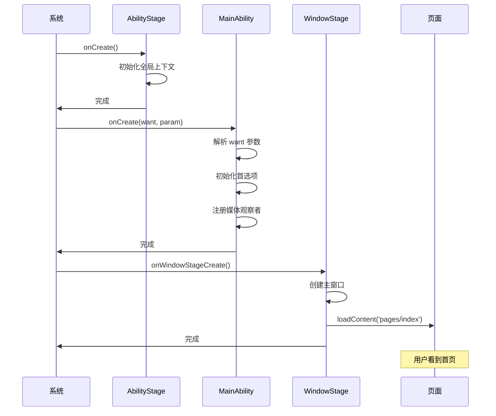
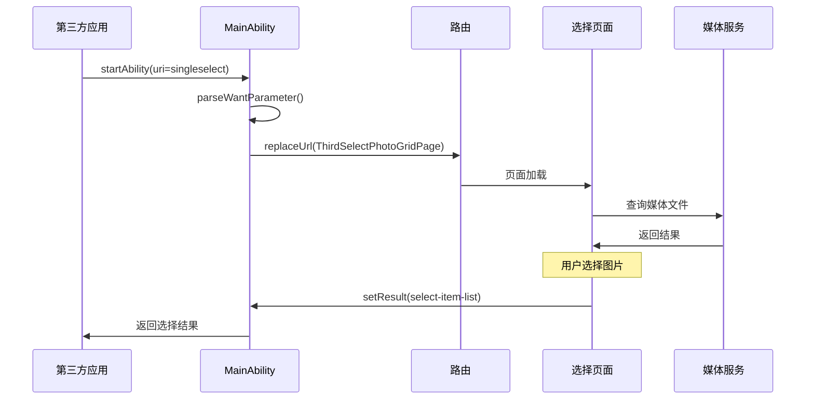

# 系统架构

## 1. 整体架构

### 1.1 架构层次

```
┌─────────────────────────────────────────────────────────────────┐
│                        应用层 (Application)                       │
│  ┌───────────────────────────────────────────────────────────┐  │
│  │                    View (视图层)                            │  │
│  │  • UI 组件渲染                                              │  │
│  │  • 触摸/点击事件监听                                        │  │
│  │  • 页面路由管理                                             │  │
│  └───────────────────────────────────────────────────────────┘  │
│  ┌───────────────────────────────────────────────────────────┐  │
│  │                 Presenter (展现层)                          │  │
│  │  • 业务逻辑处理                                            │  │
│  │  • View-Model 桥接                                         │  │
│  │  • 事件分发                                                │  │
│  └───────────────────────────────────────────────────────────┘  │
│  ┌───────────────────────────────────────────────────────────┐  │
│  │                   Model (模型层)                           │  │
│  │  • 数据获取与处理                                          │  │
│  │  • 业务规则                                                │  │
│  │  • 状态管理                                                │  │
│  └───────────────────────────────────────────────────────────┘  │
├─────────────────────────────────────────────────────────────────┤
│                     OpenHarmony 框架层                          │
│  • Ability 框架                                                │
│  • ArkUI 组件库                                                │
│  • 分布式能力                                                   │
├─────────────────────────────────────────────────────────────────┤
│                     OpenHarmony 系统服务层                       │
│  • UserFileManager (媒体文件管理)                               │
│  • MediaLibrary (媒体库)                                        │
│  • WindowManager (窗口管理)                                     │
└─────────────────────────────────────────────────────────────────┘
```

### 1.2 架构特点

| 特点 | 说明 | 证据 |
|------|------|------|
| **MVVM 基础** | 基于 OpenHarmony MVVM 架构 | `README_zh.md:10` |
| **MVP 扩展** | 在 View 层基础上扩展 MVP | `README_zh.md:10` |
| **分层清晰** | View-Presenter-Model 职责分离 | `README_zh.md:14-16` |
| **模块复用** | 功能模块以 HAR 形式提供 | `build-profile.json5` |

---

## 2. 模块架构

### 2.1 模块依赖关系

```
┌─────────────────────────────────────────────────────────────────┐
│                      phone_photos (entry)                       │
│                    主入口模块，集成所有功能                       │
├─────────────────────────────────────────────────────────────────┤
│                         │                                        │
│           ┌─────────────┼─────────────┐                         │
│           │             │             │                          │
│           ▼             ▼             ▼                          │
│    ┌──────────┐  ┌──────────┐  ┌──────────┐                     │
│    │ photos_  │  │ photos_  │  │ photos_  │                     │
│    │ common   │  │ browser  │  │ editor   │                     │
│    │  (HAR)   │  │  (HAR)   │  │  (HAR)   │                     │
│    └──────────┘  └──────────┘  └──────────┘                     │
│           │             │             │                          │
│           └─────────────┼─────────────┘                         │
│                         │                                        │
│           ┌─────────────┼─────────────┐                         │
│           │             │             │                          │
│           ▼             ▼             ▼                          │
│    ┌──────────┐  ┌──────────┐  ┌──────────┐                     │
│    │ photos_  │  │ photos_   │  │ photos_  │                     │
│    │formAbility│ │ thirdselect│ │ timeline │                     │
│    │  (HAR)   │  │  (HAR)    │  │  (HAR)   │                     │
│    └──────────┘  └──────────┘  └──────────┘                     │
└─────────────────────────────────────────────────────────────────┘
```

### 2.2 模块职责

| 模块 | 类型 | 核心职责 | 导出内容 |
|------|------|----------|----------|
| **photos_common** | HAR | 共享基础组件、工具类、数据模型 | 常量、工具、Model 基类 |
| **photos_browser** | HAR | 图片/视频浏览核心逻辑 | 浏览组件、数据源 |
| **photos_editor** | HAR | 图片编辑功能（裁剪等） | 编辑组件、工具 |
| **photos_formAbility** | HAR | FA 卡片编辑 | 卡片组件 |
| **photos_thirdselect** | HAR | 第三方选择器 | 选择 UI、回调 |
| **photos_timeline** | HAR | 日视图展示 | 时间线组件 |
| **phone_photos** | entry | 入口集成 | MainAbility、页面路由 |

---

## 3. 线程模型

### 3.1 主线程（UI 线程）

```
┌─────────────────────────────────────────────────────────┐
│                      Main Thread                          │
│                                                         │
│  ┌─────────────────────────────────────────────────┐    │
│  │              UIAbility Stage                     │    │
│  │  • onCreate() - 应用初始化                       │    │
│  │  • onWindowStageCreate() - UI 窗口创建           │    │
│  │  • onDestroy() - 资源释放                        │    │
│  └─────────────────────────────────────────────────┘    │
│                                                         │
│  ┌─────────────────────────────────────────────────┐    │
│  │              Page Lifecycle                       │    │
│  │  • onPageShow() / onPageHide()                   │    │
│  │  • router.pushUrl() / replaceUrl()                │    │
│  └─────────────────────────────────────────────────┘    │
│                                                         │
│  ┌─────────────────────────────────────────────────┐    │
│  │              Event Loop                          │    │
│  │  • UI 渲染更新                                    │    │
│  │  • 用户交互响应                                   │    │
│  │  • 轻量计算任务                                   │    │
│  └─────────────────────────────────────────────────┘    │
└─────────────────────────────────────────────────────────┘
```

### 3.2 数据异步处理

```
UI Thread                                  Worker/Async
    │                                          │
    │  1. 用户操作                              │
    │ ──────────────────────────────────>       │
    │                                          │
    │  2. 发起异步请求                         │
    │ ──────────────────────────────────>       │
    │                                          │
    │  3. 后台处理                             │
    │         ┌───────────────────────────┐     │
    │         │ • 文件 I/O               │     │
    │         │ • 数据库查询              │     │
    │         │ • 媒体解码                │     │
    │         └───────────────────────────┘     │
    │                                          │
    │  4. 回调结果                             │
    │ <────────────────────────────────────     │
    │                                          │
    │  5. UI 更新                              │
    │ ──────────────────────────────────>       │
```

### 3.3 关键异步操作

| 操作 | 线程 | 机制 | 证据 |
|------|------|------|------|
| 媒体文件查询 | 后台线程 | `MediaLibrary` 异步 API | 系统 API |
| 图片解码 | 后台线程 | `Image` 组件异步加载 | ArkUI |
| 大数据上报 | 后台线程 | `ReportToBigDataUtil` | `common/utils/` |
| 数据观察 | 主线程回调 | `MediaObserver` | `common/model/` |

---

## 4. 数据流

### 4.1 外部调用数据流

```
第三方应用                              Photos App
    │                                      │
    │ 1. startAbility/sendResult           │
    │ ══════════════════════════════════>   │
    │                                      │
    │ 2. MainAbility.onCreate()            │
    │    parseWantParameter()              │
    │ ══════════════════════════════════>   │
    │                                      │
    │ 3. 路由分发                          │
    │    router.replaceUrl()               │
    │ ══════════════════════════════════>   │
    │                                      │
    │ 4. 目标页面加载                       │
    │    读取媒体数据                       │
    │ ══════════════════════════════════>   │
    │                                      │
    │ 5. 用户选择完成                       │
    │    setResult(want)                  │
    │ <══════════════════════════════════   │
```

> **证据**: `MainAbility.ts:60-166` - `onCreate()` 和 `parseWantParameter()`

### 4.2 媒体数据观察流

```
MediaLibrary (系统服务)
        │
        │ 1. 注册观察者
        │ <───────────────────── MediaObserver
        │
        │ 2. 数据变化通知
        │ ════════════════════════>
        │
        │ 3. 更新 DataSource
        │ <───────────────────── DataSource
        │
        │ 4. 通知 UI 刷新
        │ <───────────────────── LazyForEach
        │
        │ 5. 组件重新渲染
        │ ─────────────────────> UI Component
```

> **证据**: `MainAbility.ts:69-70` - `MediaObserver.getInstance().registerForAllPhotos()`

---

## 5. 关键时序图

### 5.1 应用启动时序



### 5.2 外部选择器时序



---

## 6. 资源生命周期

### 6.1 Ability 生命周期

```
┌─────────────────────────────────────────────────────────────────┐
│                     UIAbility 生命周期                            │
├─────────────────────────────────────────────────────────────────┤
│                                                                 │
│  onCreate() ─────► onWindowStageCreate() ─────► onForeground() │
│       │                    │                        │           │
│       │                    │                        │           │
│       ▼                    ▼                        ▼           │
│  初始化              窗口创建                    进入前台          │
│  • 配置读取          • UI 内容加载               • 恢复动画       │
│  • 观察者注册       • 屏幕初始化                • 音频恢复       │
│                                                                 │
│  onBackground() ◄──── onWindowStageDestroy() ◄── onDestroy()  │
│       │                    │                        │           │
│       │                    │                        │           │
│       ▼                    ▼                        ▼           │
│  进入后台            窗口销毁                    销毁             │
│  • 暂停动画          • 释放窗口资源             • 清理资源       │
│  • 暂停视频          • 保存状态                 • 注销观察者     │
│                                                                 │
└─────────────────────────────────────────────────────────────────┘
```

### 6.2 资源释放时机

| 资源 | 释放时机 | 释放方式 | 证据 |
|------|----------|----------|------|
| **媒体观察者** | `onDestroy()` | `MediaObserver.unregisterForAllPhotos()` | `MainAbility.ts:176-177` |
| **状态栏控制器** | `onDestroy()` | `StatusBarColorController.release()` | `MainAbility.ts:173-174` |
| **窗口模式** | `onWindowStageDestroy()` | `ScreenManager.destroyWindowMode()` | `MainAbility.ts:212` |
| **UserFileManager** | `onDestroy()` | `onDestroy()` | `MainAbility.ts:178` |

---

## 7. 架构决策记录

| 决策 | 决策内容 | 原因 | 影响 |
|------|----------|------|------|
| 采用 MVP 扩展 MVVM | 在 View 层基础上增加 Presenter 层 | 解耦 UI 和业务逻辑 | 提升代码可维护性 |
| 按 Feature 模块化 | browser/editor/timeline 分开 | 独立编译、复用 | HAR 复用 |
| 单例窗口 | MainAbility launchType=singleton | 避免多实例 | 内存优化 |
