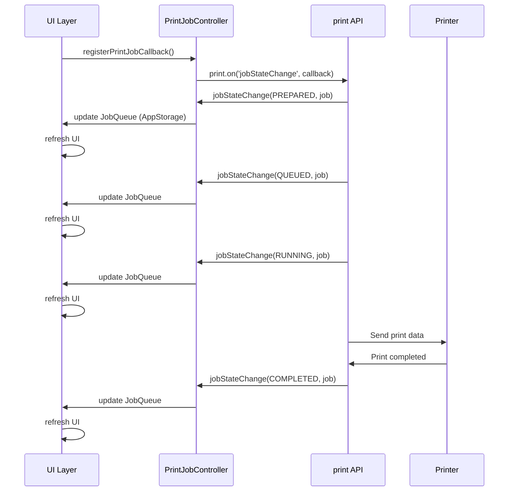
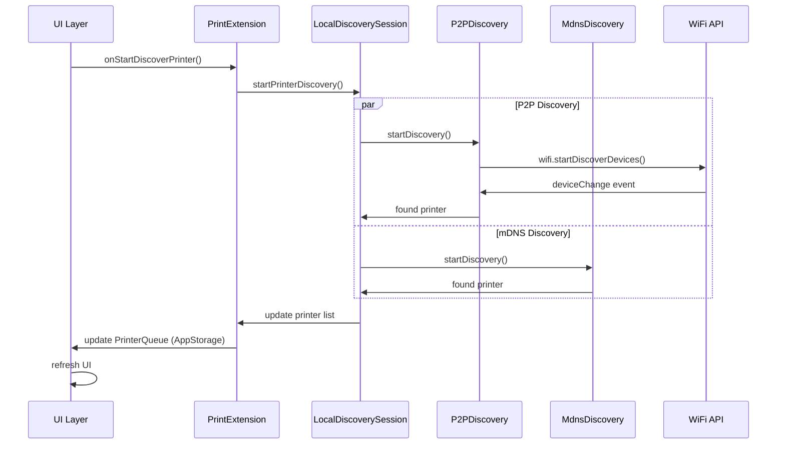

# 架构说明

## 目的

本文档描述 PrintSpooler 的系统架构设计，包括组件关系、数据流、线程模型和关键时序。

## 适用范围

本文档适用于：

- 理解系统整体架构的开发者
- 进行架构设计的架构师
- 需要理解数据流的技术人员

## 关键结论

1. **分层架构**：UI 层、控制层、服务层、协议层
2. **模块化设计**：entry、common、ippPrint、driverEntry 四个模块
3. **异步处理**：大量使用 Worker 和 Promise 实现异步操作
4. **事件驱动**：通过事件监听实现状态更新

---

## 整体架构

### 系统分层

```
┌─────────────────────────────────────────────────┐
│              应用层 (Application)              │
│                                             │
│  ┌─────────────────────────────────────────┐   │
│  │       entry 模块 (HAP)            │   │
│  │                                    │   │
│  │  ┌────────────────────────────────┐ │   │
│  │  │      UI 层               │ │   │
│  │  │  - MainAbility              │ │   │
│  │  │  - JobManagerAbility       │ │   │
│  │  │  - Pages (Print, Job, etc.)│ │   │
│  │  └────────────────────────────────┘ │   │
│  │                                    │   │
│  │  ┌────────────────────────────────┐ │   │
│  │  │    控制层            │ │   │
│  │  │  - PrintJobManager       │ │   │
│  │  │  - PrinterDiscController  │ │   │
│  │  │  - PrintExtensionController│ │   │
│  │  └────────────────────────────────┘ │   │
│  └─────────────────────────────────────────┘   │
│                                             │
└─────────────────────────────────────────────────┘
                      │ depends on
                      ▼
┌─────────────────────────────────────────────────┐
│         服务层 (Services)                   │
│                                             │
│  ┌─────────────────────────────────────────┐   │
│  │   ippPrint 模块 (HAR)             │   │
│  │                                    │   │
│  │  ┌────────────────────────────────┐ │   │
│  │  │   发现服务              │ │   │
│  │  │  - P2PDiscovery             │ │   │
│  │  │  - MdnsDiscovery            │ │   │
│  │  │  - LocalDiscoverySession     │ │   │
│  │  └────────────────────────────────┘ │   │
│  │                                    │   │
│  │  ┌────────────────────────────────┐ │   │
│  │  │   连接服务               │ │   │
│  │  │  - P2pPrinterConnection     │ │   │
│  │  │  - ConnectionListener       │ │   │
│  │  └────────────────────────────────┘ │   │
│  │                                    │   │
│  │  ┌────────────────────────────────┐ │   │
│  │  │   IPP 协议层            │ │   │
│  │  │  - Backend                 │ │   │
│  │  │  - CapabilitiesCache        │ │   │
│  │  └────────────────────────────────┘ │   │
│  └─────────────────────────────────────────┘   │
│                                             │
└─────────────────────────────────────────────────┘
                      │ depends on
                      ▼
┌─────────────────────────────────────────────────┐
│         公共层 (Common)                    │
│                                             │
│  ┌─────────────────────────────────────────┐   │
│  │     common 模块 (HAR)              │   │
│  │  - Utils (工具类)                  │   │
│  │  - Models (数据模型)               │   │
│  │  - Constants (常量定义)           │   │
│  └─────────────────────────────────────────┘   │
│                                             │
└─────────────────────────────────────────────────┘

                      │
                      ▼
┌─────────────────────────────────────────────────┐
│       OpenHarmony 系统 API 层                │
│                                             │
│  - @kit.BasicServicesKit (print)           │
│  - @ohos.wifi                             │
│  - @ohos.file.fs                           │
│  - @ohos.multimedia.image                   │
│  - @ohos.bundle.bundleManager               │
│                                             │
└─────────────────────────────────────────────────┘
```

---

## 核心组件

### 1. 主 Ability 组件

**MainAbility**
- 类型：UIExtensionAbility
- 职责：应用主入口，管理打印预览界面
- 生命周期：onCreate, onSessionCreate, onDestroy

**证据**：`entry/src/main/ets/MainAbility/MainAbility.ets:36`

**JobManagerAbility**
- 类型：UIExtensionAbility
- 职责：管理打印任务队列和状态
- 生命周期：onCreate, onDestroy

**证据**：`entry/src/main/module.json5:36-45`

### 2. 打印扩展组件

**PrintExtension**
- 类型：PrintExtensionAbility
- 职责：实现打印扩展接口，响应系统打印请求
- 生命周期：onCreate, onStartDiscoverPrinter, onConnectPrinter, onStartPrintJob, etc.

**证据**：`entry/src/main/ets/ServiceExtAbility/PrintExtension.ts:36`

**关键方法**：
- `onStartDiscoverPrinter()` - 开始发现打印机
- `onConnectPrinter(printerId)` - 连接打印机
- `onDisconnectPrinter(printerId)` - 断开打印机
- `onStartPrintJob(printJob)` - 开始打印任务
- `onCancelPrintJob(printJob)` - 取消打印任务
- `onRequestPrinterCapability(printerId)` - 查询打印机能力

### 3. 发现服务组件

**P2PDiscovery**
- 职责：通过 WiFi P2P 发现打印机
- 实现类：`feature/ippPrint/src/main/ets/common/discovery/P2pDiscovery.ts`

**MdnsDiscovery**
- 职责：通过 mDNS 发现局域网 IPP 打印机
- 实现类：`feature/ippPrint/src/main/ets/common/discovery/MdnsDiscovery.ts`

**证据**：`entry/src/main/ets/ServiceExtAbility/PrintExtension.ts:56-58`

### 4. 连接管理组件

**P2pPrinterConnection**
- 职责：管理 P2P 打印机连接
- 实现类：`feature/ippPrint/src/main/ets/common/connect/P2pPrinterConnection.ts`

**ConnectionListener**
- 职责：监听连接状态变化
- 实现类：`feature/ippPrint/src/main/ets/common/connect/ConnectionListener.ts`

### 5. 任务管理组件

**PrintJobManager**
- 职责：管理打印任务的生命周期
- 实现类：`entry/src/main/ets/Controller/PrintJobManager.ts`

**证据**：`entry/src/main/ets/Model/JobViewModel/PrintJobViewModel.ets:26`

---

## 数据流

### 打印任务流程

```
用户触发打印 (其他应用)
        ↓
    [Want] (jobId, fileList, attributes)
        ↓
┌──────────────────────────────────────────┐
│   PrintServiceExtAbility             │
│   (entry/src/main/...)              │
│                                    │
│   onSessionCreate()                │
│   - 解析 Want 参数                │
│   - 获取文件列表和属性            │
│   - 启动 PrintPage               │
└──────────────────────────────────────────┘
        ↓
┌──────────────────────────────────────────┐
│   PrintPage (UI)                   │
│   - 显示预览界面                   │
│   - 设置打印参数                   │
│   - 选择打印机                     │
└──────────────────────────────────────────┘
        ↓
用户点击"开始打印"
        ↓
┌──────────────────────────────────────────┐
│   PrintJobController               │
│   - 创建 PrintJob               │
│   - 设置打印参数                 │
└──────────────────────────────────────────┘
        ↓
    [print.startJob()] (系统 API)
        ↓
┌──────────────────────────────────────────┐
│   Print Extension                  │
│   (entry/src/main/...)              │
│   - onStartPrintJob()              │
│   - 调用后端打印                │
└──────────────────────────────────────────┘
        ↓
┌──────────────────────────────────────────┐
│   Backend (ippPrint)               │
│   - 构造 IPP 请求               │
│   - 发送到打印机                  │
└──────────────────────────────────────────┘
        ↓
    [IPP 协议传输]
        ↓
    [打印机]
```

### 打印机发现流程

```
用户打开打印机选择
        ↓
┌──────────────────────────────────────────┐
│   PrintExtension                  │
│   onStartDiscoverPrinter()         │
└──────────────────────────────────────────┘
        ↓
┌──────────────────────────────────────────┐
│   LocalDiscoverySession           │
│   - 启动 P2P 发现               │
│   - 启动 mDNS 发现              │
└──────────────────────────────────────────┘
        ↓
┌──────────────────┐   ┌──────────────────┐
│  P2PDiscovery   │   │  MdnsDiscovery   │
│  - 发现 P2P 设备│   │  - mDNS 服务   │
└──────────────────┘   └──────────────────┘
        ↓                    ↓
    [P2P 设备列表]      [mDNS 设备列表]
        ↓                    ↓
        └────────┬─────────┘
                 ▼
┌──────────────────────────────────────────┐
│   PrinterQueue (UI)               │
│   - 显示发现的打印机列表           │
└──────────────────────────────────────────┘
```

### 打印机连接流程

```
用户选择打印机并点击连接
        ↓
┌──────────────────────────────────────────┐
│   P2pPrinterConnection           │
│   - 构建 P2P 配置               │
│   - 调用 wifi.connectToPrinter() │
└──────────────────────────────────────────┘
        ↓
    [WiFi P2P 连接]
        ↓
┌──────────────────────────────────────────┐
│   ConnectionListener              │
│   - 监听连接状态               │
│   onConnectionChanged(state)      │
└──────────────────────────────────────────┘
        ↓
连接成功
        ↓
┌──────────────────────────────────────────┐
│   NativeApi                      │
│   getCapabilities(uri, name)      │
│   - 调用 print API             │
│   - 查询打印机能力             │
│   - 配置 CUPS 打印机           │
└──────────────────────────────────────────┘
        ↓
    [print.queryPrinterCapabilityByUri()]
    [print.addPrinterToCups()]
        ↓
┌──────────────────────────────────────────┐
│   CUPS 服务                        │
│   - 添加打印机配置               │
└──────────────────────────────────────────┘
```

---

## 线程模型

### 主线程（UI 线程）

**职责**：
- UI 渲染和交互
- Ability 生命周期回调
- AppStorage 状态管理

**证据**：
- 所有 @Component 和 @Entry 装饰的类在主线程运行
- AppStorage 状态更新在主线程

### Worker 线程

**职责**：
- 耗时操作（文件处理、图像处理、网络请求）
- 避免阻塞 UI 线程

**Worker 列表**：
1. **PrintWorker** - 打印相关操作
   - 位置：`entry/src/main/ets/workers/PrintWorker.ts`
   - 职责：处理打印任务、文件操作

2. **DiscoveryWorker** - 发现相关操作
   - 位置：`entry/src/main/ets/workers/DiscoveryWorker.ts`
   - 职责：P2P 发现、mDNS 发现

**证据**：
- Worker 文件：`entry/src/main/ets/workers/`
- Worker 工具：`feature/ippPrint/src/main/ets/common/utils/WorkerUtil.ts`

### 异步模式

项目大量使用 Promise 和回调实现异步操作：

```typescript
// Promise 模式
print.queryPrinterCapabilityByUri(uri).then((result) => {
  // 处理结果
}).catch((error) => {
  // 处理错误
});

// 事件监听模式
print.on('jobStateChange', this.onJobStateChanged);
```

**证据**：
- `feature/ippPrint/src/main/ets/common/napi/NativeApi.ts:43-56` - Promise 使用
- `entry/src/main/ets/Controller/PrintJobController.ets` - 事件监听

---

## 状态管理

### AppStorage（全局状态）

PrintSpooler 使用 AppStorage 进行跨组件状态共享：

| 存储键 | 类型 | 说明 |
|---------|------|------|
| JobQueue | Array<PrintJob> | 打印任务队列 |
| PrinterQueue | Array<Printer> | 打印机队列 |
| PrintExtensionsList | Array<Extension> | 打印扩展列表 |
| configLanguage | string | 配置语言 |
| startPrintTime | number | 打印开始时间 |
| ingressPackage | string | 调用者包名 |
| appVersion | string | 应用版本 |
| documentName | string | 文档名称 |
| imageSourcesName | Array<FileModel> | 图像源列表 |

**证据**：
- 存储键定义：`common/src/main/ets/model/Constants.ts:175-186`
- AppStorage 使用：`entry/src/main/ets/pages/JobManagerPage.ets:41`

### GlobalThis（全局对象）

用于跨 Ability 和组件共享对象：

| 存储键 | 类型 | 说明 |
|---------|------|------|
| KEY_ABILITY_CONTEXT | UIAbilityContext | Ability 上下文 |
| KEY_PRINT_ADAPTER | PrintAdapter | 打印适配器 |
| KEY_PREFERENCES_ADAPTER | PreferencesAdapter | 首选项适配器 |
| KEY_CURRENT_PIXELMAP | PixelMap | 当前像素图 |

**证据**：
- 存储键定义：`common/src/main/ets/model/Constants.ts:188-205`

---

## 关键时序

### 打印任务状态监听时序



**证据**：
- 回调注册：`entry/src/main/ets/Controller/PrintJobController.ets:173`
- 状态监听：`entry/src/main/ets/Controller/PrintJobController.ets:177-201`

### 打印机发现时序



**证据**：
- 发现启动：`entry/src/main/ets/ServiceExtAbility/PrintExtension.ts:67-78`
- P2P 实现：`feature/ippPrint/src/main/ets/common/discovery/P2pDiscoveryChannel.ts:209-227`

---

## 相关跳转

- [项目概览](00_Overview.md) - 项目整体介绍
- [目录结构](02_Directory_Structure.md) - 代码组织
- [对外 API](04_External_API.md) - OpenHarmony 系统 API 使用
- [内部 API](05_Internal_API.md) - 模块间接口
- [附录：关键调用链](appendix/Callgraphs.md) - 详细调用流程
