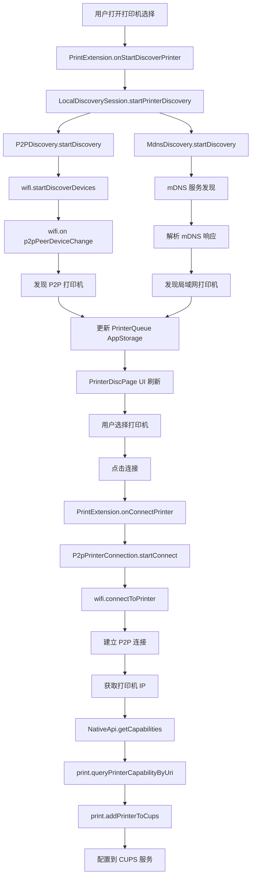
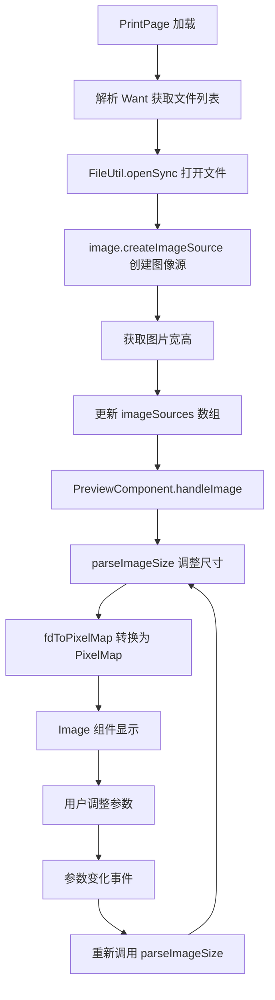
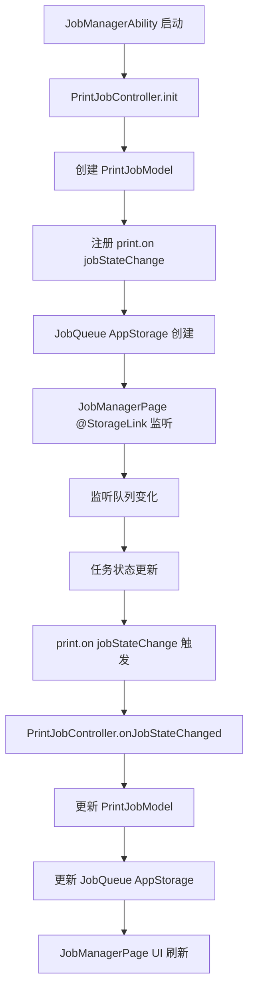

# 关键调用链

## 目的

本文档梳理 PrintSpooler 项目的关键调用链，帮助理解重要业务流程和数据流向。

## 适用范围

本文档适用于：

- 需要理解业务流程的开发者
- 问题排查的技术人员
- 架构设计和优化

---

## 调用链 1：打印任务完整流程

### 流程图

```mermaid
flowchart TD
    A[外部应用触发打印] --> B[PrintServiceExtAbility.onSessionCreate]
    B --> C[解析 Want 参数]
    C --> D[获取文件列表和属性]
    D --> E[PrintPage UI 显示]
    E --> F[用户设置打印参数]
    F --> G[用户选择打印机]
    G --> H[用户点击开始打印"]
    H --> I[PrintJobController.createPrintJob]
    I --> J[调用 print.startJob]
    J --> K[PrintExtension.onStartPrintJob]
    K --> L[Backend.sendPrintData]
    L --> M[构造 IPP 请求]
    M --> N[发送到打印机]
    N --> O[打印任务状态变化]
    O --> P[print.on jobStateChange]
    P --> Q[PrintJobController.onJobStateChanged]
    Q --> R[更新 JobQueue AppStorage]
    R --> S[JobManagerPage UI 刷新]
```

### 详细说明

**步骤 1：外部应用调用**
- 调用系统打印 API
- 传递参数：jobId, fileList, attributes, callerPid, pkgName

**证据**：`entry/src/main/ets/MainAbility/MainAbility.ets:78-100`

**步骤 2：PrintServiceExtAbility 接收**
- `onSessionCreate(want, session)` 被调用
- 解析 `want.parameters` 中的参数
- 提取文件列表、打印属性等

**证据**：`entry/src/main/ets/MainAbility/MainAbility.ets:78-100`

**步骤 3：显示 PrintPage**
- 创建打印预览页面
- 用户可以设置打印参数
- 用户可以选择打印机

**证据**：`entry/src/main/ets/pages/PrintPage.ets`

**步骤 4：创建打印任务**
- `PrintJobController.createPrintJob()` 被调用
- 设置打印参数（颜色、纸张、份数等）
- 调用系统 print API

**证据**：`entry/src/main/ets/Controller/PrintJobController.ts`

**步骤 5：PrintExtension 处理**
- `onStartPrintJob(printJob)` 被调用
- 调用 `Backend.sendPrintData()`
- 构造 IPP 请求并发送

**证据**：`entry/src/main/ets/ServiceExtAbility/PrintExtension.ts:135-137`

**步骤 6：发送到打印机**
- `Backend.sendPrintData()` 构造 IPP 协议请求
- 通过网络发送到打印机
- 监听任务状态变化

**证据**：`feature/ippPrint/src/main/ets/common/ipp/Backend.ts`

**步骤 7：状态变化监听**
- `print.on('jobStateChange')` 注册监听
- `onJobStateChanged()` 回调被调用
- 更新 `JobQueue` AppStorage
- UI 自动刷新

**证据**：`entry/src/main/ets/Controller/PrintJobController.ets:173-201`

---

## 调用链 2：打印机发现流程

### 流程图



### 详细说明

**步骤 1：启动发现**
- 用户打开打印机选择页面
- `PrintExtension.onStartDiscoverPrinter()` 被调用
- 创建 `LocalDiscoverySession`

**证据**：`entry/src/main/ets/ServiceExtAbility/PrintExtension.ts:67-78`

**步骤 2：P2P 发现**
- `P2PDiscovery.startDiscovery()` 被调用
- 调用 `wifi.startDiscoverDevices()`
- 监听 `p2pPeerDeviceChange` 事件

**证据**：`feature/ippPrint/src/main/ets/common/discovery/P2pDiscoveryChannel.ts:209-227`

**步骤 3：mDNS 发现**
- `MdnsDiscovery.startDiscovery()` 被调用
- 搜索局域网内 `_ipp._tcp` 和 `_ipps._tcp` 服务

**证据**：`feature/ippPrint/src/main/ets/common/discovery/MdnsDiscovery.ts`

**步骤 4：更新打印机列表**
- 发现的打印机添加到 `PrinterQueue` AppStorage
- UI 自动刷新显示打印机列表

**证据**：`entry/src/main/ets/pages/PrinterDiscPage.ets`

**步骤 5：连接打印机**
- 用户选择打印机并点击连接
- `onConnectPrinter(printerId)` 被调用
- `P2pPrinterConnection.startConnect()` 建立连接

**证据**：`feature/ippPrint/src/main/ets/common/connect/P2pPrinterConnection.ts:234-250`

**步骤 6：查询打印机能力**
- 连接成功后调用 `getCapabilities()`
- 调用 `print.queryPrinterCapabilityByUri()`
- 调用 `print.addPrinterToCups()` 配置打印机

**证据**：`feature/ippPrint/src/main/ets/common/napi/NativeApi.ts:34-72`

---

## 调用链 3：打印预览流程

### 流程图



### 详细说明

**步骤 1：打开文件**
- `FileUtil.openSync()` 打开传入的文件
- 获取文件描述符 fd

**证据**：`entry/src/main/ets/Common/Utils/FileUtil.ts`

**步骤 2：创建图像源**
- `image.createImageSource(fd)` 创建图像源
- 获取图像信息（宽、高等）

**证据**：README.md:86-93

**步骤 3：更新预览**
- 将图像源添加到 `imageSources` 数组
- `PreviewComponent` 的 `@Link` 监听变化
- 触发 `handleImage()` 回调

**证据**：`entry/src/main/ets/pages/component/PreviewComponent.ets:102-134`

**步骤 4：参数调整**
- 用户修改打印参数
- 触发参数变化事件
- 重新计算图片尺寸

**证据**：`entry/src/main/ets/pages/component/PreviewComponent.ets:117-134`

---

## 调用链 4：任务状态管理流程

### 流程图



### 详细说明

**步骤 1：初始化任务管理**
- `JobManagerAbility` 启动时初始化
- `PrintJobController.init()` 被调用
- 创建 `PrintJobModel`

**证据**：`entry/src/main/ets/Model/JobViewModel/PrintJobViewModel.ets:168`

**步骤 2：注册状态监听**
- `print.on('jobStateChange', callback)` 注册监听
- AppStorage 创建 `JobQueue`
- UI 使用 `@StorageLink` 监听队列

**证据**：
- `entry/src/main/ets/Controller/PrintJobController.ets:173`
- `entry/src/main/ets/pages/JobManagerPage.ets:41`

**步骤 3：状态变化处理**
- 任务状态变化时回调被调用
- 更新 `PrintJobModel` 中的任务状态
- 更新 `JobQueue` AppStorage
- UI 自动刷新

**证据**：`entry/src/main/ets/Controller/PrintJobController.ets:177-201`

---

## 关键节点

### 跨模块调用点

| 调用点 | 调用方 | 被调用方 | 作用 |
|---------|--------|---------|------|
| onSessionCreate | 系统框架 | MainAbility | 接收打印请求 |
| onStartDiscoverPrinter | PrintServiceExtAbility | LocalDiscoverySession | 启动发现 |
| onConnectPrinter | PrintServiceExtAbility | LocalDiscoverySession | 连接打印机 |
| onStartPrintJob | PrintExtension | Backend | 开始打印任务 |
| print.on jobStateChange | 打印框架 | PrintJobController | 监听状态变化 |
| print.queryPrinterCapabilityByUri | NativeApi | 打印框架 | 查询能力 |
| print.addPrinterToCups | NativeApi | 打印框架 | 配置打印机 |

### 数据存储点

| 存储位置 | 数据类型 | 作用 |
|---------|---------|------|
| AppStorage JobQueue | Array<PrintJob> | 打印任务队列 |
| AppStorage PrinterQueue | Array<Printer> | 打印机队列 |
| GlobalThis KEY_PRINT_ADAPTER | PrintAdapter | 打印适配器实例 |
| Preferences | KV 存储 | 应用首选项 |

---

## 相关跳转

- [架构设计](03_Architecture.md) - 组件关系和数据流
- [对外 API](04_External_API.md) - OpenHarmony 系统 API 使用
- [内部 API](05_Internal_API.md) - 模块间接口
