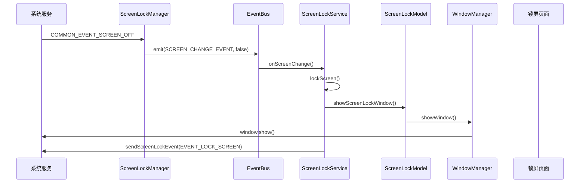
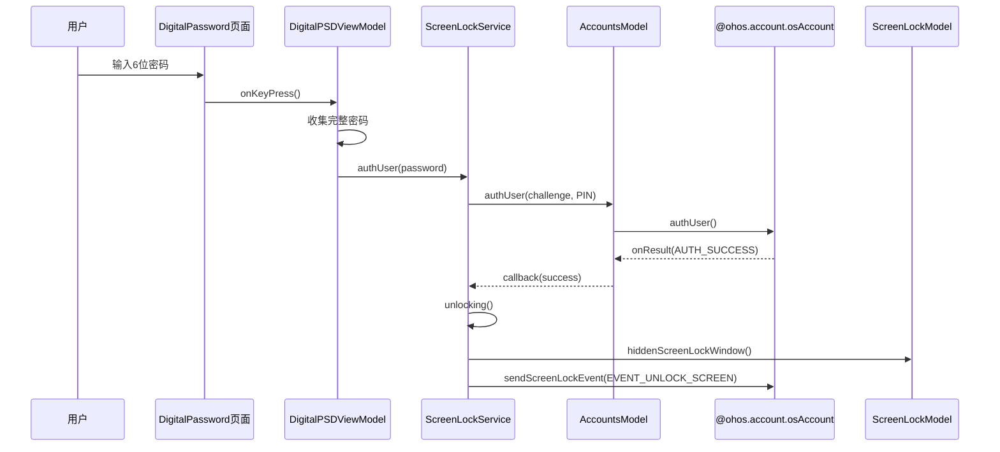
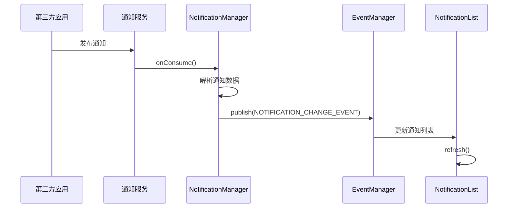
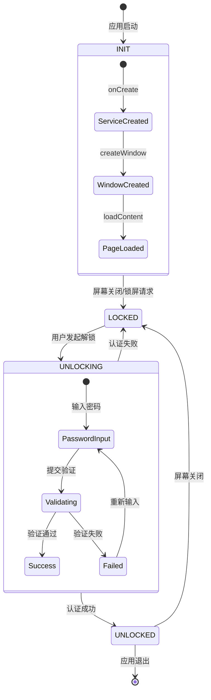
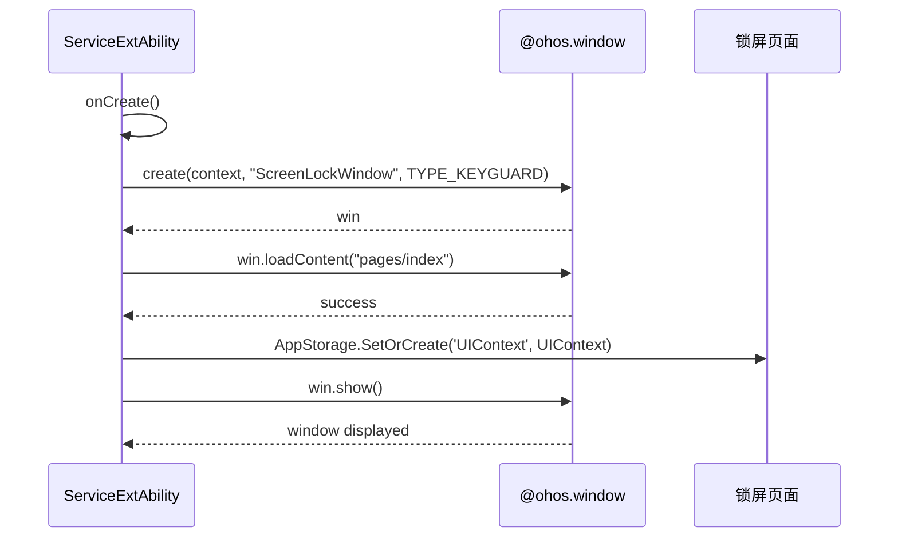
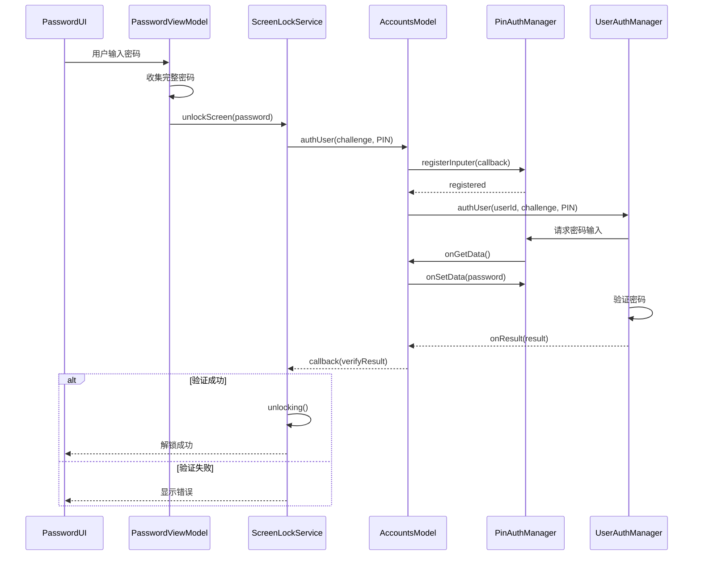

# 03. 架构设计

> 目的: 详细说明ScreenLock的架构设计、组件关系和数据流  
> 适用范围: 架构师、高级开发者

---

## 1. 整体架构

### 1.1 架构概览

ScreenLock采用**分层架构**设计，分为四层：

```
┌─────────────────────────────────────────────────────────────────────┐
│                        Presentation Layer                            │
│  (ArkUI声明式UI - Pages & Components)                                │
├─────────────────────────────────────────────────────────────────────┤
│                        Business Layer                                │
│  (ViewModel + Service + Model)                                       │
├─────────────────────────────────────────────────────────────────────┤
│                        Common Layer                                  │
│  (通用工具 - EventBus, WindowManager, Log, ...)                      │
├─────────────────────────────────────────────────────────────────────┤
│                        System Layer                                  │
│  (OpenHarmony系统服务)                                               │
└─────────────────────────────────────────────────────────────────────┘
```

### 1.2 架构特点

| 特点 | 说明 |
|------|------|
| **声明式UI** | 使用ArkUI声明式语法，状态驱动UI更新 |
| **MVVM模式** | Model-View-ViewModel架构，数据与UI分离 |
| **事件驱动** | 基于EventBus的组件间通信 |
| **模块化** | 13个模块，职责单一，高内聚低耦合 |
| **服务扩展** | 使用ServiceExtensionAbility作为后台服务 |

---

## 2. 组件架构图

### 2.1 核心组件关系

```mermaid
graph TB
    subgraph System[系统服务层]
        ScreenLockSvc[@ohos.screenLock]
        WindowSvc[@ohos.window]
        AccountSvc[@ohos.account.osAccount]
        NotificationSvc[@ohos.notification]
        CommonEventSvc[@ohos.commonEvent]
    end
    
    subgraph Common[公共层]
        EventBus[EventBus<br/>事件总线]
        EventMgr[EventManager<br/>事件管理器]
        WinMgr[WindowManager<br/>窗口管理器]
        ScreenMgr[ScreenLockManager<br/>屏幕管理器]
        Log[Log<br/>日志工具]
    end
    
    subgraph Business[业务层]
        ScreenLockService[ScreenLockService<br/>锁屏服务]
        ScreenLockModel[ScreenLockModel<br/>锁屏模型]
        AccountsModel[AccountsModel<br/>账户模型]
        NotificationMgr[NotificationManager<br/>通知管理]
    end
    
    subgraph UI[表示层]
        ServiceExtAbility[ServiceExtAbility<br/>服务扩展]
        IndexPage[Index页面]
        SlideLock[SlideScreenLock<br/>滑动锁屏]
        DigitalPSD[DigitalPassword<br/>数字密码]
        MixedPSD[MixedPassword<br/>混合密码]
        NotificationList[NotificationList<br/>通知列表]
    end
    
    ServiceExtAbility --> ScreenLockSvc
    ServiceExtAbility --> WindowSvc
    ScreenLockService --> ScreenLockSvc
    ScreenLockModel --> WindowSvc
    AccountsModel --> AccountSvc
    NotificationMgr --> NotificationSvc
    ScreenMgr --> CommonEventSvc
    
    ScreenLockService --> EventBus
    ScreenMgr --> EventBus
    ScreenLockModel --> EventMgr
    NotificationMgr --> EventMgr
    
    IndexPage --> ScreenLockService
    SlideLock --> ScreenLockService
    DigitalPSD --> AccountsModel
    MixedPSD --> AccountsModel
    NotificationList --> NotificationMgr
    
    ServiceExtAbility --> WinMgr
    WinMgr --> WindowSvc
    
    style System fill:#f9f,stroke:#333,stroke-width:2px
    style Common fill:#bbf,stroke:#333,stroke-width:2px
    style Business fill:#bfb,stroke:#333,stroke-width:2px
    style UI fill:#fbb,stroke:#333,stroke-width:2px
```

---

## 3. 数据流

### 3.1 锁屏流程



### 3.2 解锁流程（数字密码）



### 3.3 通知显示流程



---

## 4. 线程模型

### 4.1 线程分布

```
┌─────────────────────────────────────────────────────────────────┐
│                      主线程 (UI线程)                             │
│  - ArkUI渲染                                                    │
│  - 用户交互处理                                                  │
│  - Ability生命周期                                              │
│  - 轻量级业务逻辑                                                │
└─────────────────────────────────────────────────────────────────┘
                              │
                              │ 异步调用
                              ▼
┌─────────────────────────────────────────────────────────────────┐
│                    系统服务线程池                                │
│  - @ohos.screenLock回调                                          │
│  - @ohos.notification回调                                        │
│  - @ohos.commonEvent回调                                         │
│  - 窗口操作回调                                                  │
└─────────────────────────────────────────────────────────────────┘
```

### 4.2 线程安全

| 组件 | 线程安全策略 |
|------|--------------|
| EventBus | 主线程使用，事件回调在主线程执行 |
| WindowManager | Promise异步，回调在主线程 |
| ScreenLockModel | 主线程操作，系统服务异步回调 |
| AccountsModel | 主线程操作，认证回调在主线程 |

### 4.3 异步处理

```typescript
// 异步窗口创建示例 (ServiceExtAbility.ts)
async createWindow(name: string) {
    windowManager.create(this.context, name, windowManager.WindowType.TYPE_KEYGUARD)
        .then((win) => {
            return win.loadContent("pages/index");
        })
        .then(() => {
            return win.show();
        })
        .catch((error) => {
            Log.showError(TAG, "window createFailed");
        });
}
```

---

## 5. 状态管理

### 5.1 全局状态 (AppStorage)

| 状态键 | 类型 | 用途 | 位置 |
|--------|------|------|------|
| `UIContext` | UIContext | UI上下文 | ServiceExtAbility.ts:40 |
| `isWallpaperShow` | boolean | 壁纸显示状态 | screenLockModel.ts |
| `maxWidth` | number | 最大宽度 | WindowManager.ts:150 |
| `maxHeight` | number | 最大高度 | WindowManager.ts:151 |
| `minHeight` | number | 最小高度 | WindowManager.ts:152 |

### 5.2 组件状态 (@State)

```typescript
// index.ets
@State mViewModel: ViewModel = new ViewModel()
@State pageStatus: number = Constants.STATUS_ABOUT_TO_APPEAR
@State mHeightPx: number = 48
```

### 5.3 状态流转



---

## 6. 事件系统

### 6.1 EventBus实现

```typescript
// EventBus.ts 核心实现
export interface EventBus<T> {
    on(event: T | T[], cb: Callback): () => void;
    once(event: T, cb: Callback): () => void;
    off(event: T | T[] | undefined, cb: Callback): void;
    emit(event: T, args: any): void;
}

export function createEventBus<T extends string>(): EventBus<T> {
    let _cbs: { [key: string]: Set<Callback> } = {};
    
    function on(events: T | T[], cb: Callback): () => void {
        if (Array.isArray(events)) {
            events.forEach((e) => on(e, cb));
        } else {
            (_cbs[events] || (_cbs[events] = new Set())).add(cb);
        }
        return () => off(events, cb);
    }
    // ...
}
```

### 6.2 核心事件清单

| 事件名称 | 定义位置 | 发布者 | 订阅者 | 用途 |
|----------|----------|--------|--------|------|
| `SCREEN_CHANGE_EVENT` | ScreenLockManager.ts:23 | ScreenLockManager | 多个 | 屏幕开关事件 |
| `WINDOW_SHOW_HIDE_EVENT` | WindowManager.ts:37 | WindowManager | 多个 | 窗口显隐事件 |
| `WINDOW_RESIZE_EVENT` | WindowManager.ts:38 | WindowManager | 多个 | 窗口大小变化 |
| `TIME_CHANGE_EVENT` | TimeManager.ts | TimeManager | 日期时间组件 | 时间变化 |
| `USER_SWITCH_EVENT` | SwitchUserManager.ts | SwitchUserManager | 账户组件 | 用户切换 |

### 6.3 事件传播

```
系统公共事件 (commonEvent.Support.COMMON_EVENT_SCREEN_OFF)
    │
    ▼
ScreenLockManager.mSubscriber
    │
    ▼
ScreenLockManager.notifyScreenEvent(isScreenOn)
    │
    ▼
EventManager.publish(SCREEN_CHANGE_EVENT)
    │
    ▼
EventBus.emit(SCREEN_CHANGE_EVENT)
    │
    ├──► 订阅者1: ScreenLockService
    ├──► 订阅者2: NotificationService
    └──► 订阅者3: 其他组件
```

---

## 7. 窗口管理

### 7.1 窗口类型定义

```typescript
// WindowManager.ts
export enum WindowType {
  STATUS_BAR = "SystemUi_StatusBar",           // 2108
  NAVIGATION_BAR = "SystemUi_NavigationBar",   // 2112
  DROPDOWN_PANEL = "SystemUi_DropdownPanel",   // 2109
  NOTIFICATION_PANEL = "SystemUi_NotificationPanel", // 2111
  CONTROL_PANEL = "SystemUi_ControlPanel",     // 2111
  VOLUME_PANEL = "SystemUi_VolumePanel",       // 2111
  BANNER_NOTICE = 'SystemUi_BannerNotice'      // 2111
}
```

### 7.2 锁屏窗口创建



### 7.3 窗口层级

```
Z-Index (从高到低)
┌─────────────────────────────────────┐
│  ScreenLockWindow (TYPE_KEYGUARD)   │  ← 锁屏窗口（最上层）
├─────────────────────────────────────┤
│  SystemUi_BannerNotice              │  ← 横幅通知
├─────────────────────────────────────┤
│  SystemUi_NotificationPanel         │  ← 通知面板
│  SystemUi_ControlPanel              │  ← 控制面板
│  SystemUi_VolumePanel               │  ← 音量面板
├─────────────────────────────────────┤
│  SystemUi_DropdownPanel             │  ← 下拉面板
├─────────────────────────────────────┤
│  SystemUi_StatusBar                 │  ← 状态栏
├─────────────────────────────────────┤
│  SystemUi_NavigationBar             │  ← 导航栏
├─────────────────────────────────────┤
│  应用窗口                            │  ← 普通应用
└─────────────────────────────────────┘
```

---

## 8. 认证架构

### 8.1 认证类型支持

| 认证类型 | AuthType | AuthSubType | 对应页面 |
|----------|----------|-------------|----------|
| 6位数字密码 | PIN | PIN_SIX | digitalPassword |
| 混合密码 | PIN | PIN_MIXED | mixedPassword |
| 自定义数字密码 | PIN | PIN_NUMBER | customPassword |
| 2D人脸识别 | FACE | FACE_2D | 自动识别 |
| 3D人脸识别 | FACE | FACE_3D | 自动识别 |

### 8.2 认证流程架构

```mermaid
graph LR
    subgraph UI[UI层]
        PasswordPage[密码页面]
        FaceAuth[人脸认证]
    end
    
    subgraph VM[ViewModel层]
        DigitalVM[DigitalPSDViewModel]
        MixedVM[MixedPSDViewModel]
        CustomVM[CustomPSDViewModel]
    end
    
    subgraph Service[服务层]
        ScreenLockSvc[ScreenLockService]
        AccountsModel[AccountsModel]
    end
    
    subgraph System[系统层]
        UserAuth[@ohos.account.osAccount<br/>UserAuthManager]
        PinAuth[@ohos.account.osAccount<br/>PinAuthManager]
    end
    
    PasswordPage --> DigitalVM
    PasswordPage --> MixedVM
    PasswordPage --> CustomVM
    
    DigitalVM --> ScreenLockSvc
    MixedVM --> ScreenLockSvc
    CustomVM --> ScreenLockSvc
    
    ScreenLockSvc --> AccountsModel
    AccountsModel --> UserAuth
    AccountsModel --> PinAuth
    
    FaceAuth -.-> UserAuth
```

### 8.3 密码验证时序



---

## 9. 模块间通信

### 9.1 通信方式

| 通信方式 | 使用场景 | 实现 |
|----------|----------|------|
| EventBus | 组件间事件通信 | `common/event/EventBus.ts` |
| AppStorage | 全局状态共享 | ArkUI AppStorage API |
| AbilityManager | Ability间数据传递 | `common/abilitymanager/abilityManager.ts` |
| 系统服务 | 与系统服务通信 | @ohos.xxx API |

### 9.2 EventBus通信示例

```typescript
// 订阅事件
let unsubscribe = sEventBus.on(SCREEN_CHANGE_EVENT, (isScreenOn: boolean) => {
    if (isScreenOn) {
        // 处理亮屏逻辑
    } else {
        // 处理灭屏逻辑
    }
});

// 发布事件
sEventBus.emit(SCREEN_CHANGE_EVENT, true);

// 取消订阅
unsubscribe();
```

### 9.3 AbilityManager数据共享

```typescript
// 设置数据
AbilityManager.setAbilityData(
    AbilityManager.ABILITY_NAME_STATUS_BAR, 
    "rect", 
    rect
);

// 获取数据
let rect = AbilityManager.getAbilityData(
    AbilityManager.ABILITY_NAME_STATUS_BAR, 
    "rect"
);
```

---

## 10. 关键设计决策

### 10.1 为什么选择ServiceExtensionAbility？

| 考虑因素 | 决策 |
|----------|------|
| 后台运行 | ServiceExtensionAbility可以在后台持续运行 |
| 窗口创建 | 支持创建系统级窗口(TYPE_KEYGUARD) |
| 生命周期 | 独立于UI，适合锁屏这种系统级功能 |
| 系统权限 | 可以声明系统级权限 |

### 10.2 为什么使用EventBus而不是Emitter？

| 特性 | EventBus | Emitter |
|------|----------|---------|
| 类型安全 | ✅ 支持 | ❌ 不支持 |
| 自动取消订阅 | ✅ 支持 | ❌ 需手动 |
| 多播 | ✅ 原生支持 | ✅ 支持 |
| 易用性 | ✅ 更简洁 | 一般 |

### 10.3 为什么将密码验证委托给系统服务？

- **安全性**: 密码存储和验证由系统安全服务处理，应用无法直接访问
- **一致性**: 与系统其他使用密码验证的场景保持一致
- **权限隔离**: 应用不需要直接访问敏感的用户凭证

---

*关键结论: ScreenLock采用分层架构设计，通过EventBus实现组件解耦，通过系统服务API与OpenHarmony深度集成，密码验证等敏感操作委托给系统安全服务，保证安全性。*
