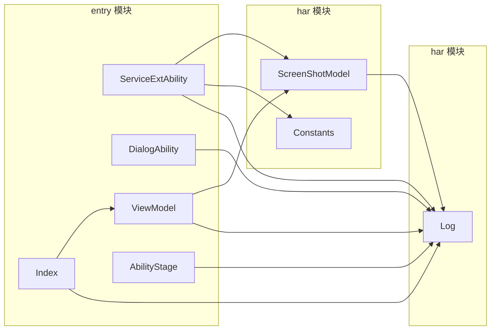
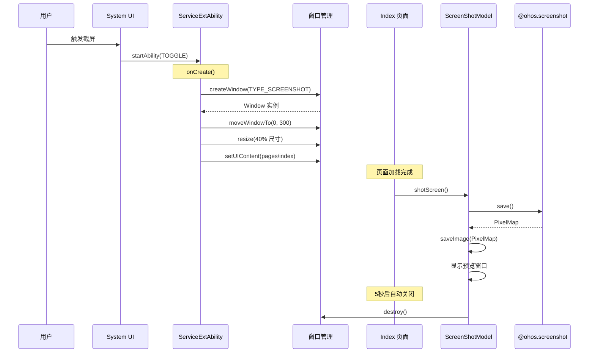
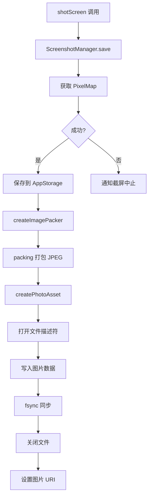
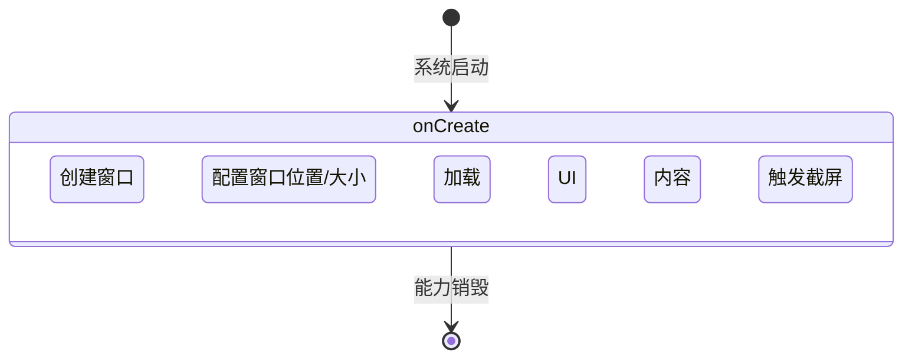
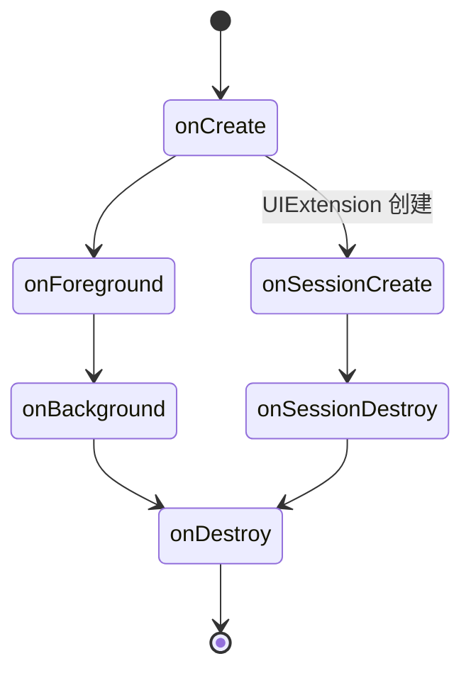

# 架构说明

## 整体架构

```mermaid
graph TD
    subgraph 用户层
        User[用户触发截屏]
        Gallery[相册应用]
    end

    subgraph 应用层
        ServiceExtAbility[ServiceExtAbility<br/>截屏服务入口]
        DialogAbility[DialogAbility<br/>隐私对话框]
        Index[Index 页面<br/>预览]
        ViewModel[ViewModel<br/>页面逻辑]
        ScreenShotModel[ScreenShotModel<br/>核心逻辑]
    end

    subgraph 系统框架层
        ScreenshotAPI[@ohos.screenshot]
        WindowAPI[@ohos.window]
        MediaAPI[@ohos.multimedia.image]
        FileAPI[@ohos.filemanagement]
        UIExtAPI[@ohos.app.ability]
    end

    subgraph Native层
        ScreenshotService[截屏服务]
        WindowManager[窗口管理]
        FileSystem[文件系统]
    end

    User -->|"TOGGLE Action"| ServiceExtAbility
    ServiceExtAbility --> WindowAPI
    ServiceExtAbility --> Index
    Index --> ViewModel
    ViewModel --> ScreenShotModel
    ScreenShotModel --> ScreenshotAPI
    ScreenShotModel --> WindowAPI
    ScreenShotModel --> MediaAPI
    ScreenShotModel --> FileAPI
    ScreenShotModel --> Gallery
    DialogAbility --> UIExtAPI
    ScreenshotAPI --> ScreenshotService
    WindowAPI --> WindowManager
    FileAPI --> FileSystem
```

## 模块依赖关系



**证据**: 代码导入语句分析
- `product/phone/src/main/ets/ServiceExtAbility/ServiceExtAbility.ets:21`
- `product/phone/src/main/ets/vm/ViewModel.ets:17`

## 启动流程



## 核心数据流

### 截图保存流程



**证据**: `features/screenshot/src/main/ets/com/ohos/model/screenShotModel.ets:40-98`

## 线程模型

### 线程分布

| 组件 | 运行线程 | 说明 |
|-----|---------|------|
| ServiceExtensionAbility | 主线程 | UI 线程，处理生命周期 |
| UIExtensionAbility | 主线程 | 对话框 UI 线程 |
| Index 页面 | UI 线程 | ArkUI 渲染 |
| ScreenShotModel | UI 线程 | 业务逻辑（异步） |

### 异步操作

所有系统 API 调用均使用 Promise/async-await 模式：

```typescript
// 文件: features/screenshot/src/main/ets/com/ohos/model/screenShotModel.ets:44
ScreenshotManager.save().then(async (data) => {
    // 异步回调
})
```

## 生命周期

### ServiceExtAbility 生命周期



**证据**: `product/phone/src/main/ets/ServiceExtAbility/ServiceExtAbility.ets:31-60`

### 隐私对话框生命周期



**证据**: `product/phone/src/main/ets/PrivacyDialog/DialogAbility.ets:31-75`
