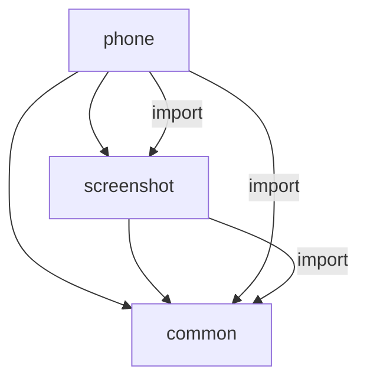

# 模块职责

## 模块概览

| 模块 | 类型 | 路径 | 职责 |
|-----|------|------|------|
| phone | entry | `product/phone/` | 应用入口、UI 展示、ServiceAbility |
| screenshot | har | `features/screenshot/` | 截屏核心逻辑、数据处理 |
| common | har | `common/` | 通用工具（Log） |

## product/phone（Entry 模块）

### 模块配置

**文件**: `product/phone/src/main/module.json5`

| 配置项 | 值 |
|-------|------|
| name | phone |
| type | entry |
| srcEntrance | `./ets/Application/AbilityStage.ts` |
| mainElement | `com.ohos.screenshot.ServiceExtAbility` |
| uiSyntax | ets |
| deliveryWithInstall | true |
| installationFree | false |

### 组件列表

#### 1. ServiceExtAbility

**路径**: `product/phone/src/main/ets/ServiceExtAbility/ServiceExtAbility.ets`

**职责**: 截屏服务入口，接收截屏请求并管理窗口

**主要方法**:

| 方法 | 功能 | 行号 |
|-----|------|------|
| `onCreate(want: Want)` | 初始化，创建窗口 | :31-60 |
| `onDestroy()` | 清理资源 | :63-65 |

**关键逻辑**:
```typescript
// 创建截屏窗口
windowManager.createWindow({
    name: 'ScreenShotWindow',
    windowType: windowManager.WindowType.TYPE_SCREENSHOT,
    ctx: this.context
}).then((win) => {
    // 配置窗口位置和大小
    win.moveWindowTo(0, WINDOW_Y);
    win.resize(dis.width * ZOOM_RATIO, dis.height * ZOOM_RATIO);
    // 加载预览页面
    win.setUIContent(INDEX_PAGE).then(() => {
        ScreenShotModel.shotScreen();
    });
});
```

**证据**: `product/phone/src/main/ets/ServiceExtAbility/ServiceExtAbility.ets:34-50`

#### 2. DialogAbility

**路径**: `product/phone/src/main/ets/PrivacyDialog/DialogAbility.ets`

**职责**: 隐私权限对话框，处理用户确认

**主要方法**:

| 方法 | 功能 | 行号 |
|-----|------|------|
| `onCreate()` | 初始化 | :31-35 |
| `onSessionCreate(want, session)` | 创建 UI 会话 | :55-70 |
| `onDestroy()` | 销毁并上报结果 | :45-52 |

**关键逻辑**:
```typescript
// 加载隐私对话框 UI
session.loadContent('PrivacyDialog/DialogPage', storage);
// 上报用户选择
media.reportAVScreenCaptureUserChoice(
    Number(globalThis.sessionId),
    JSON.stringify(jsonData)
);
```

**证据**: `product/phone/src/main/ets/PrivacyDialog/DialogAbility.ets:55-70`

#### 3. DialogPage

**路径**: `product/phone/src/main/ets/PrivacyDialog/DialogPage.ets`

**职责**: 隐私对话框 UI 组件

**主要方法**:

| 方法 | 功能 |
|-----|------|
| `onPageShow()` | 显示对话框 |
| `onCancel()` | 用户取消 |
| `onConfirm()` | 用户确认 |

#### 4. Index

**路径**: `product/phone/src/main/ets/pages/index.ets`

**职责**: 截屏预览页面

**关键逻辑**:
```typescript
// 显示截屏图片
Image(this.captureImage)
    .onClick(() => {
        ViewModel.StartPhotosAbility(this.imageFilename);
    });
// 5秒后自动关闭
setTimeout(ViewModel.CloseShotScreen, Constants.interval);
```

**证据**: `product/phone/src/main/ets/pages/index.ets:36-46`

#### 5. ViewModel

**路径**: `product/phone/src/main/ets/vm/ViewModel.ets`

**职责**: 页面逻辑控制

**主要方法**:

| 方法 | 功能 | 行号 |
|-----|------|------|
| `StartPhotosAbility(imageFileName)` | 打开相册 | :33-45 |
| `CloseShotScreen()` | 关闭截屏 | :47-50 |

**关键逻辑**:
```typescript
// 启动相册应用
const wantData: Want = {
    bundleName: 'com.ohos.photos',
    abilityName: 'com.ohos.photos.MainAbility',
    parameters: { uri: imageFileName }
};
ShotScreenModel.openAbility(wantData);
```

**证据**: `product/phone/src/main/ets/vm/ViewModel.ets:33-44`

#### 6. AbilityStage

**路径**: `product/phone/src/main/ets/Application/AbilityStage.ts`

**职责**: 应用入口 stage

**证据**: `product/phone/src/main/ets/Application/AbilityStage.ts:22-24`

## features/screenshot（HAR 模块）

### 模块配置

**文件**: `features/screenshot/src/main/module.json5`

| 配置项 | 值 |
|-------|------|
| name | screenshot |
| type | har |
| uiSyntax | ets |

### 组件列表

#### 1. ScreenShotModel

**路径**: `features/screenshot/src/main/ets/com/ohos/model/screenShotModel.ets`

**职责**: 截屏核心逻辑实现

**主要方法**:

| 方法 | 功能 | 异步 | 行号 |
|-----|------|------|------|
| `shotScreen()` | 执行截屏 | 是 | :40-60 |
| `saveImage(pixelMap, options)` | 保存图片 | 是 | :62-98 |
| `showWindow()` | 显示窗口 | 否 | :100-107 |
| `dismiss()` | 关闭能力 | 否 | :109-120 |
| `openAbility(wantData)` | 启动其他能力 | 否 | :122-125 |

**关键常量**:

| 常量 | 值 | 用途 |
|-----|------|------|
| `SCREEN_SHOT_PATH` | `Screenshots/` | 保存目录 |
| `SCREENSHOT_PREFIX` | `Screenshot` | 文件名前缀 |
| `PICTURE_TYPE` | `.jpg` | 文件扩展名 |
| `OPTIONS_QUALITY` | `100` | 图片质量 |
| `SAVE_IMAGE_DELAY` | `300` | 保存延迟(ms) |
| `CREATE_WINDOW_DELAY` | `300` | 创建窗口延迟(ms) |

**核心流程**:

```typescript
// 1. 执行截屏
async shotScreen() {
    WindowMar.notifyScreenshotEvent(WindowMar.ScreenshotEventType.SYSTEM_SCREENSHOT);
    ScreenshotManager.save().then(async (data) => {
        if (!!data) {
            // 2. 保存图片
            this.saveImage(data, { format: 'image/jpeg', quality: 100 });
        }
    });
}

// 3. 保存到相册
async saveImage(pixelMap, options) {
    const userFileMgr = userFileManager.getUserFileMgr(context);
    const packer = ImageMar.createImagePacker();
    const packedImg = await packer.packing(pixelMap, options);

    // 创建相册资源
    const fileAsset = await userFileMgr.createPhotoAsset(
        this.imageFileName,
        { subType: userFileManager.PhotoSubType.SCREENSHOT }
    );

    // 写入文件
    const fd = await fileAsset.open('w');
    await file.write(fd, packedImg);
    await file.fsync(fd);
}
```

**证据**: `features/screenshot/src/main/ets/com/ohos/model/screenShotModel.ets:40-98`

#### 2. Constants

**路径**: `features/screenshot/src/main/ets/com/ohos/common/constants.ts`

**职责**: 截屏模块常量定义

| 常量 | 值 |
|-----|------|
| `WIN_NAME` | `'ScreenShotWindow'` |

## common（HAR 模块）

### 模块配置

**文件**: `common/src/main/module.json5`

| 配置项 | 值 |
|-------|------|
| name | common |
| type | har |
| uiSyntax | ets |

### 组件列表

#### Log

**路径**: `common/src/main/ets/default/Log.ts`

**职责**: 统一日志工具

**日志域**: `0x55EE`

**日志前缀**: `[Screenshot]`

**主要方法**:

| 方法 | 功能 |
|-----|------|
| `showInfo(tag, ...args)` | Info 级别日志 |
| `showDebug(tag, ...args)` | Debug 级别日志 |
| `showError(tag, ...args)` | Error 级别日志 |

## 模块间依赖



**依赖证据**:
- `product/phone/src/main/ets/ServiceExtAbility/ServiceExtAbility.ets:20-21`
- `product/phone/src/main/ets/vm/ViewModel.ets:17`
- `features/screenshot/src/main/ets/com/ohos/model/screenShotModel.ets:21`

## 稳定性标注

| 组件 | 稳定性 | 证据 |
|-----|-------|------|
| ServiceExtAbility | 稳定 | 系统入口 |
| DialogAbility | 稳定 | 系统 UI 能力 |
| Index | 稳定 | 标准 ArkUI 页面 |
| ScreenShotModel | 稳定 | 核心业务逻辑 |
| Log | 稳定 | 通用工具 |
