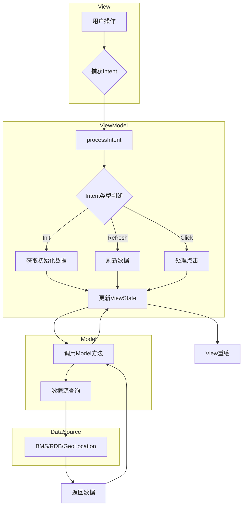

# 架构设计

## 整体架构

本项目采用 **MVI（Model-View-Intent）** 架构模式，配合 **ArkUI** 声明式 UI 框架构建。

```
┌─────────────────────────────────────────────────────────────────┐
│                        ArkUI View Layer                          │
│  ┌──────────────┐  ┌──────────────────┐  ┌──────────────────┐   │
│  │   Index      │  │ locationServices │  │  UiExtensionPage │   │
│  │  (首页)      │  │  (位置服务页)     │  │  (UIExtension)   │   │
│  └──────┬───────┘  └────────┬─────────┘  └────────┬─────────┘   │
└─────────┼────────────────────┼────────────────────┼─────────────┘
          │                    │                    │
          └────────────────────┴────────────────────┘
                              │
                              ▼
┌─────────────────────────────────────────────────────────────────┐
│                      ViewModel Layer                             │
│  ┌──────────────────┐  ┌──────────────────────────────────┐     │
│  │  AutoMenuViewModel│  │  LocationViewModel              │     │
│  │  (菜单业务逻辑)    │  │  (位置服务逻辑)                  │     │
│  └────────┬─────────┘  └───────────────┬──────────────────┘     │
│           │                            │                         │
│           │  Intent                   │  AppStorage             │
│           │  (用户意图)                │  (状态同步)              │
└───────────┼────────────────────────────┼────────────────────────┘
            │                            │
            ▼                            ▼
┌─────────────────────────────────────────────────────────────────┐
│                       Model Layer                                │
│  ┌──────────────────────────────────────────────────────────┐   │
│  │  AutoMenuModel              │  LocationService           │   │
│  │  - getMenuInfoListFromRdb   │  - isLocationEnabled       │   │
│  │  - getMenuInfoListFromBms   │  - enableLocation          │   │
│  │  - handleMenuClick          │  - disableLocation         │   │
│  └──────────────────────────────────────────────────────────┘   │
│                              │                                   │
│                              ▼                                   │
┌─────────────────────────────────────────────────────────────────┐
│                     Data Source Layer                            │
│  ┌──────────────┐  ┌──────────────┐  ┌──────────────────────┐   │
│  │  BMS         │  │  RDB         │  │  GeoLocationManager  │   │
│  │  (包管理服务)  │  │  (本地缓存)   │  │  (位置服务)           │   │
│  └──────────────┘  └──────────────┘  └──────────────────────┘   │
└─────────────────────────────────────────────────────────────────┘
```

## MVI 架构详解

### 组件职责

| 组件 | 职责 | 证据文件 |
|-----|------|---------|
| **View (视图)** | UI 渲染、用户交互捕获 | `Index.ets`、`PrivacyProtectionListView.ets` |
| **Intent (意图)** | 封装用户操作/页面事件 | `AutoMenuIntent.ets`、`AutoMenuInitIntent` |
| **ViewModel (视图模型)** | 协调 View 与 Model，处理 Intent | `AutoMenuViewModel.ets`、`LocationViewModel.ets` |
| **Model (模型)** | 业务逻辑、数据获取 | `AutoMenuModel.ets`、`LocationService.ets` |
| **ViewState (视图状态)** | 声明 UI 状态 | `AutoMenuViewState.ets` |

### 数据流图（Mermaid）



### Intent 分类

| Intent 类型 | 用途 | 触发时机 |
|------------|------|---------|
| `AutoMenuInitIntent` | 初始化菜单数据 | 页面创建时 |
| `AutoMenuRefreshIntent` | 刷新菜单数据 | 页面显示时 |
| `AutoMenuClickIntent` | 处理菜单点击 | 用户点击菜单项 |

**证据来源**：`AutoMenuIntent.ets`

## 核心模块交互

### 1. 菜单模块（AutoMenu）

```
┌─────────────┐     ┌───────────────┐     ┌─────────────┐
│   Index     │────▶│ AutoMenuViewModel │────▶│ AutoMenuModel │
│   (View)    │     │  (ViewModel)    │     │   (Model)   │
└─────────────┘     └───────────────┘     └──────┬──────┘
        ▲                                          │
        │                                          │
        │         ┌──────────────────┐             │
         ─────────│ PrivacyProtection │◀────────────
                   │   ListView       │
                   └──────────────────┘
```

**数据来源**：
1. 优先从 RDB 缓存读取（`getMenuInfoListFromRdb`）
2. 同时从 BMS 实时获取（`getMenuInfoListFromBms`）
3. 刷新后写入 RDB 缓存（`_refreshDb`）

**证据来源**：`AutoMenuModel.ets:40-104`

### 2. 位置服务模块（LocationService）

```
┌──────────────────┐     ┌───────────────┐     ┌──────────────────┐
│ locationServices │────▶│ LocationViewModel │────▶│ LocationService  │
│    (View)        │     │  (ViewModel)    │     │   (Model)        │
└──────────────────┘     └───────────────┘     └────────┬─────────┘
                                                        │
                                                        ▼
                                               ┌──────────────────┐
                                               │ geoLocationManager│
                                               │   (系统 API)      │
                                               └──────────────────┘
```

**功能**：
- `getServiceState()`：获取当前位置开关状态
- `enableLocation()`：开启位置服务
- `disableLocation()`：关闭位置服务
- 监听系统位置开关变化（`on('locationEnabledChange')`）

**证据来源**：`LocationService.ets`、`LocationViewModel.ets`

### 3. UIExtension 模块

用于承载第三方应用的 UI 界面：

```
┌─────────────┐     ┌───────────────┐     ┌──────────────────┐
│ UiExtension │────▶│ UIExtension   │────▶│ 第三方 Ability   │
│   Page      │     │ Component     │     │ (dstBundleName)  │
└─────────────┘     └───────────────┘     └──────────────────┘
```

**配置参数**：
- `bundleName`：目标应用包名
- `abilityName`：目标 Ability 名称
- `uiExtensionType`：固定为 `sys/commonUI`

**证据来源**：`UiExtensionPage.ets:31-37`

## 状态管理

### 1. 页面级状态（组件状态）

使用 `@State` 装饰器管理组件内部状态：

```typescript
@State isSplitMode: boolean = false;
@State windowWidth: number = 0;
```

**证据来源**：`Index.ets:40-44`

### 2. 应用级状态（AppStorage）

跨页面/组件共享状态：

```typescript
AppStorage.setOrCreate(Constants.INIT_APP_INFO_LIST, initAppInfoList)
AppStorage.setOrCreate(locationServiceOpenStatusKey, state)
```

**证据来源**：
- `Index.ets:75`
- `LocationViewModel.ets:39`

### 3. ViewModel 状态（ViewState）

MVI 架构中的视图状态：

```typescript
class AutoMenuViewState {
  listMenuList: MenuInfo[] = [];
}
```

**证据来源**：`AutoMenuViewState.ets`

## 路由管理

### 页面路由

使用 `router` 模块进行页面跳转：

| 源页面 | 目标页面 | 路由模式 |
|-------|---------|---------|
| Index | locationServices | Standard |
| Index | UiExtensionPage | Single |

**证据来源**：
- `Index.ets:143-149`
- `AutoMenuModel.ets:121-143`

### 页面配置

页面在 `main_pages.json` 中注册：

```json
{
  "src": [
    "pages/Index",
    "pages/locationServices",
    "pages/UiExtensionPage"
  ]
}
```

**证据来源**：`resources/base/profile/main_pages.json`

## 线程模型

本项目运行在 **UI 线程**：

- 所有 UI 操作在 UI 线程执行
- 耗时操作（如数据库查询）应使用异步调用
- 系统 API 调用均为异步（Promise 模式）

**示例**：
```typescript
// 异步数据库查询
let resultSet = await RdbManager.getInstance().query(context, predicates);
```

**证据来源**：`AutoMenuModel.ets:44`

## 依赖方向

```
pages/Index
    │
    ├──▶ view/privacy/PrivacyProtectionListView
    │         │
    │         └──▶ model/bundleInfo/BundleInfoModel
    │
    ├──▶ main/auto_menu/AutoMenuViewModel
    │         │
    │         └──▶ main/auto_menu/AutoMenuModel
    │                   │
    │                   ├──▶ utils/AutoMenuManager
    │                   ├──▶ utils/RdbManager
    │                   └──▶ utils/ResourceUtil
    │
    └──▶ model/locationServicesImpl/LocationViewModel
              │
              └──▶ model/locationServicesImpl/LocationService
                        │
                        └──▶ @ohos.geoLocationManager（系统 API）
```

**依赖原则**：无循环依赖，依赖方向为**从视图到数据源**的单向流。

## 返回导航

- [SUMMARY.md](./SUMMARY.md) → 文档导航
- [01_Overview.md](./01_Overview.md) → 项目概览
- [02_Directory_Structure.md](./02_Directory_Structure.md) → 目录结构
- [05_Inner_API.md](./05_Inner_API.md) → 内部 API
