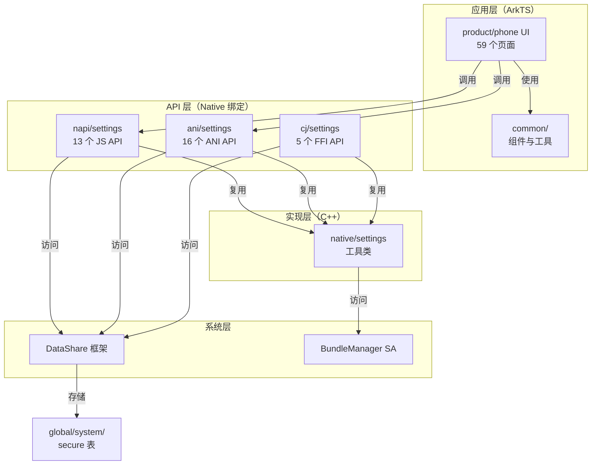
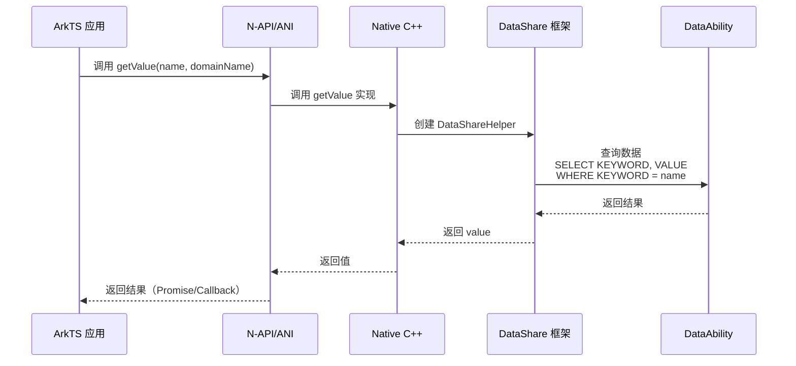
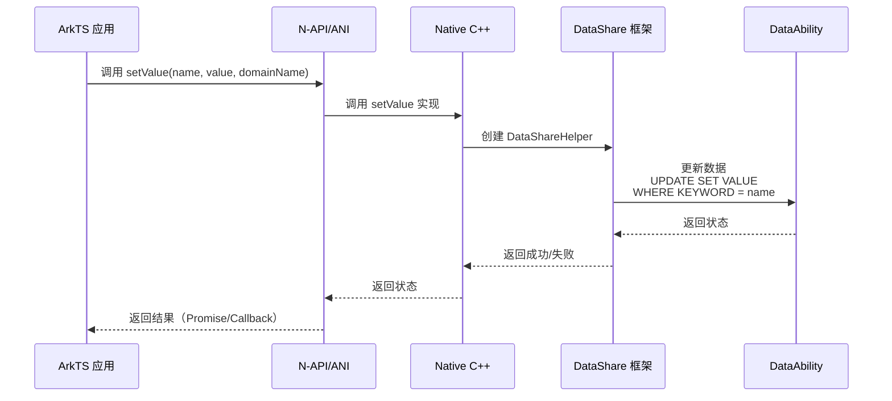
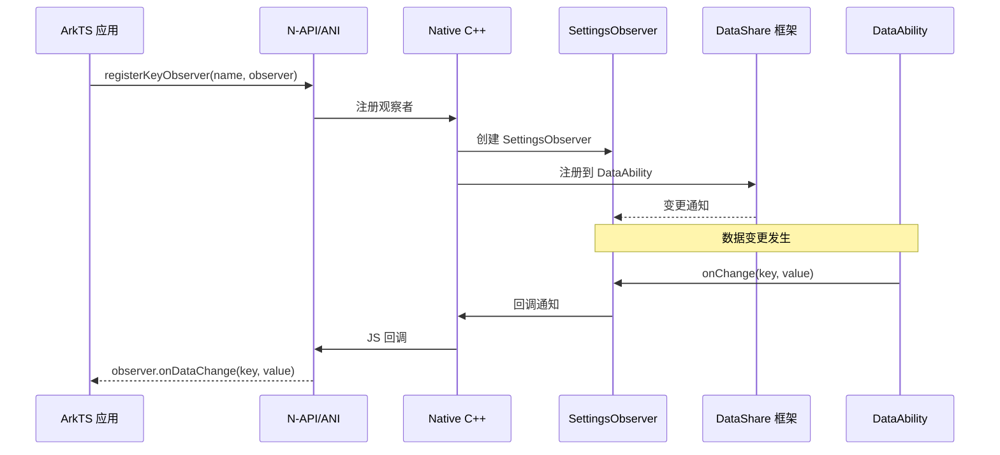
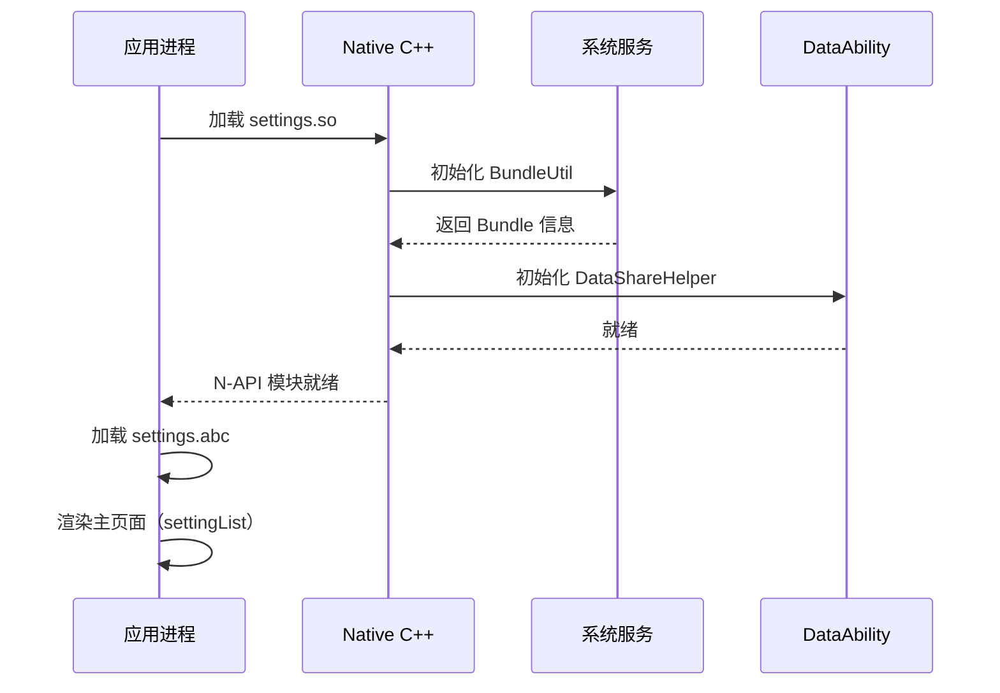
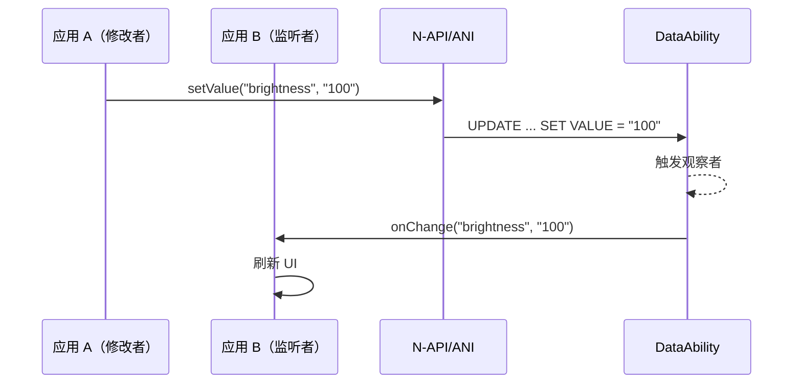
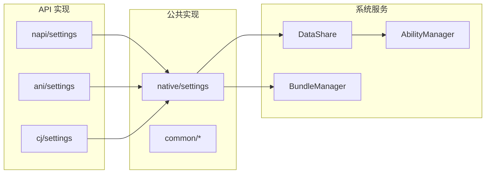

# 架构说明

> Settings 应用的组件架构、数据流、线程模型与关键时序

---

## 目的

本文档说明 Settings 应用的架构设计，包括组件关系、数据流转、线程模型和关键时序。

## 适用范围

- 目标读者：架构师、系统开发者
- 项目：@ohos/settings (Settings 3.1)

---

## 组件架构

### 总体架构图



### 架构分层

| 层级 | 模块 | 职责 | 稳定性 |
|--------|--------|--------|--------|
| **应用层** | product/phone | UI 实现、页面路由 | 不稳定 |
| **公共层** | common/* | 可复用组件、工具 | 中等 |
| **API 层** | napi/, ani/, cj/ | JS ↔ C++ 绑定 | 稳定 |
| **实现层** | native/settings | 公共 Native 实现 | 稳定 |
| **系统层** | DataShare, BundleManager | 数据存储、服务发现 | 外部 |

---

## 数据流

### 设置读取流程



### 设置写入流程



### 观察者通知流程



---

## 线程模型

### 单进程架构

Settings 采用**单进程架构**，所有组件运行在同一进程。

### 线程分配

| 模块 | 线程类型 | 说明 |
|--------|-----------|------|
| N-API 层 | JS 线程 + Worker 线程 | N-API 在 JS 线程执行，异步操作在 Worker 线程 |
| ANI 层 | JS 线程 + Worker 线程 | ANI 在 JS 线程执行，异步操作在 Worker 线程 |
| UI 层 | UI 线程 | ArkTS UI 在主 UI 线程运行 |
| DataShare | 系统线程 | DataShare IPC 调用在系统线程 |

### 异步处理

Settings API 支持**异步模式**（Callback/Promise）：

```
JS 线程                Worker 线程
   │                        │
   │  N-API 初始化            │
   ├─────────────────────────┤    │
   │                        │    │
   │  发起异步调用            │    │
   ├─────────────────────────┤    │
   │                        │    │
   │  参数验证                │    │
   ├─────────────────────────┤    │
   │                        │    │
   │  创建 Async Work         │    │
   ├─────────────────────────┤    │
   │                        │    │
   │  提交到 Worker          │    │
   ├─────────────────────────┼────┼────┐
   │                        │    │    │
   │                        │    │    │
   │  执行 Native 函数        │    │    │
   │                        │    │    │
   │  调用 DataShare        │    │    │
   │                        │    │    │
   │  返回结果              │    │    │
   │                        │    │    │
   │  回调 JS               │    │    │    │
   ├─────────────────────────┼────┼────┼────┘
   │                        │    │
   │  返回给调用者          │    │
   ├─────────────────────────┤    │
   │                        │
```

---

## 关键时序

### 应用启动时序



### 设置修改时序



---

## 依赖关系

### 模块间依赖



### 跨模块调用

| 调用者 | 被调用者 | 方式 | 证据 |
|----------|----------|------|--------|
| napi/settings | native/settings | 直接依赖 | napi/settings/BUILD.gn:22 |
| ani/settings | native/settings | 直接依赖 | ani/settings/BUILD.gn:32 |
| cj/settings | native/settings | 直接依赖 | cj/settings/BUILD.gn:25 |
| product/phone | common/component | ArkTS 导入 | product/phone/src/main/ets/pages/ |
| product/phone | common/search | ArkTS 导入 | product/phone/src/main/ets/model/ |

---

## 关键设计决策

### 1. 多语言 API 支持

**决策**：支持 N-API / ANI / CJ FFI 三种绑定方式

**原因**：
- **N-API**：兼容性好，支持第三方应用
- **ANI**：ArkTS 原生支持，性能最优
- **CJ FFI**：C ABI 兼容，用于系统级调用

### 2. 单进程架构

**决策**：不实现自定义 SystemAbility，作为客户端使用

**原因**：
- 简化架构，避免 IPC 开销
- 依赖系统服务（DataShare, BundleManager）
- 符合 OpenHarmony 设计模式

### 3. 观察者模式

**决策**：基于 DataAbilityObserverStub 实现观察者

**原因**：
- 系统级通知机制
- 支持跨应用监听
- 低开销，无需轮询

### 4. 数据表分离

**决策**：设置数据分为三张表（global, system, secure）

**原因**：
- **global**：所有应用共享，常用设置
- **system**：系统级设置，限制访问
- **secure**：敏感数据，需特殊权限

---

## 性能考虑

### 缓存策略

**DataShareHelper 缓存**（napi_settings.cpp:49）：
```cpp
std::shared_ptr<OHOS::DataShare::DataShareHelper> globalDataShareHelper = nullptr;
std::mutex helper;
```

**好处**：
- 避免重复创建 DataShareHelper
- 减少系统调用
- 提升性能

### 全局变量

| 模块 | 全局变量 | 用途 |
|--------|----------|------|
| napi/settings | globalDataShareHelper | 缓存 DataShareHelper |
| native/settings | versionName, bundleName | Bundle 信息缓存 |

---

## 相关跳转

- **[00_Overview.md](00_Overview.md)** - 项目概览
- **[01_Positioning.md](01_Positioning.md)** - 项目定位与边界
- **[02_Directory_Structure.md](02_Directory_Structure.md)** - 目录结构与模块职责
- **[04_NAPI_API.md](04_NAPI_API.md)** - 对外 API 详细文档

---

**最后更新**：2026-02-06 00:11:23
