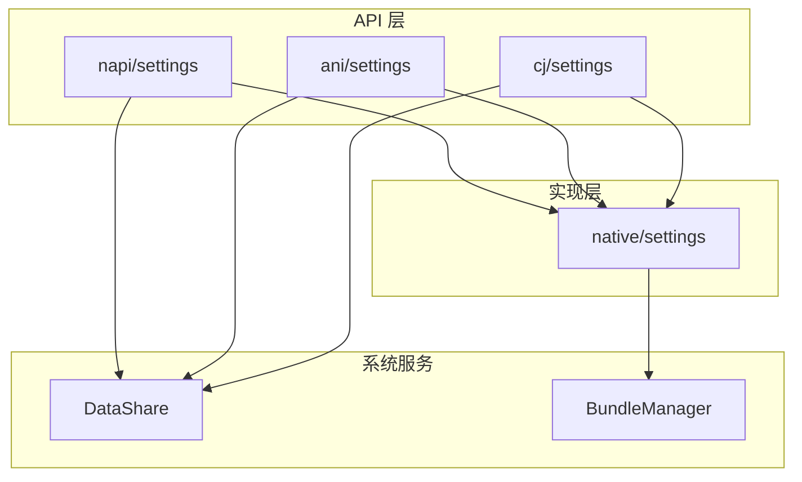

# 内部 API

> Settings 应用的内部模块接口、依赖方向、稳定性说明

---

## 目的

本文档说明 Settings 应用的内部 API，包括模块接口、依赖关系和稳定性说明。

## 适用范围

- 目标读者：系统开发者、架构师
- 项目：@ohos/settings (Settings 3.1)

---

## Native 模块接口

### BundleUtil

**位置**：native/settings/src/include/napi_bundle_util.h:27

**接口**：
```cpp
class BundleUtil {
public:
    static std::string GetCurrentBundleName();
    static std::string GetCurrentVersionName();
    static void InitCurrentBundleInfo();
private:
    static std::string versionName;
    static std::string bundleName;
};
```

**职责**：
- 获取当前应用 Bundle 名称
- 获取当前应用版本名称
- 初始化 Bundle 信息

**依赖**：
- BundleManagerService（通过 SystemAbilityManager）
- 文件：native/settings/src/napi_bundle_util.cpp:34

---

### SysEventUtil

**位置**：native/settings/src/include/napi_sys_event_util.h

**接口**：待确认详细 API

**职责**：
- 上报系统事件
- 日志记录

---

## 模块依赖关系

### 依赖图



### 依赖方向

| 依赖者 | 被依赖者 | 依赖类型 | 说明 |
|----------|----------|----------|------|
| napi/settings | native/settings | 内部依赖 | BUILD.gn:22 |
| ani/settings | native/settings | 内部依赖 | BUILD.gn:32 |
| cj/settings | native/settings | 内部依赖 | BUILD.gn:25 |
| native/settings | BundleManager | 外部依赖 | SA 调用 |
| napi/settings | DataShare | 外部依赖 | 框架调用 |
| ani/settings | DataShare | 外部依赖 | 框架调用 |
| cj/settings | DataShare | 外部依赖 | 框架调用 |

---

## 接口稳定性

### 稳定接口（公共 API）

| 接口 | 模块 | 稳定性 | 标注位置 |
|------|--------|--------|----------|
| N-API: settings | napi/settings | 稳定 | 对外导出 |
| N-API: intelligentscene | napi/intelligentscene | 稳定 | 对外导出 |
| ANI: settings_ani | ani/settings | 稳定 | 对外导出 |
| ANI: intelligentscene_ani | ani/intelligentscene | 稳定 | 对外导出 |
| CJ FFI | cj/settings | 稳定 | innerapi_tags = "platformsdk" |
| Native: BundleUtil | native/settings | 稳定 | 公共头文件 |
| Native: SysEventUtil | native/settings | 稳定 | 公共头文件 |

### 不稳定接口（内部实现）

| 接口 | 模块 | 稳定性 | 说明 |
|------|--------|--------|------|
| DataShareHelper 内部实现 | DataShare 框架 | 外部 | 系统框架，不属于 Settings |
| DataAbilityObserverStub | DataShare 框架 | 外部 | 系统框架，不属于 Settings |
| BundleManager 接口 | BundleManager SA | 外部 | 系统服务，不属于 Settings |

---

## 可替换点

### 可替换模块

| 模块 | 可替换性 | 替换难度 | 说明 |
|--------|----------|-----------|------|
| Native 实现 | 中等 | 需重新编译 | C++ 实现，影响 N-API/ANI/CJ |
| N-API 实现 | 困难 | 需重写 JS | N-API 接口已稳定 |
| ANI 实现 | 困难 | 需重写 ArkTS | ANI 接口已稳定 |
| UI 实现 | 容易 | 可独立替换 | ArkTS UI，独立模块 |

### 不可替换点

| 模块 | 不可替换性 | 原因 |
|--------|----------|--------|
| DataShare 框架 | 系统框架，核心功能 |
| BundleManager SA | 系统服务，标准接口 |
| DataAbility 接口 | 系统框架，标准接口 |

---

## 跨模块调用

### N-API → Native

```cpp
// napi/settings/napi_settings.cpp
std::shared_ptr<OHOS::DataShare::DataShareHelper> getDataShareHelper(
    napi_env env, OHOS::sptr<IRemoteObject> token, std::string tableName)
{
    // 调用 DataShare::DataShareHelper::Creator()
    return OHOS::DataShare::DataShareHelper::Creator(token, strUri, "");
}
```

### ANI → Native

```cpp
// ani/settings/ani_settings.cpp
std::shared_ptr<DataShare::DataShareHelper> getDataShareHelper(
    ani_env *env, const ani_object context, std::string tableName)
{
    // 调用 DataShare::DataShareHelper::Creator()
    return OHOS::DataShare::DataShareHelper::Creator(contextS->GetToken(), strUri);
}
```

### CJ FFI → Native

```cpp
// cj/settings/src/cj_settings.cpp
std::shared_ptr<DataShare::DataShareHelper> GetDataShareHelper(
    OHOS::AbilityRuntime::Context* context, std::string tableName)
{
    // 调用 DataShare::DataShareHelper::Creator()
    return OHOS::DataShare::DataShareHelper::Creator(context->GetToken(), strProxyUri, strUri);
}
```

---

## 模块生命周期

### 加载顺序

```
1. 系统加载 settings.so
2. 执行构造函数（NAPI：RegisterModule, ANI：ANI_Constructor）
3. 初始化 Native 工具（BundleUtil, SysEventUtil）
4. 创建 DataShareHelper 实例（全局缓存）
5. 准备接收 API 调用
```

### 资源清理

```
1. 应用进程退出
2. 释放 DataShareHelper 实例（智能指针自动释放）
3. 取消注册所有观察者
4. 清理全局缓存
```

---

## 相关跳转

- **[00_Overview.md](00_Overview.md)** - 项目概览
- **[02_Directory_Structure.md](02_Directory_Structure.md)** - 目录结构与模块职责
- **[03_Architecture.md](03_Architecture.md)** - 架构说明
- **[04_NAPI_API.md](04_NAPI_API.md)** - 对外 API 文档

---

**最后更新**：2026-02-06 00:11:23
