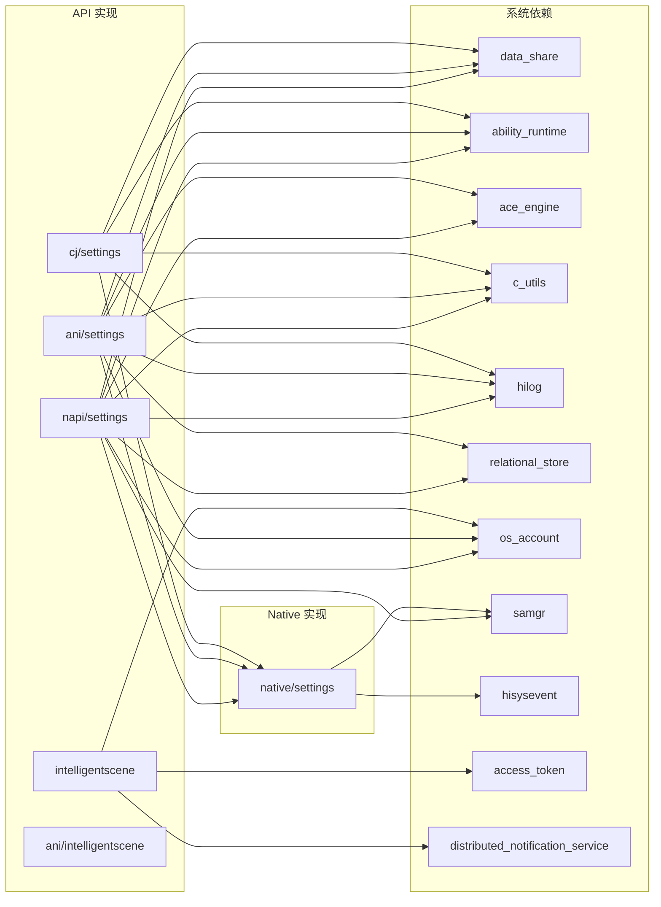

# GN Targets 与编译产物

> Settings 应用的 GN 构建系统、Targets 清单与编译产物

---

## 目的

本文档详细说明 Settings 应用的 GN 构建系统，包括所有 Targets、依赖关系和编译产物。

## 适用范围

- 目标读者：构建工程师、系统开发者
- 项目：@ohos/settings (Settings 3.1)

---

## GN Targets 清单

### 主要 Shared Library Targets

| Target 名称 | 类型 | 位置 | 产物名称 | 依赖 | 产物路径 |
|------------|------|--------|-----------|--------|--------|
| settings | ohos_shared_library | napi/settings/BUILD.gn:16 | libsettings.z.so | /system/lib64/module/ |
| intelligentscene | ohos_shared_library | napi/intelligentscene/BUILD.gn:16 | libintelligentscene.z.so | /system/lib64/module/ |
| settings_ani | ohos_shared_library | ani/settings/BUILD.gn:17 | libsettings_ani.z.so | /system/lib64/module/ |
| intelligentscene_ani | ohos_shared_library | ani/intelligentscene/BUILD.gn | libintelligentscene_ani.z.so | /system/lib64/module/ |
| cj_settings_ffi | ohos_shared_library | cj/settings/BUILD.gn:16 | libcj_settings_ffi.z.so | /system/lib64/ |
| settings_common | ohos_shared_library | native/settings/BUILD.gn:21 | libsettings_common.z.so | /system/lib64/ |

### ArkTS Bytecode Targets

| Target 名称 | 类型 | 位置 | 产物名称 | 产物路径 | ETS 文件 |
|------------|------|--------|-----------|----------|----------|
| settings (ANI) | generate_static_abc | ani/settings/BUILD.gn:67 | settings.abc | /system/framework/ | ani/settings/ets/@ohos.settings.ets |
| settings_etc | ohos_prebuilt_etc | ani/settings/BUILD.gn:74 | settings.abc | /system/framework/ | - |
| intelligentscene (ANI) | generate_static_abc | ani/intelligentscene/BUILD.gn | intelligentscene.abc | /system/framework/ | ani/intelligentscene/ets/@ohos.intelligentscene.ets |
| intelligentscene_etc | ohos_prebuilt_etc | ani/intelligentscene/BUILD.gn | intelligentscene.abc | /system/framework/ | - |

---

## Target 详细配置

### settings（N-API）

**文件**：napi/settings/BUILD.gn

**配置**：
```gn
ohos_shared_library("settings") {
  include_dirs = [
    "./open_network_settings",
    "./util",
  ]
  deps = ["../../native/settings:settings_common"]
  sources = [
    "./napi_settings.cpp",
    "./napi_settings_init.cpp",
    "./napi_settings_observer.cpp",
    "./native_module.cpp",
    "./open_network_settings/napi_open_network_settings.cpp",
    "./open_network_settings/napi_open_settings_page_util.cpp",
  ]
  external_deps = [
    "ability_base:want",
    "ability_base:zuri",
    "ability_runtime:ability_context_native",
    "ability_runtime:ability_manager",
    ...
  ]
  relative_install_dir = "module"
  subsystem_name = "applications"
  part_name = "settings"
}
```

**关键信息**：
- 依赖：native/settings:settings_common
- 安装路径：module
- 子系统：applications
- 零件名：settings

### intelligentscene（N-API）

**文件**：napi/intelligentscene/BUILD.gn

**配置**：
```gn
ohos_shared_library("intelligentscene") {
  include_dirs = ["./common"]
  sources = [
    "./native_module.cpp",
    "./napi_nodisturb.cpp",
    "./common/common_utils.cpp",
    "./common/intelligence_inner_errors.cpp",
  ]
  external_deps = [
    "ability_base:configuration",
    "ability_base:zuri",
    "napi:ace_napi",
    "os_account:os_account_innerkits",
    "distributed_notification_service:ans_innerkits",
    "access_token:libaccesstoken_sdk",
    "access_token:libtokenid_sdk",
  ]
  relative_install_dir = "module"
  subsystem_name = "applications"
  part_name = "settings"
}
```

**关键信息**：
- 独立模块，不依赖 native/settings
- 使用访问令牌库（access_token）
- 使用通知服务（distributed_notification_service）

### settings_ani（ANI）

**文件**：ani/settings/BUILD.gn

**配置**：
```gn
ohos_shared_library("settings_ani") {
  include_dirs = [
    "./ani_settings.h",
    "./ani_settings_observer.h",
    "./open_network_settings",
    "./util",
  ]
  deps = ["../../native/settings:settings_common"]
  sources = [
    "./ani_settings.cpp",
    "./ani_settings_observer.cpp",
    "./open_network_settings/ani_open_network_settings.cpp",
    "./open_network_settings/api_open_settings_page_util.cpp",
  ]
  version_script = "settings_ani.versionscript"
  external_deps = [
    "ability_base:want",
    "ability_base:zuri",
    ...
    "runtime_core:ani",
    "runtime_core:libarkruntime",
    ...
  ]
  relative_install_dir = "module"
  subsystem_name = "applications"
  part_name = "settings"
}

generate_static_abc("settings") {
  base_url = "./ets"
  files = ["./ets/@ohos.settings.ets"]
  is_boot_abc = "True"
  device_dst_file = "/system/framework/settings.abc"
}

ohos_prebuilt_etc("settings_etc") {
  source = "$target_out_dir/settings.abc"
  deps = [":settings"]
  module_install_dir = "framework"
  subsystem_name = "applications"
  part_name = "settings"
}
```

**关键信息**：
- 依赖：native/settings:settings_common
- 版本脚本：settings_ani.versionscript
- Boot ABC：is_boot_abc = "True"（系统启动时加载）

### intelligentscene_ani（ANI）

**文件**：ani/intelligentscene/BUILD.gn

**配置**：
```gn
ohos_shared_library("intelligentscene_ani") {
  include_dirs = ["./common"]
  sources = [
    "./ani_init_module.cpp",
    "./ani_nodisturb.cpp",
    "./common/ani_throw_error.cpp",
  ]
  version_script = "intelligentscene_ani.versionscript"
  external_deps = [
    "ability_base:configuration",
    "ability_base:zuri",
    "runtime_core:ani",
    "runtime_core:libarkruntime",
    "os_account:os_account_innerkits",
    "distributed_notification_service:ans_innerkits",
    "access_token:libaccesstoken_sdk",
    "access_token:libtokenid_sdk",
  ]
  relative_install_dir = "module"
  subsystem_name = "applications"
  part_name = "settings"
}

generate_static_abc("intelligentscene") {
  base_url = "./ets"
  files = ["./ets/@ohos.intelligentscene.ets"]
  is_boot_abc = "True"
  device_dst_file = "/system/framework/intelligentscene.abc"
}

ohos_prebuilt_etc("intelligentscene_etc") {
  source = "$target_out_dir/intelligentscene.abc"
  deps = [":intelligentscene"]
  module_install_dir = "framework"
  subsystem_name = "applications"
  part_name = "settings"
}
```

### cj_settings_ffi（CJ FFI）

**文件**：cj/settings/BUILD.gn

**配置**：
```gn
ohos_shared_library("cj_settings_ffi") {
  include_dirs = []
  sources = [
    "src/cj_settings.cpp",
    "src/cj_settings_observer.cpp",
    "src/settings_ffi.cpp",
  ]
  deps = []
  external_deps = [
    "ability_runtime:ability_manager",
    "ability_runtime:abilitykit_native",
    "ability_runtime:data_ability_helper",
    "data_share:datashare_common",
    "data_share:datashare_consumer",
    "hilog:libhilog",
    "ipc:ipc_core",
    "napi:ace_napi",
    "napi:cj_bind_ffi",
    "napi:cj_bind_native",
    "os_account:os_account_innerkits",
  ]
  innerapi_tags = ["platformsdk"]
  part_name = "settings"
  subsystem_name = "applications"
}
```

**关键信息**：
- 稳定性标注：innerapi_tags = "platformsdk"
- 无内部依赖（deps = []）
- 使用 CJ 绑定库（cj_bind_ffi, cj_bind_native）

### settings_common（Native）

**文件**：native/settings/BUILD.gn

**配置**：
```gn
config("settings_common_config") {
  visibility = ["*:*"]
  include_dirs = ["//applications/standard/settings/native/settings/src/include"]
}

ohos_shared_library("settings_common") {
  include_dirs = ["src/include"]
  sources = [
    "src/napi_bundle_util.cpp",
    "src/napi_sys_event_util.cpp"
  ]
  public_configs = [":settings_common_config"]
  deps = []
  external_deps = [
    "ability_runtime:ability_manager",
    "ability_runtime:ui_extension",
    "hilog:libhilog",
    "hisysevent:libhisysevent",
    "samgr:samgr_proxy",
  ]
  part_name = "settings"
  subsystem_name = "applications"
}
```

**关键信息**：
- 公共配置：public_configs = [":settings_common_config"]
- 头文件：include_dirs = ["//applications/standard/settings/native/settings/src/include"]
- 系统能力管理器依赖：samgr:samgr_proxy

---

## 依赖关系

### Target 依赖图



---

## 编译产物清单

### 动态库产物

| 产物名称 | 类型 | 大小估计 | 安装路径 | 加载时机 |
|-----------|------|-----------|----------|----------|
| libsettings.z.so | N-API 共享库 | ~500KB | /system/lib64/module/ | 按需加载 |
| libintelligentscene.z.so | N-API 共享库 | ~300KB | /system/lib64/module/ | 按需加载 |
| libsettings_ani.z.so | ANI 共享库 | ~500KB | /system/lib64/module/ | 按需加载 |
| libintelligentscene_ani.z.so | ANI 共享库 | ~300KB | /system/lib64/module/ | 按需加载 |
| libcj_settings_ffi.z.so | CJ FFI 共享库 | ~400KB | /system/lib64/ | 按需加载 |
| libsettings_common.z.so | Native 共享库 | ~200KB | /system/lib64/ | 被依赖库链接 |

### ArkTS 字节码产物

| 产物名称 | 类型 | 大小估计 | 安装路径 | 加载时机 |
|-----------|------|-----------|----------|----------|
| settings.abc | ArkTS 字节码 | ~50KB | /system/framework/ | 系统启动时加载（is_boot_abc） |
| intelligentscene.abc | ArkTS 字节码 | ~30KB | /system/framework/ | 系统启动时加载（is_boot_abc） |

---

## 运行时加载关系

### 加载顺序

```
1. 系统启动
2. 加载 ArkTS 字节码（settings.abc, intelligentscene.abc）
   - is_boot_abc = "True" 表示系统启动时加载
3. 应用进程启动
4. 按需加载动态库：
   - libsettings.z.so（当 import @ohos.settings 时）
   - libintelligentscene.z.so（当 import @ohos.intelligentscene 时）
   - libsettings_ani.z.so（当使用 ANI 接口时）
   - libcj_settings_ffi.z.so（当使用 CJ FFI 接口时）
```

### 库依赖关系

```
libsettings.z.so
  ↓ 依赖
libsettings_common.z.so
  ↓ 依赖
系统服务（DataShare, BundleManager, SAMGR）

libsettings_ani.z.so
  ↓ 依赖
libsettings_common.z.so
  ↓ 依赖
系统服务（DataShare, AbilityManager）

libcj_settings_ffi.z.so
  ↓ 依赖
系统服务（DataShare, AbilityManager）

libintelligentscene.z.so
  ↓ 依赖
系统服务（OS Account, Access Token, Notification）
```

---

## 版本控制

### 版本脚本

| 模块 | 版本脚本 | 用途 |
|--------|----------|------|
| settings_ani | settings_ani.versionscript | 控制符号导出 |
| intelligentscene_ani | intelligentscene_ani.versionscript | 控制符号导出 |

### 编译配置

- **子系统**：applications
- **零件名**：settings
- **SDK 版本**：23
- **系统类型**：standard

---

## 相关跳转

- **[00_Overview.md](00_Overview.md)** - 项目概览
- **[02_Directory_Structure.md](02_Directory_Structure.md)** - 目录结构与模块职责
- **[07_Build_Artifacts.md](07_Build_Artifacts.md)** - 编译产物详细

---

**最后更新**：2026-02-06 00:11:23
