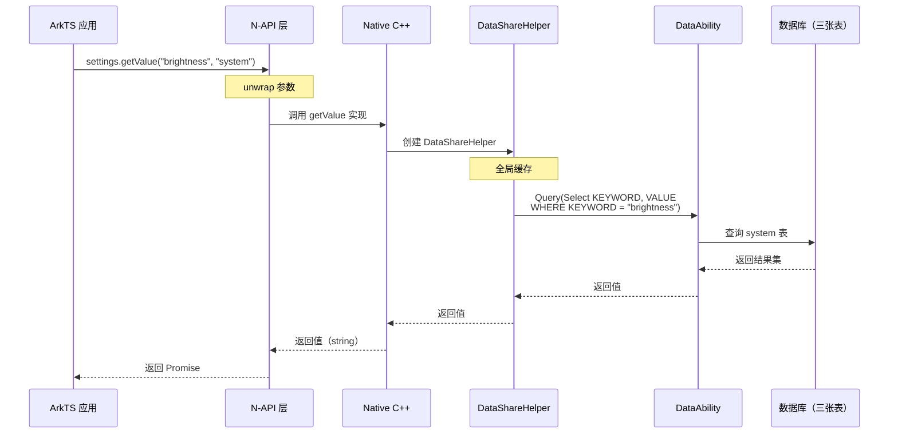
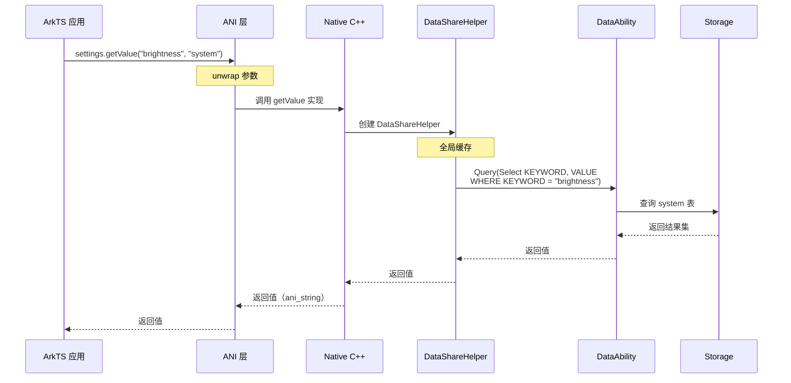
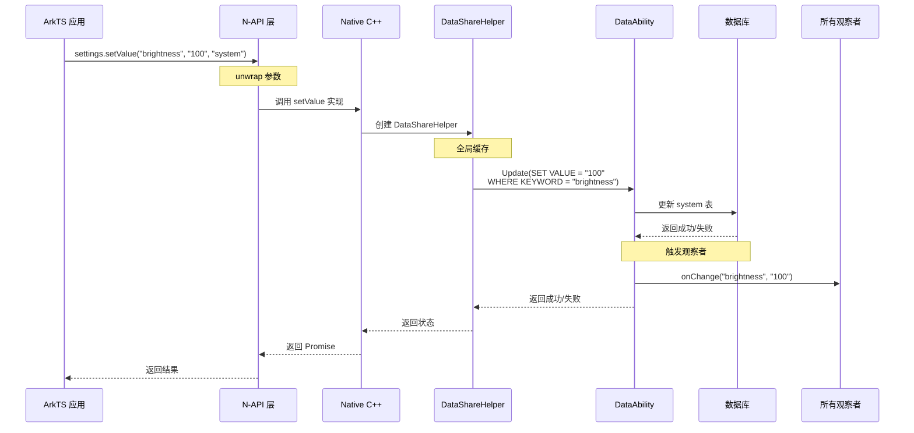
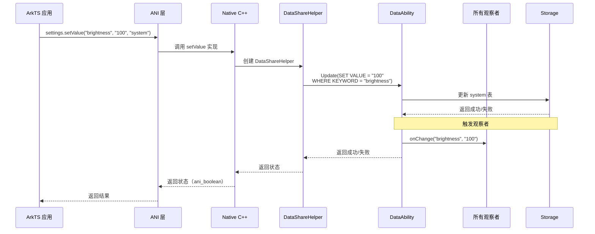
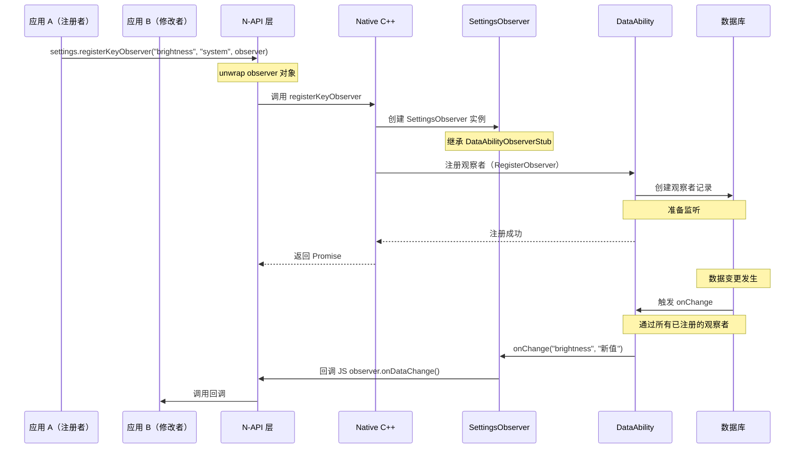
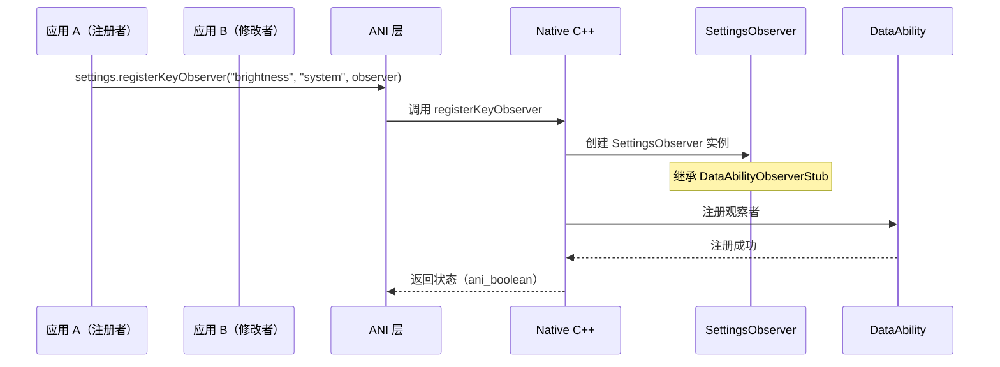
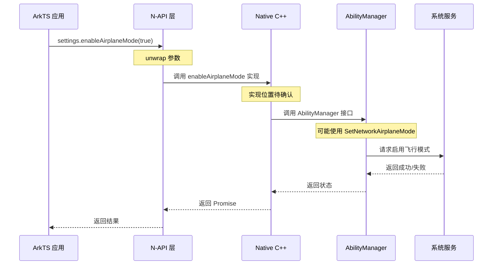
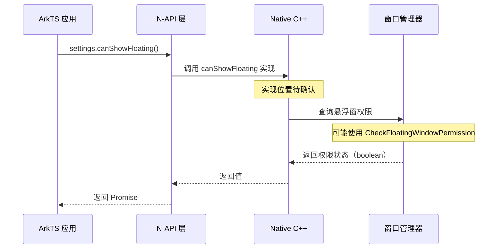
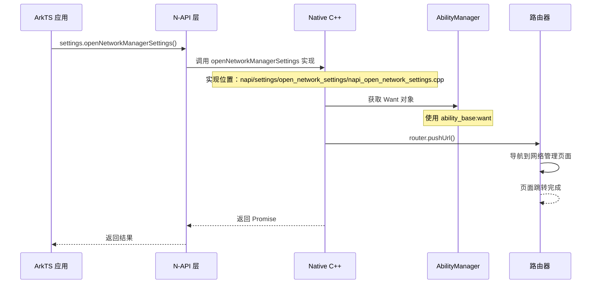
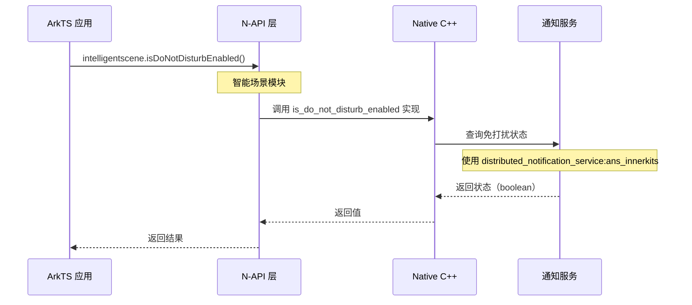

# 关键调用链图

> Settings 应用的关键调用链（入口 → 核心逻辑）

---

## 目的

本文档提供 Settings 应用的关键调用链图，帮助理解从入口到核心逻辑的执行路径。

## 适用范围

- 目标读者：系统开发者
- 项目：@ohos/settings (Settings 3.1)

---

## getValue 调用链

### N-API 版本

### ANI 版本

---

## setValue 调用链

### N-API 版本

### ANI 版本

---

## registerKeyObserver 调用链

### N-API 版本

### ANI 版本

---

## enableAirplaneMode 调用链

### N-API 版本

---

## canShowFloating 调用链

### N-API 版本

---

## openNetworkManagerSettings 调用链

### N-API 版本

---

## isDoNotDisturbEnabled 调用链

### N-API 版本

---

## 相关跳转

- **[00_Overview.md](00_Overview.md)** - 项目概览
- **[03_Architecture.md](03_Architecture.md)** - 架构说明（更详细的时序图）
- **[04_NAPI_API.md](04_NAPI_API.md)** - 对外 API 文档

---

**最后更新**：2026-02-06 00:11:23
