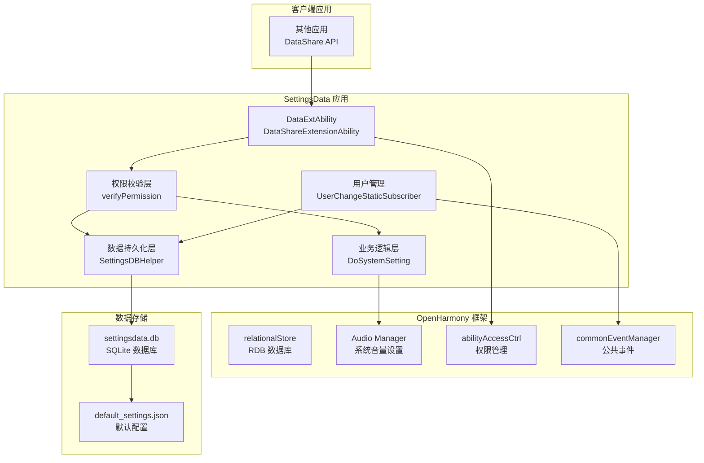
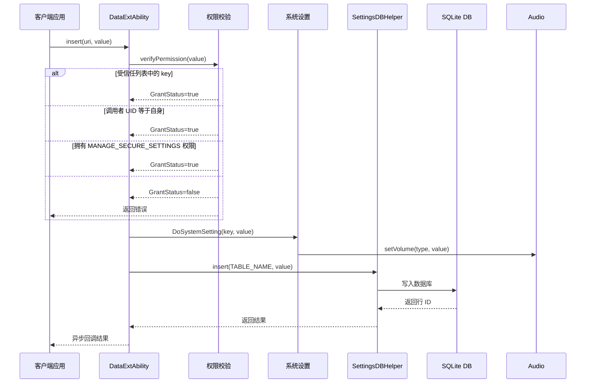
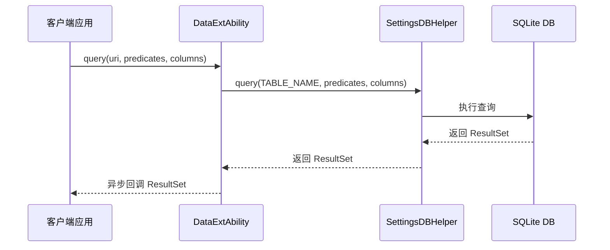
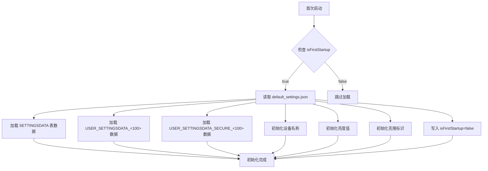
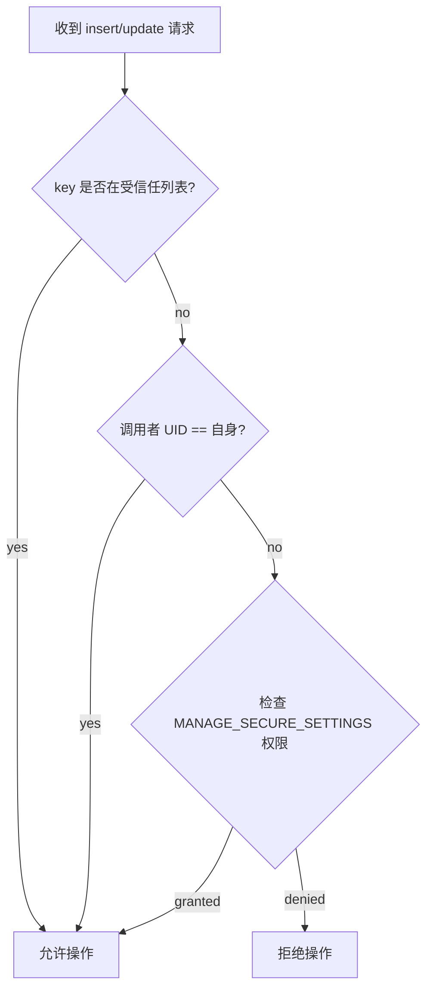
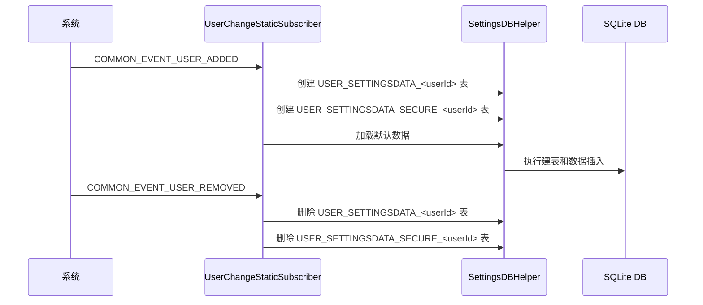
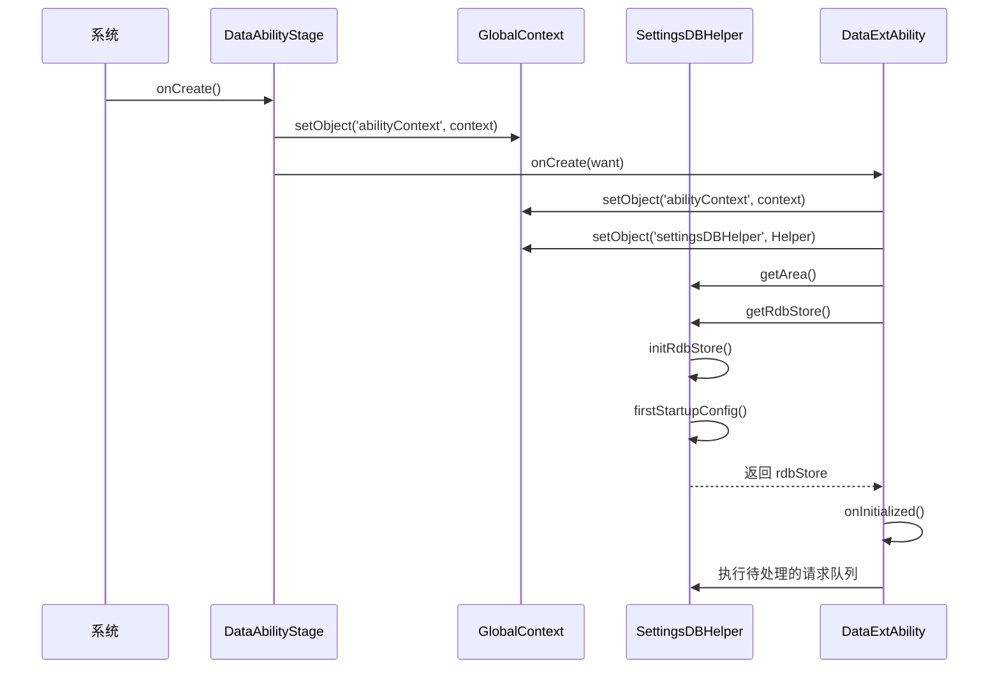

# 架构设计

## 整体架构图



---

## 组件职责

| 组件 | 职责 | 证据位置 |
|------|------|----------|
| **DataExtAbility** | DataShare 数据提供者，处理 CRUD 请求 | `DataExtAbility.ets:55` |
| **权限校验层** | 验证调用者是否有权限修改设置 | `DataExtAbility.ets:271-298` |
| **业务逻辑层** | 执行系统设置操作（如音量调节） | `DataExtAbility.ets:233-269` |
| **SettingsDBHelper** | RDB 数据库初始化与管理 | `SettingsDBHelper.ets:53` |
| **UserChangeStaticSubscriber** | 监听用户变更事件，管理用户数据表 | `UserChangeStaticSubscriber.ets:27` |

---

## 数据流分析

### 写入数据流 (Insert/Update)



**证据**: `entry/src/main/ets/DataAbility/DataExtAbility.ets:128-164`

### 查询数据流 (Query)



**证据**: `entry/src/main/ets/DataAbility/DataExtAbility.ets:209-231`

---

## 线程模型

### 主线程职责

| 操作 | 线程 | 说明 |
|------|------|------|
| DataAbility 生命周期 | 主线程 | `onCreate()`, `onInitialized()` |
| 权限校验 | 主线程 | `verifyPermission()` |
| 系统设置操作 | 主线程（异步） | `DoSystemSetting()` 调用 Audio API |
| 结果回调 | 主线程 | 异步回调返回主线程执行 |

### 异步操作

| 操作 | 异步机制 | 说明 |
|------|----------|------|
| RDB 初始化 | Promise | `initRdbStore()` 返回 Promise |
| 数据库操作 | Callback | insert/update/query 使用 AsyncCallback |
| 权限验证 | Promise | `verifyAccessToken()` 返回 Promise |
| 音频设置 | Promise | `setVolume()` 返回 Promise |

**证据**: `entry/src/main/ets/DataAbility/DataExtAbility.et:238-263`

```typescript
Audio.getAudioManager().setVolume(volumeType, Number(settingsValue)).then(() => {
  Log.info('settings Promise returned to indicate a successful RINGTONE setting.')
});
```

---

## 数据库架构

### 表结构

所有数据表使用相同的 schema：

```sql
CREATE TABLE IF NOT EXISTS <TABLE_NAME> (
  ID INTEGER PRIMARY KEY AUTOINCREMENT,
  KEYWORD TEXT,
  VALUE TEXT CHECK (LENGTH(VALUE) <= 1000)
)
```

**证据**: `entry/src/main/ets/Utils/SettingsDBHelper.ets:54-63`

### 数据表分类

| 表名 | 用途 | 证据 |
|------|------|------|
| SETTINGSDATA | 公共设置数据 | `SettingsDataConfig.ets:27` |
| USER_SETTINGSDATA_<userId> | 用户设置数据 | `SettingsDataConfig.ets:28` |
| USER_SETTINGSDATA_SECURE_<userId> | 用户安全设置数据 | `SettingsDataConfig.ets:29` |

### 初始数据加载流程



**证据**: `entry/src/main/ets/Utils/SettingsDBHelper.ets:133-160`

---

## 权限模型

### 权限校验流程



### 受信任列表

以下设置项无需权限即可修改：

| 设置项 | 说明 |
|--------|------|
| `settings.display.SCREEN_BRIGHTNESS_STATUS` | 屏幕亮度状态 |
| `settings.display.AUTO_SCREEN_BRIGHTNESS` | 自动亮度开关 |
| `settings.display.SCREEN_OFF_TIMEOUT` | 屏幕超时时间 |

**证据**: `entry/src/main/ets/DataAbility/DataExtAbility.ets:47-51`

```typescript
let trustList: String[] = [
  settings.display.SCREEN_BRIGHTNESS_STATUS,
  settings.display.AUTO_SCREEN_BRIGHTNESS,
  settings.display.SCREEN_OFF_TIMEOUT
];
```

---

## 用户管理机制

### 用户事件监听



**证据**: `entry/src/main/ets/StaticSubscriber/UserChangeStaticSubscriber.ets:33-79`

---

## 关键时序图

### 应用启动时序



**证据**: `entry/src/main/ets/DataAbility/DataExtAbility.ets:56-126`

---

## 相关文档

| 文档 | 链接 |
|------|------|
| 项目概览 | [01_Project_Overview.md](./01_Project_Overview.md) |
| 目录结构 | [02_Directory_Structure.md](./02_Directory_Structure.md) |
| API 参考 | [04_API_Reference.md](./04_API_Reference.md) |
| 安全评审 | [06_Security_Review.md](./06_Security_Review.md) |
