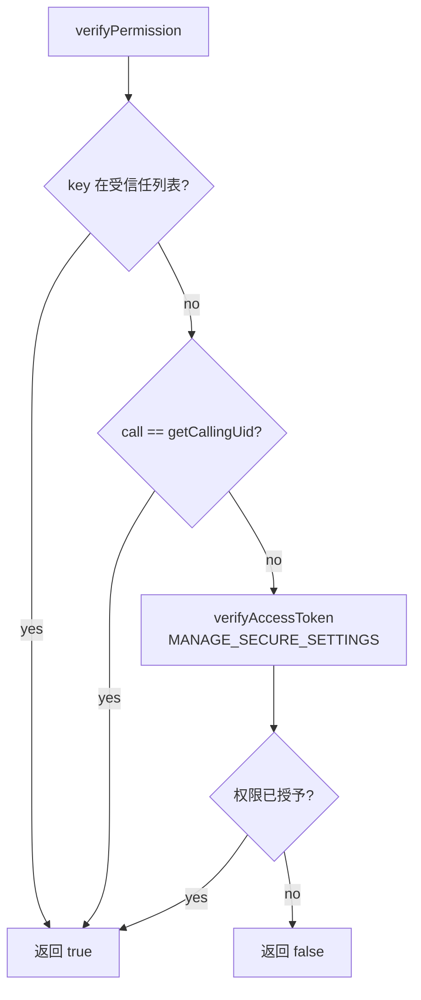

# API 参考

## 概述

SettingsData 主要通过 **DataShare** 协议对外提供数据访问接口。不同于传统 N-API，SettingsData 是一个纯前端 ArkTS 应用，不涉及 C/C++ 层的 N-API 实现。

本文档详细说明 DataShare URI 配置、接口参数和权限要求。

---

## DataShare URI 配置

### URI 清单

| URI | 用途 | 跨用户模式 | 证据 |
|-----|------|------------|------|
| `datashare:///com.ohos.settingsdata/entry/settingsdata/SETTINGSDATA` | 公共设置数据 | 1 (跨用户) | `data_share_config.json:8` |
| `datashare:///com.ohos.settingsdata/entry/settingsdata/USER_SETTINGSDATA` | 用户设置数据 | 1 (跨用户) | `data_share_config.json:12` |
| `datashare:///com.ohos.settingsdata/entry/settingsdata/USER_SETTINGSDATA_SECURE` | 用户安全设置数据 | 1 (跨用户) | `data_share_config.json:16` |
| `datashare:///com.ohos.settingsdata/entry/settingsdata/*` | 通配符匹配 | 1 (跨用户) | `data_share_config.json:4` |

**证据**: `entry/src/main/resources/base/profile/data_share_config.json:2-19`

```json
{
  "tableConfig": [
    {
      "uri": "*",
      "crossUserMode": 1
    },
    {
      "uri": "datashare:///com.ohos.settingsdata/entry/settingsdata/SETTINGSDATA",
      "crossUserMode": 1
    },
    {
      "uri": "datashare:///com.ohos.settingsdata/entry/settingsdata/USER_SETTINGSDATA",
      "crossUserMode": 1
    },
    {
      "uri": "datashare:///com.ohos.settingsdata/entry/settingsdata/USER_SETTINGSDATA_SECURE",
      "crossUserMode": 1
    }
  ]
}
```

### URI 匹配规则

1. `*` 通配符匹配所有 URI
2. 精确匹配具体的数据表 URI
3. `crossUserMode: 1` 表示支持跨用户访问

---

## DataAbility 接口

### 模块注册信息

| 属性 | 值 | 证据 |
|------|-----|------|
| 扩展能力类型 | dataShare | `module.json5:28` |
| 组件名称 | DataExtAbility | `module.json5:25` |
| URI | `datashare://com.ohos.settingsdata.DataAbility` | `module.json5:29` |
| 写权限 | `ohos.permission.MANAGE_SECURE_SETTINGS` | `module.json5:31` |
| 入口文件 | `./ets/DataAbility/DataExtAbility.ets` | `module.json5:24` |

**证据**: `entry/src/main/module.json5:22-32`

```json
{
  "srcEntrance": "./ets/DataAbility/DataExtAbility.ets",
  "name": "DataExtAbility",
  "icon": "$media:icon",
  "description": "$string:description_datashareextability",
  "type": "dataShare",
  "uri": "datashare://com.ohos.settingsdata.DataAbility",
  "visible": true,
  "writePermission": "ohos.permission.MANAGE_SECURE_SETTINGS",
  "metadata": [{"name": "ohos.extension.dataShare", "resource": "$profile:data_share_config"}]
}
```

---

## CRUD 接口详细说明

### 1. Insert (插入数据)

**函数签名**:

```typescript
insert(uri: string, value: relationalStore.ValuesBucket, callback: AsyncCallback<number>)
```

**参数说明**:

| 参数 | 类型 | 必填 | 说明 |
|------|------|------|------|
| uri | string | 是 | DataShare URI |
| value | ValuesBucket | 是 | 包含 KEYWORD 和 VALUE 的对象 |
| callback | AsyncCallback\<number\> | 是 | 异步回调，返回插入的行 ID |

**value 结构**:

```typescript
interface ValuesBucket {
  KEYWORD: string;  // 设置项名称
  VALUE: string;    // 设置项值（最大 1000 字符）
}
```

**权限要求**:

- 受信任列表中的 key（SCREEN_BRIGHTNESS_STATUS, AUTO_SCREEN_BRIGHTNESS, SCREEN_OFF_TIMEOUT）无需权限
- 其他 key 需要 `ohos.permission.MANAGE_SECURE_SETTINGS` 权限
- 调用进程 UID 等于 DataAbility 进程 UID 时无需权限

**错误码**:

| 错误码 | 说明 |
|--------|------|
| -1 | 权限校验失败 |
| >= 0 | 插入成功，返回行 ID |

**证据**: `entry/src/main/ets/DataAbility/DataExtAbility.ets:128-164`

### 2. Update (更新数据)

**函数签名**:

```typescript
update(
  uri: string,
  predicates: dataSharePredicates.DataSharePredicates,
  value: relationalStore.ValuesBucket,
  callback: AsyncCallback<number>
)
```

**参数说明**:

| 参数 | 类型 | 必填 | 说明 |
|------|------|------|------|
| uri | string | 是 | DataShare URI |
| predicates | DataSharePredicates | 是 | 更新条件谓词 |
| value | ValuesBucket | 是 | 要更新的字段 |
| callback | AsyncCallback\<number\> | 是 | 异步回调，返回影响的行数 |

**权限要求**: 同 Insert

**证据**: `entry/src/main/ets/DataAbility/DataExtAbility.ets:167-203`

### 3. Query (查询数据)

**函数签名**:

```typescript
query(
  uri: string,
  predicates: dataSharePredicates.DataSharePredicates,
  columns: string[],
  callback: AsyncCallback<Object>
)
```

**参数说明**:

| 参数 | 类型 | 必填 | 说明 |
|------|------|------|------|
| uri | string | 是 | DataShare URI |
| predicates | DataSharePredicates | 是 | 查询条件谓词 |
| columns | string[] | 否 | 要返回的列名数组，空数组返回所有列 |
| callback | AsyncCallback\<Object\> | 是 | 异步回调，返回 ResultSet |

**ResultSet 结构**:

```typescript
interface ResultSet {
  rowCount: number;      // 行数
  columnNames: string[]; // 列名数组
  // ... 其他方法
}
```

**权限要求**: 无（查询为只读操作）

**证据**: `entry/src/main/ets/DataAbility/DataExtAbility.ets:209-231`

### 4. Delete (删除数据)

**函数签名**:

```typescript
delete(uri: string, predicates: dataSharePredicates.DataSharePredicates, callback: AsyncCallback<number>)
```

**当前状态**: **未实现**（空操作）

**证据**: `entry/src/main/ets/DataAbility/DataExtAbility.ets:205-207`

```typescript
delete(uri: string, predicates: dataSharePredicates.DataSharePredicates, callback: AsyncCallback<number>) {
  Log.info('nothing to do');
}
```

---

## 系统设置联动接口

### DoSystemSetting (系统设置操作)

**函数签名**:

```typescript
private DoSystemSetting(settingsKey: string | undefined, settingsValue: string | undefined)
```

**支持的设置项**:

| 设置项 | 操作 | 证据 |
|--------|------|------|
| `settings.audio.ringtone` | 调用 `Audio.setVolume(AudioVolumeType.RINGTONE, value)` | `DataExtAbility.ets:235-244` |
| `settings.audio.media` | 调用 `Audio.setVolume(AudioVolumeType.MEDIA, value)` | `DataExtAbility.ets:245-254` |
| `settings.audio.voicecall` | 调用 `Audio.setVolume(AudioVolumeType.VOICE_CALL, value)` | `DataExtAbility.ets:255-264` |
| 其他 | 仅记录日志，无操作 | `DataExtAbility.ets:265-268` |

**证据**: `entry/src/main/ets/DataAbility/DataExtAbility.ets:233-269`

---

## 权限校验接口

### verifyPermission (权限校验)

**函数签名**:

```typescript
private verifyPermission(value: relationalStore.ValuesBucket, callBack: (GrantStatus: boolean) => void)
```

**校验逻辑**:



**权限常量**:

| 权限名称 | 说明 | 用途 |
|----------|------|------|
| `ohos.permission.MANAGE_SECURE_SETTINGS` | 管理安全设置 | 修改敏感设置项 |

**证据**: `entry/src/main/ets/DataAbility/DataExtAbility.ets:271-298`

---

## 公共事件接口

### UserChangeStaticSubscriber

**订阅的事件**:

| 事件名称 | 说明 | 处理动作 |
|----------|------|----------|
| `COMMON_EVENT_USER_ADDED` | 用户添加事件 | 创建用户数据表，加载默认数据 |
| `COMMON_EVENT_USER_REMOVED` | 用户移除事件 | 删除用户数据表 |

**证据**: `entry/src/main/ets/StaticSubscriber/UserChangeStaticSubscriber.ets:42-78`

---

## 配置常量

### SettingsDataConfig

**证据**: `entry/src/main/ets/Utils/SettingsDataConfig.ets:25-33`

| 常量名 | 值 | 说明 |
|--------|-----|------|
| DB_NAME | `settingsdata.db` | 数据库文件名 |
| TABLE_NAME | `SETTINGSDATA` | 公共设置表名 |
| USER_TABLE_NAME | `USER_SETTINGSDATA` | 用户设置表名前缀 |
| SECURE_TABLE_NAME | `USER_SETTINGSDATA_SECURE` | 用户安全设置表名前缀 |
| FIELD_ID | `ID` | ID 字段名 |
| FIELD_KEYWORD | `KEYWORD` | KEYWORD 字段名 |
| FIELD_VALUE | `VALUE` | VALUE 字段名 |

---

## 客户端使用示例

### 查询设置数据

```typescript
import dataShare from '@ohos.data.dataShare';

// 创建 DataShare 实例
let dataShareHelper = dataShare.createDataShareHelper(
  context,
  'datashare:///com.ohos.settingsdata.DataAbility'
);

// 查询数据
let predicates = new dataShare.DataSharePredicates();
predicates.equalTo('KEYWORD', 'settings.display.SCREEN_BRIGHTNESS_STATUS');

dataShareHelper.query(
  'datashare:///com.ohos.settingsdata/entry/settingsdata/SETTINGSDATA',
  predicates,
  ['KEYWORD', 'VALUE'],
  (err, data) => {
    if (err) {
      console.error('Query failed: ' + JSON.stringify(err));
      return;
    }
    console.log('Query result: ' + JSON.stringify(data));
  }
);
```

### 插入设置数据（需要权限）

```typescript
// 插入数据
let valueBucket = {
  'KEYWORD': 'settings.audio.ringtone',
  'VALUE': '7'
};

dataShareHelper.insert(
  'datashare:///com.ohos.settingsdata/entry/settingsdata/SETTINGSDATA',
  valueBucket,
  (err, data) => {
    if (err) {
      console.error('Insert failed: ' + JSON.stringify(err));
      return;
    }
    console.log('Insert succeeded, rowId: ' + data);
  }
);
```

---

## 相关文档

| 文档 | 链接 |
|------|------|
| 项目概览 | [01_Project_Overview.md](./01_Project_Overview.md) |
| 架构设计 | [03_Architecture.md](./03_Architecture.md) |
| 构建与编译 | [05_Build_and_Compilation.md](./05_Build_and_Compilation.md) |
| 安全评审 | [06_Security_Review.md](./06_Security_Review.md) |
