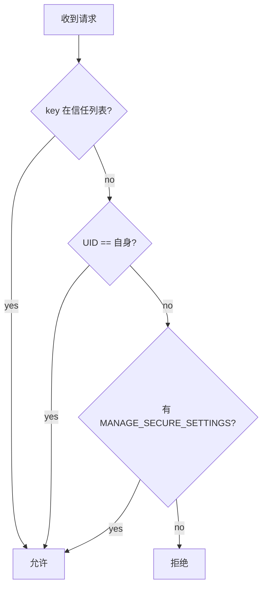

# 安全风险评审

## 概述

本文档对 SettingsData 系统应用进行安全风险评审，基于代码静态分析识别潜在的安全问题，并提供修复建议。

**评审范围**: `entry/src/main/ets/` 目录下的业务代码（不含测试）

**评审时间**: 2026-02-06

---

## 威胁模型

### 信任边界

```
┌─────────────────────────────────────────────────────────────────┐
│                        信任边界                                  │
├─────────────────────────────────────────────────────────────────┤
│  内部可信区域:                                                   │
│  - SettingsData 应用进程                                         │
│  - SettingsDBHelper (数据库操作)                                 │
│  - DataExtAbility (数据提供者)                                   │
│  - UserChangeStaticSubscriber (事件监听)                         │
├─────────────────────────────────────────────────────────────────┤
│  外部不可信区域:                                                 │
│  - 第三方客户端应用 (通过 DataShare 调用)                        │
│  - 网络 (如有远程攻击面)                                         │
│  - 文件系统 (恶意配置文件)                                       │
└─────────────────────────────────────────────────────────────────┘
```

### 数据流

| 数据流 | 方向 | 风险等级 |
|--------|------|----------|
| 客户端 → DataExtAbility | 外部 → 内部 | **高** |
| DataExtAbility → SettingsDBHelper | 内部 → 内部 | 低 |
| SettingsDBHelper → SQLite DB | 内部 → 存储 | 低 |
| DataExtAbility → Audio API | 内部 → 系统 | 中 |

---

## 攻击面分析

| 攻击面 | 类型 | 说明 | 证据位置 |
|--------|------|------|----------|
| DataShare URI | IPC | 通过 DataShare 接口接收外部请求 | `data_share_config.json` |
| insert/update 操作 | 数据写入 | 接收外部数据写入数据库 | `DataExtAbility.ets:128-164` |
| query 操作 | 数据读取 | 对外提供数据查询 | `DataExtAbility.ets:209-231` |
| default_settings.json | 配置文件 | 加载本地配置文件 | `SettingsDBHelper.ets:257-271` |
| 音频设置操作 | 系统调用 | 调用 Audio API 修改系统音量 | `DataExtAbility.ets:233-269` |

---

## 已识别风险点

### 风险 1: SQL 注入风险 (中等)

**证据位置**: `entry/src/main/ets/DataAbility/DataExtAbility.ets:98`

**问题描述**:

使用 `DataSharePredicates` 构建查询条件，如果 predicates 被恶意构造，可能导致 SQL 注入。

```typescript
// 潜在风险代码
rdbStore?.query(SettingsDataConfig.TABLE_NAME, predicates, columns, (
  err: BusinessError, resultSet: relationalStore.ResultSet) => {
  // ...
});
```

**触发条件**:

1. 攻击者通过 DataShare 接口传入恶意构造的 `DataSharePredicates`
2. predicates 包含特殊 SQL 语句
3. RDBStore 未正确过滤特殊字符

**影响**:

- 数据泄露：查询其他表的敏感数据
- 数据篡改：修改或删除非授权数据
- 权限提升：绕过权限检查访问敏感数据

**修复建议**:

```typescript
// 1. 对 KEYWORD 和 VALUE 进行白名单校验
private validateInput(value: relationalStore.ValuesBucket): boolean {
  const keyword = value[SettingsDataConfig.FIELD_KEYWORD] as string;
  const inputValue = value[SettingsDataConfig.FIELD_VALUE] as string;
  
  // 白名单校验（只允许特定字符）
  const keywordRegex = /^[a-zA-Z0-9._]+$/;
  const valueRegex = /^.{0,1000}$/;
  
  if (!keywordRegex.test(keyword) || !valueRegex.test(inputValue)) {
    Log.error('Invalid input detected');
    return false;
  }
  return true;
}

// 2. 在 insert/update 前调用校验
insert(uri: string, value: relationalStore.ValuesBucket, callback : AsyncCallback<number>) {
  if (!this.validateInput(value)) {
    callback({ code: -1 } as BusinessError, 0);
    return;
  }
  // ...
}
```

---

### 风险 2: VALUE 长度校验不完整 (低)

**证据位置**: `entry/src/main/ets/Utils/SettingsDBHelper.ets:61-63`

**问题描述**:

数据库表定义中 VALUE 字段有 CHECK 约束限制 1000 字符，但在应用层 insert/update 时未做长度校验。

```sql
-- 数据库约束
VALUE TEXT CHECK (LENGTH(VALUE)<=1000)
```

**触发条件**:

1. 攻击者构造超过 1000 字符的 VALUE
2. 数据库层会拒绝，但会触发异常

**影响**:

- 性能问题：大数据可能导致内存占用过高
- 异常处理：可能触发未预期的异常

**修复建议**:

```typescript
// 在 insert/update 操作前进行长度校验
private validateValueLength(value: relationalStore.ValuesBucket): boolean {
  const inputValue = value[SettingsDataConfig.FIELD_VALUE] as string;
  if (inputValue && inputValue.length > 1000) {
    Log.error('VALUE length exceeds limit of 1000 characters');
    return false;
  }
  return true;
}
```

---

### 风险 3: 路径遍历风险 (不适用)

**评估结论**: **不适用**

**理由**: SettingsData 不涉及文件路径操作，所有数据通过 DataShare 接口存取，不接受文件路径参数。

**证据**: `entry/src/main/ets/DataAbility/DataExtAbility.ets` 中无文件路径相关参数。

---

### 风险 4: 敏感信息泄露风险 (低)

**证据位置**: `entry/src/main/ets/DataAbility/DataExtAbility.ets:262-263`

**问题描述**:

音频设置操作失败时，日志可能输出敏感信息。

```typescript
catch (err) {
  Log.info('settings RINGTONE failed error = ' + JSON.stringify(err));
}
```

**触发条件**:

1. 音频设置操作失败
2. 日志级别设置为 DEBUG 或 INFO

**影响**:

- 信息泄露：可能暴露系统内部状态
- 攻击面扩大：为攻击者提供系统信息

**修复建议**:

```typescript
catch (err) {
  Log.error(`settings RINGTONE failed, error code: ${err.code}`);
  // 不输出完整的 err 对象
}
```

---

### 风险 5: 受信任列表不完整 (中等)

**证据位置**: `entry/src/main/ets/DataAbility/DataExtAbility.ets:47-51`

**问题描述**:

受信任列表（trustList）仅包含 3 个 display 相关的 key，缺少其他常见系统设置项。这可能导致：

1. 合法的系统设置请求被拒绝
2. 开发者需要频繁申请 `MANAGE_SECURE_SETTINGS` 权限

```typescript
let trustList: String[] = [
  settings.display.SCREEN_BRIGHTNESS_STATUS,
  settings.display.AUTO_SCREEN_BRIGHTNESS,
  settings.display.SCREEN_OFF_TIMEOUT
];
```

**触发条件**:

1. 应用尝试修改信任列表外的设置项
2. 需要申请系统权限

**影响**:

- 权限滥用风险：更多应用需要申请敏感权限
- 用户体验：频繁的权限授权提示

**修复建议**:

扩展受信任列表，将更多安全的设置项加入：

```typescript
let trustList: String[] = [
  settings.display.SCREEN_BRIGHTNESS_STATUS,
  settings.display.AUTO_SCREEN_BRIGHTNESS,
  settings.display.SCREEN_OFF_TIMEOUT,
  settings.display.NAVIGATIONBAR_STATUS,
  settings.audio.RINGTONE,
  settings.audio.MEDIA,
  settings.general.DEVICE_NAME
];
```

---

### 风险 6: 默认配置注入风险 (低)

**证据位置**: `entry/src/main/ets/Utils/SettingsDBHelper.ets:257-271`

**问题描述**:

从 `default_settings.json` 加载默认配置时，未对配置内容进行校验。

```typescript
public async readDefaultFile(): Promise<Object> {
  let rawStr: string = '';
  try {
    let content: number[] = Array.from(await this.context?.resourceManager.getRawFile(DEFAULT_JSON_FILE_NAME));
    rawStr = String.fromCharCode(...Array.from(content));
  } catch (err) {
    Log.error('readDefaultFile readRawFile err' + err);
  }

  if (rawStr) {
    Log.info('readDefaultFile success');
    return JSON.parse(rawStr);  // 直接解析 JSON
  }
  return rawStr;
}
```

**触发条件**:

1. `default_settings.json` 被恶意篡改
2. 包含非法配置项

**影响**:

- 初始配置污染：影响所有用户的初始设置
- 潜在的安全问题：恶意配置可能导致异常行为

**修复建议**:

```typescript
private async loadDefaultSettingsData(): Promise<void> {
  // ... 读取配置
  let content = await this.readDefaultFile() as IContent;
  
  // 添加配置校验
  if (!this.validateConfig(content)) {
    Log.error('Invalid config detected, abort loading');
    return;
  }
  
  // ... 继续加载
}

private validateConfig(content: IContent): boolean {
  if (!content || !content.settings) {
    return false;
  }
  
  for (const item of content.settings) {
    const name = item['name'];
    const value = item['value'];
    
    // 校验配置项名称格式
    const nameRegex = /^[a-zA-Z0-9._]+$/;
    if (!nameRegex.test(name)) {
      Log.error(`Invalid config name: ${name}`);
      return false;
    }
    
    // 校验值长度
    if (value && value.length > 1000) {
      Log.error(`Config value too long: ${name}`);
      return false;
    }
  }
  
  return true;
}
```

---

## 权限模型评估

### 当前权限配置

| 权限 | 用途 | 评估 |
|------|------|------|
| `ohos.permission.MANAGE_SECURE_SETTINGS` | 修改敏感设置 | **必要** - 保护敏感操作 |

**证据**: `entry/src/main/module.json5:31`

### 权限校验流程



**评估结论**: 权限模型设计合理，但信任列表范围过窄。

---

## 安全最佳实践

### 1. 输入验证

- 所有外部输入必须进行验证
- 使用白名单而非黑名单
- 限制字符串长度

### 2. 最小权限原则

- 仅申请必要的权限
- 敏感操作需要显式权限
- 信任列表应覆盖所有安全操作

### 3. 日志安全

- 避免输出敏感信息
- 日志级别应可配置
- 关键操作需要审计日志

### 4. 错误处理

- 不向外部暴露系统内部错误
- 统一错误码格式
- 记录安全相关的拒绝操作

---

## 未涉及的安全领域

以下安全领域经评估确认不适用于本项目：

| 领域 | 评估结论 | 理由 |
|------|----------|------|
| 网络安全 | 不适用 | 无网络通信功能 |
| 内存安全 | 不适用 | ArkTS 内存安全语言 |
| 竞态条件 | 低风险 | 单线程模型，无复杂并发 |
| 动态加载 | 不适用 | 无动态代码加载 |
| 加密存储 | 不适用 | 数据库本身已加密 |
| 跨站脚本 | 不适用 | 无 WebView |

---

## 总结

### 风险汇总

| 风险 | 等级 | 状态 | 修复难度 |
|------|------|------|----------|
| SQL 注入风险 | 中等 | 需修复 | 低 |
| VALUE 长度校验 | 低 | 需增强 | 低 |
| 敏感信息泄露 | 低 | 需修复 | 低 |
| 受信任列表不完整 | 中等 | 需改进 | 低 |
| 默认配置注入 | 低 | 需增强 | 低 |

### 修复优先级

| 优先级 | 风险 | 建议时间 |
|--------|------|----------|
| P1 | SQL 注入风险 | 立即修复 |
| P2 | 受信任列表不完整 | 1-2 周内 |
| P3 | 敏感信息泄露 | 1 个月内 |
| P4 | 默认配置注入 | 1 个月内 |
| P5 | VALUE 长度校验 | 1 个月内 |

---

## 相关文档

| 文档 | 链接 |
|------|------|
| 项目概览 | [01_Project_Overview.md](./01_Project_Overview.md) |
| 架构设计 | [03_Architecture.md](./03_Architecture.md) |
| API 参考 | [04_API_Reference.md](./04_API_Reference.md) |
| 构建与编译 | [05_Build_and_Compilation.md](./05_Build_and_Compilation.md) |
