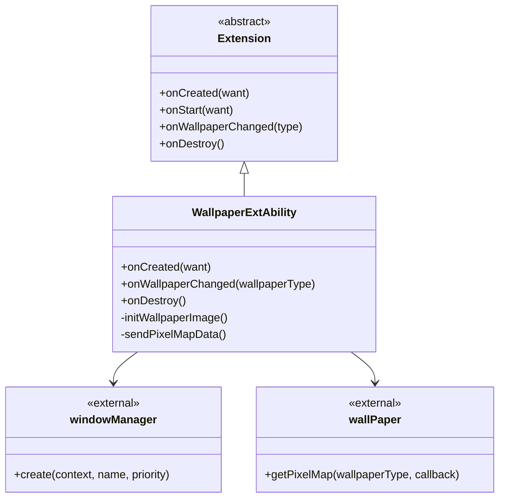
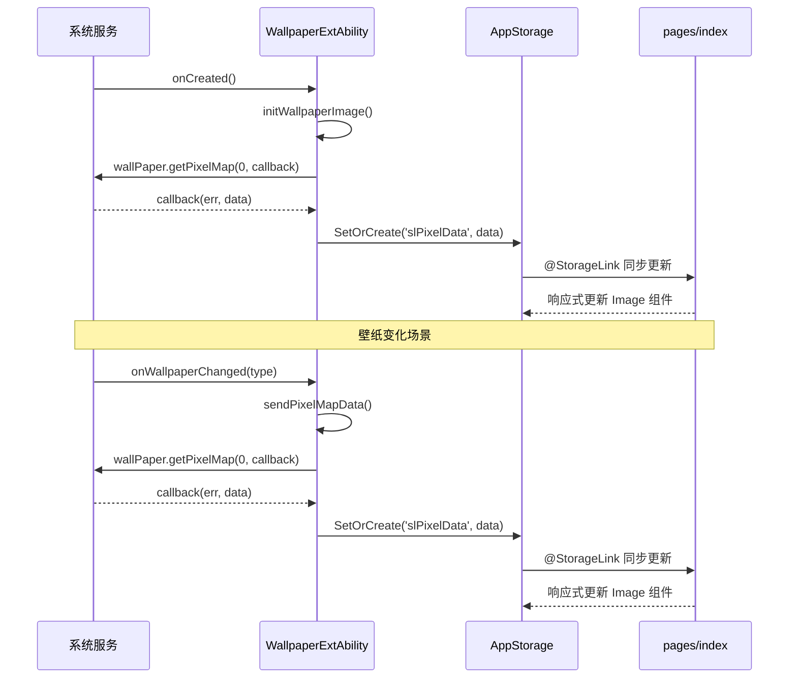
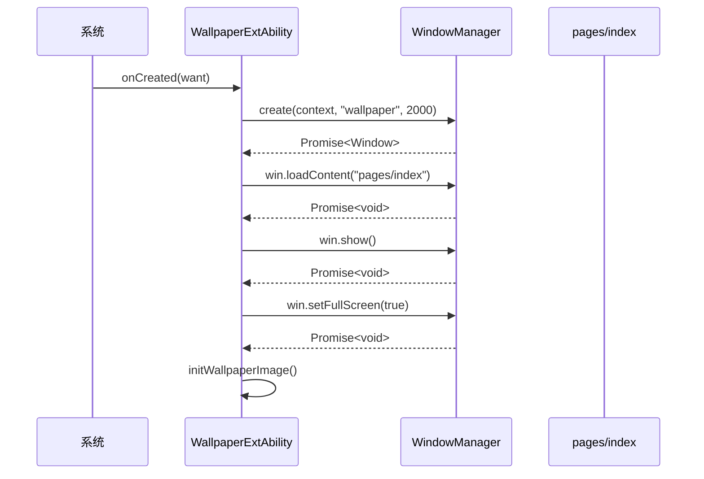
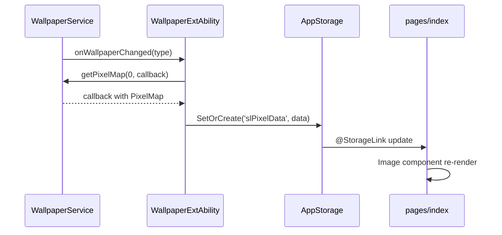

# 架构说明

## 组件图

### 整体组件关系

```mermaid
graph TB
    subgraph OpenHarmony 系统
        WM[WindowManager]
        WS[WallpaperService]
        PM[PermissionManager]
    end

    subgraph applications_theme
        subgraph 能力层
            MA[MainAbility]
            AS[AbilityStage]
            WE[WallpaperExtAbility]
        end

        subgraph UI层
            Index[pages/index.ets]
        end

        subgraph 数据层
            ASr[AppStorage]
        end
    end

    AS --> |onCreate| PM
    WE --> |create window| WM
    WE --> |getPixelMap| WS
    WE --> |SetOrCreate| ASr
    ASr --> |@StorageLink| Index
```

### WallpaperExtAbility 组件详情



## 数据流

### 壁纸数据流

```
┌─────────────────────────────────────────────────────────────────────┐
│                         壁纸数据流                                    │
├─────────────────────────────────────────────────────────────────────┤
│                                                                     │
│  WallpaperService                                                   │
│       │                                                             │
│       │ getPixelMap(wallpaperType, callback)                        │
│       │                                                             │
│       ▼                                                             │
│  ┌─────────────────────────────────────────────────────────┐       │
│  │              WallpaperExtAbility                         │       │
│  │  1. 接收 PixelMap 数据                                   │       │
│  │  2. JSON.stringify(err), JSON.stringify(data)           │       │
│  │  3. AppStorage.SetOrCreate('slPixelData', data)         │       │
│  └─────────────────────────────────────────────────────────┘       │
│       │                                                             │
│       │ @StorageLink 双向绑定                                       │
│       ▼                                                             │
│  ┌─────────────────────────────────────────────────────────┐       │
│  │              pages/index.ets                             │       │
│  │  - Image(this.pixelData)                                 │       │
│  └─────────────────────────────────────────────────────────┘       │
│                                                                     │
└─────────────────────────────────────────────────────────────────────┘
```

### 时序图



## 线程模型

### 线程划分

| 线程/进程 | 职责 | 隔离性 |
|-----------|------|--------|
| **Main Thread** | UI 渲染、Ability 生命周期 | 主线程 |
| **UI Thread** | ArkUI 组件渲染 | 主线程 |
| **Wallpaper Service** | 壁纸数据管理 | 系统服务进程 |

### 线程通信

```typescript
// wallPaper.getPixelMap 是异步回调模式
wallPaper.getPixelMap(0, (err, data) => {
    // 回调在调用线程执行
    AppStorage.SetOrCreate('slPixelData', data);
});
```

### 线程安全说明

- AppStorage 的 `SetOrCreate` 操作是线程安全的
- UI 更新通过 @StorageLink 自动在 UI 线程执行
- 无需开发者手动处理线程同步

## 资源生命周期

### WallpaperExtAbility 生命周期

```
onCreate()
    │
    ▼
onCreated() ──────┐
    │             │
    ▼             │
initWallpaperImage() │
    │             │
    ▼             │
sendPixelMapData()   │
    │             │
    ▼             ▼
    └──── onDestroy()
```

### 资源释放点

| 资源 | 释放位置 | 说明 |
|------|----------|------|
| **窗口对象** | onDestroy | 系统自动回收 |
| **壁纸数据** | onDestroy | AppStorage 自动清理 |
| **回调注册** | onDestroy | 系统自动清理 |

## 关键时序

### 窗口创建时序



### 壁纸更新时序



## 架构特点

### 1. 轻量级设计

- 无 N-API 暴露，纯 ETS 实现
- 代码量小，约 200 行核心逻辑
- 依赖简单，仅使用系统原生 API

### 2. 数据驱动 UI

- 使用 AppStorage 进行跨组件数据同步
- @StorageLink 实现声明式数据绑定
- 响应式更新，无需手动刷新

### 3. 扩展能力模式

- 继承 Extension 基类
- 使用系统标准扩展能力类型 (wallpaper)
- 遵循 OpenHarmony 扩展能力开发规范

## 相关文档

- [项目概览](01_Project_Overview.md)
- [目录结构](02_Directory_Structure.md)
- [API 文档](04_API.md)
- [内部 API](05_Inner_API.md)
